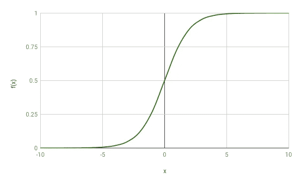
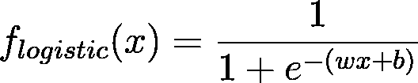
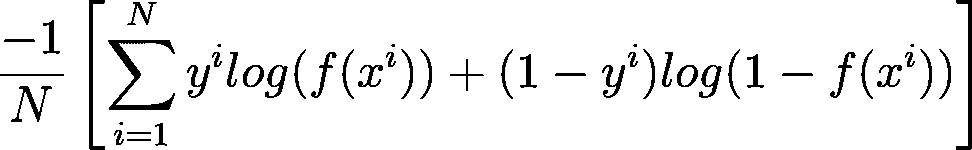
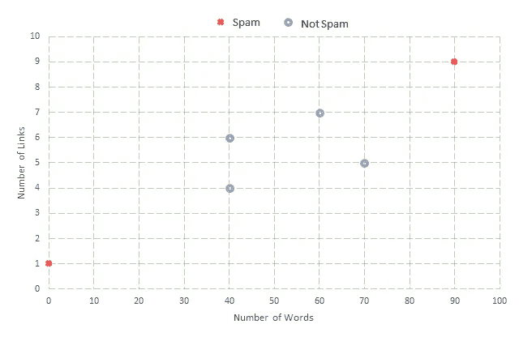
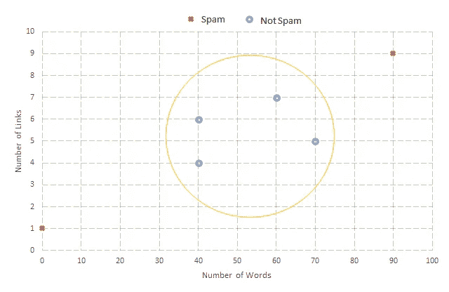
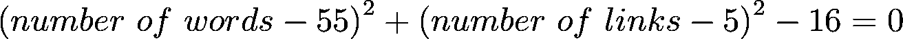
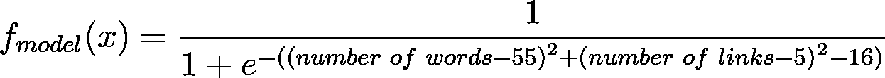
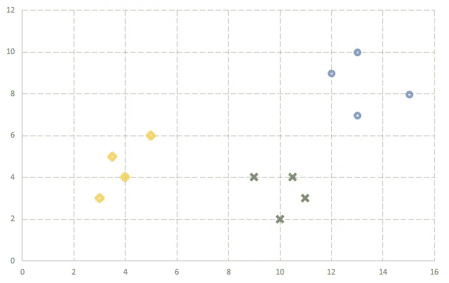

# 逻辑回归

> 原文：<https://towardsdatascience.com/logistic-regression-fa1a86270eb?source=collection_archive---------16----------------------->

## 更简单直观的解释。

与其名称相反，逻辑回归是一种分类算法。给定一个输入示例，逻辑回归模型将该示例分配给相关的类。

```
A note on the notation. x_{i} means x subscript i and x_{^th} means x superscript th.
```

# 线性回归快速回顾

*   线性回归用于预测+∞和-∞之间任何地方的实值输出。
*   用于训练线性回归模型的每个示例由其属性或特征定义，这些属性或特征统称为特征向量。你的名字、年龄、联系电话、性别等等对应于描述你的特征向量。
*   一个线性回归模型 *f(x)* 、*、*是输入实例 *x* 的特征的线性组合，用 *f(x) = wx+b* 表示。
*   通过平方或立方来变换原始特征(考虑一维特征向量 *x* )会产生多项式模型(例如 *f(x) = wx +b* 或 *f(x) = wx +b* )。
*   通常对于具有 R 维特征向量 *x* 和一维输出 *y* 的数据集，线性回归建模一个超平面作为决策边界。超平面在 2D 区域的情况下是一条线，在 3D 空间的情况下是一个平面，在 4D 空间的情况下是一个三维形状，例如一个球体，等等。超平面比它们周围的空间少了一个维度。
*   均方误差成本函数用于找到线性回归模型的最佳值组 *w** 和 *b** 。

# 动机

为了便于理解，让我们假设 John 被分配了预测给定电子邮件是否是垃圾邮件的工作。他收集了下表所示的数据集。数据集由 *n* 个示例组成，其中每个示例 *x_{i}* 由一个二维特征向量表示，包括该电子邮件中的字数和链接数。如果对应的示例是垃圾邮件，则目标变量 *y，*等于 1，否则等于 0。

```
Y takes value 0 for a negative class which corresponds to absence of something (like not spam) whereas, Y takes value 1 for a positive class which corresponds to presence of something (like spam).
```

Here each feature vector is 2-dimensional consisting of the number of words, and the number of links in the email. The target variable Y is 1 for a spam email and 0 otherwise. This is an illustrative data set.

John 首先决定建立一个线性回归模型来解决这个问题。然而，建立了线性回归模型后，他对自己的结果很不满意。

请记住，线性回归用于预测实值输出，其中输出可能在+∞到-∞之间变化，而在本例中 *y* ，目标变量仅取两个离散值，即 0 和 1。

约翰决定扩展线性回归的概念来满足他的要求。一种方法是获取线性回归的输出，并将其映射在 0 和 1 之间，如果结果输出低于某个阈值，则将该示例分类为负类，而如果结果输出高于某个阈值，则将该示例分类为正类。其实这就是**逻辑回归**学习算法。

我们将处理从 0 到 1 之间的线性回归模型获得的实值输出，并基于阈值对新示例进行分类。用于执行该映射的函数是 **sigmoid 函数。**


Sigmoid function.

该图显示，sigmoid 函数已经成功地将 0 和 1 之间的值从+∞映射到-∞。

注意，在 *x=0* 时，sigmoid 函数的值为 0.5。同样，如果 *x > 0* ，则 sigmoid 函数值为> 0.5，另一方面，如果 *x < 0* ，则 sigmoid 函数值为< 0.5。



The graph of Sigmoid function.

# 模型

根据上述讨论，逻辑回归模型表示为—



The model of Logistic Regression. x is the feature vector whereas w and b correspond to the weight and bias respectively. The goal is to find the optimal set of values for w and *b*.

在上面的等式中，来自线性回归模型的输出 *wx+b* 已经作为输入传递给 sigmoid 函数，从而计算 0 到 1 之间从+∞到-∞范围内的值，为我们提供逻辑回归模型。模型的输出被解释为实例 *x* 落入正类的概率。具体来说，如果对于一个未知的 *x* 模型输出 0.8，那么这意味着 *x* 被归类为正的概率是 0.8。

显然， *w* 和 *b* 的不同值对应不同的逻辑回归模型。但是，我们想要一组最优值， *w** 和 *b** ，这将最小化模型 *f(x)* 所做的预测与*训练集*的实际结果 *y* 之间的误差。

# *最佳模特*

称为**对数似然函数**的逻辑回归模型的成本函数由下式给出



The log-likelihood function. N is the total number of examples. x_{^i} is the i_{^th} feature vector and y_{^i} is it’s corresponding class either 0 or 1.

目标是找到模型 *f(x)* 的 *w* 和 *b* 的值，这将最小化上述成本函数。在观察成本函数时，我们注意到求和中有两项，其中第一项对于 *y=0* 的所有示例都是 *0* ，第二项对于 *y=1* 的所有示例都是零。因此，对于任何给定的例子，其中一个求和项总是零。还有， *f(x)* 的取值范围是[0，1]，暗示- *log(f(x))* 取值范围是从(+∞，0)。

让我们通过考虑一个任意的例子 *x_{^i}* 来更好地理解成本函数，其中 *y=1* 。随着 *(1-y_{^i})* 变为零，第二项将评估为零。就第一项而言，如果我们的模型 *f(x)* 预测 1，那么第一项也将变为零，因为 *log(1)* 等于 *0* ，因此第一项和第二项都变为零，随后成本也变为零，这是有意义的，因为我们的模型已经预测了目标变量 *y* 的正确值。如果我们的模型预测值为 0，则- *log(0)* 的值将接近+ **∞** ，表明成本函数对我们的模型施加了很高的惩罚。

```
Try out an example where the target variable y equals to zero.
```

平均求和表示我们希望最小化所有训练示例的总体误差。

# 一个例子

有了这种直觉，John 现在决定为垃圾邮件分类器问题建立一个逻辑回归模型。他从绘制数据集开始。



An illustrative data set for classifying e-mail as spam or not spam.

很明显，线性决策边界不太可能适合数据集。就像线性回归一样，我们可以将特征转换为包含二次或三次项的更高阶，以使非线性决策边界适合我们的数据集。

假设，John 决定将二次决策边界拟合到他的数据集，因此他包括了二次项，如(链接数)、(字数)和(链接数)*(字数)。他最终以下面的决策边界结束。



A non-linear decision boundary. For illustrative reasons a perfect circular decision boundary has been considered. However, in real world scenario decision boundary need not be this perfect a circle.

上述判定边界对应于圆心在(55，5) 且半径为 4 个单位的圆—



Equation of the circle representing the above decision boundary.

这给了约翰下面的逻辑回归模型—



John’s logistic regression model.

对于落入圆圈(决策边界)内的看不见的示例，圆圈的等式返回负值，因此上述模型返回小于 0.5 的值，这意味着该示例是垃圾邮件的概率小于 0.5。如果阈值也是 0.5，目标变量， *y* 取值 *0，*表示该示例是一封普通电子邮件。

```
Consider a case where example falls outside the decision boundary.
```

# 关于阈值的更多信息

选择阈值本身就是一个讨论的话题——一种解释是，阈值表示模型的容忍程度。以将患者分类为受心脏病影响的模型为例，在这种情况下，优选具有较低的阈值，该阈值捕捉了这样的想法:每当有疑问时，将患者分类为受疾病影响，并对他/她进行检查以进行确认，这意味着您愿意接受更多的误报(将健康的患者分类为不健康，或将非垃圾邮件分类为垃圾邮件)。

从技术上讲，**灵敏度**是正确识别患病患者(真阳性)的能力，而**特异性**是正确识别未患病患者(真阴性)的能力。理想情况下，我们需要一个阈值来平衡灵敏度和特异性，但是，阈值的值取决于具体的问题，并且取决于您希望模型的容忍程度，该值必须进行调整。

# 多类分类

考虑一个分类问题，有三个任意的类，如下图所示



An arbitrary plot with data belonging to three different classes represented by circle, cross and diamond shapes.

现在的目标是将二元分类的思想扩展到多类分类。下面的图说明了如何将我们的多类分类的原始问题转换成二元分类问题。

每个图一次只考虑一个类别，并预测一个实例落入该类别的概率，最后将概率最高的类别分配给一个新实例。这种方法被称为**一对全分类**。


One versus all classification method.

通常，为了解决具有 *n* 个类别的多类别分类问题，训练 *n* 个逻辑回归模型，每个模型仅考虑单个类别。每当一个新的例子必须被分类时，所有的 *n* 模型预测该例子落入其各自类别的概率。最后，将该示例分配给由 *n* 个模型之一预测的概率最高的类别。