# 用于癌症中恶性预测的逻辑回归

> 原文：<https://towardsdatascience.com/logistic-regression-for-malignancy-prediction-in-cancer-27b1a1960184?source=collection_archive---------8----------------------->

## [生物医学数据的机器学习](https://towardsdatascience.com/tagged/ml-for-bio-data)

## 将逻辑回归应用于威斯康星州乳腺癌(诊断)数据集

在 [一元或多元线性回归](/machine-learning-for-biomedical-data-linear-regression-7d43461cdfa9)中，我们引入了线性回归的概念，这是一种用于机器学习的统计模型，属于算法的监督学习类。此外，我们还讨论了线性回归对生物医学数据的可能应用，特别是在预测连续值输出方面。

在这篇文章中，我们将解释**逻辑回归**，另一个监督学习模型，用于预测离散值输出。

我们将介绍逻辑回归背后的数学概念，通过 Python，一步一步，我们将制作乳腺癌恶性肿瘤的预测器。我们将使用[“威斯康辛乳腺癌(诊断)”](https://archive.ics.uci.edu/ml/datasets/Breast+Cancer+Wisconsin+%28Diagnostic%29) (WBCD)数据集，由威斯康辛大学提供，由 [UCI 机器学习库](https://archive.ics.uci.edu/ml/datasets/Breast+Cancer+Wisconsin+(Diagnostic))托管。

该数据库的创建者 Mangasarian、Street 和 Wolberg 博士打算利用从微创细针抽吸(FNA)获得的乳腺癌单个细胞的 30 个特征，使用机器学习来区分乳腺肿块的良性和恶性肿块[1]。

简而言之，FNA 是一种活检，医生使用连接到注射器的针头从可疑区域提取少量细胞。然后检查活检以确定癌症[2]。

使用基于*曲线拟合算法*的图像分析软件 *Xcyt* ，作者能够从 FNA 的数字化 640×400、每像素 8 位灰度图像中确定细胞核的边界。

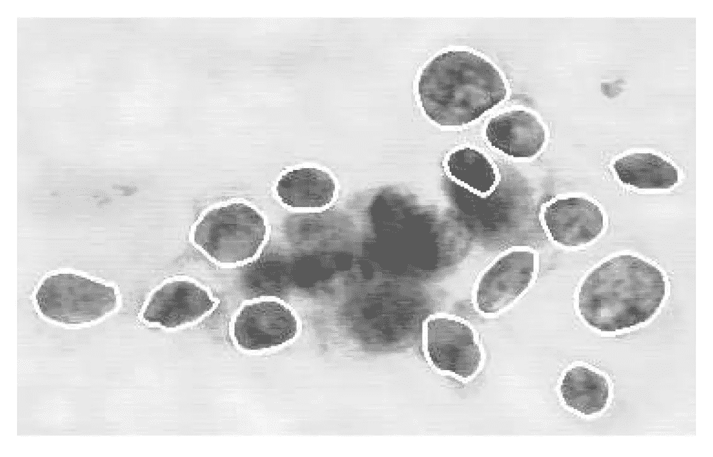

Figure 1: A magnified image of a malignant breast FNA. A curve-fitting algorithm was used to outline the cell nuclei. (Figure from Mangasarian OL., Street WN., Wolberg. WH. Breast Cancer Diagnosis and Prognosis via Linear Programming. Mathematical Programming Technical Report 94–10\. 1994 Dec)

这 30 个特征描述了扫描图像中存在的细胞核的特征。

正如他们在论文中所报道的，作者已经使用机器学习和图像处理技术来完成恶性肿瘤预后预测。然而，对它们的计算方法的深入研究超出了本文的目的。

在本帖中，我们不会翻拍曼加萨里安、斯特里特和沃尔伯格的作品。我们将使用他们的数据集，基于 WBCD 的 30 个要素中的一些要素，以 Python 语言实现逻辑回归预测器。我们将根据 FNA 数据，使用良性/恶性结果来预测新患者是否有可能发展为恶性肿瘤。此外，我们的预测器将是一个令人兴奋的场合，它揭示了*逻辑回归*的一些基本概念，并围绕生物医学问题实施了一个代码: ***哪些特征在预测恶性结果*** 中是必不可少的。

数据集的第一列对应于患者 ID，而最后一列代表诊断(根据报告的诊断类型，结果可以是“良性”或“恶性”)。结果数据集包括 569 名患者:212 名(37.2%)为恶性，357 名(62.7%)为良性。图 2 描述了数据集结构:

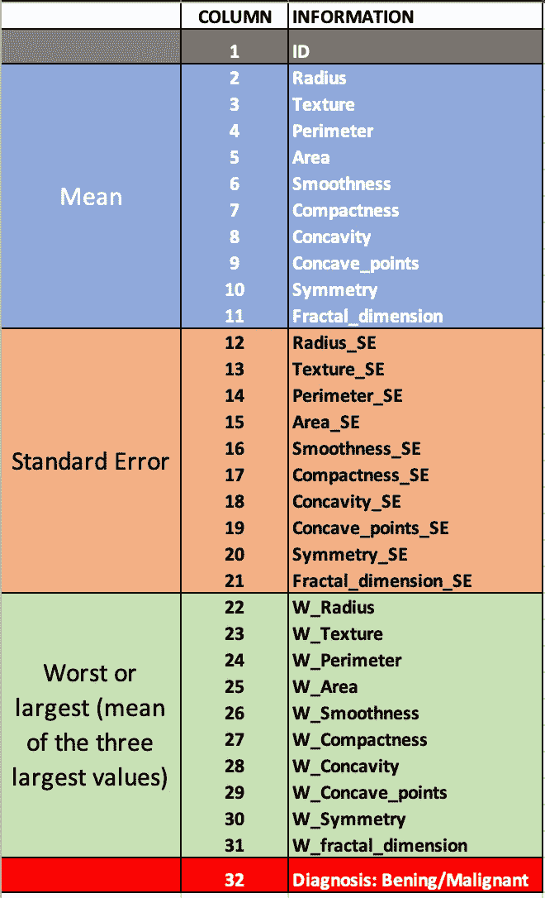

Figure 2: The Breast Cancer Wisconsin (Diagnostic), dataset structure.

详细地说，数据集由为每个细胞核计算的十个实值特征组成。分别是 **1) *半径*** (中心到圆周上各点的平均距离) **2) *纹理*** (灰度值的标准差) **3) *周长*** ， **4) *面积*** ， **5) *平滑度*** (半径长度的局部变化) **6】 **8) *凹点*** (轮廓的凹部个数) **9) *对称性*****10)*分维*** 【海岸线近似】-1)。 十个实值特征对应于平均值(第 2 列至第 11 列的值)、标准误差(第 12 列至第 21 列的值)和最差或最大值(三个最大值的平均值)(第 22 列至第 31 列)。列 32 包含良性/恶性结果。**

为了更加简单，我将 WBDC 格式化为逗号分隔值文件。你可以按照这个[链接](https://raw.githubusercontent.com/lucazammataro/bioinsteps/master/wdbc.data.csv)(文件名: *wdbc.data.csv* )下载格式化版本。

在开始之前，我建议读者关注一下 Andrew NG 在 Coursera 开设的有趣的机器学习课程[3]。本课程对这篇文章中讨论的所有论点提供了一个很好的解释。

本文中的所有代码都是用 Python 2.7 编写的。对于实现环境，我推荐使用 [Jupyter 笔记本](https://jupyter.org/)。

# 步骤 1:从 SciPy 导入包

导入本文 Python 代码所需的所有包:Pandas、NumPy、matplotlib 和 SciPy。这些软件包属于 SciPy.org 的[，这是一个基于 Python 的数学、科学和工程开源软件生态系统。此外，我们将导入](http://scipy.org/) [seaborn](http://seaborn.pydata.org/generated/seaborn.pairplot.html) ，这是一个基于 matplotlib 的 Python 数据可视化库。此外，来自 *scipy.optimize* 包的对象 *op* 将被创建，以对渐变进行优化。

Code 1: Import all the packages

# 步骤 2:上传数据

一旦我们下载了 wdbc.data.csv 文件，用它来创建一个使用 [pandas](https://pandas.pydata.org/) 的数据帧:

Code 2: Create a pandas DataFrame.

使用 *pandas* 我们可以使用。*头()*方法:

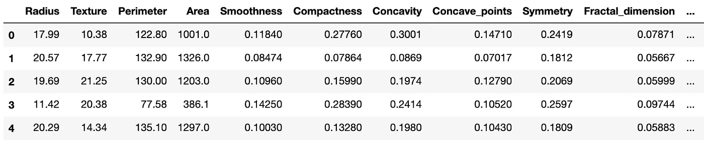

Table 1: Typing *df.head()*, will display the DataFrame content (partial output)

# 步骤 3:数据可视化和双变量分析

现在我们有了一个包含数据的数据框架，我们想确定这 30 个特征中哪些对我们的预测模型是重要的。选择数据集的最佳特征是机器学习中的关键步骤，以获得有用的分类并避免预测偏差。

***可视化每对***

一种方法是每对的*可视化。正如 Ahmed Qassim 在他的文章[中所建议的，使用 seaborn 提供的 pairplot 函数集可以获得优雅的数据显示。](/breast-cancer-cell-type-classifier-ace4e82f9a79)*生成完整特征组合图的 Python 代码如下:

Code 3: Visualizing all the paired features.

这里我们已经创建了*seaborn*object*SNS；*然后*，*我们使用了在步骤 2 中生成的*熊猫数据帧(df)* 作为 *sns* *pairplot* 方法的参数。注意，指定参数“*色调=诊断，”**对绘图*方法可以访问包含诊断值(0，1)的 *df* 列。此外， *pairplot* 将使用参数“调色板”根据诊断值用 *b* 蓝色*或 *r* 红色给点着色。*

为了简化可视化，由*代码 3* 生成的地图显示了前五对特征的组合。它们代表参数*半径*、*纹理*、*周长*、*面积*、*平滑度*的平均值。根据您的计算机性能，制作完整的功能图、运行*代码 3、*可能需要一些时间。

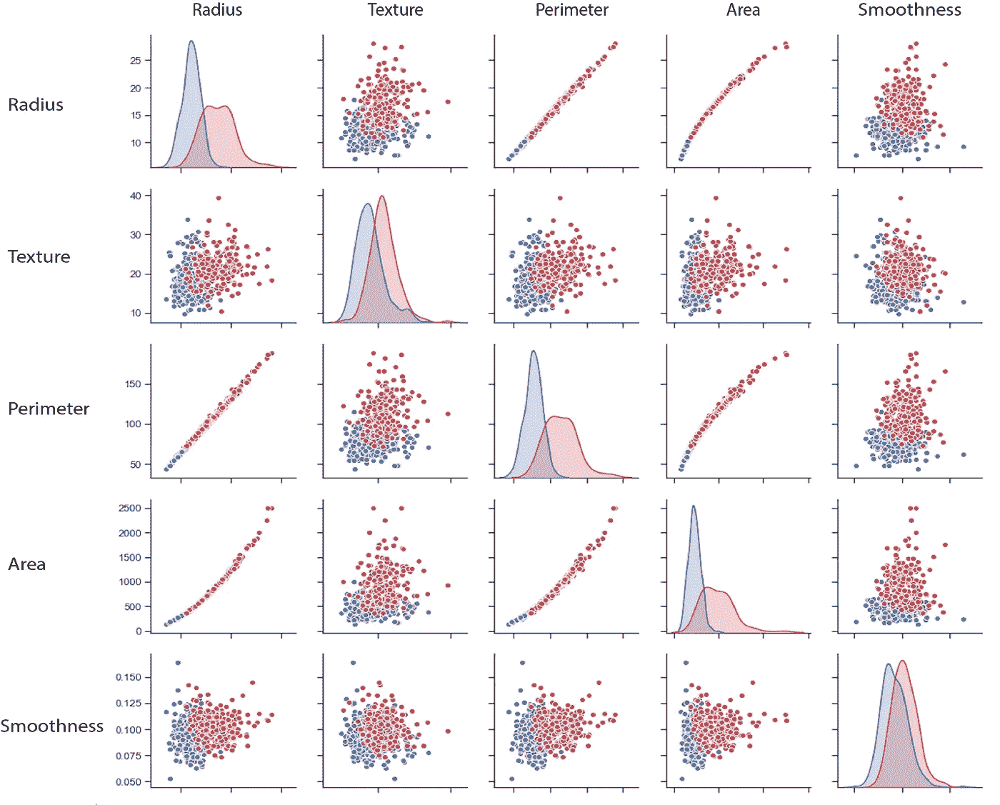

*Figure 3: Visualization Per Pair*

每个图块代表一对参数的散点图。这种可视化使得分类的基本元素的识别更加容易。这些对中的一些，如*半径*对*纹理*或*周长*对*平滑度*，具有关于*诊断*的正确分离级别(蓝点=良性；红斑=恶性)。将成对图中的要素可视化是一个很好的工具，主要是因为它的即时性。

***双变量分析***

除了可视化之外，用于选择非冗余特征的更有效的方法是 ***双变量分析*** ，这是一种基于相关性的方法，其分析元素对之间的关系。在这里，我提出一个我从 [AN6U5](https://datascience.stackexchange.com/a/10461) 重新改编的代码，它实现了一个用于*双变量分析*的函数。此处称为*特征相关矩阵*的函数将 WBCD *df* 作为参数，并返回 30 个特征的相关矩阵:

Code 4: Bivariate Analysis: Features Correlation Matrix of the WBCD features

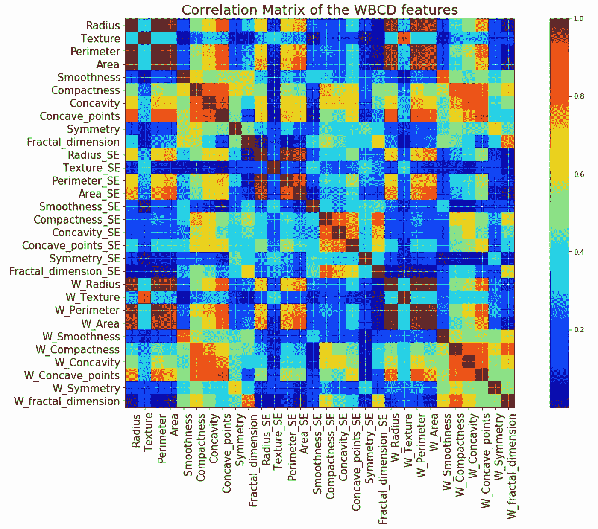

Figure 4: Plotting the Correlation Matrix of the WBDC features

看一看*图 4 中的结果图:我们的目标是*了解数据集的 30 个特征是如何相互关联的。在计算变量之间的相关性时，我们可以观察到其中一些变量导致显著相关(值大于 0.9)。*双变量分析*的一般假设是高度相关的特征提供冗余信息:出于这个原因，我们想要消除它们，避免预测偏差。

正如 Kalshtein Yael 在这篇致力于 R 的 WBCD 分析的文章中所建议的，我们应该删除所有相关性高于 0.9 的特征，保留那些具有较低均值的特征。*代码 5* 是一个 Python 代码示例的重新改编，来自[克里斯·阿尔邦](https://chrisalbon.com/machine_learning/feature_selection/drop_highly_correlated_features/)的书[4]:

Code 5: Dropping of features with a correlation greater than 0.9

“*到 _ drop”*列表包含相关性>为 0.9 的十个冗余特征。它们列举如下:

```
['Perimeter',
 'Area',
 'Concave_points',
 'Perimeter_SE',
 'Area_SE',
 'W_Radius',
 'W_Texture',
 'W_Perimeter',
 'W_Area',
 'W_Concave_points']
```

现在我们想从我们的*数据帧*中消除这些特征，并用剩余的 20 个 *:* 重新绘制 *df*

Code 6: Delete the redundant features from the DataFrame and re-plot only the not-redundant

图 5 显示了由*代码 6* 产生的曲线图:

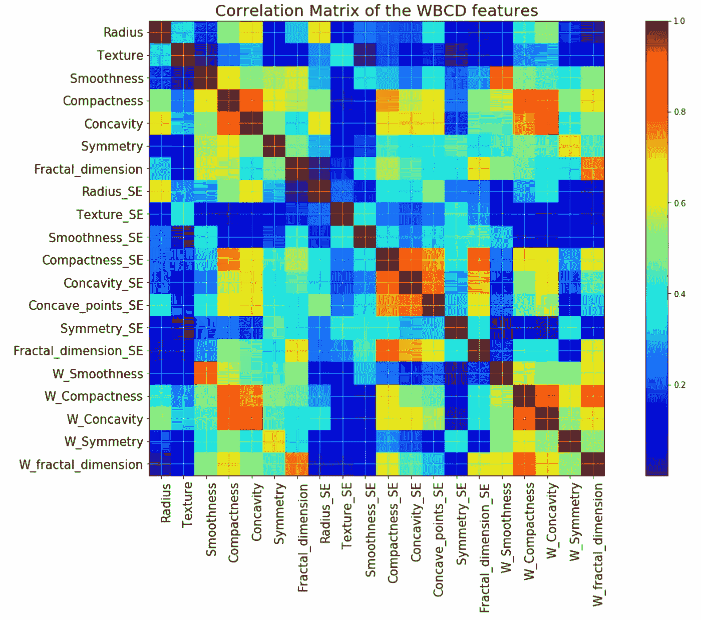

Figure 5: Plotting the Correlation Matrix of the 20 not-redundant features

我们现在已经删除了高度相关的特征对，所以只有低相关性的特征，如*半径*和*纹理*将被保留。我们可以直接访问相关矩阵值，在新的笔记本单元格中键入:

Code 7: Creating a correlation table of the not-redundant features

结果输出如下:

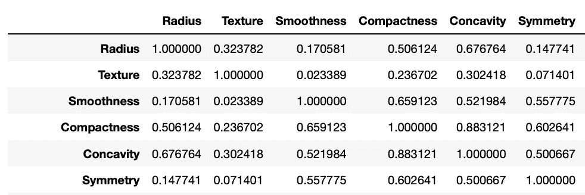

Table 2: Correlation Matrix of the features (partially displayed)

感谢 V *每对可视化*和*双变量分析* s，现在我们知道哪些特征值得在我们的分析中考虑，然后让我们继续构建我们的*逻辑回归*结果预测器。在接下来的步骤中，我们将编写一个代码来预测基于非冗余性选择的一对特征的诊断结果。

# 第四步:逻辑回归假设模型

理论上，对于*逻辑回归*，我们可以使用与*线性回归相同的假设模型(*参见[一个或多个变量的线性回归](/machine-learning-for-biomedical-data-linear-regression-7d43461cdfa9) *)* )。尽管如此，我们还是有几个原因不能使用线性假设进行逻辑推理，现在我们来解释一下原因。瞟一眼*图 6* :

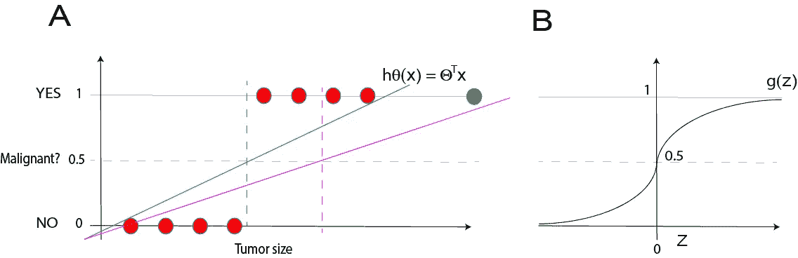

Figure 6\. A: Example of binary classification of malignancy prediction in breast cancer. B: The Logistic Regression Hypothesis is a non-linear function.

图*中的图 6A* 解释了为什么我们不能将线性假设应用于二元分类。想象一下，我们想用良性或恶性的结果(红圈)来绘制样本。我们可以应用线性假设模型将样本分成两个不同的组。在尝试将二进制值分类为 0 和 1 时，线性回归试图将大于 0.5 的值预测为“1”，将所有小于 0.5 的值预测为“0”，因为 *hθ(x)* 的阈值分类器输出为 0.5。

理论上，我们选择的线性回归模型也可以很好地用于二元分类，如蓝线所示。但是让我们看看如果我们插入另一个恶性诊断样本会发生什么(图*中的绿色圆圈 6A* )。线性回归假设调整线条以包含新样本(洋红色线条)。

尽管如此，这种假设模型并不能对我们将要上传的所有新样本都正确工作，因为线性假设似乎并没有给我们的预测增加更多的信息。这是因为分类不是线性函数。我们需要的是一个新的假设 *hθ(x)* 可以计算出诊断输出可以是 0 或 1 的概率:这个新的假设模型就是*逻辑回归。*

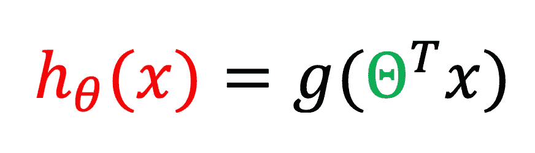

Equation 1: Logistic Regression model (Hypothesis)

等式 1 中的逻辑回归假设模型看起来类似于线性回归。但真正的区别是在 ***g*** 函数中，该函数使用翻译后的 *θ* *向量*与 ***x*** *向量*的乘积(我们将该乘积称为 ***z*** )作为参数。 ***g*** 函数的定义见*等式 2* :

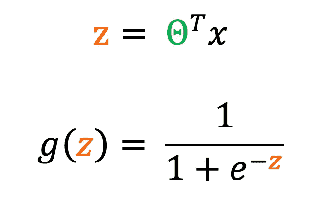

Equation 2: Logistic Regression model (Hypothesis)

作为 *sigmoid 函数* ( *逻辑函数)*的 *g(z)* 函数是非线性的。它计算诊断输出为 0 或 1 的概率(*图 6B* )。

实现*逻辑功能*的 Python 代码如下:

Code 8: The Logistic Function (sigmoid function)

# 第五步:成本函数

这一步将回答问题:*Logistic 回归如何选择参数θ？*就像线性回归一样，选择θ的唯一方法是计算其成本函数，然后尝试使用复杂的梯度下降优化算法来优化搜索。(步骤 6 的参数)。

同样，我们可以使用我们用于线性回归的相同的成本函数，并且它应该看起来像专用于线性回归的文章中的[等式 4 的成本函数，除了表征假设模型 *hθ(x)的 sigmoid 函数的差异。*](/machine-learning-for-biomedical-data-linear-regression-7d43461cdfa9)

***y 向量，*** 照常，表示输出，区别在于，这里的 ***y*** 是二元结果(0/1，或良性/恶性)的向量，而不是连续值输出的向量:

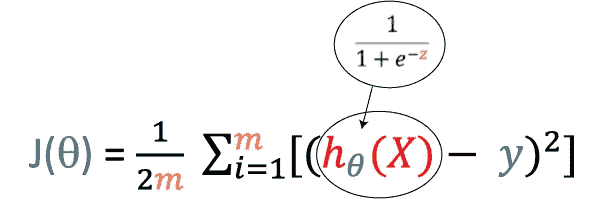

Equation 3: The Logistic Regression Cost Function

具体地说，我们不能用线性回归成本函数来进行逻辑推理。处理 *hθ(x)* 的 sigmoid 函数的非线性导致 *J(θ)* 具有非凸模式，并且看起来像图 7A 中的曲线:

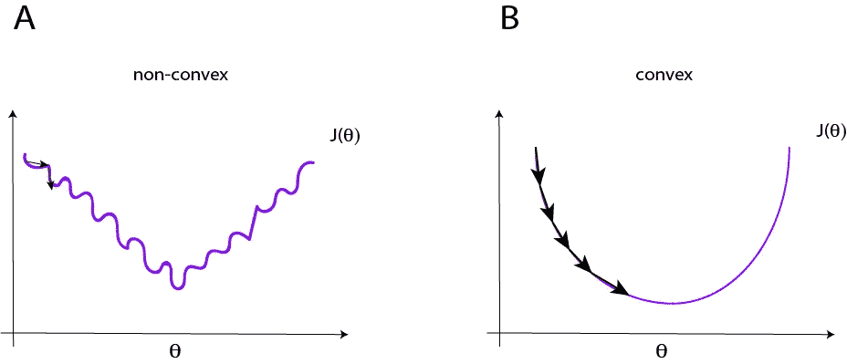

Figure 7: non-convex and convex Cost Function

这个非凸的 *J(θ)* 是一个有很多局部最优的函数。不能保证梯度下降会收敛到全局最小值。我们想要的是一个如图 7B 所示的凸 *J(θ)* ，它是一个收敛到全局最小值的函数。因此，我们必须以保证凸 *J(θ)* 的方式来写成本函数:

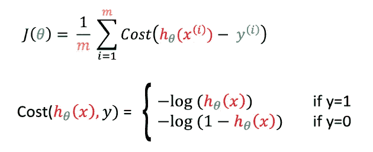

Equation 4: Logistic Regression Cost Function

实施*等式 4* ，成本函数计算为 *log(z)* ，看起来像*图 8* 的红色曲线:

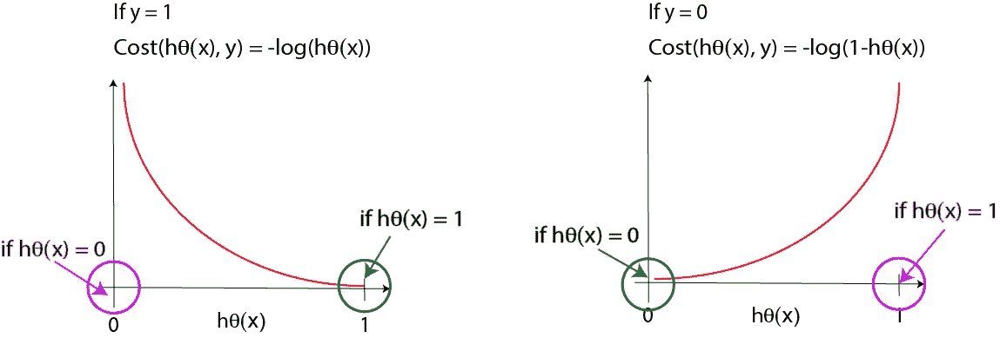

Figure 8: Plotting Logistic Regression Cost Function

因为我们有两个良性或恶性结果的二元条件(*y*),*等式 4* 中的成本函数表示我们关于 y 的假设预测的成本为。

如果 ***y = 1*** ，但是我们预测 ***hθ(x) = 0* ，**我们会以相当大的代价来惩罚学习算法(见图 8 中的**红色曲线**因为，在这种情况下，代价将趋于无穷大。相反，如果我们的预测是 ***hθ(x) = 1，*** (从而等于 *y* )，那么成本将为 0。

在***y = 0* ，**的情况下，我们有相反的情况:如果****y = 0***并且我们预测 ***hθ(x) = 0* ，**成本将会是 0，因为我们的假设与 y 匹配，而如果我们的预测是 ***hθ(x) = 1*** ，我们*

**成本函数*的简化版本如下:*

*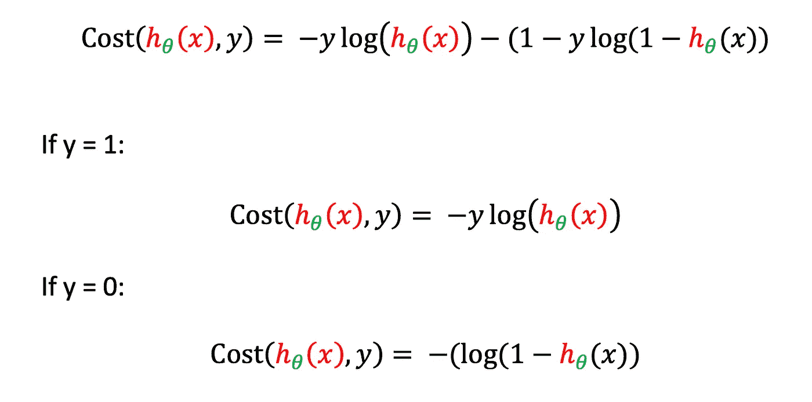*

*Equation 5: Simplified Logistic Regression Cost Function*

*如果 ***y = 0*** ，则*代价函数*将等于***-(log(1-hθ(x))***。如果 ***y = 1，*** 等式 5 的第二部分将为 0，那么代价将等于***-y * log(hθ(x))***。简化和矢量化的*成本函数*的 Python 实现如下:*

*Code 9: The Logistic Regression Cost Function*

# *第六步:梯度函数及其优化*

*在[致力于线性回归](/machine-learning-for-biomedical-data-linear-regression-7d43461cdfa9)的帖子中，我们介绍了 ***梯度下降*** ，这是一种计算代价函数导数的算法，通过参数 *α、*即学习率来更新向量 *θ* 。*

*但在机器学习场景中，梯度下降并不是最小化成本函数的唯一算法: ***共轭梯度，例如 BFGS、L-BGFS、TNC、*、**，代表了一些更复杂的用于最小化成本函数的算法，在自动化 *θ* 的搜索中。*

*基于不同的统计，这些算法试图优化*梯度函数*，该函数是数据集的实际向量 *y* 和 *h 向量(*预测*)*之间的差，以了解如何找到最小值 *J* 。概括地说，一个优化算法将重复，直到它将收敛。重要的是:更新 *θ* **总是**必须同时进行。*

*优化算法是*数值优化*领域的争论点，对算法使用的深入研究超出了本文的范围。我们将要实现的梯度函数看起来与用于线性回归的函数相同。但是在这里，对于成本函数*，*来说，区别在于需要 sigmoid 函数的 *hθ(x)* 的定义:*

*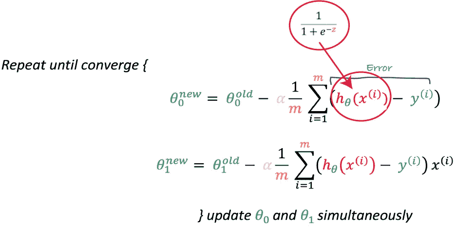*

*Equation 6: Logistic Regression Gradient wrapped in a generic optimizing algorithm.*

*梯度函数的矢量化实现的等式为:*

*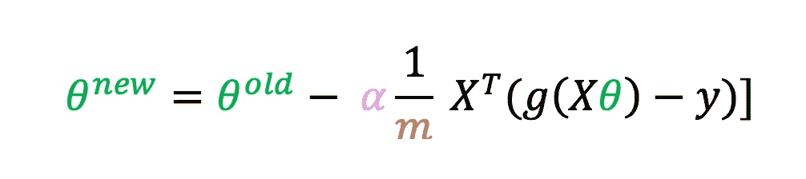*

*Equation 7: Vectorized Logistic Regression Gradient*

*计算*梯度*的 Python 代码如下:*

*Code 10: The Gradient Function*

*在第 9 步中，我们将看到如何优化梯度函数，使用 *scipy.optimize* 提供的算法之一。*

# *步骤 7:特征缩放和标准化*

*我们可能需要重新调整和标准化我们的数据。计算两个变量的*特征缩放和归一化*的 Python 代码如下:*

*Code 11: Feature Scaling and Normalization for two variables*

# *第八步:计算准确度*

*该函数计算我们算法的*精度*:*

*Code 12: The function for calculating the accuracy.*

# *步骤 9:用两个变量实现逻辑回归*

*在前面的步骤中，我们已经为实施*逻辑回归创建了所有的基本函数。*让我们来简单总结一下:*

```
*sigmoid(z)
calcCostFunction(theta, X, y)
calcGradient(theta, X, y)
FeatureScalingNormalization(X)
CalcAccuracy(theta, X)*
```

*现在我们将编写包装所有这些函数的代码，根据我们数据集的 20 个非冗余特征中的两个来预测恶性肿瘤的结果。对于特征的选择，我们可以参考我们在步骤 3 中找到的一对，*半径，*和*纹理，*，它们的相关分数= 0.32。以下代码从*数据帧 df:* 中产生特征 numpy 数组 *X* 和输出 numpy 向量 *y，**

*Code 13: Make the X and y numpy arrays*

*让我们画出这两个特征:*

*Code 14: Plot the features*

*在图 7 中，显示了结果图:*

*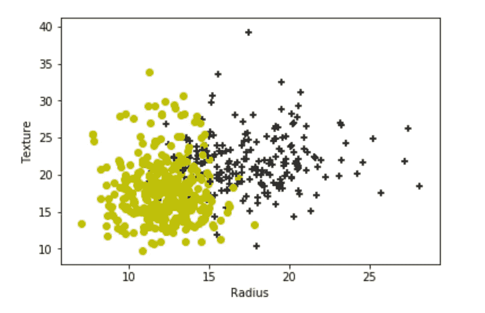*

*Figure 7: Plotting Radius and Texture*

*黄点代表良性，黑色，恶性。*

*现在让我们将*的数据正常化并缩放。另外，我们需要收集 ***mu*** ，它是我们训练集中 *X* 的平均值，以及 ***sigma*** 即*标准差。*在新的笔记本单元格中，让我们键入:**

**Code 15: Run Feature Scaling and Normalization**

**现在，我们必须用方法更新数组 X，添加一列“1”。 *vstack:***

**Code 16: Add a column of “ones” to the X matrix**

*****测试*****

**让我们做一些测试:为了测试我们的代码，让我们试着计算*成本函数*和*梯度*，从一个 *θ = [0，0，0]:* 开始**

**Code 17: 1st test; compute Cost Function and Gradient starting with initial θ = 0**

**新的 *θ* 向量为现= [ 0.12741652，-0.35265304，-0.20056252]，关联的 *J(θ)* = 0.69。**

**此外，我们可以尝试非零值的 *θ，*并看看会发生什么:**

**Code 18: 2nd test; compute Cost Function and Gradient starting with initial not-zero θ**

**更新后的 *θ* 向量现在是= [-0.37258348，-0.35265304，-0.20056252]，关联的 *J(θ)* = 8.48。**

*****渐变下降高级优化*****

**我们将用于寻找 *θ* 的优化算法是 ***BFGS*** ，它基于 Broyden、Fletcher、Goldfarb 和 Shanno [5]的拟牛顿法。*代码 19* 将实现函数 *Scypy* *minimize，*将在内部调用 *BFGS* 方法:**

**Code 19: Gradient Descent Advanced Optimization**

**如果我们不指定我们想要在参数“Method”中使用的*方法*的类型。*最小化*功能，默认使用 BFGS 算法。另一种方法，即 ***TNC*** ，使用截断牛顿算法来最小化变量受限的函数。用户可以尝试各种类型的优化算法。*最小化 Scypy 中的*功能。[参见 Scypy 文档页面，了解更多关于所有优化方法和函数的信息](https://www.coursera.org/learn/machine-learning/supplement/cmjIc/advanced-optimization)。*最小化*。*代码 18，*产生的输出如下:**

```
**fun: 0.2558201286363281
 hess_inv: array([[12.66527269, -1.22908954, -2.82539649],
       [-1.22908954, 71.16261306,  7.07658929],
       [-2.82539649,  7.07658929, 13.39777084]])
      jac: array([7.36409258e-07, 3.24760454e-08, 9.55291040e-07])
  message: 'Optimization terminated successfully.'
     nfev: 20
      nit: 19
     njev: 20
   status: 0
  success: True
        x: array([-0.70755981,  3.72528774,  0.93824469])**
```

*****决定边界*****

**BFGS 算法找到了 *scypy.minimize* 函数*的 *θ = [-0.70755981，3.72528774，0.93824469]* ，对应一个包含 *Result.x* 自变量的向量。*在步骤 3 中，我们提到，对于逻辑回归，假设 *hθ(x)* 计算输出可以为 0 或 1 的概率*。*为了将这个概率映射到一个离散的类别(良性/恶性)，我们选择一个阈值 0.5，高于这个阈值的值将被分类为“1”，低于这个阈值的值将被分类为“0”。所以，我们要做的是跟踪所谓的*决策边界*。决策边界是假设及其参数 *θ，*的属性，而不是数据集的属性。让我们再次绘制*半径*和*纹理*特征，但是添加一条红线，代表找到的 *θ* 的决定边界:**

*Code 20: Plot the data and the Decision Boundary*

*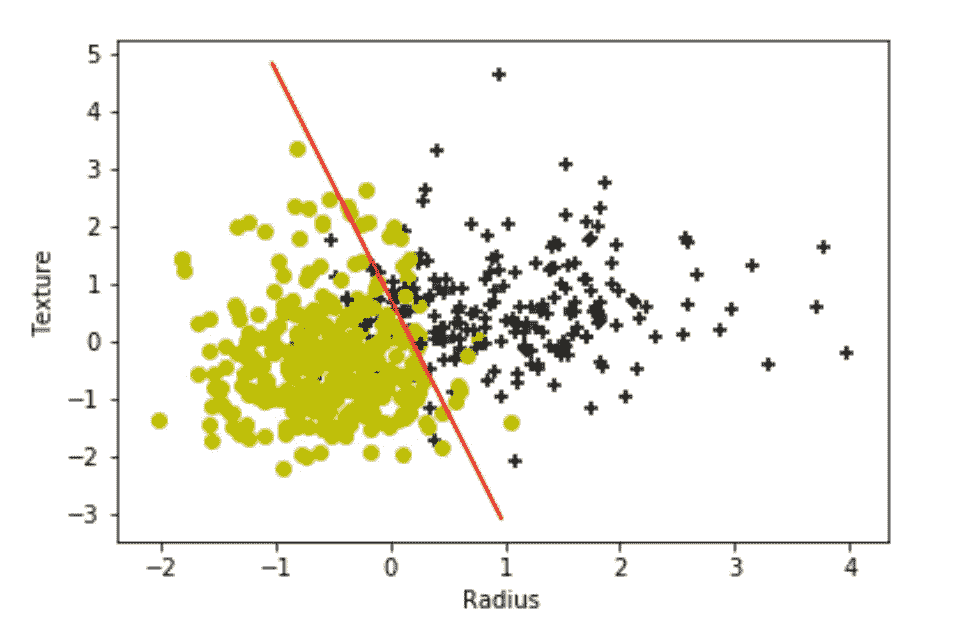*

*Figure 8: Plotting Radius and Texture together to the decision boundary*

*我认为重要的是要强调，令人惊讶的是，尽管逻辑回归在其假设模型中使用了非线性(sigmoid)函数，但决策边界是线性的！*

****计算精度****

*现在我们要计算我们算法的精度。步骤 8 中描述的函数 CalcAccuracy 将完成这项工作:*

*Code 21: calculate the accuracy*

**计算精度*的输出是 89.1，这是一个很好的精度分数！*

****做出预测****

*现在，我们已经测试了我们的算法并评估了它的准确性，我们想要进行预测。下面的代码代表了一个可能的查询示例:我们想知道*半径* = 18.00 和*纹理* = 10.12 的结果是什么:*

*Code 22: Example of Query; predict the risk of malignancy for Radius = 18.00 and Texture = 10.12*

*请注意，我们必须使用 *mu* 和 *sigma* 来规范化查询，以便进行缩放和规范化。预测的结果是 0.79，这意味着对于半径= 18 和纹理=10.12，恶性肿瘤的风险接近 1。*

# *步骤 10:如何为多个变量修改代码*

*在这一步中，我们将修改前面的代码来处理多个变量。需要更新的内容很少:首先是关于特征缩放和归一化功能:*

*Code 23: The Feature Scaling and Normalization function for multiple variables*

*其他小的修改涉及上传 X 向量的代码和查询的代码。下面的代码重新组合了我们到目前为止所做的工作，将所有函数扩展到使用多变量逻辑回归。将以下代码复制并粘贴到新的 Jupyter 笔记本单元格中:*

*Code 24: The complete Logistic Regression code for multiple variables*

*代码 24 将预测恶性肿瘤的风险:半径= 5.00，纹理= 1.10，W _ 凹面 _ 点= 0.4。在所有计算之后，它将产生以下输出:*

```
*Your Query is: 5.0, 1.1, 0.4
BFGS Message: Optimization terminated successfully.
Theta found: -1.40776926  3.13487429  1.52552603  4.02250701
Train Accuracy: 95.43057996485061
Prediction: 0.8154762110038786*
```

*这些输入值的恶性肿瘤预测值接近 1。修改查询，您可以自己试验概率是如何变化的。*

# *结论和考虑*

*逻辑回归是一种强大的机器学习工具，我们可以成功地使用它来预测生物医学数据的分类输出。数据争论和数据挖掘可以从 Python 及其库提供的出色性能中受益，社区对它们的支持非常好。线性代数编程在尽可能避免“while”和“for”循环方面具有内在优势。它可以通过 numpy 实现，numpy 是一个将矩阵矢量化的包。Numpy 使得在其上工作更加舒适，并保证对操作的更好控制，特别是对于大型数组。*

*此外，Python 的机器学习场景因许多强大包的出现而变得丰富(即， [Tensorflow，](https://www.tensorflow.org/) [Scikit-learn](https://scikit-learn.org/stable/) ，以及其他由于技术原因，我们在本文中没有提到的包)，这些包提供了对数据的出色优化分类和预测。*

*虽然配备了 Python 及其所有附件的机器学习可以代表预防和诊断医学的未来之路，但理解生物变量的局限性可能会使这条道路变得尴尬。*

*威斯康星乳腺癌(诊断)数据集有 569 名患者和 30 个特征，提供了分类参数的详尽分类，因此代表了机器学习应用的完美示例。无论如何，这些特征中的许多似乎是多余的，并且它们中的一些对分类和预测的明确影响仍然是未知的。*

*我们在步骤 3 中引入了双变量分析，以减少冗余特征的数量。关于这些特征在预测中的作用的深入讨论应该值得一篇专门的文章。*

*希望这篇帖子对你有用！*

# *参考资料:*

1.  *Mangasarian，Olvi & Street，Nick & Wolberg，William。(1970).基于线性规划的乳腺癌诊断和预后。运筹学 43.*
2.  *[https://www . cancer . org/cancer/breast-cancer/screening-tests-and-early-detection/乳腺活检/乳腺细针穿刺活检. html#references](https://www.cancer.org/cancer/breast-cancer/screening-tests-and-early-detection/breast-biopsy/fine-needle-aspiration-biopsy-of-the-breast.html)*
3.  *Andrew NG，机器学习| Coursera。*
4.  *Chris Albon,《Python 机器学习指南》, O'Really，ISBN-13:978–1491989388。*
5.  *诺塞达尔，J .和 S J .赖特。2006.数值优化。斯普林格纽约。*