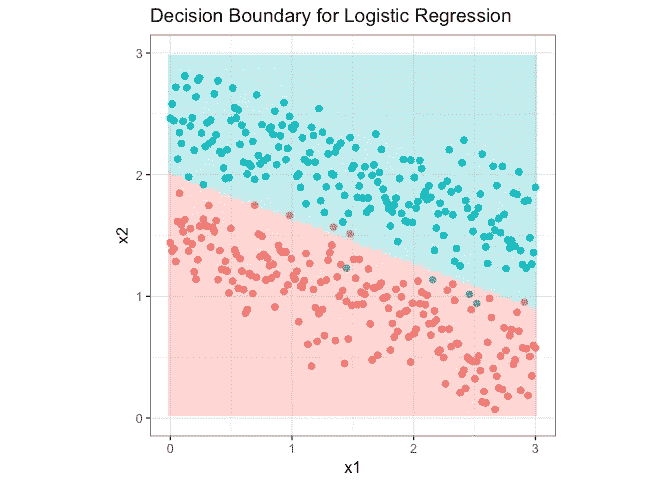

# R 中从头开始的逻辑回归

> 原文：<https://towardsdatascience.com/logistic-regression-from-scratch-in-r-b5b122fd8e83?source=collection_archive---------19----------------------->

*如果方程式没有出现，请点击“显示嵌入”来显示它们*

# 介绍

在统计学和数据科学中，逻辑回归用于预测某一类或某一事件的概率。通常，该模型是二项式的，但也可以扩展到多项式。对于许多应用程序来说，它可能是最简单但极其有用的模型之一，因为它实现速度快，易于解释。

这篇文章将关注二项式逻辑回归(可能会跟进多项式模型)。我将讨论逻辑回归的基础知识，它与线性回归的关系，以及如何使用简单的矩阵运算在 **R** 中构建模型。仅使用数学和矩阵运算(而不是 **R** 中的内置模型)将帮助我们理解幕后的逻辑回归。

最后，我将使用构建的模型对一些生成的数据进行分类，并显示决策边界。

# 逻辑回归

我们可以认为逻辑回归是一个广义线性模型，具有二项分布和 logit 连接函数。这种与线性回归的相似性将有助于我们构建模型。但是两种模型的区别在于:在线性回归中，预测值的范围是( **-∞，∞** )，而在逻辑回归中，是概率 ***p*** 范围[0，1]。这就是为什么我们需要使用 logit link 函数。

我们不是直接预测 ***p*** ，而是预测几率对数( [logit](https://en.wikipedia.org/wiki/Logit) ):

其范围从 **-∞** 到 **∞** 。当***p***→**0**，**logit(*p*)**→**-∞**而当 **p → 1 时，logit(*p*)**→**-∞。**因此，logit 函数有效地将概率值从[0，1]映射到( **-∞，∞** )。现在线性关系是:

其中上标表示第 ***i*** 个例子，下标表示特征或预测器 ***x* 1** ， ***x* 2** 等( ***x* 0** 为 **1** 作为偏差)。对于总共 **m 个**训练样本，预测矩阵 ***X*** 的形状将是 **m×(D+1)** ，其中 **D** 是预测变量 **( *x* 1， *x* 2，…， *x* D)** 的维数。加 1 是为了包含偏置列 ***x* 0** 。

而 **( *θ* 0， *θ* 1，…， *θ* D)** 是一个 **(D+1)×1** 列向量。向量化计算，右手边( **RHS** )可以写成**转置**(***θ***)***⋅x***或者 ***X⋅θ*** 。接下来的任务是找到 ***θ*** ，这最能代表 ***p*** 随*X***【m***训练示例的变化。*

*为了找到 ***θ*** ，我们需要定义一个代价函数。成本函数是这样的，每一个不正确的预测(或离真实值更远的预测)都会增加它的值。在逻辑回归中，成本函数定义为:*

*其中***h*(*x*)**是 sigmoid 函数，logit 函数的反函数:*

*对于每个例子， ***y*** 是实际的类标签 0 或 1， ***h* ( *x* )** 是得到值 1 的预测概率。如果 ***y* = 1** (第二项用 **(1- *y* )** 将为 0)，***j*(*I*)=-*y⋅*log(*h*(*x*)。**当***h*(*x*)→**1、**J(*I*)→0**自**log(1)= 0**；当***h*(*x*)**→**0**， ***J* ( *i* ) → ∞时。**如果 ***y* = 0，*J*(*I*)=-log(1-(*h*(*x*))。**当***h*(*x*)**→**0**，***J*(*I*)→0**，当***h*(*x*)**→1，**T92【J】**随着***h*(*x*)**从 ***y*** 进一步发展，成本函数迅速增加。*

*这是构建模型的基本过程。令人惊讶的是，当我开始编码时，它比我想象的要简单。*

# *R 中的模型构造*

*现在我们已经有了数学部分，让我们建立我们的逻辑回归。首先我将定义辅助函数，如 sigmoid 函数、成本函数 ***J*** 和梯度函数 ***J*** 。注意`%*%`是 **R** 中的点积。以下所有函数都使用矢量化计算。*

*接下来是逻辑回归函数，它将训练数据 ***X*** ，标签 ***y*** 作为输入。它返回一个列向量，该向量存储了 ***θ*** 中的系数。需要注意的一点是，输入的 ***X*** 通常没有偏置项，前导列向量为 1，所以我在函数中添加了这个列。*

*最后我可以写两个预测函数:第一个以 ***X*** 和 ***θ*** 为输入预测概率 ***p*** ，第二个以 ***p*** 为输入返回 ***y*** (1 或 0)。*

# *分类和决策边界*

*生成训练数据，使得它具有两个类别(0，1)，两个预测值( ***x* 1， *x* 2** )，并且可以通过线性函数来分离。*

**

*有一些轻微的重叠，所以没有这样的线将两个类完全分开。然而，我们的模型仍然能够找到最佳线路。*

*现在我可以训练模型得到 ***θ*** 。*

*还创建了一个网格，它可以被视为一个测试集。经过训练的模型将应用于此网格，并预测结果 z。这可用于创建决策边界。*

*在下面的图中，模型预测了将两个类的大部分分开的边界。一些数据点没有像预期的那样正确预测。但是，对训练数据进行 100%预测的模型在大多数情况下可能不是一个好模型，因为它会过度拟合数据。事实上，根据我生成数据的方式，解析解应该是***x*/3+*y*= 2**。而我的决策边界非常接近这条分析线。*

**

# *结论*

*现在你知道了，从头开始建立回归模型对我们来说并不困难。如果你阅读了这篇文章，希望现在你已经对逻辑回归有了更好的理解。最后一点，虽然逻辑回归经常被认为是一个分类器，但它也可以用于回归:找到我们上面看到的概率。*

**你可以在这里找到代码:*[https://github . com/JunWorks/Logistic-Regression-from-scratch-in-R](https://github.com/JunWorks/Logistic-Regression-from-scratch-in-R)*