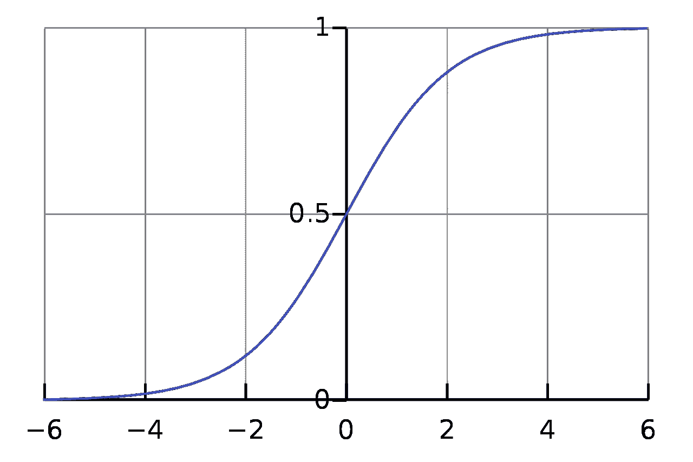
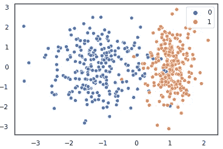
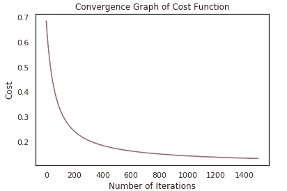
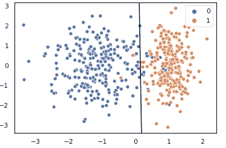

# 使用 NumPy 从头开始进行逻辑回归

> 原文：<https://towardsdatascience.com/logistic-regression-from-scratch-with-numpy-da4cc3121ece?source=collection_archive---------3----------------------->


At the end, it’s all about creating something valuable with your bare hands!

欢迎来到另一个实现机器学习算法的帖子！今天，我们将从头开始实现的算法是**逻辑回归**。除了它心爱的姐妹算法*线性回归*，由于其简单性和鲁棒性，这一算法也被高度用于机器学习。尽管它被称为逻辑*回归*，但它实际上是一种分类算法，用于将输入数据分类到其类别(标签)中。

这个强大的机器学习模型可以用来回答一些问题，例如:

*   一封电子邮件是否是垃圾邮件
*   如果客户会流失
*   肿瘤是良性的还是恶性的

以上所有问题都是简单的*是-否*问题，因此它们可用于将输入数据分为两类。因此，术语 ***二进制分类*** 在数据可以被分类为两个不同类别时使用。

显然， ***多类分类*** 处理的是有两个以上标签(类)的数据。在掌握了进行二元分类的逻辑回归的来龙去脉之后，过渡到多类分类是相当直接的，因此，我们现在将只处理具有两个类的数据。

请记住，在线性回归中，我们根据输入和模型参数预测数值。这里，在逻辑回归中，我们也可以接近模型，因为我们试图预测数值，但这次这些值对应于属于特定类别的输入数据的 ***概率*** 。

使用逻辑回归中的术语*逻辑*是因为我们将另一个函数应用于输入数据和模型参数的加权和，该函数称为 ***logit (sigmoid)函数*** 。

Sigmoid 函数始终输出介于 0 和 1 之间的值，将值映射到一个范围，因此可用于计算属于某个类别的输入数据的概率:

*sigmoid(x)= 1/(1+e⁻****ˣ****)*



Sigmoid (logit) function

事不宜迟，让我们开始编写这个实现的代码。必要时，我会边走边解释代码。

我们从导入必要的库开始。和往常一样， **NumPy** 是我们用来实现逻辑回归算法的唯一一个包。

所有其他工具只能帮助我们完成一些小任务，比如可视化手头的数据或创建数据集。因此，我们不会使用已经实现的逻辑回归包解决方案。

这里，我们为前面提到的 sigmoid (logit)函数编写代码。值得注意的是，这个函数可以单独应用于一个`numpy`数组的所有元素，因为我们使用了 **NumPy** 包中的指数函数。

接下来，我们为逻辑回归写成本函数。请注意，逻辑回归中使用的成本函数不同于线性回归中使用的成本函数。

请记住，在线性回归中，我们计算输入数据和参数的加权和，并将该和提供给成本函数来计算成本。当我们绘制成本函数时，发现它是凸的，因此局部最小值也是全局最小值。

然而，在逻辑回归中，我们将 sigmoid 函数应用于加权和，这使得结果*是非线性的*。

如果我们把非线性结果输入到成本函数中，我们得到的将是一个非凸的函数，我们不能保证只找到一个局部最小值，也就是全局最小值。

因此，我们使用另一个成本函数来计算成本，该成本保证在优化期间给出一个局部最小值*。*

这里的梯度下降实现与我们在线性回归中使用的没有太大不同。显然，唯一需要注意的区别是应用于加权和的 sigmoid 函数。

当写出预测函数时，我们不要忘记我们在这里处理的是*概率*。

因此，如果结果值高于 0.50，我们将其向上舍入到 1，这意味着数据样本属于类 1。因此，如果属于类别 1 的数据样本的概率低于 0.50，这仅仅意味着它是另一个类别(类别 0)的一部分。

记住这是二元分类，所以我们只有两个类(类 1 和类 0)。



写完必要函数的代码后，让我们用来自`sklearn.datasets`的`make_classification`函数创建我们自己的数据集。我们用两个类创建 500 个样本点，并在`seaborn`库的帮助下绘制数据集。

```
Initial Cost is: [[0.69312718]] 

Optimal Parameters are: 
 [[-0.45293068]
 [ 3.26552327]
 [ 0.03334871]]
```



现在，让我们运行算法，计算模型的参数。

看到该图，我们现在可以确定我们已经实现了逻辑回归算法，没有错误，因为它随着每次迭代而减少，直到*减少如此之小，以至于成本收敛到最小值*，这正是我们真正想要的。

```
0.966
```

运行算法并获得最佳参数后，我们想知道我们的模型在预测数据类别方面有多成功。事实证明，我们获得的准确度分数是一个相当高的值，所以一定要鼓励自己！



现在，为了形象化，让我们沿着模型的决策边界绘制数据集。

我们只需使用最佳参数计算截距和斜率值，并绘制将数据分为两类的边界。

从图中我们可以看出，分类不是 100%正确的，因为类的分离自然不是线性的。然而，错误分类的点(假阳性和假阴性)真的很少，所以我们在逻辑回归的实现方面做得很好。

请随意继续并再次编写所有这些代码。

但是这一次，*靠自己*去做。

你也可以查看我的 [GitHub 简介](https://github.com/leventbass/logistic_regression)，沿着 *jupyter 笔记本*阅读代码，或者简单地使用代码来实现。

将来，我一定会带来更多的实现。

编码快乐！

## 有问题吗？评论？通过[leventbas92@gmail.com](http://leventbas92@gmail.com)或 [GitHub](https://github.com/leventbass) 联系我。