# Python 中从头开始的逻辑回归

> 原文：<https://towardsdatascience.com/logistic-regression-from-very-scratch-ea914961f320?source=collection_archive---------20----------------------->

我一直在发表关于从零开始实现的文章。这一次是为了逻辑回归！让我们开始吧！

Photo by [Mikhail Vasilyev](https://unsplash.com/@miklevasilyev?utm_source=medium&utm_medium=referral) on [Unsplash](https://unsplash.com?utm_source=medium&utm_medium=referral)

# 逻辑回归

逻辑回归用于二元分类。你可以训练你的模型来预测某人是否是癌症，或者你的模型可以被训练来预测照片中的人是否是猫。

# 等式实现

你还记得那个等式吗:

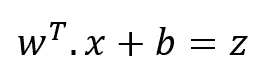

这是用于回归的。但是这产生了大的数字，而我们希望输出是 1 或 0(癌症与否)。在这种情况下，乙状结肠功能就发挥作用了。

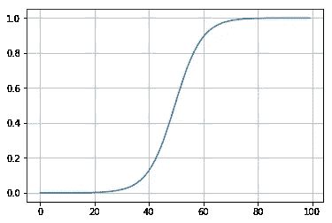

sigmoid function graph

当您输入 z 时，sigmoid 函数产生 0 到 1 之间的值。上面给出了 z。

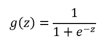

sigmoid function

这是 sigmoid 函数在 Python 中的实现方式:

由于这个功能，我们的输出将在 0 和 1 之间。

# 损失和成本函数

假设您的训练集有许多训练示例。你想计算你的模型做得有多好。损失和成本函数开始起作用。损失函数是仅用于训练示例的损失。代价函数是整个训练集的损失。

有许多损失函数可以选择使用。我会用这个:

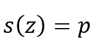

s(z): sigmoid of z. p: predictions

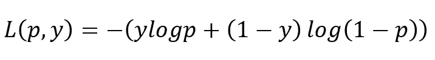

loss function

在损失函数中， **p** 是我们的预测值， **y** 是实际值。为了便于讨论，我们只有权重参数，成本函数的图形如下所示:

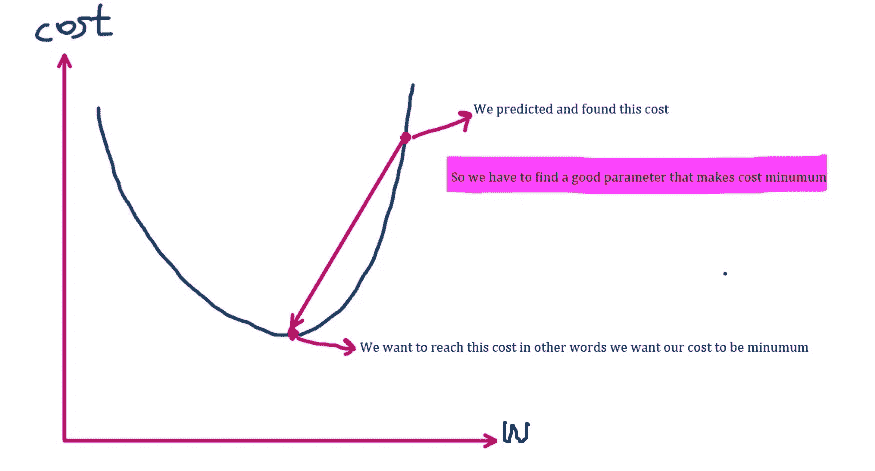

我们希望我们的成本尽可能低。从图中，我们想找到全局最小值。为此将使用梯度下降算法。我们将找到该图的斜率(导数),并更新我们的权重(w)和偏差(b ),以使成本最小。

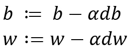

updating parameters

为了更新权重和偏差，我们将使用上面的等式。(:=)是顺便更新的意思。我们知道 b 和 w，但是如何找到 **db** 和 **dw 呢？让我们做些数学计算。**

# 让我们找到 db 和 dw

记住我们的目标是使成本最小化。所以我们想找到使成本最小的参数。我们可以通过对损失函数关于参数求导来实现。那就更新我们的参数！我们将利用链式法则来计算损失函数对参数的导数。所以我们将首先找到损失函数对 p 的导数，然后是 z，最后是参数。

让我们记住损失函数:

在取导数损失函数之前。让我告诉你如何取导数对数。

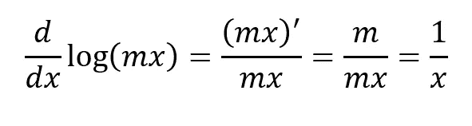

让我们首先找到损失函数相对于 **p** (预测)的导数，以便能够对 dz 求导。

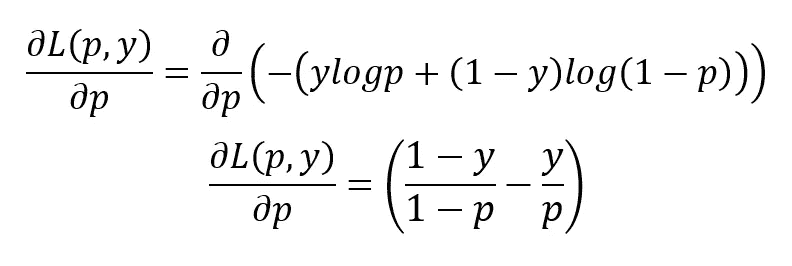

我们刚刚找到了关于 p 的导数，现在我们可以计算关于 z 的。

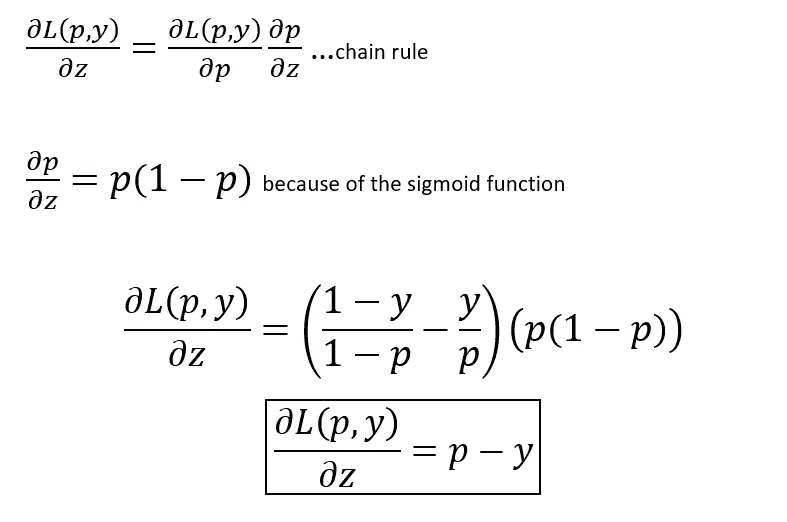

我们还没完。我们找到了损失函数对 p 和 z 的导数，现在我们可以对 w 和 b 做同样的事情来更新参数。

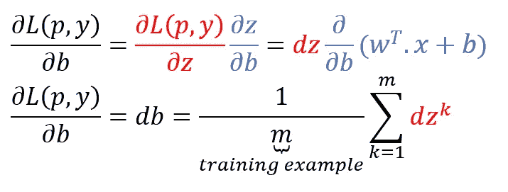

db

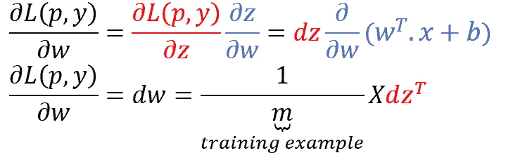

dw

我们刚找到 db 和 dw。好消息…我们现在可以更新参数了。

# 多合一

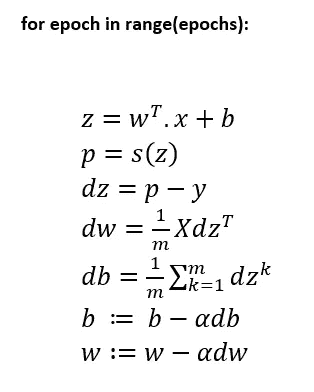

让我们用 Python 来实现它:

我将使用 [sci-kit learn](https://scikit-learn.org/stable/) 创建一个数据集。

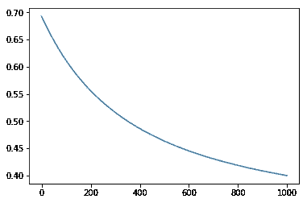

它看起来像我们所期待的。

# 预言；预测；预告

如果你想让你的模型预测。你可以这样做。从上面的代码中，假设你找到了 p，它将在 0 和 1 之间。假设输出为 0.85。**是 0(不是癌症)还是 1(癌症)？**由你决定。如果你说，你的门槛是 0.8。作为 0.85 > 0.8(你的门槛)，你的模型说 1(癌症)。就像添加一个 if 条件一样简单。

感谢您的阅读！喜欢就鼓掌，跟着我上 [github](https://github.com/halilibrahim95) 。