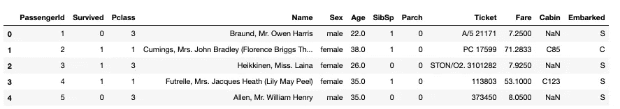
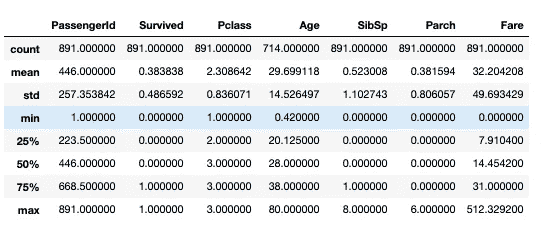
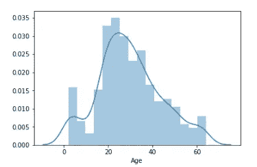
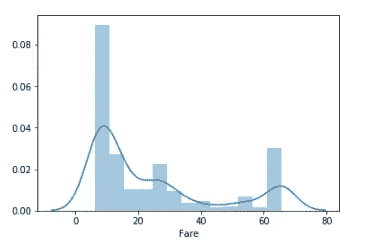
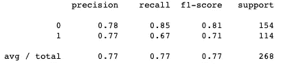
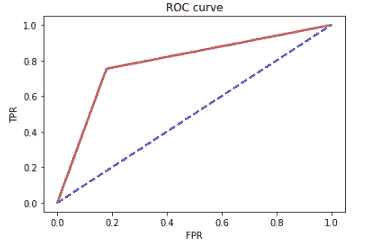

# Python 中的逻辑回归

> 原文：<https://towardsdatascience.com/logistic-regression-in-python-f66aeb15e83e?source=collection_archive---------15----------------------->

逻辑回归是一种相当常见的机器学习算法，用于预测分类结果。在这篇博文中，我将带您浏览使用 Jupyter 笔记本在 python 中创建逻辑回归模型的过程。

我们将使用来自 kaggle 的泰坦尼克号数据集，它是数据点的集合，包括年龄、性别、票价等..泰坦尼克号上所有乘客中。数据集有 891 行和 12 列。目标是看看我们是否能预测任何给定的乘客是死是活。希望你能明白为什么逻辑回归是这个问题的合适模型。

# 让我们开始吧…

无论您正在构建什么模型，第一步都是导入所有的库并探索数据集。

现在，让我们加载数据集并查看数据框。

简短的预览让我们了解我们正在处理的数据类型和空值的种类。它有助于了解如何处理、清理和编码数据。

## 汇总数据

这对于一个成功的模型来说并不是必须的，但是我总是这样做，我认为这样可以让代码更干净，更易读。我喜欢在数据集上调用 describe()函数，它产生一个简洁的数据框架，其中包含每一列的标准统计数据。然后，我将每一行存储为一个单独的序列。这将有助于查找异常值或替换空值。

# 计算异常值

有几种方法可以计算异常值。我选择使用四分位数范围(IQR)。为了简明扼要，我假设您熟悉 IQR 的概念，所以我将只介绍如何用 Python 来编写它。如果你认为你需要刷新你的记忆，我会推荐你看看这篇[博文](https://medium.com/datadriveninvestor/finding-outliers-in-dataset-using-python-efc3fce6ce32)。

让我从描述计算异常值的步骤开始。

1.  我访问了“年龄”和“费用”列中的第 25 和第 75 百分位值。
2.  然后，我用这些百分位值计算了四分位间距、下限和上限。
3.  我还计算了第 98 和第 2 百分位值。
4.  我将每一列中的值与上限和下限进行了比较。如果它们超出了界限，我就用第 98 或第 2 百分位值来替换它们。

# 数据可视化

在处理大型数据集时，有时很难掌握变量对结果的影响程度。可视化数据集有助于从不同的角度看待事物。

以下是“年龄”和“费用”的分布情况:

# 创建模型

## 识别特征

创建模型时，确定所有特征值非常重要。在这种情况下，我去掉了一些类似“passengerid”、“Name”和“Ticket”的列，因为我不认为个人的姓名或 ID 会影响他们的生存机会。

我删除了像“Cabin”这样的其他列，只是因为它们有太多的空值。

## 编码值

在我们确定了要丢弃的特征之后，我们仍然需要对分类值或字符串值进行编码。模型没有性别和机舱位置的概念；这就是为什么我们必须将字符串编码成整数，以模型可以理解的方式来表示这些数据类型。

## 列车测试分离

现在我们已经选择了所有的特性，让我们将数据集分成一个训练集和一个测试集，并创建模型。

# 分析模型

有几个指标来分析模型的准确性。从 sklearn.metrics 库中，我导入了混淆矩阵、分类报告和 auc/roc 分数。

这些工具在评估模型的有效性时非常方便。

