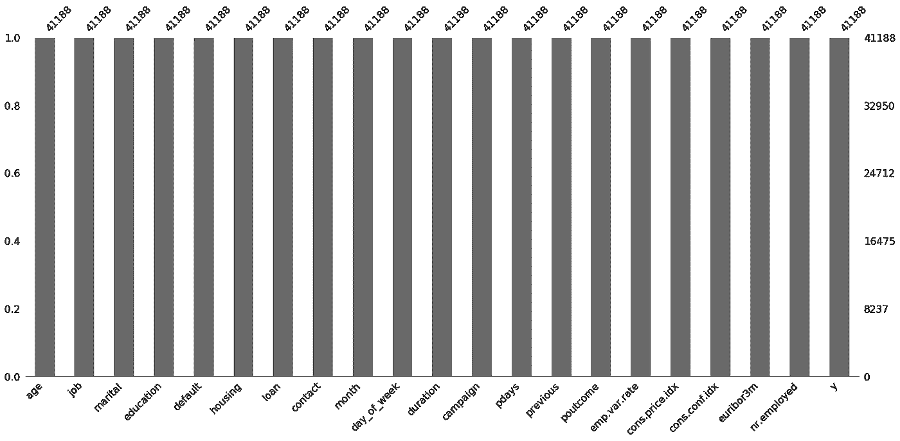
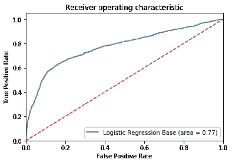
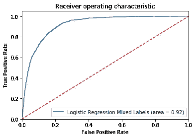
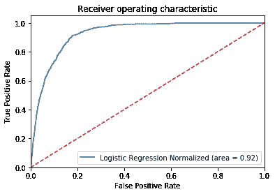
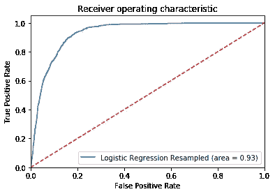
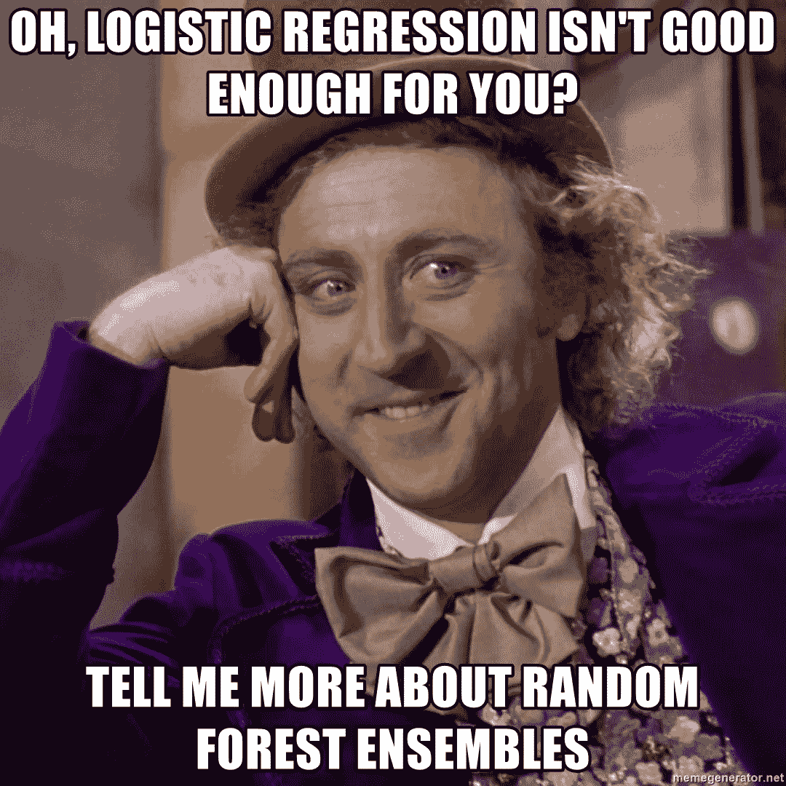
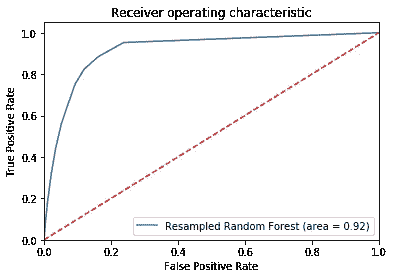
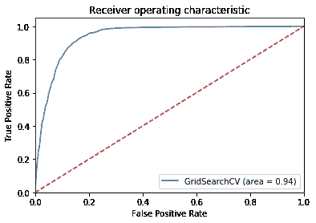

# 使用 scikit-learn 调整逻辑回归模型—第 1 部分

> 原文：<https://towardsdatascience.com/logistic-regression-model-tuning-with-scikit-learn-part-1-425142e01af5?source=collection_archive---------0----------------------->

## 模型调整过程中的度量比较

分类器是机器学习模型的核心组件，可以广泛应用于各种学科和问题陈述。

有了所有可用的包，在 Python 中运行逻辑回归就像运行几行代码并在测试集上获得预测的准确性一样简单。

有哪些方法可以改进这样一个基础模型，结果如何比较？

为了展示一些技术，我们将使用来自 UCI 机器学习知识库的[银行营销数据集](https://www.kaggle.com/henriqueyamahata/bank-marketing)运行一些模型。该数据集代表了一家葡萄牙银行的直接营销活动，以及这些活动是否导致了银行定期存款。


## 基本逻辑回归模型

在为基本 EDA 导入必要的包并使用 missingno 包之后，似乎这个数据集的大部分数据都存在了。



要对此数据进行逻辑回归，我们必须将所有非数字特征转换为数字特征。有两种流行的方法:标签编码和热编码。

对于标注编码，将为要素列中的每个唯一值分配不同的编号。这种方法的一个潜在问题是假设标签大小表示平凡性(即标签 3 大于标签 1)。

对于一个热编码，为特征列中的每个唯一值创建一个新的特征列。如果该观察值存在，则该值为 1，否则为 0。然而，这种方法很容易导致特征数量的爆炸，并导致维度的[诅咒](https://www.kdnuggets.com/2017/04/must-know-curse-dimensionality.html)。

下面，我们试图拟合一个只有虚拟变量的模型和另一个只有标签编码变量的模型。

```
Model accuracy is 0.8963340616654528
```

```
Model accuracy is 0.9053168244719592
```

虽然最终的模型精度相当，但快速查看一下 [AUC](https://developers.google.com/machine-learning/crash-course/classification/roc-and-auc) ，另一个模型指标表明使用标签编码后有了显著的改善。



All dummy variables vs all label encoded.

在不同的阈值范围内，标签编码似乎表现得更好。但是，有几个功能的标签排序没有意义。例如，一周中的几天:

```
{'fri': 1, 'mon': 2, 'thu': 3, 'tue': 4, 'wed': 5}
```

此外，如果转换为虚拟变量，特别是“工作”特征将更具解释力，因为一个人的工作似乎是他们是否开设定期存款的重要决定因素，而序数标度将没有太大意义。

下面，为教育、月份和星期几确定定制订单，同时为工作创建虚拟变量。

```
Model accuracy is 0.9053168244719592
```



得到的模型具有与仅标记编码的变量相当的准确性，同时保持类似的 0.92 的高 AUC 分数。更重要的是，现在可以清楚地解释和识别标签和虚拟变量的新组合。

## 归一化和重采样

上面的基本模型是在原始数据上执行的，没有任何标准化。这里，我们采用 MinMaxScaler，并将值的范围限制在 0 和 1 之间。

```
Model accuracy is 0.906409322651129
```

人们也可能对大约 0.9 的直接 AUC 分数持怀疑态度。在检查响应变量的样本时，似乎存在一个类别不平衡的问题，只有大约 10%的客户订阅定期存款。

关于 10:90 比例的阶级不平衡问题的严重性存在争议，因为有许多转换实验可以达到 1:99 的比例。

尽管如此，我们在这里使用 SMOTE 探索一种重采样技术。在我们的特定场景中，我们通过合成生成附加样本来对少数类进行过采样。

```
Model accuracy is 0.8661082787084243
```



虽然重采样数据在 AUC 上略胜一筹，但准确性下降到 86.6%。事实上，这比我们的基本模型还要低。

## 随机森林回归模型

虽然我们在上面的测试案例中使用了基本的逻辑回归模型，但是另一种流行的分类方法是随机森林模型。



让我们用标准化数据和随机森林模型的重采样数据重复上述两个模型。

```
Normalized Model accuracy is 0.9059237679048313Resampled Model accuracy is 0.9047098810390871
```

两者的精确度分数相当，但有趣的是，与基本逻辑回归模型相比，随机森林模型在重采样数据上的模型精确度大大提高了。



虽然这两个 AUC 分数都略低于逻辑模型的分数，但似乎对重采样数据使用随机森林模型在准确性和 AUC 指标的总体上表现更好。

## 网格搜索

值得注意的是，上述模型是使用由 LogisticRegression 和 RandomForestClassifier 模块确定的默认参数运行的。我们可以通过调整模型的超参数来改进模型吗？

为了实现这一点，我们定义了一个参数“网格”,我们希望在模型中测试这些参数，并使用 GridSearchCV 选择最佳模型。

在上面的网格搜索中，我们利用了由两个字典组成的参数网格。

第一个字典包括我想在模型中运行的所有 LogisticRegression 的变体，包括关于正则化类型、惩罚大小和所用求解器类型的变体。

第二个字典包括 RandomForestClassifier 的所有变体，并包括模型中使用的估计器(树)数量和最大特征数量的不同范围。

```
Fitting 5 folds for each of 100 candidates, totalling 500 fits[Parallel(n_jobs=-1)]: Using backend LokyBackend with 4 concurrent workers.
[Parallel(n_jobs=-1)]: Done  42 tasks      | elapsed:    4.7s
[Parallel(n_jobs=-1)]: Done 192 tasks      | elapsed:   43.1s
[Parallel(n_jobs=-1)]: Done 442 tasks      | elapsed:  6.4min
[Parallel(n_jobs=-1)]: Done 500 out of 500 | elapsed:  8.8min finished
```

使用定义的参数范围，评估了 100 个潜在模型。因为我选择了五重交叉验证，这导致了 500 个不同的模型被拟合。这花了大约 9 分钟。

这是“最佳”模型的参数:

```
RandomForestClassifier(bootstrap=True, class_weight=None, criterion='gini',
            max_depth=None, max_features=6, max_leaf_nodes=None,
            min_impurity_decrease=0.0, min_impurity_split=None,
            min_samples_leaf=1, min_samples_split=2,
            min_weight_fraction_leaf=0.0, n_estimators=100, n_jobs=None,
            oob_score=False, random_state=None, verbose=0,
            warm_start=False)
```

准确度为 0.908，AUC 评分为 0.94，这两项指标都是迄今为止我们从所有模型中所见的每项指标的最高值。

```
Model accuracy is 0.9083515416363195
```



对重新采样的数据重复相同的拟合，得到相同的准确度和分类报告，但运行时间长达 23 分钟。

## 基础模型与“最终”模型的比较

不同的分类标准是如何从我们的基本模型中得到改进的？

基本模型分类报告:

```
 precision    recall  f1-score   support

           0       0.97      0.92      0.95      7691
           1       0.38      0.64      0.47       547

   micro avg       0.91      0.91      0.91      8238
   macro avg       0.67      0.78      0.71      8238
weighted avg       0.93      0.91      0.92      8238
```

“最终”模型分类报告:

```
 precision    recall  f1-score   support

           0       0.97      0.94      0.95      7537
           1       0.48      0.64      0.55       701

   micro avg       0.91      0.91      0.91      8238
   macro avg       0.72      0.79      0.75      8238
weighted avg       0.92      0.91      0.92      8238
```

似乎所有模型在多数类中都表现很好，准确率、召回率都高于 0.9。

不过，新的改进模型对少数族裔来说表现更好，可以说是对客户是否打算订阅定期存款的“更重要”分类。


AUC 评分也提高到 0.94，这表明最终模型在不同阈值下的表现也更好。

虽然我们已经设法改进了基本模型，但仍有许多方法来调整模型，包括多项式特征生成、sklearn 特征选择以及为网格搜索调整更多的超参数。

这将是第 2 部分的重点！同时，谢谢阅读，代码可以在[这里](https://github.com/finnqiao/bank-logistic/blob/master/bank-logistic-v2.ipynb)找到。也可以在[领英](https://www.linkedin.com/in/finnqiao/)上自由连接！