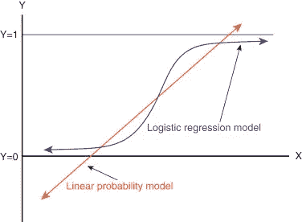

# PyTorch 对 MNIST 的 Logistic 回归分析

> 原文：<https://towardsdatascience.com/logistic-regression-on-mnist-with-pytorch-b048327f8d19?source=collection_archive---------2----------------------->

**逻辑回归**用于描述数据，解释**一个因变量**与一个或多个名义变量、序数变量、区间变量或比率水平自变量之间的关系【1】。下图显示了**逻辑**和**线性**回归的区别。



Taken from [https://www.sciencedirect.com/topics/nursing-and-health-professions/logistic-regression-analysis](https://www.sciencedirect.com/topics/nursing-and-health-professions/logistic-regression-analysis)

在这篇文章中，我将展示如何用 PyTorch 编写一个逻辑回归模型。

我们将尝试解决 MNIST 数据集的分类问题。首先，让我们导入所有我们需要的库。

```
**import** torch
**from** torch.autograd **import** Variable
**import** torchvision.transforms **as** transforms
**import** torchvision.datasets **as** dsets
```

当我创建一个模型时，我喜欢把下面的步骤列表放在我面前。这份名单公布在 PyTorch 网站上[2]。

```
*# Step 1\. Load Dataset
# Step 2\. Make Dataset Iterable
# Step 3\. Create Model Class
# Step 4\. Instantiate Model Class
# Step 5\. Instantiate Loss Class
# Step 6\. Instantiate Optimizer Class
# Step 7\. Train Model*
```

所以让我们一个接一个地经历这些步骤。

## 加载数据集

为了加载数据集，我们使用了 **torchvision.datasets，**这个库几乎包含了机器学习中使用的所有流行数据集。你可以在[3]查看完整的数据集列表。

```
train_dataset = dsets.MNIST(root=**'./data'**, train=**True**, transform=transforms.ToTensor(), download=**False**)
test_dataset = dsets.MNIST(root=**'./data'**, train=**False**, transform=transforms.ToTensor())
```

## 使数据集可迭代

我们将使用 DataLoader 类，通过下面几行代码使我们的数据集可迭代。

```
train_loader = torch.utils.data.DataLoader(dataset=train_dataset, batch_size=batch_size, shuffle=**True**)
test_loader = torch.utils.data.DataLoader(dataset=test_dataset, batch_size=batch_size, shuffle=**False**)
```

## 创建模型类

现在，我们将创建一个定义逻辑回归架构的类。

```
**class** LogisticRegression(torch.nn.Module):
    **def** __init__(self, input_dim, output_dim):
        super(LogisticRegression, self).__init__()
        self.linear = torch.nn.Linear(input_dim, output_dim)

    **def** forward(self, x):
        outputs = self.linear(x)
        **return** outputs
```

## 实例化模型类

在实例化之前，我们将初始化如下一些参数。

```
batch_size = 100
n_iters = 3000
epochs = n_iters / (len(train_dataset) / batch_size)
input_dim = 784
output_dim = 10
lr_rate = 0.001
```

现在，我们初始化我们的逻辑回归模型。

```
model = LogisticRegression(input_dim, output_dim)
```

## 实例化损失类

我们使用交叉熵来计算损失。

```
criterion = torch.nn.CrossEntropyLoss() *# computes softmax and then the cross entropy*
```

## 实例化优化器类

优化器将是我们使用的学习算法。在这种情况下，我们将使用随机梯度下降。

```
optimizer = torch.optim.SGD(model.parameters(), lr=lr_rate)
```

## 训练模型

现在，在最后一步中，我们将使用以下代码来训练模型。

```
iter = 0
**for** epoch **in** range(int(epochs)):
    **for** i, (images, labels) **in** enumerate(train_loader):
        images = Variable(images.view(-1, 28 * 28))
        labels = Variable(labels)

        optimizer.zero_grad()
        outputs = model(images)
        loss = criterion(outputs, labels)
        loss.backward()
        optimizer.step()

        iter+=1
        **if** iter%500==0:
            *# calculate Accuracy* correct = 0
            total = 0
            **for** images, labels **in** test_loader:
                images = Variable(images.view(-1, 28*28))
                outputs = model(images)
                _, predicted = torch.max(outputs.data, 1)
                total+= labels.size(0)
                *# for gpu, bring the predicted and labels back to cpu fro python operations to work* correct+= (predicted == labels).sum()
            accuracy = 100 * correct/total
            print(**"Iteration: {}. Loss: {}. Accuracy: {}."**.format(iter, loss.item(), accuracy))
```

训练，这个模型仅仅 3000 次迭代就给出了 82% 的**准确率。您可以稍微调整一下参数，看看精度是否会提高。**

为了更深入地理解 PyTorch 中的逻辑回归模型，一个很好的练习是将它应用于你能想到的任何分类问题。例如，你可以训练一个逻辑回归模型来对你最喜欢的**漫威超级英雄**的图像进行分类(应该不会很难，因为他们中的一半已经消失了:)。

## 参考

[1][https://www . statistics solutions . com/what-is-logistic-regression/](https://www.statisticssolutions.com/what-is-logistic-regression/)

[2][https://py torch . org/tutorials/beginner/blitz/neural _ networks _ tutorial . html # sphx-glr-beginner-blitz-neural-networks-tutorial-py](https://pytorch.org/tutorials/beginner/blitz/neural_networks_tutorial.html#sphx-glr-beginner-blitz-neural-networks-tutorial-py)

[https://pytorch.org/docs/stable/torchvision/datasets.html](https://pytorch.org/docs/stable/torchvision/datasets.html)