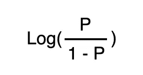
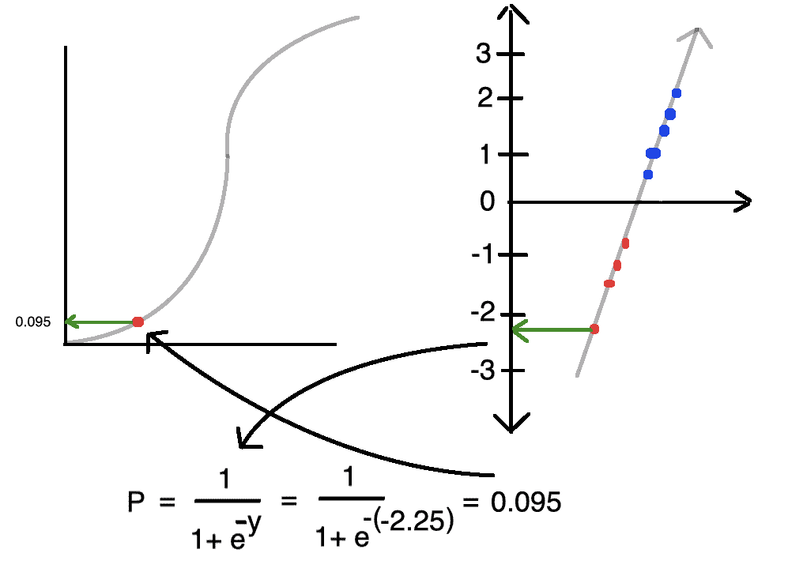

# Python 中的逻辑回归

> 原文：<https://towardsdatascience.com/logistic-regression-python-7c451928efee?source=collection_archive---------1----------------------->


[https://www.pexels.com/photo/strict-female-teacher-with-book-pointing-at-scribbled-blackboard-3771074/](https://www.pexels.com/photo/strict-female-teacher-with-book-pointing-at-scribbled-blackboard-3771074/)

尽管逻辑回归中有 ***回归*** 这个词，但逻辑回归是一种用于二分类的监督机器学习算法。我说 ***二进制*** 是因为逻辑回归的局限性之一是它只能用 ***两个*** 不同的类对数据进行分类。在较高层次上，逻辑回归将直线拟合到数据集，然后根据新样本相对于直线的位置返回新样本属于两个类之一的概率。

# 赔率与概率

在深入逻辑回归的本质之前，我们理解概率和赔率之间的区别是很重要的。概率的计算方法是，用发生的事件数除以没有发生的事件数。例如，如果赢得一场比赛的赔率是 5 比 2，我们将该比率计算为 5/2=2.5。另一方面，概率的计算方法是用某件事情发生的事件数除以事件总数(包括同样的事情发生和没有发生的事件)。比如，相同赔率的游戏，赢的概率是 5/(5+2)=0.714。

赔率和概率之间的一个重要区别是，概率的范围从 0 到 1，而赔率的**对数**的范围从负无穷大到正无穷大，这一点在我们训练模型时会发挥作用。我们采用赔率的对数，因为否则，当我们计算某个事件发生的赔率(例如，赢得一场比赛)时，如果分母大于分子，赔率的范围将从 0 到 1。然而，当分子大于分母时，赔率将从 1 到无穷大。例如，假设我们比较了两个不同球队赢得比赛的几率。A 队由全明星组成，因此他们赢一场比赛的赔率是 5 比 1。


另一方面，B 队赢一局的赔率是 1 比 5。


在记录概率时，两个队离原点(0)的距离是相同的。


我们可以通过用一个事件发生的概率除以它不发生的概率来从概率到赔率。


我们把后者的通式写成如下:



正如我们将要看到的，在确定模型的最佳拟合时，我们需要在概率和赔率之间来回权衡。

# 算法

假设我们想要建立一个逻辑回归模型，在给定某些变量(如学习时间)的情况下，预测学生是否会通过或失败。确切地说，我们想要一个输出学生通过概率(0 到 1 之间的数字)的模型。值为 1 意味着学生肯定会通过，而值为 0 意味着学生会不及格。

在数学中，我们称下面的方程为 Sigmoid 函数。


其中 *y* 是直线的方程式。


不管 T2 y T3 的值是多少，Sigmoid 函数的范围是从 0 到 1。例如，当 y 趋向负无穷大时，概率接近零。


当 y 趋于正无穷大时，概率趋近于 1。


在逻辑回归中，我们使用 Sigmoid 函数来描述样本属于两个类别之一的概率。Sigmoid 函数的形状决定了我们的模型预测的概率。当我们训练我们的模型时，我们实际上是试图选择其形状最适合我们的数据的 Sigmoid 函数。我们选择最佳路线的实际方法涉及大量的数学运算。正如我们在线性回归中看到的，我们可以使用梯度下降或其他技术来收敛到一个解。然而，Sigmoid 函数的导数相当复杂。

如果我们可以优化一条直线的方程呢？


正如我们之前提到的，我们可以从概率(范围从 0 到 1 的函数)到对数(赔率)(范围从负到正无穷大的函数)。


比如假设一个学生通过的概率是 0.8 或者 80%。我们可以通过用它们通过的概率除以它们失败的概率，然后取结果的对数，找到新图的 y 轴上的相应位置。


然后，我们将对每个数据点重复这一过程。


一旦我们在新的 y 轴上绘制了每个数据点，就像线性回归一样，我们可以使用优化器来确定最佳拟合线的 y 截距和斜率。


在这个例子中，我们将介绍如何使用最大似然法优化函数。

首先，我们生成一条候选线，然后将原始数据点投影到这条线上。


我们查看沿线每个数据点的 *y* 值，并将其从赔率的对数转换为概率。



在对每个数据点重复这个过程之后，我们得到了下面的函数。


学生通过的可能性是 y 轴上该点的值。在给定 s 形形状的情况下，观察到具有当前分布的学生的可能性是单独观察每个学生通道的结果。


接下来，我们包括那些没有通过总体可能性等式的学生的可能性。因为 Sigmoid 函数表示学生通过 的 ***概率，所以学生失败的可能性是 1(总概率)减去沿线该点的 *y* 值。***


您通常会看到被使用的可能性日志。对数中两个数的乘积相当于它们对数的相加。


我们以下面的可能性结束。


然后，我们对不同的行重复整个过程，并比较可能性。我们选择具有最大可能性(最大正数)的线。


# 密码

让我们看看如何在 Python 中实现逻辑回归。首先，导入以下库。

```
from sklearn.datasets import make_classification
from matplotlib import pyplot as plt
from sklearn.linear_model import LogisticRegression
import seaborn as sns
sns.set()
from sklearn.model_selection import train_test_split
from sklearn.metrics import confusion_matrix
import pandas as pd
```

接下来，我们将利用`scikit-learn`库中的`make_classification`函数来生成数据。正如我们前面提到的，逻辑回归只适用于二元分类问题。因此，数据点由两类组成。

```
x, y = make_classification(
    n_samples=100,
    n_features=1,
    n_classes=2,
    n_clusters_per_class=1,
    flip_y=0.03,
    n_informative=1,
    n_redundant=0,
    n_repeated=0
)
```

我们绘制了特征和类之间的关系。

```
plt.scatter(x, y, c=y, cmap='rainbow')
```


在训练我们的模型之前，我们将留出一部分数据来评估它的性能。

```
x_train, x_test, y_train, y_test = train_test_split(x, y, random_state=1)
```

我们实例化了一个`LogisticRegression`类的实例，并调用带有特征和标签的`fit`函数(因为逻辑回归是一种有监督的机器学习算法)作为参数。

```
lr = LogisticRegression()lr.fit(x_train, y_train)
```

我们可以访问以下属性来实际查看最佳拟合线的斜率和 y 截距的系数。

```
print(lr.coef_)
print(lr.intercept_)
```


让我们来看看这个模型对未经训练的数据的表现。

```
y_pred = lr.predict(x_test)
```

鉴于这是一个分类问题，我们使用混淆矩阵来衡量我们的模型的准确性。

```
confusion_matrix(y_test, y_pred)
```


从我们的**混淆矩阵**我们得出结论:

*   **真阳性:7** ( *我们预测了阳性结果，结果是阳性*)
*   **真阴性:12** ( *我们预测了阴性结果，结果是阴性*
*   **假阳性:4** ( *我们预测结果为阳性，结果为阴性*)
*   **假阴性:2** ( *我们预测结果为阴性，结果为阳性*

如果出于某种原因，我们想要检查一个数据点属于给定类的实际概率，我们可以使用`predict_proba`函数。

```
lr.predict_proba(x_test)
```


第一列对应于样本属于第一类的概率，第二列对应于样本属于第二类的概率。

在尝试绘制 Sigmoid 函数之前，我们创建并排序一个包含测试数据的数据帧。

```
df = pd.DataFrame({'x': x_test[:,0], 'y': y_test})
df = df.sort_values(by='x')from scipy.special import expitsigmoid_function = expit(df['x'] * lr.coef_[0][0] + lr.intercept_[0]).ravel()plt.plot(df['x'], sigmoid_function)plt.scatter(df['x'], df['y'], c=df['y'], cmap='rainbow', edgecolors='b')
```

