# 逻辑回归:好的部分

> 原文：<https://towardsdatascience.com/logistic-regression-the-good-parts-55efa68e11df?source=collection_archive---------6----------------------->

## 用 GD 和牛顿法进行二元和多元 Logistic 回归

在上一篇文章中，我们通过降维的视角解决了[机器学习分类的问题。我们看到了 Fisher 的线性判别式是如何将数据点从更高的维度投射到更低的维度的。该预测遵循两个原则。](https://medium.freecodecamp.org/an-illustrative-introduction-to-fishers-linear-discriminant-9484efee15ac?source=friends_link&sk=842b291dc6304d477b278c7aa622ec23)

*   它使类间方差最大化。
*   它最小化了类内方差。

尽管 Fisher 的方法(本质上)不是判别式，但我们通过使用高斯模型对类别条件分布进行建模，建立了一个判别式。首先，我们找到了先验类概率 p(Ck)。然后，我们用贝叶斯定理求出后验类概率 p(Ck|x)。这里，x 是输入向量，Ck 是类 k 的标签。

简而言之，我们可以根据 ML 模型对数据进行分类的方式对它们进行分类。有两种类型:生成方法和判别方法。

生成方法明确地学习后验类概率。与之相反，判别算法直接学习后验类概率。

直观上，它有一个很好的几何解释。对于每一类，生成模型被关注来寻找数据的概率表示。相反，判别算法侧重于通过决策边界来分离数据。

换句话说，生成模型试图通过为每个类建立一个统计模型来解释数据。

另一方面，判别算法的目标是找到分隔类别的最佳决策边界。因此，只要存在决策面，这种模型就不关心数据的分布。

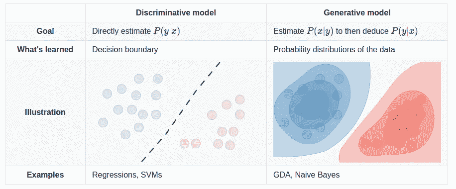

以一个二元分类问题为例。给定一个输入向量 **x** ，我们需要决定 Ck， **x** 最有可能属于哪个类。为了做出这个决定，两种类型的 ML 算法都需要一种从训练数据计算后验概率 p(Ck|x)的方法。

对于 Fisher 的，我们明确学习后验类概率使用高斯。一旦我们找到它，我们使用决策理论来确定 **x** 的类成员。

对于判别模型，将直接导出后验 p(Ck|x)。在这种情况下，一旦我们有了后验概率，我们就可以使用决策理论，将 **x** 分配给最可能的类。

# 逻辑回归

*在我们开始之前，请确保您跟随这些* [*Colab 笔记本*](https://github.com/sthalles/logistic-regression) 。

逻辑回归可能是最著名的判别模型。这样，它隐式地导出后验类别概率 p(Ck| **x** )。

对于二元分类，后验概率由应用于输入 *ϕ.的线性组合的 sigmoid 函数σ给出*

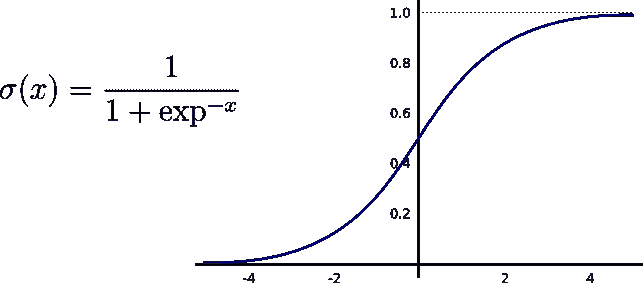

Sigmoid function.

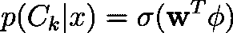

For binary classification, the posterior probabilities are represented by the logistic Sigmoid function.

同样，对于多类问题，我们可以使用 softmax 函数来估计后验概率。像 sigmoid 一样，softmax 将给定向量归一化为概率，即 0 到 1 之间的值。

让我们从二进制分类的情况开始。

# 二元逻辑回归

对于 M 维输入特征向量，逻辑回归必须学习 M 个参数。

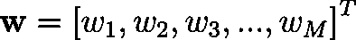

Trainable parameters for binary logistic regression.

以 SVHN 数据集为例。每个 RGB 图像的形状为 32x32x3。因此，逻辑回归需要学习 32x32x3=3072 个参数。

为了找到这些参数，我们通常优化交叉熵误差函数。

交叉熵测量模型的预测与标签的距离**有多远**。当预测值偏离真实值时**增加**，否则**减少**。

假设目标值 **t** 为 0 或 1，交叉熵定义为:

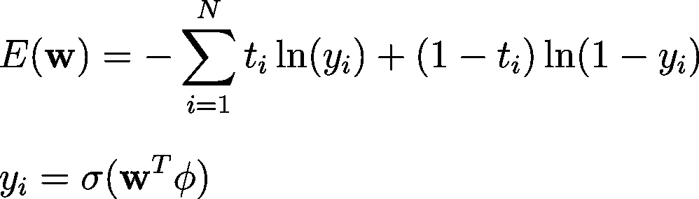

这里， **N** 表示数据集中实例的总数， **yᵢ** 是模型的概率。

交叉熵比较两种概率分布。因此，重要的是要注意逻辑回归的输出被解释为概率——甚至在学习期间。

取交叉熵相对于权重向量 **w** 的导数，我们得到梯度。

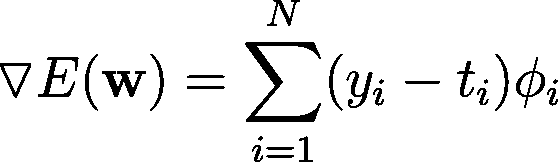

The gradient of the cross-entropy

注意，为了计算这个导数，我们需要 sigmoid 函数 w.r.t weights **w** 的导数。幸运的是，sigmoid 的一个很好的特性是，我们可以用它自己来表示它的导数。

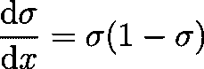

The derivative of the sigmoid function.

梯度是一个向量值函数。实际上，渐变是一种线性变换，将输入向量映射到其他相同形状的向量。

梯度捕捉整个多变量函数的导数。它的每一个值都表示我们可以改变一个特定权重的方向，这样我们就可以达到一个函数的最大值。因此，梯度代表最陡上升的方向。

# Softmax 回归

对于多类分类，只有一些事情会发生变化。现在，我们可以使用 softmax 函数来模拟后验概率。

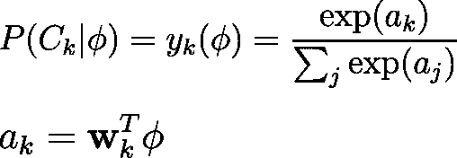

Here ak are the activations.

由于逻辑回归将其预测视为概率，我们需要改变表示标签的方式。至此，目标/标签向量通常被表示为整数向量。每个值代表一个不同的类。如果我们希望它们是同等价值的概率，它们需要在 0 和 1 之间。要做到这一点，我们可以将它们的表示方式改为 one-hot-encoding。

One-hot-encoding representation.

这一次，对于具有 M 个特征和 K 个不同类的输入，逻辑回归学习 MxK 个参数。我们可以把它看作一个矩阵。

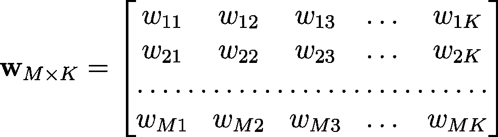

Trainable parameters for multiclass logistic regression.

现在，我们可以进行类似的二进制分类的情况。首先，我们对激活的 softmax 求导。然后，似然的负对数给出了多类分类的交叉熵函数。

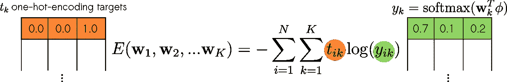

实际上，交叉熵度量两个概率向量之间的距离。一个，来自于 **softmax** 。第二个包含真实目标值的独热编码表示。

请注意用于二分类和多分类的误差函数之间的差异。实际上，它们真的是一回事。

二元交叉熵将目标视为标量。他们要么接受 0 要么接受 1。对于多类分类，目标被表示为一个热点编码向量。

最后，我们取误差函数 w.r.t .的梯度作为权重 **w** 并获得以下梯度向量。

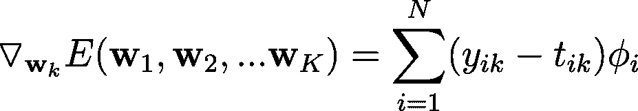

# 迭代加权最小二乘法

与线性回归不同，逻辑回归没有封闭形式的解。换句话说，对于线性回归，我们可以用下面的等式求解梯度等于 0 的点:

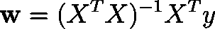

Closed-form solution for linear regression.

对于逻辑回归，这样一个封闭形式的方程是不存在的。由于非线性，我们应用于输入的线性组合。

然而，损失函数和参数 **w** 之间的关系仍然给了我们一个**凹误差函数**。因此，我们可以放心，在误差曲面上只有一个唯一的最小值。

因此，我们可以使用迭代技术(如梯度下降法或牛顿-拉夫森法)来求解。

如果我们选择梯度下降，就万事俱备了。

*   顺着梯度的反方向走就行了。

说白了就是最陡下降的方向。因此，我们可以迭代地更新权重 **w** 为:

但是，我们可以做得更好一点。

梯度下降提供了到下一个临界点的最陡下降方向。而学习速度控制着我们在那个方向上所走的一步的长度(幅度)。看看下面的图片。

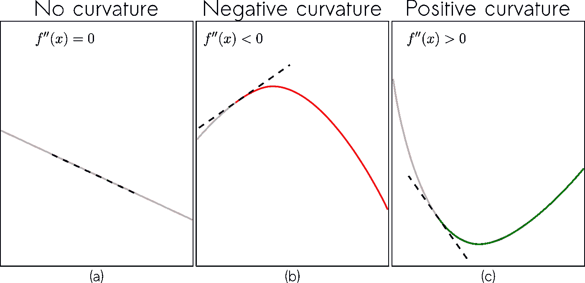

Image based on [Deep Learning](https://www.deeplearningbook.org/contents/numerical.html) book by Ian Goodfellow and Yoshua Bengio and Aaron Courville.

特别是在(c)中，根据我们所采取的步骤的大小，我们可能会使我们的损失函数增加。为了避免这个警告，我们利用二阶导数给出的信息。

在实践中，我们不是只对交叉熵求导，而是对它的导数求导。由 f″(x)描述的二阶导数给出了函数曲率的信息。

直觉上，如果:

*   f''(x)=0，则不存在曲率。
*   f''(x) <0, it means that the function curves downward.
*   f’’(x)> 0，函数中有向上的曲率。

利用该信息，用于最小化交叉熵的更新步骤采取以下形式:

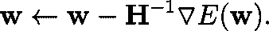

这个更新方程被称为牛顿-拉夫逊方程。

注意，它将矩阵**的逆 H⁻** 乘以梯度。 **H** ，或者 Hessian，存储交叉熵 w.r.t 的二阶导数权重 **w** 。

现在让我们深入研究代码。

以这个玩具数据集为例。

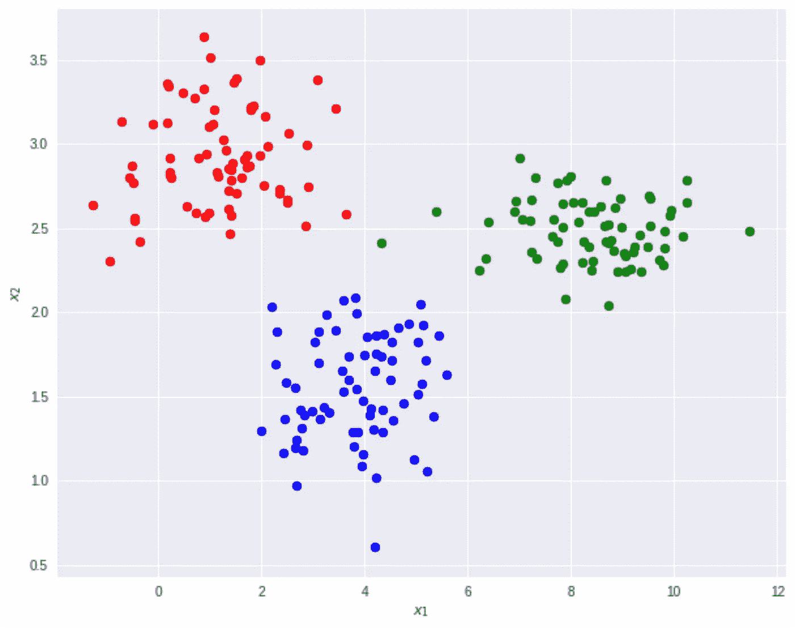

在这个 2D 坐标系中有 210 个点，分为三个等级:蓝圈、红圈和绿圈。由于类的数量大于 2，我们可以使用 Softmax 逻辑回归。

首先，为了将偏差变量引入我们的模型，我们可以执行一个简单的转换，称为:固定基函数。这可以通过简单地在输入中添加一个充满 1 的列来实现。对于二元分类，它使得相应的权值 w₀起着偏向的作用。对于多类，权重矩阵的第一列作为偏差。

然后，我们可以创建一个逻辑回归对象。

遵循 sklearn 的基于 API，我们可以**拟合**和**评估**模型

注意，我们可以在牛顿和梯度下降更新规则之间进行选择。虽然牛顿法往往收敛更快，但它需要在每次迭代中计算并存储一个完整的 Hessian。此外，Hessian 需要是可逆的——用于参数更新。

对于可逆矩阵，有一些约束条件必须为真。

首先， **H** 必须是一个方阵。第二， **H** 的列需要线性无关。意思是对于**H*****I***的任意一列 ***i*** 不能表示为其他任意一列 ***j*** 的线性组合。

也就是说， **H** 的列跨越了坐标系。或者说 **H** 的行列式是非零的

因为对于非常大的矩阵，这些约束可能不成立，所以我们可以在这里使用伪逆技术。这就是函数 ***pinv(H)*** 在上面的代码中所做的。

尽管对于较小的数据集来说，这可能不是问题，但 Hessian 往往会随着要素和类数量的增加而增加。为了有一个概念，使用具有 M 个要素的输入和具有 K 个类的数据集。全麻布有形状[M*K，M * K]；在本例中，这意味着:[9x9] —记住，我们在输入中添加了一个新的特性列。

对于 CIFAR-10 数据集，每个 RGB 图像的形状为 32x32x3。这意味着存储和倒置一个形状为[30720x30720]的正方形矩阵。使用浮点 32 位精度，Hessian 需要 3.775 GB(千兆字节)。

最后，用玩具数据集和牛顿法看一下拟合的模型。十字是测试数据。

享受吧。

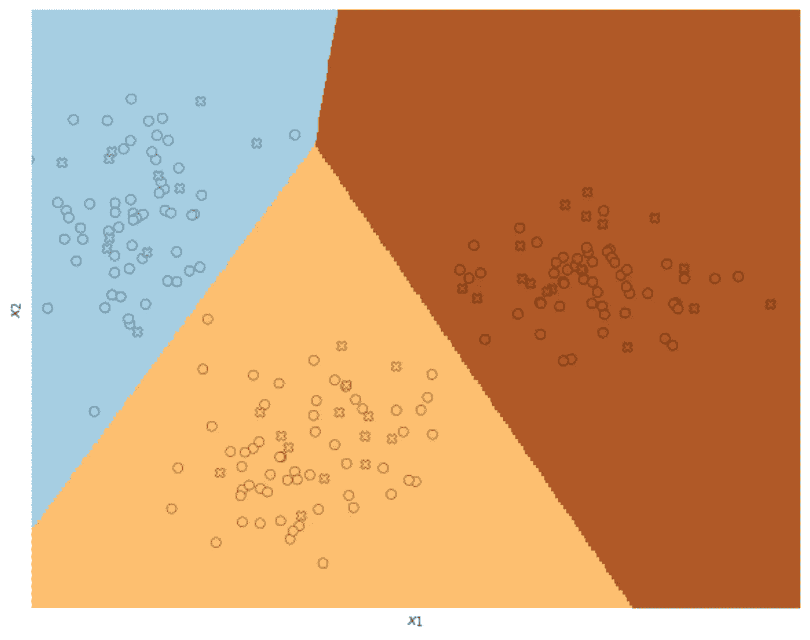

Decision boundaries for Logistic Regression using Newton’s method. Circles represent training data and crosses test instances.

总之，生成模型是一类明确学习类别概率的 ML 算法。

*   他们通常在训练样本较少的情况下表现良好。
*   他们可以处理丢失的数据。
*   并且可以用于监督和非监督学习。

判别模型隐含地学习类别概率。

*   一般来说，它们需要更多的标记数据。
*   他们通常有较少的假设和参数。
*   但是，只能用于监督训练。

对于二元分类，逻辑回归使用 sigmoid 函数来表示后验概率。对于多类分类，它使用 softmax。

想了解更多关于机器学习的有趣内容，请看:

 [## 费希尔线性判别式的说明性介绍

### 为了处理两个或更多类别的分类问题，大多数机器学习(ML)算法以相同的方式工作。

medium.freecodecamp.org](https://medium.freecodecamp.org/an-illustrative-introduction-to-fishers-linear-discriminant-9484efee15ac)  [## 高维超参数调谐简介

### 优化 ML 模型的最佳实践

medium.freecodecamp.org](https://medium.freecodecamp.org/an-introduction-to-high-dimensional-hyper-parameter-tuning-df5c0106e5a4) 

## 参考

克里斯托弗·贝肖普。2006.模式识别和机器学习(信息科学和统计学)。施普林格出版社，柏林，海德堡。

**感谢阅读。**