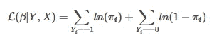
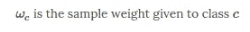
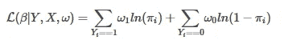
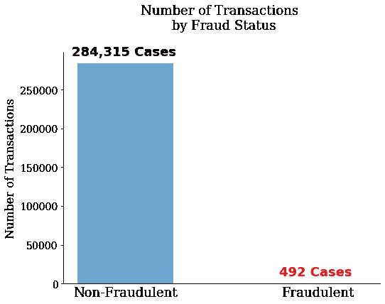
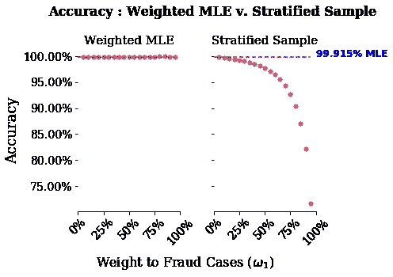
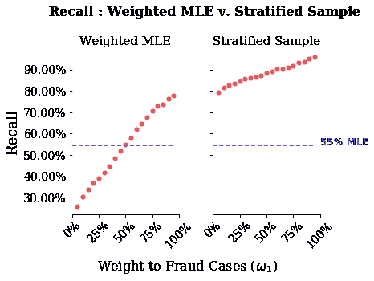

# 逻辑回归和罕见事件

> 原文：<https://towardsdatascience.com/logistic-regressions-and-rare-events-weighted-maximum-likelihood-versus-oversampling-92a25ef74d4e?source=collection_archive---------18----------------------->

## 加权最大似然与过采样

# 介绍

我之前为一个博士班设计了一些问题集。其中一个作业是处理一个简单的分类问题，使用的数据是我从试图预测欺诈性信用卡交易的 [kaggle challenge](https://www.kaggle.com/mlg-ulb/creditcardfraud) 中获得的。问题的目标是预测特定信用卡交易欺诈的概率。数据中一个未预料到的问题是，单笔信用卡交易欺诈的无条件概率非常小。这种类型的数据被称为罕见事件数据，在许多领域都很常见，例如疾病检测、冲突预测，当然还有欺诈检测。

本说明比较了两种提高稀有事件数据分类的常用技术。这些技术背后的基本思想是通过对罕见事件的过度拟合来增加分类算法的辨别能力。一种技术在似然函数本身中使用抽样权重，而另一种是一种病例对照设计，在这种设计中，我们从稀有类中进行过抽样。哪个更好取决于预测性能以及计算复杂度。在本例中，我们将通过比较使用 MLE 估计的逻辑回归模型的预测性能来“固定”计算复杂性。

这篇笔记的另一个动机是，在普通 ML 库的引擎盖下寻找可能是困难的。鉴于许多方法都是 C 库的包装器，追踪精确的实现可能会很乏味。这个练习的一个希望是展示使用 sklearn 库中的`sample_weights`与使用我创建的分层抽样程序相比如何。

所有的代码和数据的超链接都在我的 [github](https://github.com/ryanlstevens/logistic_regression_rare_events) 上。

为了解决这个问题，让我们简单地比较一下当我们的数据服从伯努利分布时的标准似然性和样本加权似然性。伯努利分布随机变量的“标准可能性”如下:

# 加权最大似然

加权似然法只是试图对我们的数据进行重新加权，以说明不同类别之间的不平衡。我们引入以下术语来表示样品重量:

似然性只是将每一项与一个加权因子相乘，得到一个“加权似然性”:

# 分层随机抽样

我们可以使用重新采样程序来重新平衡我们的数据，而不是将权重直接纳入可能性。然后我们最大化这个样本的“标准可能性”。本说明关注的方法是分层抽样的一种形式。该过程如下:

1.  选择一类具有一定样本权重的数据
2.  在所选的类别中，用替换法画出相同可能性的观察值

因为我在两种方法中都使用了 MLE 进行估计，所以这些技术在计算复杂度上是相似的。然而，第二种技术与您正在评估的模型无关。同样的过程可以用于支持向量机、神经网络和更复杂的模型。此外，它是灵活的，并且可以改变取样的附加阶段或包含在样本中的判定规则。我的下一个笔记将集中在这种分层过程的扩展上，它试图基于跨类观察的“接近度”来创建匹配的样本。

另一个需要注意的是 sklearn 的一个特点，这个库在 model_selection 库中有一个`StratifiedKFold`方法。但是，这种方法创建的折叠可以保持类之间的平衡。例如，如果类 0 有 10 个观测值，而类 1 有 90 个观测值，则分割将保持 0 比 1 的比例不变，即，将总是有 1 个来自类 0 的观测值到 9 个来自类 1 的观测值。

总之，本练习将使用两种不同的方法来比较预测性能，以重新衡量我们的数据。给定一些预先选择的权重，我们用ω表示:

1.  加权最大似然:最大化“加权似然”函数
2.  分层随机抽样:分层随机抽样，然后最大化“标准似然”函数

# 数据分析

我们读入数据，将因变量和自变量分开。这里自变量定义为“类”。我们可以在下图中看到，在 284，807 笔交易中，只有 492 笔交易是欺诈性的。

我是用 python 做这些的。虽然 sklearn 有一个 K-Fold 类，可以生成 K-split 的数据，但我的具体任务需要以下采样过程:

1.  将数据分成 K 倍，我们用 K 来索引
2.  在折叠 k 中的训练集中，运行我们的分层抽样程序

为了实现这一点，我扩展了 KFold 类，创建了`oversample_KFold`类。这个新类需要一个样品重量来从每个类中取样。

我们创建一个模型管线，它包含以下步骤:

1.  **分离分类变量和数值变量**
2.  **标准化(或热编码)变量**
3.  **将列连接在一起**
4.  **利用数据转换和逻辑回归模型创建完整的渠道**

# 模型估计

这是这个练习的核心。我们要做的是用分层随机抽样来估计加权逻辑回归和标准逻辑回归。然后，我们将绘制三个相关的模型得分指标:准确度、召回率和精确度。我们将会看到对罕见事件预测的准确性有多差。然后我们将会看到这两种策略在召回率和准确率上的不同。

# 型号选择

我们有三个不同的性能指标:准确度、召回率和精确度。每个图中的蓝线是没有样品重量的标准 MLE 的指标值。x 轴是给予罕见事件的样本权重。随着样本权重的增加，稀有事件选项的权重也会增加。请注意，我在 0.05 和 0.95 之间运行模型，因此分层抽样程序在最大似然线以上开始。此外，我只运行了一次重采样方法，因此在这些估计中存在一些噪声。然而，考虑到分层抽样图中线的单调性，抽样误差一定很小。

从这些图表中有两点需要注意。首先，准确性对于这两个模型来说都是一个糟糕的衡量标准。观察分层样本，即使将几乎所有的权重赋予分层样本，该模型的准确率也在 75%左右。第二，分层抽样在回忆上表现得好得多，而对于高权重，它在精度上表现得比加权 MLE 差得多。

这与思考你在这个问题中试图确定的确切损失函数非常吻合。这种算法的利益相关者是一家信用卡公司。对于一家信用卡公司来说，遗漏一个欺诈实例比将一个非欺诈实例称为欺诈活动要糟糕得多。该公司面临欺诈指控，因此他们希望尽可能减少这些指控。考虑到这一点，他们可能希望检测所有欺诈案件，而不管非欺诈案件。对我来说，这听起来像回忆，更高的预测欺诈值，或真阳性，是首选。如果我们只关心回忆，那么我们的分层抽样模型做得更好。

然而，信用卡公司拒绝太多的费用是有代价的。如果你是一家信用卡公司的顾客，而这家公司拒绝支付你所有的费用，那么你很可能会得到另一张信用卡。在这种情况下，信用卡公司可能也关心如何减少误报。考虑到这一点，我们可以看看精度。我们所看到的是，对于低权重的重采样，其效果与加权最大似然估计一样好，但是对于较高权重的重采样，其效果要差得多。

# 摘要

上面的练习表明，模型选择度量对于您手头的任务非常重要。当面对罕见的事件数据时，准确性表现不佳，而召回率和精确度取决于手头的模型。该算法中需要改进的一个关键地方是跨类采样的独立性。当前算法选择一个类，然后从该类中选择一个观察值。然而，选择一个感兴趣的观察结果可能更好，比如说一个欺诈的例子，然后选择一个非常相似的非欺诈的例子来区分它们之间的差异。潜在的想法是，很容易发现明显的非欺诈行为，例如有人从当地的咖啡店购买了一杯 4 美元的咖啡，而这些都不是该算法赖以训练的重要案例。

*最初发表于*[*【http://github.com】*](https://gist.github.com/7fd33cf5fbe824f9100ef5a071c08c03)*。*