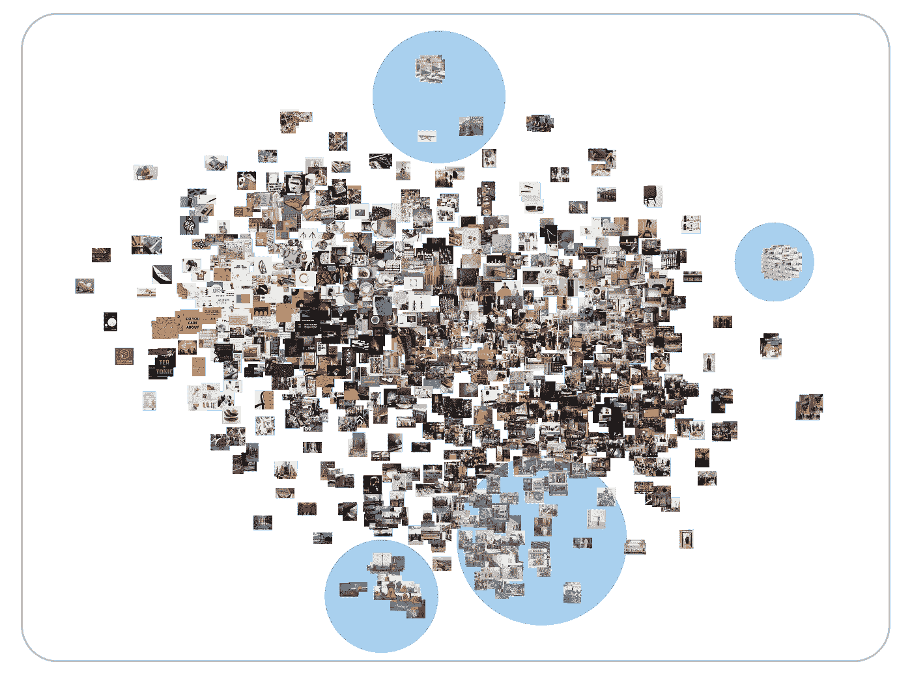

# 伦敦设计节(第三部分):计算机视觉

> 原文：<https://towardsdatascience.com/london-design-festival-part-3-computer-vision-36eed9667da4?source=collection_archive---------24----------------------->

## 第三部分:用计算机视觉分析推特上的 3K 图片

## 介绍

在这一系列的最后一篇博文中，我应用计算机视觉技术来理解 3300 幅关于 2018 年伦敦设计节的图像，这是一个为期七天的设计节，于 2018 年 9 月 15 日至 23 日举行。

伦敦设计节 2018 (LDF18)有一个非常活跃的活动计划，横跨伦敦 11 个不同的“设计区”、5 个“设计目的地”和 3 条“设计路线”。这是伦敦作为一个建筑环境的灵活性的另一个极好的例子，作为一个画布来展示创造性的想法。

在本系列的[第二部分](/london-design-festival-2018-part-2-natural-language-processing-595f3c2dc24f?source=friends_link&sk=23ff5746ca0810a255e2023e52ebd450)和[第一部分](/analyzing-the-london-design-festival-2018-part-1-7edac3bfb165?source=friends_link&sk=5cbb7a0f8ad17446129f3be1a54b4c85)中，我展示了自然语言处理和对 11000 条关于这个节日的推文的探索性数据分析。然而，这些推文中只有 3300 条有媒体数据(图像)，所以这篇文章的目的是使用计算机视觉分析来理解和语境化我从 Twitter 上传的这些图像。

请向下滚动查看分析！

An image of LDF18 at the V&A Museum. Source: Flickr

## 数据和方法

使用 Twitter API，我收集了包含标签 **#LDF18** 的关于 LDF18 的推文。总共有 11，000 条推文，但只有 3，300 条推文有媒体数据(图片)。[阅读第 2 部分了解更多](/london-design-festival-2018-part-2-natural-language-processing-595f3c2dc24f?source=friends_link&sk=23ff5746ca0810a255e2023e52ebd450)。

然后，使用[谷歌云的视觉 API](https://cloud.google.com/vision/docs/) 提取每张图像的标签。云视觉 API 利用“谷歌庞大的机器学习专业知识网络”(g [reat 文章](https://medium.com/@srobtweets/exploring-the-cloud-vision-api-1af9bcf080b8)作者 [Sara Robinson](https://medium.com/u/7f2ab73b39f8?source=post_page-----36eed9667da4--------------------------------) )来检测图像的特征和标签。总共有 1045 个不同的标签被赋予了 3300 张图片。

被称为**特征提取**和**反向图像搜索**的机器学习技术然后使用[基因科岗的代码](http://ml4a.github.io/ml4a/)完成，以基于视觉相似性找到图像。首先，使用预训练的卷积神经网络来提取每幅图像的“特征”，然后，计算这些特征的[余弦相似度](https://en.wikipedia.org/wiki/Cosine_similarity)，以“搜索”与查询图像相似的少量图像。

特征在计算机视觉中的主要作用是“[将视觉信息转换到向量空间](https://medium.com/machine-learning-world/feature-extraction-and-similar-image-search-with-opencv-for-newbies-3c59796bf774)”。相似的图像应该产生相似的特征，我们可以利用这些特征进行信息检索。基于这些特征，我们还可以使用一种叫做 t-SNE 的方法通过相似性对图像进行聚类。

## 图像分析

在这一节中，我将展示我的计算机视觉分析的结果。下面，我报告以下三个指标:

1.  图像的标签检测；
2.  基于视觉相似性的图像搜索:
3.  基于视觉相似性的图像聚类。

## 标签检测

每张照片的标签都是使用[谷歌云视觉 API](https://cloud.google.com/vision/) 生成的。这背后的想法是将图片分类，这样我就可以识别相似的图片。下面的条形图显示了 3，300 张图片的前 10 个标签。

我们看到“产品”、“字体”、“家具”、“桌子”、“设计”出现的次数最多。这些标签是有意义的，因为这是一个设计节！这是一个好消息，它证明了 Cloud Vision API 在标记关于设计节的图像方面做得很好。

然而，这些标签并没有明确描述艺术品本身——我对更详细的上下文理解感兴趣——这凸显了一些标签检测技术的缺点。

## 图像搜索—视觉相似性

我们可以通过编程让计算机学习图像之间的视觉相似性，而不是使用标签来理解图像。一种叫做**特征提取**和**反向图像搜索**的技术就是这样做的。

使用在 [TensorFlow 后端](https://www.tensorflow.org/guide/keras)上运行的 [Keras VGG16](https://keras.io/applications/#vgg16) 神经网络模型，我首先为数据集中的每张图像提取了一个特征。一个特征是每个图像的 4096 元素的数字数组。我们的期望是“该特征形成图像的非常好的表示，使得相似的图像将具有相似的特征”([吉恩·科岗，2018](http://ml4a.github.io/ml4a/convnets/) )。

然后使用主成分分析(PCA)降低特征的维度，以创建一个[嵌入](https://developers.google.com/machine-learning/crash-course/embeddings/video-lecture)，然后计算一个图像的 PCA 嵌入到另一个图像的距离[余弦距离](https://en.wikipedia.org/wiki/Cosine_similarity)。我终于能够向计算机发送随机查询图像，它选择并返回数据集中具有相似特征向量的五个其他图像。

下面是三个例子:

A reverse image search for Dazzle by Pentagram and 14–18 NOW at LDF18

A reverse image search for The Onion Farm by Henrik Vibskov and Full Spectrum by Flynn Talbot at LDF18

当试图从一个包含许多图片的相册中找到相似的图片时，这种技术非常有用，事实上我就是这么做的！

## 图像聚类—相似性

既然我们在向量空间中嵌入了每个图像，我们可以使用一种流行的叫做 t-SNE 的机器学习可视化算法来聚类，然后在二维空间中可视化向量空间。

> “tSNE 的目标是聚集相似数据点的小“邻域”,同时减少数据的整体维度，以便更容易可视化”(谷歌人工智能博客，2018 年)

下面我们看到基于视觉相似性的聚类形成。

在下面的图片中，我突出了三件艺术品——沃·西斯尔顿建筑师的*乘*、Es Devlin 的*请喂狮子*和五角星的*炫*——以及它们的集群轮廓。

The clustering of images of three art installations at LDF18\. Source: Twitter

## **结论**

所以你有它！我只是刚刚涉足计算机视觉的奇妙世界。还有很多东西需要我去学习，但这对我来说是很好的第一步。

我的发现表明，使用机器学习和计算机视觉技术来理解和联系关于 LDF18 的图像是可能的。

对我来说，下一步显然是计算在数据集中出现了多少艺术装置，以衡量“受欢迎程度”。我将继续研究这个数据集。

## 结束了

这是我关于 LDF18 的博客系列的结尾！这个系列是我正在进行的关于使用数据科学来理解和衡量城市文化影响的长期讨论的一部分。

今年，我将开始新的项目，主要是 JavaScript。敬请期待！

感谢阅读！

Vishal

[*Vishal*](https://vishalkumar.london/) *是伦敦 UCL*[*The Bartlett*](https://www.ucl.ac.uk/bartlett/)*的文化数据科学家和研究生。他对城市文化的经济和社会影响感兴趣。*