# 长短期记忆和门控循环单位的解释——Eli 5 方式

> 原文：<https://towardsdatascience.com/long-short-term-memory-and-gated-recurrent-units-explained-eli5-way-eff3d44f50dd?source=collection_archive---------11----------------------->

## ELI5 项目机器学习

Photo by [Deva Williamson](https://unsplash.com/@biglaughkitchen?utm_source=medium&utm_medium=referral) on [Unsplash](https://unsplash.com?utm_source=medium&utm_medium=referral)

大家好，欢迎来到我的博客“*长短期记忆和门控循环单元的解释——Eli 5 Way*”这是我 2019 年的最后一篇博客。我叫[尼兰詹·库马尔](https://www.linkedin.com/feed/)，是好事达印度公司的高级数据科学顾问。

**递归神经网络(RNN)** 是一种神经网络，前一步的输出作为当前步骤的输入。

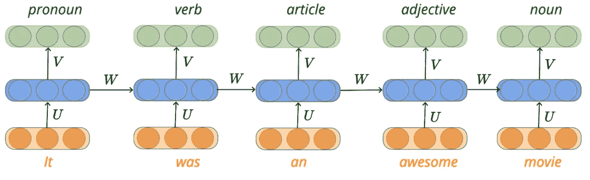

RNN 主要用于，

*   **序列分类** —情感分类&视频分类
*   **序列标注** —词性标注&命名实体识别
*   **序列生成** —机器翻译&音译

> **引用说明:**本文的内容和结构是基于我对四分之一实验室深度学习讲座的理解——[pad hai](https://padhai.onefourthlabs.in/)。

在每个时间步的递归神经网络中，旧信息被当前输入改变。对于较长的句子，我们可以想象在“t”时间步之后，存储在时间步“t-k”的信息(k << t) would have undergone a gradual process of transformation. During back-propagation, the information has to flow through the long chain of timesteps to update the parameters of the network to minimize the loss of the network.

Consider a scenario, where we need to compute the loss of the network at time step four **L₄** )。假设损失是由于时间步 **S₁** 的隐藏表示的错误计算造成的。 **S₁** 处的错误是由于矢量 **W 的参数不正确。**该信息必须反向传播至 **W** ，以便矢量修正其参数。

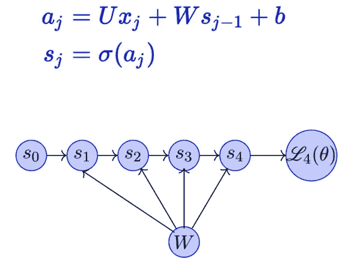

为了将信息传播回向量 W，我们需要使用链式法则的概念。简而言之，链式法则归结为在特定时间步长上隐藏表示的所有偏导数的乘积。

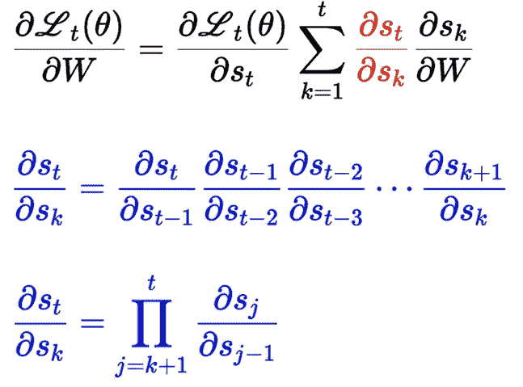

如果我们有超过 100 个更长序列的隐藏表示，那么我们必须计算这些表示的乘积用于反向传播。假设偏导数之一变成一个大值，那么整个梯度值将爆炸，导致**爆炸梯度的问题。**

如果偏导数之一是一个小值，那么整个梯度变得太小或消失，使得网络难以训练。**消失渐变的问题**

# 白板模拟

假设您有一个固定大小的白板，随着时间的推移，白板变得非常凌乱，您无法从中提取任何信息。在较长序列的 RNN 环境中，所计算的隐藏状态表示将变得混乱，并且难以从中提取相关信息。

因为 RNN 具有有限的状态大小，而不是从所有时间步长提取信息并计算隐藏状态表示。在从不同的时间步长提取信息时，我们需要遵循有选择地读、写和忘记的策略。

# 白板类比— RNN 示例

让我们以使用 RNN 的情感分析为例，来看看选择性读、写、忘策略是如何工作的。

回顾 : *电影的前半部分很枯燥，但后半部分真的加快了节奏。男主角的表演令人惊叹。*

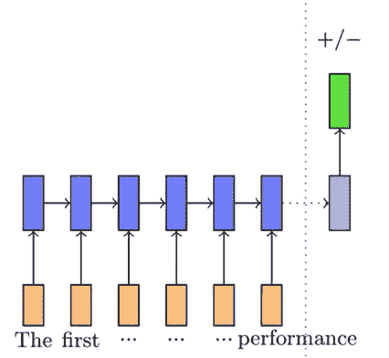

这部电影的评论从负面情绪开始，但从那时起，它变成了积极的回应。在选择性读取、写入和忘记的情况下:

*   我们希望忘记由停用词(a、the、is 等)添加的信息。
*   有选择地阅读带有感情色彩的词语所添加的信息(惊人的、令人敬畏的等等)。
*   选择性地将隐藏状态表示信息从当前单词写入新的隐藏状态。

使用选择性读取、写入和遗忘策略，我们可以控制信息流，从而使网络不会遭受短期记忆的问题，并且还可以确保有限大小的状态向量得到有效使用。

# 长短期记忆——LSTM

LSTM 的引入是为了克服香草 RNN 的问题，如短期记忆和消失梯度。在 LSTM 的理论中，我们可以通过使用门来调节信息流，从而有选择地读、写和忘记信息。

*在接下来的几节中，我们将讨论如何实现选择性读、写和忘记策略。我们还将讨论我们如何知道哪些信息应该阅读，哪些信息应该忘记。*

# 选择性写入

在普通 RNN 版本中，隐藏表示( **sₜ)** 被计算为先前时间步长隐藏表示( **sₜ₋₁** )和当前输入( **xₜ** )以及偏差( **b** )的输出的函数。

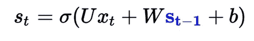

这里，我们取 sₜ₋₁的所有值并计算当前时间的隐藏状态表示

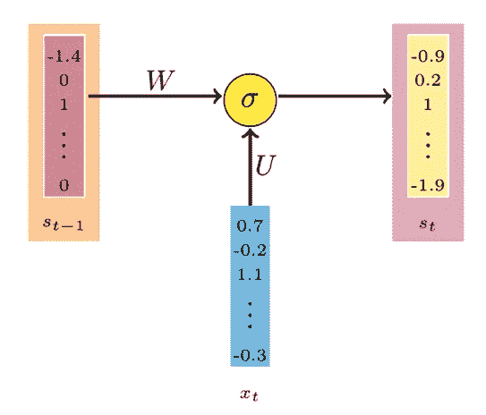

In Plain RNN Version

在选择性写入中，不是将所有信息写入 **sₜ₋₁** 来计算隐藏表示( **sₜ** )。我们可以只传递一些关于 sₜ₋₁的信息给下一个状态来计算 sₜ.一种方法是分配一个介于 0-1 之间的值，该值决定将当前状态信息的多少部分传递给下一个隐藏状态。

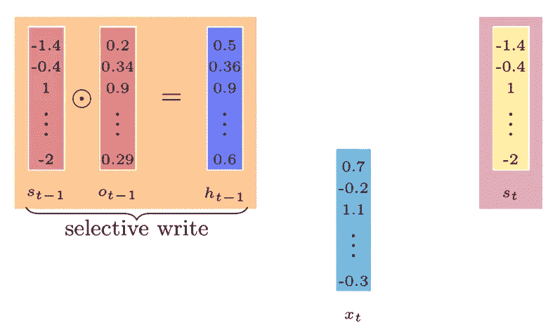

Selective Write in RNN aka LSTM

我们进行选择性写入的方式是，我们将 sₜ₋₁的每个元素乘以 0-1 之间的值来计算新的向量 hₜ₋₁。我们将使用这个新的向量来计算隐藏表示 **sₜ.**

> 我们如何计算 **oₜ₋₁？**

我们将从数据中学习 **oₜ₋₁** ，就像我们使用基于梯度下降优化的参数学习来学习其他参数一样，如 **U** 和 **W** 。 **oₜ₋₁** 的数学方程式如下:

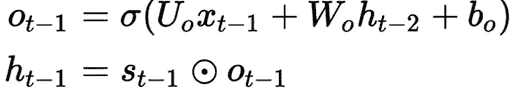

一旦我们从 **oₜ₋₁那里得到**数据，它就乘以 **sₜ₋₁** 得到一个新的矢量 **hₜ₋₁.**由于 **oₜ₋₁** 正在控制什么信息将进入下一个隐藏状态，所以它被称为**输出门**。

# 选择性阅读

在计算了新的向量 **hₜ₋₁** 之后，我们将计算一个中间隐藏状态向量**šₜ**(用绿色标记)。在这一节中，我们将讨论如何实现选择性读取来获得我们的最终隐藏状态 **sₜ.**

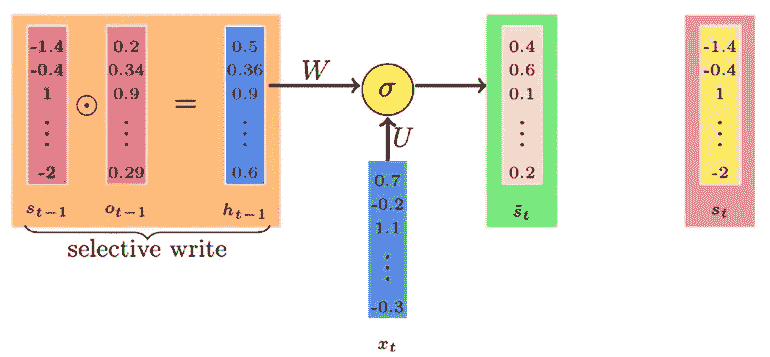

**ₜ的数学方程式如下:**

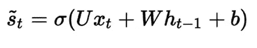

*   **šₜ**捕捉来自前一状态 **hₜ₋₁** 和当前输入 **xₜ** 的所有信息。
*   然而，我们可能不想使用所有的新信息，而只是在构建新的单元结构之前有选择地从中读取。也就是说…我们只想从**šₜ**读取一些信息来计算 **sₜ** 。

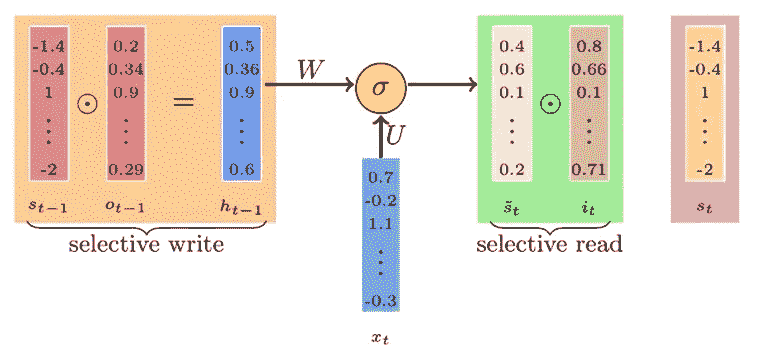

Selective Read

就像我们的输出门一样，这里我们用一个新的向量 **iₜ** 乘以**šₜ**的每个元素，该向量包含 0-1 之间的值。由于矢量 **iₜ** 控制着从当前输入流入的信息，它被称为**输入门**。

**iₜ** 的数学方程式如下:

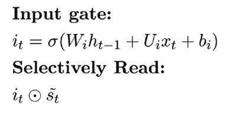

在输入门中，我们将前一时间步隐藏状态信息 **hₜ₋₁** 和当前输入 **xₜ** 连同偏置一起传递到一个 sigmoid 函数中。计算的输出将在 0-1 之间，它将决定什么信息从当前输入和先前的时间步长隐藏状态流入。0 表示不重要，1 表示重要。

回顾一下我们到目前为止所学的，我们有先前的隐藏状态 **sₜ₋₁** ，我们的目标是使用选择性读取、写入和忘记策略来计算当前状态 **sₜ** 。

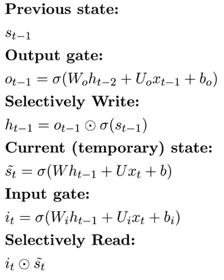

# 选择性遗忘

在本节中，我们将讨论如何通过组合 **sₜ₋₁** 和**šₜ.来计算当前状态向量 **sₜ****

**遗忘门 fₜ** 决定从 **sₜ₋₁** 隐藏向量中保留或丢弃的信息部分。

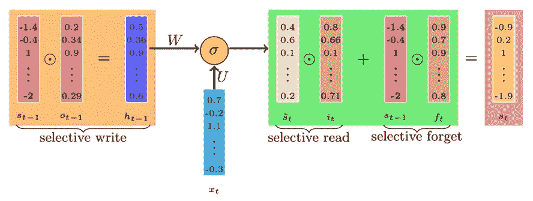

Selective Forget

遗忘门 **fₜ** 的数学方程式如下:

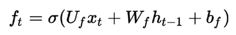

在“忘记门”中，我们将前一时间步隐藏状态信息 **hₜ₋₁** 和当前输入 **xₜ** 连同一个偏置一起传递到一个 sigmoid 函数中。计算的输出将在 0-1 之间，它将决定保留或丢弃什么信息。如果该值更接近 0，则表示丢弃，如果更接近 1，则表示保留。

通过结合遗忘门和输入门，我们可以计算当前的隐藏状态信息。

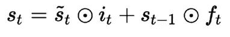

最后一幅插图如下所示:

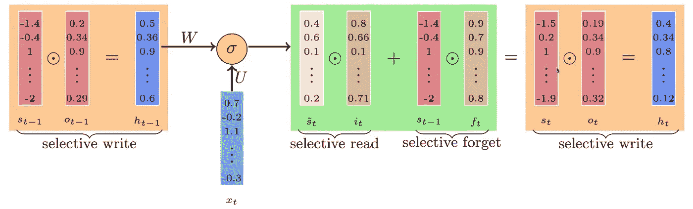

完整的方程组如下所示:

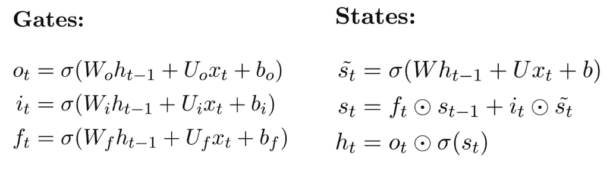

**注:***LSTM 架构的某些版本没有遗忘门，而是只有一个输出门和输入门来控制信息流。它将只实现选择性读取和选择性写入策略。*

我们上面讨论的 LSTM 的变体是 LSTM 最流行的变体，三个门都控制信息。

# 门控循环单元— GRU 氏病

在本节中，我们将简要讨论 GRU 背后的直觉。门控循环单位是 LSTM 的另一个流行变体。GRU 使用较少的门。

在 LSTM 这样的门控循环单元中，我们有一个输出门 **oₜ₋₁** 来控制什么信息进入下一个隐藏状态。类似地，我们也有一个输入门 **iₜ** 控制什么信息从当前输入流入。

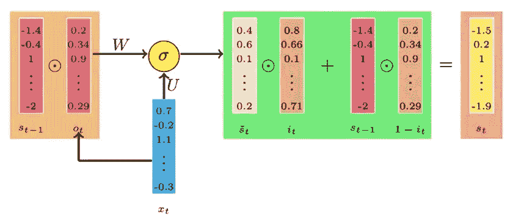

LSTM 和 GRU 之间的主要区别在于它们组合中间隐藏状态向量**šₜ**和先前隐藏状态表示向量 **sₜ₋₁.的方式**在 LSTM 中，我们忘记了确定要从 **sₜ₋₁.那里保留多少部分信息**

在 GRU 而不是遗忘门中，我们基于输入门向量的补充(1- **iₜ** )来决定保留或丢弃多少过去的信息。

> 忘记门= 1 —输入门向量(1- **iₜ** )

GRU 的全套方程式如下所示:

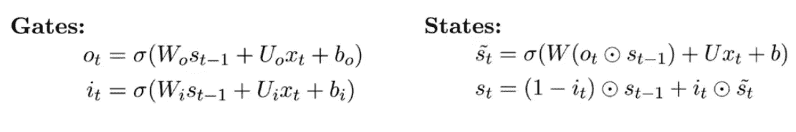

从等式中，我们可以注意到只有两个门(输入和输出),并且我们没有显式地计算隐藏状态向量 **hₜ₋₁.**所以我们没有在 GRU 中保持额外的状态向量，也就是说……比 LSTM 计算量更少，训练速度更快。

# 从这里去哪里？

如果想用 Keras & Tensorflow 2.0 (Python 或 R)学习更多关于神经网络的知识。查看来自 Starttechacademy[的 Abhishek 和 Pukhraj 的](https://courses.starttechacademy.com/full-site-access/?coupon=NKSTACAD)[人工神经网络](https://courses.starttechacademy.com/full-site-access/?coupon=NKSTACAD)。他们以一种简单化的方式解释了深度学习的基础。

# 摘要

本文讨论了递归神经网络在处理较长句子时的不足。RNN 受到短期记忆问题的困扰，也就是说，在信息变形之前，它只能存储有限数量的状态。之后，我们详细讨论了选择性读取、写入和遗忘策略在 LSTM 是如何通过使用门机制来控制信息流的。然后我们研究了 LSTM 的变体，称为门控循环单元，它比 LSTM 模型具有更少的门和更少的计算。

在我的下一篇文章中，我们将深入讨论编码器-解码器模型。所以确保你在媒体上跟随着我，以便在它下跌时得到通知。

直到那时，和平:)

NK。

***推荐阅读***

使用 Pytorch 开始练习 LSTM 和 GRU

 [## 使用 LSTM 和 Pytorch 对人名国籍进行分类

### 个人名字在不同的国家，甚至在同一个国家，都有不同的变化。通常情况下…

www.marktechpost.com](https://www.marktechpost.com/2019/12/18/classifying-the-name-nationality-of-a-person-using-lstm-and-pytorch/) 

了解递归神经网络

 [## 递归神经网络(RNN)解释 ELI5 方式

### 使用 RNN 的序列标记和序列分类

towardsdatascience.com](/recurrent-neural-networks-rnn-explained-the-eli5-way-3956887e8b75) 

# 作者简介

[Niranjan Kumar](https://medium.com/@niranjankumarc) 是好事达印度公司的高级数据科学顾问。他对深度学习和人工智能充满热情。除了在媒体上写作，他还作为自由数据科学作家为 Marktechpost.com 写作。点击查看他的文章[。](https://www.marktechpost.com/author/niranjan-kumar/)

你可以在 [LinkedIn](https://www.linkedin.com/in/niranjankumar-c/) 上与他联系，或者在 [Twitter](https://twitter.com/Nkumar_283) 上关注他，了解关于深度学习和机器学习的最新文章。

# **联系我:**

*   领英—[https://www.linkedin.com/in/niranjankumar-c/](https://www.linkedin.com/in/niranjankumar-c/)
*   GitHub—[https://github.com/Niranjankumar-c](https://github.com/Niranjankumar-c)
*   推特—[https://twitter.com/Nkumar_n](https://twitter.com/Nkumar_n)
*   中—[https://medium.com/@niranjankumarc](https://medium.com/@niranjankumarc)

## **参考文献:**

1.  [pad hai 的深度学习](https://padhai.onefourthlabs.in/)
2.  [LSTM 和 GRU 的图解指南:一步一步的解释](/illustrated-guide-to-lstms-and-gru-s-a-step-by-step-explanation-44e9eb85bf21)

免责声明——这篇文章中可能有一些相关资源的附属链接。你可以以尽可能低的价格购买捆绑包。如果你购买这门课程，我会收到一小笔佣金。