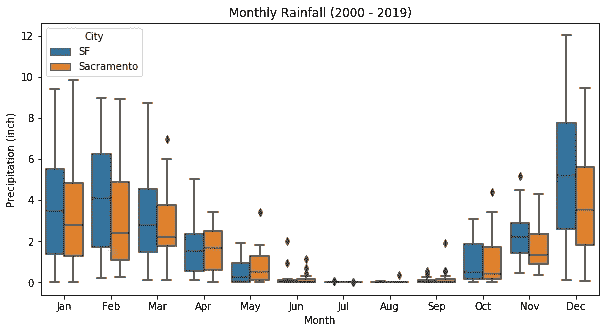

# 长而宽的数据以及如何有效地绘制它们

> 原文：<https://towardsdatascience.com/long-wide-data-and-how-to-efficiently-plot-them-7a96887e309d?source=collection_archive---------16----------------------->

## 与实例的比较

# 介绍

很多时候，当我们处理数据时，它有不同的格式。如果你从一个网站上删除了这些数据，很可能是以**宽格式**。事实上，我们实际看到的大多数数据都是这种格式，因为宽数据非常直观，也更容易理解。一个很好的例子就是这个来自 ESPN 的 [NBA 统计页面。](https://www.espn.com/nba/stats/player/_/table/offensive/sort/avgPoints/dir/desc)

另一方面，**长格式的**数据不太经常看到。然而，它有自己的优势，如:

*   快速处理(使用矢量化运算)
*   某些高级统计分析和绘图所要求的

在这本笔记本中，我将展示如何在两种格式之间转换数据，长格式如何更快地处理，以及如何有效地绘制每种格式。我们将使用旧金山和萨克拉门托的月降水量数据作为例子。

*注:天气数据取自* [*本网站*](https://w2.weather.gov/climate/xmacis.php?wfo=mtr) *。*

# 准备数据集

以下是我们对数据的观察:

1.  对于每个城市，数据都是宽格式的。
2.  前十一个月的数据以浮点形式存储，但是十二月份和年度总计则不是
3.  是因为我们还在今年 12 月…数据还没有
4.  我们需要将它们转换为浮点型，并找到一种方法来填充 2019 年的数据
5.  降水量的单位是英寸(来自网站)

我们使用前 19 年的平均值填充了 12 月的降水数据，然后计算 2019 年的年总和。

现在我们可以开始处理和绘制数据。

# 数据处理和转换

接下来，我们将对数据进行一些操作，以显示长数据和宽数据之间的差异。

首先，让我们将它们转换成长数据，并将两个数据帧连接(或合并)成一个。

现在假设我们要计算每年的月降雨量百分比。

我们从广泛的数据开始。由于我们需要对每一列进行操作，我们可以使用`apply`函数。

正如我们在上面看到的，对于长数据来说要容易得多。事实上，它也更快，因为它使用向量化操作。

# 使用宽而长的数据绘图

我们想看看近二十年来每个月降水量的变化和分布。一个好的方法是使用方框图。对于每个日历月，我们将绘制成一个方框来显示不同年份的变化。总的来说，在一个单独的地块上将有 12 个盒子。

让我们先用宽数据把它画在旧金山。

使用*熊猫*中的内置函数制作剧情相当容易。如果我们想并排绘制萨克拉门托的数据呢？对于宽数据来说，这是一项相当复杂的任务。

正如您在下面看到的，我们必须分别绘制两个数据帧，指定每个数据帧的宽度和位置(否则它们会重叠)，并将 xticks 放在两个框的中心。有一些调整，使它看起来正确。

现在让我们试着用长格式来达到同样的效果。在这种情况下，我使用了 *Seaborn* 包。

使用长数据和 *Seaborn* 进行并排比较要容易得多。在`R`中，`ggplot`也使用长格式，下划线语法与 *Seaborn* 非常相似。

# 思想

来自`R`，在我的大学里广泛使用过`MATLAB`，相比 Python 的`matplotlib`(类似于 MATLAB)，我更喜欢`ggplot`。一个原因是我可以很容易地利用不同的变量来定制情节。在上面的例子中，我使用了`hue`(颜色)来显示一个分类变量。我也可以在可视化中包含连续变量，例如:符号的大小等。我真的很高兴找到 Python 中的 *Seaborn* 包。

*你可以在这里找到代码*[*https://github.com/JunWorks/Long_and_wide*](https://github.com/JunWorks/Long_and_wide)