# 小心，齐洛，贾斯蒂马特来了！

> 原文：<https://towardsdatascience.com/look-out-zillow-here-comes-jestimate-145a96efbfbb?source=collection_archive---------30----------------------->

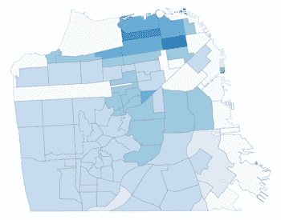

## 使用机器学习预测旧金山房价

作为一个在房地产和数据科学方面都有专业知识的人，我一直对 Zillow 的 Zestimate 很着迷。本着竞争的精神，我开发了 Jim 的估计或 Jestimate！

【2018 年旧金山独栋住宅预估

以下互动地图包含了 2018 年旧金山按街区划分的房屋销售情况。单击邻居，然后单击数据表中的房屋，查看 Jestimate 结果和实际销售价格。

[**点击这里看三藩市 2018 Jestimates！**](https://sf-2018-sales.herokuapp.com/SF_2018_Sales)

Zestimate 使用专有的机器学习公式来估计房屋的当前市场价值。在房地产领域，代理人不断与房主争夺他们房子的市场价值，比如“你说我的房子值 100 万美元，但 Zillow 说我的房子值 120 万美元。”在出售房产时，你认为房主更喜欢哪个数字？

代理人对物业的市场分析几乎总是确定物业当前市场价值的最佳方法，因为代理人会实际查看物业，查看可比物业并分析当地市场条件。诸如地基裂缝、25 年的旧屋顶、非法扩建或其他未记录的房产缺陷等信息无法通过机器学习公式进行分析。与机器学习公式相比，代理可以访问更多更好的数据。

然而，代理商需要时间和精力来进行准确的市场分析，这对于估计大量的房屋价值是不实际的。这就是像 Zestimate 这样的预测引擎提供价值的地方。

考虑到这一点，我想看看我能为旧金山独栋房屋销售建立一个多好的预测引擎。一个人，一台 Mac 和 Colab 能打败 Zillow 吗？跟着一起去发现吧！

**关于代码的一句话**

该项目的所有代码、数据和相关文件都可以在 my [GitHub](https://github.com/JimKing100/Jestimate_Live) 访问。该项目分为两个 Colab 笔记本。一个运行线性回归模型，另一个使用 Heroku 上的散景服务器生成交互式地图。

**项目目标和数据**

该项目的目标是预测 2018 年旧金山独户住宅的价格，比基线更好，达到或超过 Zillow 指标。

由于我有房地产许可证，我可以访问旧金山的 MLS，我用来下载 10 年(2009 年至 2018 年)的单户住宅销售。原始数据包括 10 年间的 23，711 次销售。使用地理编码([geocoding.geo.census.gov](https://geocoding.geo.census.gov/)表示纬度/经度，[viewer.nationalmap.gov](https://viewer.nationalmap.gov/apps/bulk_pqs/)表示海拔)将经度、纬度和海拔添加到原始数据中。)

从原始数据中移除了代表 1.6%数据的以下异常值:

1.  有 7 个以上浴室的住宅
2.  有 8 间以上卧室的住宅
3.  地段超过 10，000 平方英尺的住宅
4.  有 14 个以上房间的家庭
5.  售价超过 1000 万美元的住宅

一个重要的数据，房屋面积，大约 16%的数据为零。我尝试使用所有单户住宅的平均卧室面积作为填充值，并删除零值住宅。虽然模型在填充值下表现良好，但我选择移除零值住宅，以便最大化模型的性能。最终的统计数据留下了大约 82%的数据，即 19，497 套房屋销售。

原始数据包括 40 个特征，20 个数字特征和 20 个分类特征。快速浏览一下相关矩阵，可以为数字特征之间的关系提供一些线索。

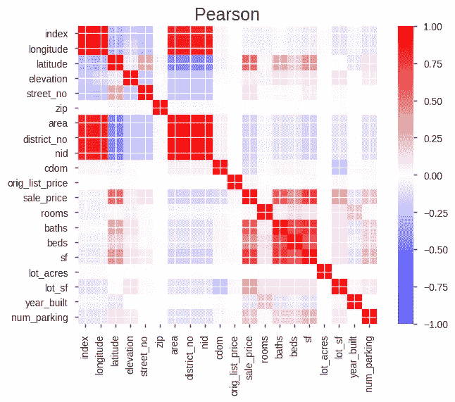

Pearson Correlation Matrix — Initial Data

与销售价格高度相关的特征包括纬度、浴室、卧室、住宅面积、地段面积和停车场。这是有道理的，因为旧金山的北部拥有最昂贵的房屋(纬度)，拥有更多平方英尺/床/浴室的房屋将卖得更高的价格，而在旧金山停车是非常昂贵的。

**指标**

由于线性回归最终成为选择的模型(稍后将详细介绍模型选择)，关键指标是平均绝对误差(MAE)和 R 平方。

作为基线，使用 2018 年销售平均售价的 MAE 为 684，458 美元。换句话说，如果我使用 2018 年旧金山单户住宅的平均价格作为每个家庭的预测，平均误差将是 684，458 美元。模型最好能打败这个！

我还想将该模型与 Zillow 的结果进行比较。他们实际上公布了旧金山市区的精度结果( [Zestimate metrics](https://www.zillow.com/zestimate/) )。虽然结果不能与我的数据直接比较(大城市区域要大得多)，但它们确实为模型提供了一个粗略的拉伸目标。

1.  中值误差— 3.6%
2.  Zestimate 在销售价格的 5%以内— 62.7%
3.  Zestimate 在销售价格的 10%以内— 86.1%
4.  Zestimate 在销售价格的 20%以内— 97.6%

**评估协议**

评估协议将使用 2009 年至 2016 年的数据将数据集分为训练集，使用 2017 年数据的验证集和使用 2018 年数据的最终测试集。

1.  train——2009 年至 2016 年销售了 15，686 套房屋。
2.  验证-2017 年销售 1932 套房屋。
3.  测试—2018 年房屋销售 1897 套。

**型号选择**

线性回归模型被充分证明是房屋价格预测的强模型，这是最初选择的模型。以最少的数据清理/争论进行简单的线性回归，并记录结果。逻辑回归和随机森林模型也被尝试用于比较，线性回归模型显然是领先的。随着项目的进展，我会定期对照随机森林模型检查它，线性回归模型继续优于随机森林模型。所以是线性回归！

**开发模型**

初始模型使用所有功能运行，结果如下。为了查看模型的性能，我添加了每平方英尺价格特性，这实际上是房产的代理销售价格。正如预期的那样，每平方英尺的价格结果很好，但显然无法使用，因为在预测 2018 年的价格时不会知道该值。这是一个明显的数据泄露的例子。

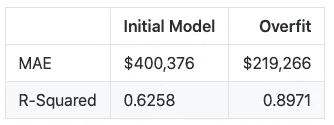

Base Model and Overfit

这些初始预测的指标提供了一个基本的最小值和最大值。换句话说，我有一个已经超过基线的最小值和一个使用数据争论来避免数据泄漏的最大值。

**数据角力**

优化模型的关键在于数据扯皮！

*消除特征*

事实证明，超过 20 个特征对预测影响很小或没有影响，可以被删除，从而大大简化了模型。例如，城市和州对于所有属性都是相同的。

*日期和时间序列*

数据中有两个日期特性:销售日期和上市日期。上市日期是物业在 MLS 上上市的日期，对预测影响很小，因此被删除。

销售日期需要年份，因为数据是按销售年份划分的。这也提出了使用时间序列来预测价格的问题。与每日价格的股票不同，房地产销售可能每 5-10 年发生一次。为了使用时间序列，该模型将需要使用一个考虑到升值/贬值和任何季节性的价格指数。这种方法被简单地尝试过，但是结果比我最终的模型弱。年价格乘数如下所示。如果你在 2009-2011 年在旧金山买了一套房子，到 2018 年，它的价值平均翻了一番！

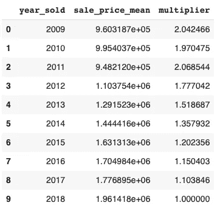

Annual Price Multiplier

最终只有售出年份被用于最终模型。

*零和 Nans*

使用各种方法填充纬度、经度、海拔、房间、浴室、地块平方英尺和地块英亩中的零和 Nans(见代码)。

*特色工程*

消除特征和填充零和 nan 为模型提供了增量改进，但是需要特征工程来获得更大的改进。

分类数据使用普通编码进行编码，但一些特征通过计算特征中分类值的数量来改进模型。例如，视图特性包含了从 25 种视图类型中挑选的属性的所有潜在视图的列表。据推断，景观越多的房产价值越高。因此，视图计数功能被设计为对视图功能中记录的视图数量进行计数。同样的方法也用于停车和车道/人行道功能。

然而，关键的设计特征被证明是可比较的销售特征。该特征是通过模拟代理对财产估价的方式而创建的估计值。下面的代码获取最近的三个类似规模的房产的最近销售额(可比销售额)，并计算它们每平方英尺的平均价格，该价格稍后将在模型中用于计算可比销售价格。为避免任何数据泄露，未使用 2018 年可比销售额(最大可比销售年度为 2017 年)。

```
nhoods = X[['sf', 'longitude', 'latitude']]

def neighbor_mean(sqft, source_latitude, source_longitude):

  source_latlong = source_latitude, source_longitude
  source_table = train[(train['sf'] >= (sqft * .85)) & (train['sf'] <= (sqft * 1.15))]
  target_table = pd.DataFrame(source_table, columns = ['sf', 'latitude', 'longitude', 'year_sold', 'sale_price']) 

  def get_distance(row):
      target_latlong = row['latitude'], row['longitude']
      return get_geodesic_distance(target_latlong, source_latlong).meters

  target_table['distance'] = target_table.apply(get_distance, axis=1)

  # Get the nearest 3 locations
  nearest_target_table = target_table.sort_values(['year_sold', 'distance'], ascending=[False, True])[1:4]

  new_mean = nearest_target_table['sale_price'].mean() / nearest_target_table['sf'].mean()
  if math.isnan(new_mean):
    new_mean = test['sale_price'].mean() / test['sf'].mean()

  return new_mean

nhoods['mean_hood_ppsf'] = X.apply(lambda x: neighbor_mean(x['sf'], x['latitude'], x['longitude']), axis=1)
nhoods = nhoods.reset_index()
nhoods = nhoods.rename(columns={'index': 'old_index'})
```

一个新的关联矩阵显示了新的争论和工程特性之间的关系。

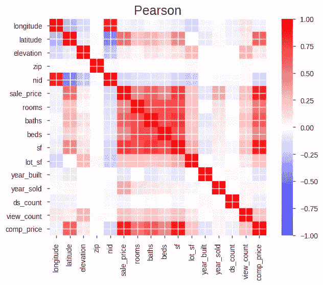

Pearson Correlation Matrix — Wrangled Data

**最终结果**

最后，根据 2018 年的测试数据运行该模型。该模型的测试 MAE 为 276，308 美元，R 平方值为 0.7981，轻松超过基线。

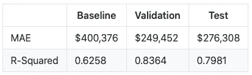

Final Results

与 Zestimate 的性能相比，Jestimate 模型的中值误差较低，但无法击败 Zestimate 的强误差分布。同样，Zestimate 数据覆盖的区域比 Jestimate 大。

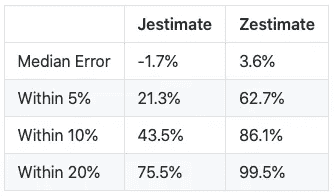

Jestimate vs. Zestimate

Jestimate 百分比预测误差的直方图显示了分布情况:

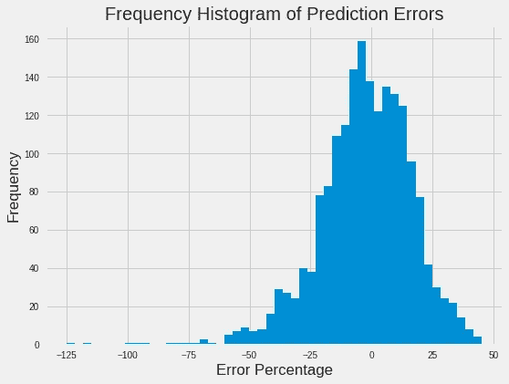

Prediction Errors for Jestimate

**使用 Shapley 值的特征重要性**

为了提供对预测的进一步了解，计算了每个属性的 Shapley 值，显示了对预测价格具有最高正面影响(赞成)和最高负面影响(反对)的特性及其值。

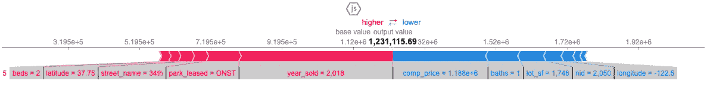

Shapley Values Graph

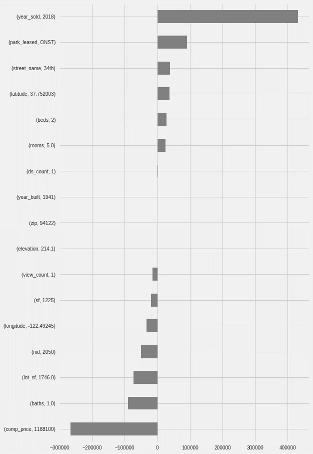

Shapley Values Grid

**显示**

最终显示数据帧被创建并保存在. csv 文件中，以供显示代码使用。另一篇文章“[数据可视化—高级散景技术](/data-visualization-advanced-bokeh-techniques-e33f92537415)”详细介绍了如何使用散景图、数据表和文本字段创建数据的交互式显示。

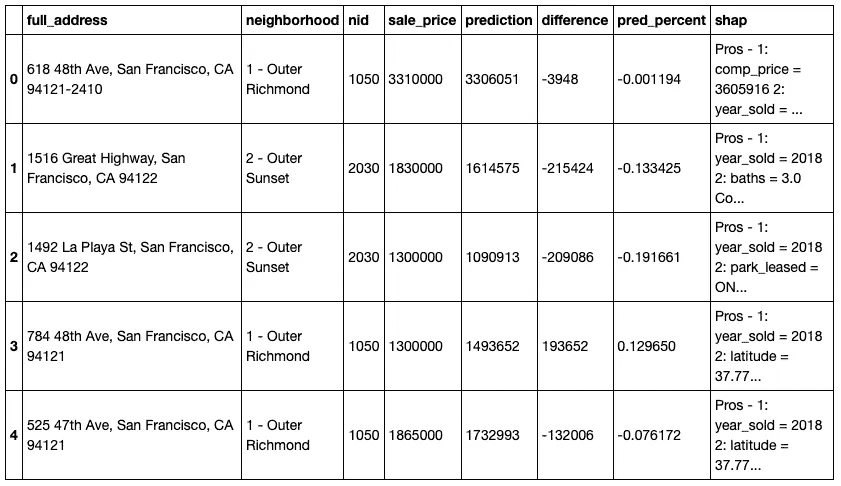

display_data Dataframe

我欢迎建设性的批评和反馈，请随时给我发私信。

有关该项目的数据可视化部分的详细信息，请参见配套文章“数据可视化—高级散景技术”。

这篇文章最初出现在我的 [GitHub 页面](https://jimking100.github.io/2019-10-17-Post-4/)网站上。

在推特上关注我 [@The_Jim_King](https://twitter.com/The_Jim_King)

*这是探索旧金山房地产数据系列文章的一部分*

*旧金山房地产数据来源:旧金山 MLS，2009–2018 年数据*