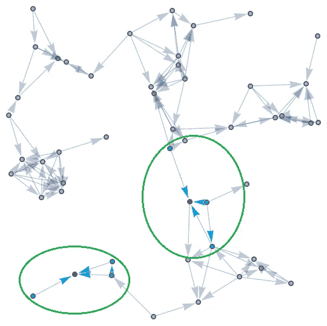
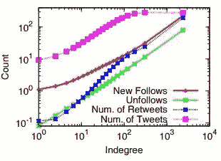
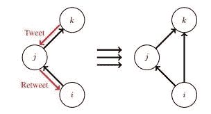
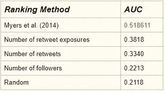

# Twitter 社交和信息网络:论文综述

> 原文：<https://towardsdatascience.com/looking-for-that-twitter-follower-burst-eb24dda444b1?source=collection_archive---------26----------------------->

关于关注者/转发者关系及其演变的论文综述

**全告白，这是* ***而不是*** *在推特上获得更多追随者的直接指南。我甚至没有推特账号！！但是我对社交网络有相当不错的了解，这篇* [*论文*](https://dl.acm.org/citation.cfm?id=2568043)*【1】中呈现的结果支持了我的观点。**

*因此，如果你想深入了解 twitter 上的粉丝网络是如何演变的，以及为什么某些转发往往会获得大量粉丝，而其他人却不会，你应该继续阅读。我试图以一种任何人都可以理解的方式写这篇博文，不需要任何先验知识。有关更多技术细节，请参考本文。*

# *自我网络*

**

*A small portion of the social network. Every node represents a user and every edge represents a follower/followee relation. The blue nodes and edges together represent the ego-networks of two red nodes.*

*在我们开始之前，让我们谈谈如何用数学方法来表示各种 Twitter 动态。整个社交网络由一个巨大的图形表示，其中每个用户由一个节点表示，每个关注关系由一条有向边表示(从关注者到被关注者)。*

*用户的自我网络只不过是由她的追随者(不包括用户自己)以及他们之间的所有追随者/被追随者关系组成的子图。在技术术语中，用户的自我网络包含所有具有朝向用户节点的边的节点以及这些节点之间的所有边。*

# *推文相似度*

*通常，人们会发现用户的自我网络倾向于与用户有相似的兴趣。他们通常会发推文和转发类似的话题。但是我们如何“量化”这种相似性呢？我们可以通过测量推文的文本相似性来做到这一点。*

*两条推文之间的相似性可以计算为两条推文的 TF-IDF 加权词向量之间的余弦相似性。如果你不知道那是什么，不要担心。粗略地说，这是一种衡量两条推文之间有多少相似单词的方法。这是一个介于 0 和 1 之间的分数，代表给定推文的相似程度。*

# *推特动态*

*既然我们已经弄清楚了技术细节，让我们更深入地研究一下网络。Twitter 信息网络有两大动态，tweeting/retweeting(代表信息的流动)和 following/unfollowing(代表网络的演变)。正如直觉所暗示的，显然这两者应该是相互关联的。*

*Twitter 信息图是高度动态的。大约 9%的边缘每个月都会改变，其中大约 2%的改变会被删除。粗略地说，这意味着平均每个用户每获得 3 个追随者就会失去 1 个追随者。*

**

*Number of new follow, unfollows, tweets and retweets against the user indegree (number of followers). Clearly highly followed users have a more dynamic ego-network.*

*对于这样一个动态变化的网络，显然很难对每一个微小的变化进行建模和理解。然而，twitter 有时会经历用户关注/不关注数量的激增。这可能是因为一条出名的推文或者一条冒犯了别人的推文。两种主要类型的突发是，*

*   ****转发关注*爆发:**用户获得大量关注者的最明显解释是什么？大概是因为大量新人第一次看到她的推文。或者换句话说，她的转发量激增。
    不关注用户的人不会知道她发布的推文。然而，当一条推文被转发很多次时，更多的人第一次接触到它。其中一些人可能会喜欢这条推文，并决定直接关注用户，从而导致她的粉丝数量激增。*

**

*User ‘i’ is never directly exposed to the tweets of user ‘k’. However, when user ‘j’ retweets, user ‘i’ gets to know about user ‘k’. It is possible that user ’i’ might like the tweet that she sees and starts directly following user ‘k’.*

*   ****tweet-unfollow* 突发:**un follow 突发比 follow 突发更容易解释。有时，一个用户可能会在推特上发布一些惹恼或冒犯她的一大群追随者的事情。这将导致该组关注者不再关注用户，这被称为 tweet-unfollow 突发事件。发微博的频率也是一个重要因素。*

# *为什么不是每个转发的爆发都会导致一个关注者的爆发？*

*直觉告诉我们，越多的人接触到这条微博，就意味着越多的人开始关注用户。因此，每个转发突发都应该有一个追随者突发。但是，事实并非如此，而且实际上很容易解释。*

*考虑一个用户(姑且称她为 A)可能拥有的两类关注者，一类是经常转发 A 每条推文的人(姑且称她为 R)，另一类是很少转发任何推文的人(姑且称她为 L)。很明显，和 R 有联系(而不是和 A 有联系)的人已经意识到了 A 的存在(由于 R 的频繁转发)。但是，由于他们仍然没有关注，所以即使在转发爆发期间，他们也不太可能这样做。*

*然而，对于连接到 L(而不是 A)的人来说，情况就不一样了。这些人并没有意识到 A 的存在(因为 L 很少转发)，在一次转发突发中第一次接触到 A。这是将决定 A 是否得到那个追随者爆发的“那个”组。如果这个群体的人似乎喜欢 A 的推文，他们会直接开始关注 A，然后转发突发会被关注者突发所取代。然而，反之亦然，以防他们不喜欢 a 的推文。*

**

*If users who rarely see the tweets by user ‘i’ are more compatible (better tweet similarity) with the user, then they are more likely to start directly following user ‘i’ after a retweet burst.*

*但是，如果看到用户的推文，你怎么决定有人跟踪她的可能性呢？这就是两个用户的推文相似性(也称为兼容性)发挥作用的地方。衡量很少接触用户推文的人的兼容性可以很好地预测转发突发是否会有追随者突发。*

# *成绩有多好？*

*400，000 个随机选择的转发突发被不同的算法排序为最有可能被追随者突发继承。绘制了相同算法的精确-召回曲线，并记录了各种算法的曲线下面积(AUC)。如果你不明白这个指标是什么，没关系，你仍然可以欣赏比较差异。*

*论文[1] (Myers 等人)中给出的结果明显优于他们对比的任何其他基线算法。“转发曝光次数”是根据看到转发的人数来排名的。“转发数”是根据转发的人数进行排名的。“追随者数量”的排名是基于用户已经拥有的追随者数量，而“随机”只是随机对他们进行排名。*

**

# *结论*

*很明显，我们不能否认推特信息网络的两大动力之间的关系，推特/转发和关注/不关注。试图对这些网络中出现的某些行为的原因进行建模是一个开始，并使我们更接近能够理解高度进化和不断增长的社交网络。*

**注:没有图像、图表、公式等。这个博客里的礼物是我自己的。它们都直接摘自本文[1]。我过去和现在都没有参与这篇论文的研究。要获得更多关于该研究的深入知识，请参考该论文。**

## *参考*

**[1]迈尔斯，塞斯·a .，和朱尔·莱斯科维奇。"推特信息网络的突发动态."第 23 届国际万维网会议论文集。美国计算机学会，2014 年。**