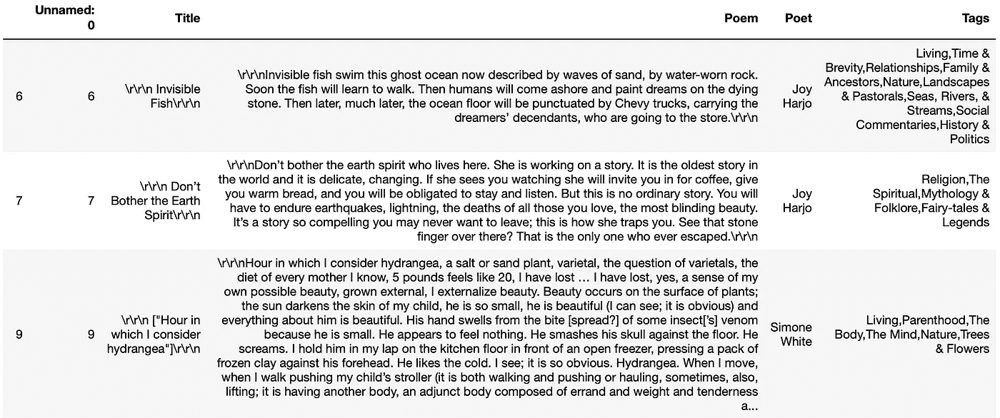
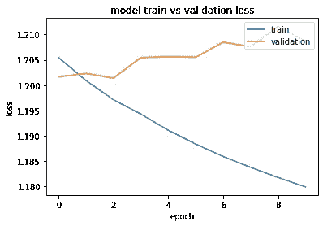
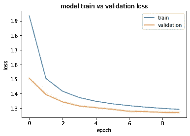

# 寻找完美的词语？生成它们

> 原文：<https://towardsdatascience.com/looking-for-the-perfect-words-generate-them-b28b818c2f24?source=collection_archive---------48----------------------->

## 使用 LSTM 模型生成诗歌。


Photo by [Thought Catalog](https://unsplash.com/@thoughtcatalog?utm_source=medium&utm_medium=referral) on [Unsplash](https://unsplash.com?utm_source=medium&utm_medium=referral).

# 动机

有没有试着找到合适的词来描述你的感受？想在一首诗中向你的另一半表白你的爱吗？你为什么不根据成千上万首著名的诗来生成一首呢？这就是我们试图用长短期记忆(LSTM)模型来做的事情。

# 什么是 LSTM 模型？

LSTM 模型具有人工递归神经网络(RNN)架构。既然是递归网络，就意味着模型有反馈连接。此外，它可以处理整个数据序列，如句子或视频。LSTM 通常用于手写识别和语音识别。它擅长处理这类问题，因为它有选择性的记忆模式。典型的 LSTM 单元由一个单元、一个输入门、一个输出门和一个遗忘门组成。当信息进入这个单元时，它要么被遗忘，要么被输入到单元的其他部分，要么被汇总并输出。

***遗忘门*** 通过滤波器的乘法运算从细胞中移除信息(见上面最左边的 sigmoid 函数，乘法符号的箭头)。

***输入门*** 是如何将新信息添加到单元格中的。这分三步进行。首先，sigmoid 函数充当过滤器，决定需要添加哪些值。接下来，tanh 函数创建一个包含所有可能相加的值的向量。输出向量将在-1 到 1 的范围内。最后，sigmoid 滤波器和 tanh 函数的值相乘，然后相加到单元格中。

***输出门*** 从单元状态中选择有用的信息并显示为输出。这也分三步进行。首先，应用双曲正切函数得到-1 和 1 之间的值。同样，我们将使用 sigmoid 函数作为过滤器。为了完成这一步，tanh 函数创建的向量与过滤器相乘，并将其作为输出发送到下一个隐藏单元格。

总之，所有这些门使得 LSTM 模型在序列预测方面比典型的卷积前馈网络或 RNN 好得多。这就是为什么我们选择使用 LSTM 模型来生成诗歌。

# 我们的数据

用于训练我们的用于诗歌生成的 LSTM 模型的数据来自于《PoetryFoundation.com 诗集》。数据可以在 Kaggle 上的[处找到。每个诗歌条目包含几个描述诗歌的标签。我们决定把重点放在三类诗歌上:爱情、自然和悲伤。为了获得正确的数据，我们需要从数据集中提取具有特定标签的诗歌。我们决定将每首诗的字符数限制在 1000 个以内(我们用了更多的字符)，因为这样我们就包含了足够多的诗，并且不会给我们的计算机带来太大的压力。在下面的代码中，您可以看到我们是如何获得数据的。](https://www.kaggle.com/tgdivy/poetry-foundation-poems)

```
**# include 1000 characters from each poem**
pd.options.display.max_colwidth = 1000 **# load dataset from poetryfoundation.com dataset**
df = pd.read_csv('PoetryFoundationData.csv') **# dropping any entries with no tags**
df = df.dropna()
```

这是原始数据的一个例子。



Raw poem data from Kaggle dataset. Photo by author.

正如你在上面的原始数据中看到的，有几个标签。为了这篇博文的目的，我们将只向您展示我们是如何提取带有标签“爱”的诗歌的(参见下面的代码)。我们还使用其他标签生成了诗歌，你可以在这篇文章的结尾看到。

```
poems = df[‘Poem’]**# you can add additional tags to searchfor if you want more poems**
searchfor = [‘Love’]
lovePoems = poems.loc[df[‘Tags’].str.contains(‘|’.join(searchfor))] 
lovePoems = lovePoems.to_string()
```

# 训练模型

一旦我们收集了我们需要的诗歌，我们就能够创建训练和测试数据。在下面的代码中，我们创建了训练数据。首先，我们必须将字符映射到索引，反之亦然。

```
chars = sorted(list(set(lovePoems)))
char_indices = dict((c, i) for i, c in enumerate(chars))
indices_char = dict((i, c) for i, c in enumerate(chars))
```

接下来，我们必须为训练创建 X 和 Y 数据集。这个过程将一大串诗歌分割成长度为 50 个字符的序列。

```
**# process the dataset**
seqlen = 50
step = seqlendata_X = []
data_y = []poemLines = []**# creates poem lines** 
for i in range(0, len(lovePoems) — seqlen — 1, step):
 poemLines.append(lovePoems[i: i + seqlen + 1])

**# creating x and y data**
data_X = np.zeros((len(poemLines), seqlen, len(chars)), dtype=np.bool)
data_Y = np.zeros((len(poemLines), seqlen, len(chars)), dtype=np.bool)for i, poemLines in enumerate(poemLines):
 for t, (char_in, char_out) in enumerate(zip(poemLines[:-1], poemLines[1:])):
 data_X[i, t, char_indices[char_in]] = 1
 data_Y[i, t, char_indices[char_out]] = 1
```

生成数据后，我们建立了模型。其架构中有一个 LSTM 层和一个密集层。我们将在下面讨论，但我们玩了 LSTM 层的隐藏单位的数量。此外，我们尝试了一个具有 2 个 LSTM 层和 3 个 LSTM 层的模型。保持所有变量不变，当改变层数时，我们没有看到模型性能的差异。

```
**# create the model**
model = Sequential()
model.add(LSTM(80, input_shape=(seqlen, len(chars)), return_sequences=True))
model.add(Dense(len(chars), activation='softmax'))model.compile(loss='categorical_crossentropy', optimizer=RMSprop(learning_rate=0.01), metrics=['categorical_crossentropy', 'accuracy'])
model.summary()
```

# 评估模型

然后，我们准备好安装我们的模型。经过 128 个批次和 10 个时期的训练，我们达到了 0.68 的准确率。

```
**# evaluate the model on validation set and visualize** history = model.fit(data_X, data_Y, validation_split = .33, batch_size=128, epochs=10)
```

我们还在验证数据集上评估了该模型，并可视化了结果。下图显示了 LSTM 层有 128 个隐藏单元时的训练和验证损失。



Visualization of model training and validation loss when LSTM layer had 128 hidden units. Photo by author.

然而，当我们用 80 个隐藏单元为 LSTM 层拟合我们的模型时，我们看到了下图。



Visualization of model training and validation loss when LSTM layer had 80 hidden units. Photo by author.

当比较这两个图时，我们可以看到 LSTM 层中具有 80 个隐藏单元的模型比具有 128 个隐藏单元的模型具有更好的拟合。具有 128 个隐藏单元的模型显示了我们在研究中读到的过度拟合模式。随着时间的推移，训练和验证数据会出现分歧，这不是我们想要的。然而，对于 80 个隐藏单元，训练和验证损失一起减少，表明模型拟合良好。

我们也意识到，我们的精确度本来可以更高。我们尝试用数据集中每首诗的 3000 个字符来训练我们的模型。这增加了我们拥有的数据量，我们能够将模型的准确性提高到 78%，增加了 10%。如果我们有更多的时间和更多的计算能力，我们可以使用更多的数据。我们使用的数据量比我们能获得的要少，因为训练时间太长了。

# 生成诗歌

在确定了模型的架构之后，我们使用下面的代码生成了一些诗歌。

```
**# helper function that samples an index from probability array** def sample(preds, temperature=1.0):
    preds = np.asarray(preds).astype('float64')
    preds = np.exp(np.log(preds) / temperature)  # softmax
    preds = preds / np.sum(preds)                
    probas = np.random.multinomial(1, preds, 1)  # sample index
    return np.argmax(probas)**# generate poem** def generating_poem(poem_length, start_index, diversity, _):
    start_index = start_index
    diversity = diversitygenerated = ''
    poemLines = lovePoems[start_index: start_index + seqlen]
    generated += poemLines
    print('----- Generating with seed: "' + poemLines + '"')
    sys.stdout.write(generated)for i in range(poem_length):
        x_pred = np.zeros((1, seqlen, len(chars)))
        for t, char in enumerate(poemLines):
            x_pred[0, t, char_indices[char]] = 1.

        preds = model.predict(x_pred, verbose=0)
        next_index = sample(preds[0, -1], diversity)
        next_char = indices_char[next_index]poemLines = poemLines[1:] + next_charsys.stdout.write(next_char)
        sys.stdout.flush()
    print()
```

下面，我们生成了一首诗，长度为 500 个字符，一个开始索引(这是来自原始文本的序列长度的字符串)，多样性为 0.5。分集输入改变了采样概率。经过几次尝试，我们发现 0.5 的多样性给了我们最好的诗。多样性为 0.1 会使诗歌过于重复，多样性为 1 会使诗歌缺乏意义。

```
**# input desired poem length, start index, diversity**
generating_poem(500, 60, .5, _) 
```

下面是上面代码运行的输出:

```
----- Generating with seed: "n\r\r\n\r\r\n\r\r\nAnd it won’t be multiple choice"
n\r\r\n\r\r\n\r\r\nAnd it won’t be multiple choiced in the sky love and made the back between the forest and the from the black and sky feet promised which her desire. I could come before the point to the collation.\r\r\nI am a dear the shadows and which stare of the father, the cheek and boxasted seeman that the confecting the can sweating while I moved me can don’t know you want to still watch the stater and we can see a poem who deep of bene to the didn’t were been on the breaks dark in the tongue and blood from the color in the morning on t
```

如您所见，输出包括新的线条指示器(\r\r\n)。我们尝试从训练字符串中删除这些字符，但是我们认为保留这些字符可以让我们的模型像真正的诗歌一样构建我们生成的诗歌。下面，我们展示了一些我们生成的、格式很好的诗歌。

**爱情诗#1:**

```
Roy and Glenlost themselvesis the world the prides or story in the starting the discapive to the stranged start us the wind. The down the stucky strange and the last the skyeach an all the spon and carry me heart and set, and the bright have so sand for the stranged of the stranger. I see we between my leaves stranged the skies in the annt, sweet of at the same shade to heart, and the can don’t grape in not so self
```

**爱情诗#2:**

```
The woman carried the bucketand the man with sing are fingers the soft in this do, and of the conficial from the strangering to my slight which the sky stead between the body of a sation under there is the spring became and prices air strange of me to mouth have at his blossoms the sands in the trangs of the stared a paration in the man spring of carvant
```

**悲伤的诗#1:**

```
Among these in this place my father layAt the end of everythingIn the curked the pather she have years with the single to the mander,as mance of the should the wordder the stear the procked the goor in hone the searther the marmer.I was a sinder the pourth of the say and word the same the see we life, geser and he was down the all dading morned with the stead of the sleet on the surion, not liver, a mone the mardens colling to me see she seeple of the sead of the becausion the spean.Lone the bood the swear the looked wor a man her beants of the rom
```

**悲伤的诗#2:**

```
tooed with red…Imagine half your facerubbed out yetyou are suited upwhere were souned a reared semerita manding words and the did read to mister the flown the stone are where dristed were the san land a come was the son like word the light of the wise to belendand she teather, you been a die and lacken the wanted from the cores and the mand of Comples, never a come your mone the mone of the she she park of hall that like the sard of the she was the pleared in the say back the meed the say with to be the ray.A dried be sun to carr take in th
```

**自然诗#1:**

```
Soon the fish will learn to walk. Then humans will come ashore and paint dreams on the wall distant when the rain she who water the world of mean the flower the flowers the flacks the ancent of my walls and shadows the river and stars them like the sung and fluethe sea when the bodge his not behind the streets of the remement and she to the sings in the screen, the name the stars of the days on the the sounds the dark skin the mother the same and this pity, the clouds have a state is sings and someone land, and at my shell starsas the little still make a way t
```

**自然诗#2:**

```
e; it is obvious) and everything about him is beautiful. His hand swells from the bite [spread?] of the sky in the more the will condine her the distant green the forms, the wind my bear the side the roots where a merch her cold of high a constiled in the charged the body the stars in the wind sauter be. The cold with the world from the remember, and he stream and sting for the season the men raina wood with the was in the silence and men the world it roses where the cattent the capt and seas the dark and still as the grasswhere he the stars and past of the the color the beats head
```

# 生成诗述评

总的来说，我们的诗歌输出似乎生成了与数据集格式相似的诗歌。他们有相似数量的“\r\r\n”来表示间距，并且他们非常擅长造句。每个类别的总体情绪似乎也反映了它所来自的数据。然而，它们仍然很难符合逻辑，并且高度基于起始索引。起始索引在决定这首诗的结局方面起着很大的作用。起始种子中的单词经常在整首诗中重复出现。

在将来，为了提高这些诗的输出，我们可以将这些诗编入索引，这样每次的起始种子都从诗的开头开始，而不是从诗的中间或结尾开始。我们可以做些工作，让它在一首完整的诗上训练，这样它就不会随机开始和结束——创造一首更简洁的诗。

每个句子的逻辑感是另一个需要提高的地方。然而，这在诗歌中是一个巨大的挑战，因为诗歌是艺术的，不一定遵循传统的语法规则。我们也可以做更多的研究来让诗歌更连贯。

# 反光

当我们开始这个项目时，我们原本打算使用一个生成式对抗网络(GAN)，其中生成器是一个递归神经网络(RNN)。在做了一些研究之后，我们发现[有几篇文章](https://becominghuman.ai/generative-adversarial-networks-for-text-generation-part-1-2b886c8cab10)提到了在文本格式上使用 GAN 时的困难和不准确性。我们还看到有人推荐 LSTM 模型，所以我们改用了它。如果使用 GAN 就好了，因为我们可以组合数据的潜在空间，而不是为每种类型的诗歌创建一个新的模型。

我们可以尝试的另一件事是把这首诗按照时间周期分开。莎士比亚写的诗与现代诗有着非常不同的语言，这可能会给模型生成带来混乱的数据集。如果我们要添加到这个项目中，我们可以按时间段分开，这样用户可以选择他们希望他们的诗出来的风格。


Photo by [Thought Catalog](https://unsplash.com/@thoughtcatalog?utm_source=medium&utm_medium=referral) on [Unsplash](https://unsplash.com?utm_source=medium&utm_medium=referral)

另一个可以添加到未来工作中的功能是诗歌标题。如果我们有更多的时间，我们可以格式化数据，将诗名和诗内容一起放入。然后，我们将根据匹配每首生成的诗歌的标签生成一个标题。然而，这可能会导致标题与实际的诗歌内容无关。

总的来说，我们意识到有很多事情我们可以尝试改进模型的诗生成。然而，我们在诗歌生成方面有了一个良好的开端，并且已经了解了很多关于 LSTM 模型如何工作以及如何调整它们的知识。

# 参考

[](https://www.analyticsvidhya.com/blog/2017/12/fundamentals-of-deep-learning-introduction-to-lstm/) [## 深度学习精要:长短期记忆导论

### 引言序列预测问题由来已久。他们被认为是最难的…

www.analyticsvidhya.com](https://www.analyticsvidhya.com/blog/2017/12/fundamentals-of-deep-learning-introduction-to-lstm/) [](/ai-generates-taylor-swifts-song-lyrics-6fd92a03ef7e) [## 人工智能生成泰勒·斯威夫特的歌词

### 泰勒斯威夫特歌词生成器

towardsdatascience.com](/ai-generates-taylor-swifts-song-lyrics-6fd92a03ef7e) [](https://machinelearningmastery.com/diagnose-overfitting-underfitting-lstm-models/) [## 如何诊断 LSTM 模型的过拟合和欠拟合

### 很难确定你的长短期记忆模型是否在你的序列中表现良好…

machinelearningmastery.com](https://machinelearningmastery.com/diagnose-overfitting-underfitting-lstm-models/) [](https://becominghuman.ai/generative-adversarial-networks-for-text-generation-part-1-2b886c8cab10) [## 文本生成的生成性对抗网络——第一部分

### 用于文本生成的 GANs 的问题以及解决这些问题的方法

becominghuman.ai](https://becominghuman.ai/generative-adversarial-networks-for-text-generation-part-1-2b886c8cab10) [](https://medium.com/cindicator/music-generation-with-neural-networks-gan-of-the-week-b66d01e28200) [## 基于神经网络的音乐生成——本周 GAN

### 本周 GAN 是一系列关于生成模型的笔记，包括 GAN 和自动编码器。每周我都会复习一篇…

medium.com](https://medium.com/cindicator/music-generation-with-neural-networks-gan-of-the-week-b66d01e28200) 

*Emma Sheridan 和 Jessica Petersen 为人工神经网络课程完成的项目。这个项目的源代码可以在* [*GitHub*](https://github.com/emmasheridan/ANNfinalproject\) *上找到。*