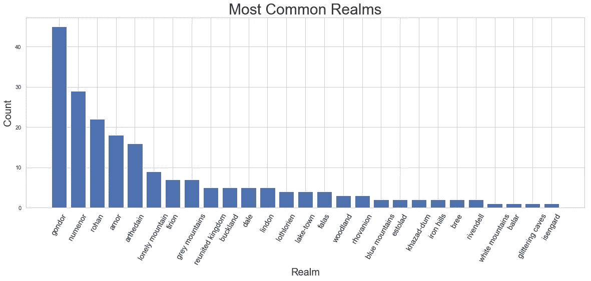

# 一张图来统治他们所有人——指环王网络分析

> 原文：<https://towardsdatascience.com/lord-of-the-rings-analysis-8a246643bf45?source=collection_archive---------19----------------------->

**链接到最终结果→**[链接 ](https://alon-cohen-gordon.wixsite.com/lotr-graph)

我第一次看《指环王》是在 2001 年，我觉得我的生活永远改变了。从 2001 年到现在已经过去很长时间了，但直到今天我还能享受看加长三部曲的乐趣。由于电影看多了，我决定做点不一样的，把魔戒和数据分析的世界结合起来。

魔戒和数据分析如何结合？这是个好问题…

与所有数据分析项目一样，一切都始于数据。

我在网上快速搜索了一下，找到了一个网站[一个统治一切的维基](https://lotr.fandom.com/wiki/Main_Page)，一个充当 J. R. R .托尔金图书百科全书的网站。幸运的是，该网站包含数千页关于人物、地点、种族和历史小说事件的详细信息。

此外，它允许任何人使用爬虫抓取它的页面。我怎么知道？因为在每个站点*“robots . txt/”*都可以添加到 URL 中，检查站点是否允许抓取，以及在什么条件下。([链接到该网站的 robots.txt](https://lotr.fandom.com/robots.txt) ，[进一步了解 robots.txt](https://support.google.com/webmasters/answer/6062608?hl=en) )

首先，我必须到达网站并抓取所有页面。我决定只刮去几页文字，并把注意力集中在它们上面。

可以刮出哪些数据？

每一页都包含文本、照片、链接，在许多情况下还有传记资料。我对传记数据特别感兴趣，因为我假设它包含的字段在所有页面中都是相似的，所以我可以将它安排到一个数据框中。

先说传记资料。

在抓取了所有的字符页之后，这就是数据框的样子:(使用 [missingno](https://github.com/ResidentMario/missingno) 绘制数据框)

如你所见，有许多列，但大多数都是半满或几乎是空的。在对数据进行清理和重新整理后，我对以下领域进行了分析:武器、领域、种族、性别、文化。

**传记资料**

上面的图表显示了人物种族和出身的分布。如种族图所示，男性最常见，然后是霍比特人、精灵、矮人、兽人等等。在分析过程中，我遇到了一些我不知道的人物。例如，你知道有 3 个不同的角色属于巴罗格种族吗？

在文化图表中，不出所料，最常见的文化是男性文化，而刚铎和洛汗文化位于顶部。这个图表与种族图表相关联，它讲述了同样的故事。

性别图表显示，男性比女性多得多(几乎多 5 倍)。更有可能的是，如果这些书是在我们这个时代而不是在 20 世纪写的，那么图表会更加平衡。

最后一张图显示了武器的分布情况。为了创建这个图表，我必须将武器的名称标准化。在大多数情况下，一种武器有几种版本。例如，在“剑”类别下，有“国王之剑”、“精灵之剑”、“罗希里姆之剑”等等。

**正文**

NLP 是一个迷人的世界，人们可以使用各种算法从文本中提取洞察力。因为我想保持专注，所以我决定只创建一个强调文本力量的图表。

上图是用[甘道夫的页面](https://lotr.fandom.com/wiki/Gandalf)中的文字制作的。单词排列成环形，它们的大小与它们在文本中的出现频率有关。

**链接**

链接可能看起来不像一个强大的数据源，但在我看来，这将是一个低估。使用链接分析，我们可以指出几点见解。例如:A)一个角色有多受欢迎，B)角色之间有什么联系和关系。

这个图表非常有趣，因为它告诉我们，提到最多的人物不一定是中心人物。索伦和甘道夫是重要的角色，但在我看来，他们没有佛罗多重要。尽管如此，弗罗多最终排名第九，而索伦和甘道夫则分列第一和第二。等级并没有告诉我们故事的中心地位，但是它告诉了我们角色之间的联系。

在网络理论中，[中心度](https://www.sciencedirect.com/topics/computer-science/degree-centrality)是用来衡量网络中节点中心性的度量。指向你的节点越多，你就越居中。上图与上图不同，因为它通过唯一链接的数量而不是简单链接的数量来衡量角色的中心性。

另一个让我们了解节点重要性的指标是[中间中心度](https://www.sciencedirect.com/topics/computer-science/betweenness-centrality)。该指标衡量节点对网络中最短路径的重要性。例如，布鲁克林大桥不是一个中心位置，因为人们参观它，而是因为人们在去其他地方的路上走过它。

为了获得关于字符连接的一些见解，有几种社区检测算法。在下一个示例中，图表显示了使用 Louvain 算法检测到的社区所着色的字符。

Top 100 Characters Network

Louvain Detected Communities (Top 100)

由于我搜集的数据已经包含了角色的许多细节，我认为这些复杂的模型在我们的案例中没有任何用处。这些角色可以根据他们的种族或文化来划分。

Lord of The Rings Network

Characters Details

[**链接到一个交互图形**](https://alon-cohen-gordon.wixsite.com/lotr-graph)

在上图中，你可以看到网络图中人物之间的联系。在这个互动网络(使用 [pyvis](https://pyvis.readthedocs.io/en/latest/) 制作)中，当鼠标悬停在每个节点上时，角色的传记数据就会显示出来。当鼠标悬停在边缘时，引用的数量会显示出来，这可以告诉我们字符之间的连接质量。节点的大小与它们的中心度有关，它们的位置是使用[Barnes–Hut simulation](https://en.wikipedia.org/wiki/Barnes%E2%80%93Hut_simulation)算法基于它们的连接来计算的。

感谢大家阅读我的文章，如果你有任何问题，意见或改进的想法，请在下面留下评论！

[代号](https://github.com/aloncohen1/My-Projects/blob/master/lord%20of%20the%20rings%20analysis.ipynb)
[*阿龙科恩*](https://www.linkedin.com/in/alon-cohen-67459988/)