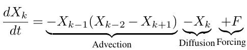
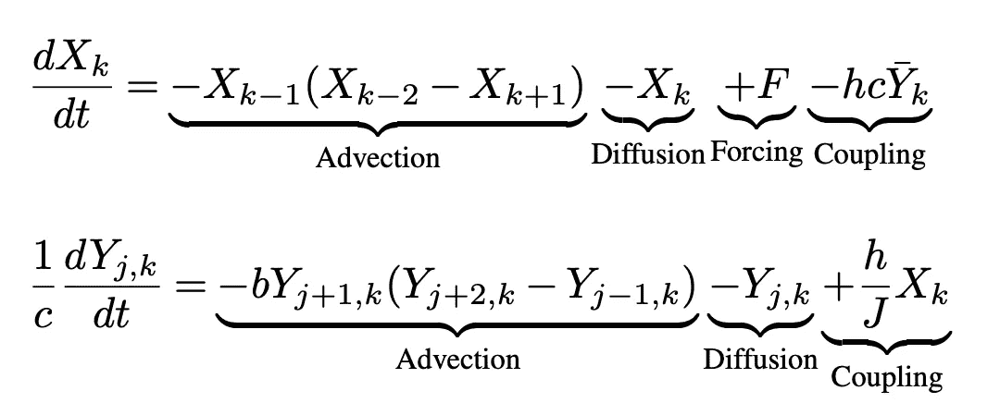
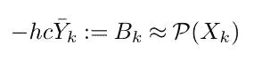
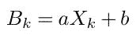
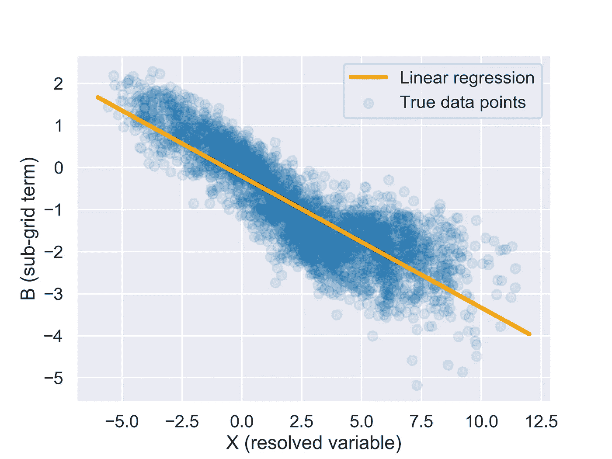
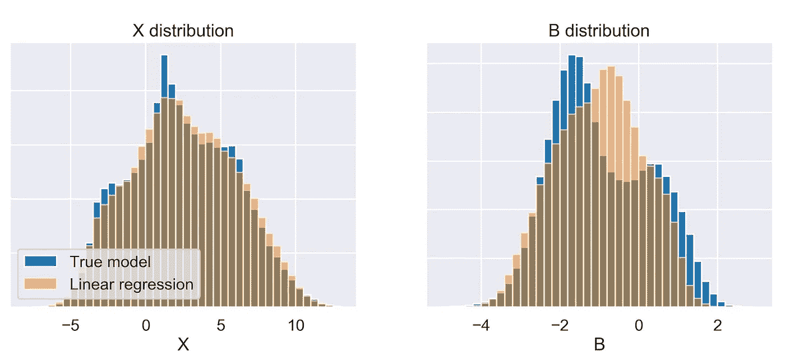
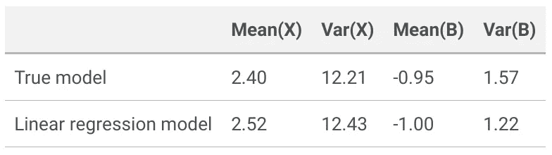
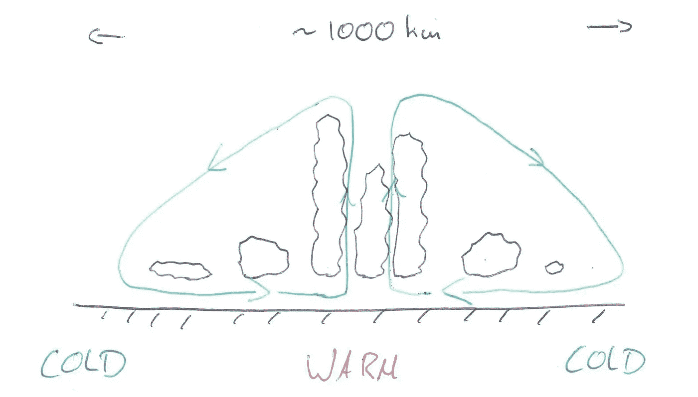

# 洛伦茨 96 太容易了！机器学习研究需要更真实的玩具模型。

> 原文：<https://towardsdatascience.com/lorenz-96-is-too-easy-machine-learning-research-needs-a-more-realistic-toy-model-6add938f6cc0?source=collection_archive---------20----------------------->

*点击* [*这里*](https://mybinder.org/v2/gh/raspstephan/L96-Visualization/master?filepath=L96-visualization.ipynb) *会打开一个互动笔记本，你可以在里面重现本帖中的所有可视化效果和结果。*

埃德·洛伦茨是一个天才，他提出了简单的模型，在一个复杂得多的系统中抓住了问题的本质。他从 1963 年开始的著名蝴蝶[模型启动了混沌研究，随后是更复杂的模型来描述高档误差增长(](https://doi.org/10.1175/1520-0469(1963)020<0130:DNF>2.0.CO;2) [1969](https://doi.org/10.1111/j.2153-3490.1969.tb00444.x) )和大气环流( [1984](https://doi.org/10.1111/j.1600-0870.1984.tb00230.x) )。1995 年，他创造了另一种[混沌模式](http://eaps4.mit.edu/research/Lorenz/Predicability_a_Problem_2006.pdf)，这将是这篇博文的主题。令人困惑的是，尽管最初的论文出现在 1995 年，但大多数人将该模型称为 Lorenz 96 (L96)模型，我们在这里也将这样做。

# **洛伦茨 96 型**

先简单介绍一下车型。在这里，我将使用来自 Schneider et al .[2017](https://doi.org/10.1002/2017GL076101)的符号。在其最简单的版本中，该模型由 K (k=1，…，K)个周期系统描述:

右边的第一项是平流项，而第二项代表阻尼。f 代表外部强制项，设置为 10。因为这是一个周期系统，我们可以用圆形图来形象化它的演变:

对于参数估计或参数化研究，最常见的是使用 L96 模型的两级版本。为此，我们加上另一个周期变量 Y，它有自己的一组常微分方程。X 和 Y 电极通过耦合项连接，耦合项是下面两个方程中的最后一项。每个 X 有 J 个与之相关的 Y 个变量。

同样，我们可以通过可视化来更好地理解正在发生的事情。

# **为什么 L96 车型太容易**

L96 模式自提出以来，已被广泛应用于资料同化和参数化研究。最近，L96 车型经历了一次复兴，以测试驱动用于[参数学习](https://doi.org/10.1002/2017GL076101)或[子网格参数化](https://github.com/djgagne/lorenz_gan)的机器学习算法。事实上，我自己最近也发表了一篇[论文](http://arxiv.org/abs/1907.01351)，其中我展示了一个使用 L96 模型的在线学习算法。

但是 L96 有一个很大的问题:它太简单了！我这么说是什么意思？让我们看一个 L96 模型的经典用例，参数化研究。与真实的大气或海洋类似，X 代表已解决的慢速变量，而 Y 代表未解决的快速变量。本质上，任务是建立一个参数化，通过替换 X 方程中的最后一项来表示快速变量对 X 的影响，为方便起见，我们称之为 B。

假设我们忽略了空间和时间的相关性，只把 B_k 建模为 X_k 的局部函数。

我们可以建立的最简单的参数化是线性回归:

以下是真实数据点和线性回归的样子:

现在让我们使用简单的线性回归参数化，将其插入 L96 模型并对 100 个无量纲时间单位进行积分。以下是 X 和 B 的统计结果:

当然，它们并不完全相同，但是 X 直方图中的差异已经非常小了。我们可以进一步计算一些统计数据，如真实模型和参数化模型的 X 和 B 的平均值和可变性。

相对差异真的很小。这意味着简单的线性回归基本上解决了 L96 参数化问题。当然，你可以改进这个简单的基线，但是我们没有遇到困扰真实大气或海洋模型中最大似然参数化研究的任何问题。

# **需要更逼真的玩具模型**

参数化子网格过程是气候建模的巨大挑战。现代机器学习方法可能是取得真正进展的一种方式。在过去的两年里，最初的研究(这里的[或者这里的](https://doi.org/10.1073/pnas.1810286115)或者[或者这里的](http://doi.wiley.com/10.1029/2018GL078510)或者[已经证明了建立一个 ML 参数化通常是可行的。但是，正如我在最近关于在线学习的论文](http://doi.wiley.com/10.1029/2018MS001351)中总结的那样，在最大似然参数化能够真正改善天气和气候预测之前，还有几个基本障碍需要克服。稳定性、物理一致性和调谐只是其中的一部分。

为了解决这些问题，我们需要尝试一系列新方法。L96 可以是一个很好的起点，以确保算法的工作。但是如果真的发生了呢？因为 L96 没有表现出首先需要更复杂的方法的任何问题，L96 中的工作实现没有给出该方法是否也适用于全复杂性模型的更多证据。

那么，为什么不马上在一个完全复杂的模型中实现这个算法呢？问题是目前的大气和海洋模型带有巨大的技术包袱。它们通常是用成千上万行支持 MPI 的 Fortran 语言编写的。这使得快速测试一个新方法基本上不可能。即使实现一个用 Python 训练的简单神经网络目前也是一个挑战。Fortran-Python 接口是可能的，但不是特别用户友好和快速。更复杂的方法，如在线学习、强化学习或集合参数估计，将需要对模型进行更复杂的改变。最后，全复杂性模型，特别是如果需要高分辨率的模拟，在计算上是昂贵的，这使得快速实验非常困难。

所有这些挑战都迫切需要 L96 和全复杂性模型之间的中间步骤。

# **中间复杂度模型的属性**

那么这个中级复杂度模型应该是什么样子的呢？以下是一些要求:

*   多尺度:因为我们正在寻找建立一个子网格参数化，我们需要一个系统，我们可以分为解决和未解决的过程。理想情况下，它是一个连续的系统，所以我们可以模拟粗粒化的额外挑战。
*   一个主要的运动方向:在大气和海洋中，垂直运动与水平运动非常不同。这就是参数化通常作用于列的原因。在玩具模型中反映这一点会很有帮助。
*   复杂到足以展示实际问题:ML 参数化研究的头两年揭示了以下关键问题。一个好的玩具模型应该模拟其中的大部分。
*   ____ 稳定性:耦合/在线模拟通常是不稳定的。
*   ____ 偏差:即使离线(非耦合)验证表明 ML 参数化准确地再现了亚网格效应，在线运行也经常显示偏差或漂移。
*   ____ 物理一致性:在真实的地球系统中，能量和其他属性守恒是至关重要的。(最近由 Tom Beucler 领导的一篇论文展示了如何在神经网络训练期间做到这一点。)应该可以写下某些守恒性质。
*   ____ 推广到看不见的气候:ML 参数化到目前为止还不能在它们的训练范围之外进行外推。这意味着人们应该能够通过外部强制来改变模型的基本状态。
*   ____ 随机性:到目前为止，大多数 ML 参数化都是确定性的，这意味着真实的混沌系统的某些可变性是缺失的。因此，模型也应该是混沌的。
*   易于理解:大部分可用模型(如 LES 或 CRMs)的一个问题是，它们试图尽可能好地表示大气，这导致了复杂的数值方法和物理方程。我们正在寻找的中等复杂程度的模型不需要精确地代表真实世界。简单更重要。这适用于基本方程和数值方法。
*   快速运行:一些提出的方法需要许多模型运行，通常是在一个集合中。中等复杂度的模型应该足够快，最多在几分钟内运行一次预测。
*   易于使用:这绝对是关键。该模型必须有一个 Python 接口，以兼容最常用的 ML 库。人们还应该能够在 Jupyter 笔记本中交互式地运行模型，即一次执行一个步骤并查看字段。

我不是流体建模专家，所以我在这里寻求帮助。满足所有(大部分)这些要求的一组好的方程是什么？它可能是一个非常接近真实大气/海洋方程(即纳维尔-斯托克斯方程)的系统，或者是具有类似特征的完全不同的系统。

我相信新方法的快速测试绝对是 ML 参数化研究进展的关键。目前，我们(或者至少我是)被 L96 等过于简单的模型和完全复杂的模型之间的差距所阻碍。

# **PS:我的建议**

这是我的一个非常模糊的想法:一个 2D 云解析模型，尽可能使用最简单的方程。正如超级参数化和其他早期对流研究显示的那样，二维 CRMs 捕捉到了真实对流的大部分本质。当然，2D 模型比 3D 模型要快得多。

这个模型的基础可以是滞弹性运动方程。微观物理学方案可以是简单的饱和度调整方案，只有一种水文凝结物物种(液体)在某一阈值以上降雨。湍流可以用一阶局部 K-闭包来建模。表面将有一个恒定的温度，并通过一个简单的体积方案与空气相互作用。辐射只能通过在自由大气中的持续冷却来表现。

有了这个模型，就有可能运行一个辐射对流平衡的设置。但是，为了使它更有趣，并涉及一些大规模的动态，人们可以想象一个像这个粗糙的图纸显示的设置。

在这里，我们基本上有一个平坦的，周期性的微型世界，具有冷-暖梯度，这将导致一个大规模的循环单元，在暖池上方有深度对流(对吗？).可以想象一个有 250 根 4 千米宽的柱子，30 层的系统。从计算的角度来看，这应该是可以管理的。

这种设置是否可行，能否重现上述关键挑战？确切的方程式应该是什么？