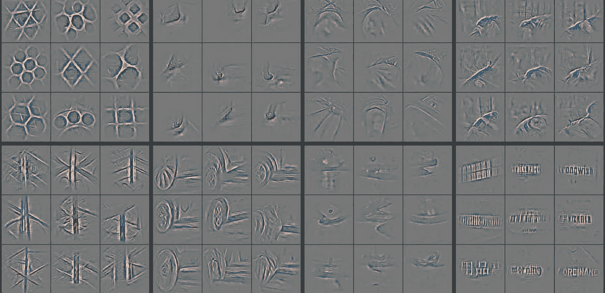
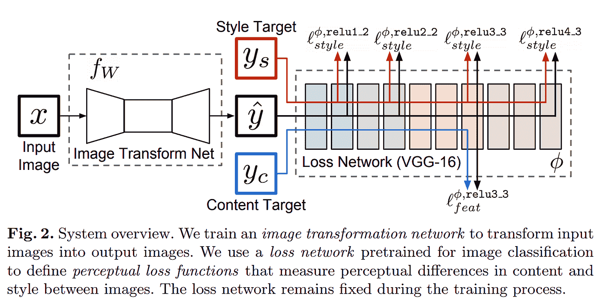
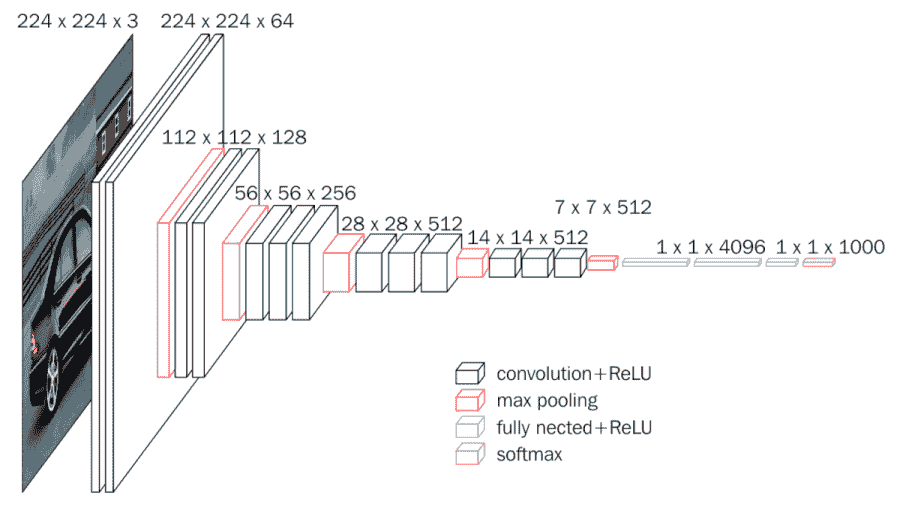
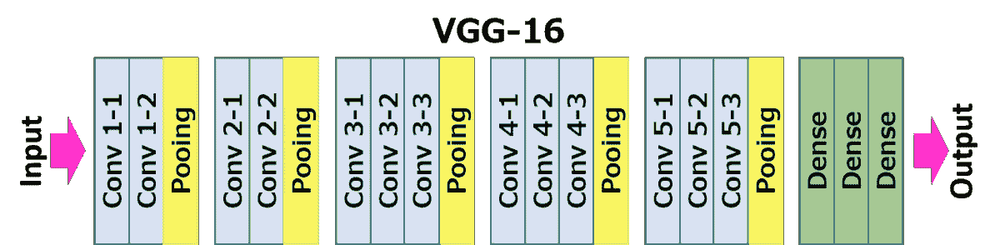
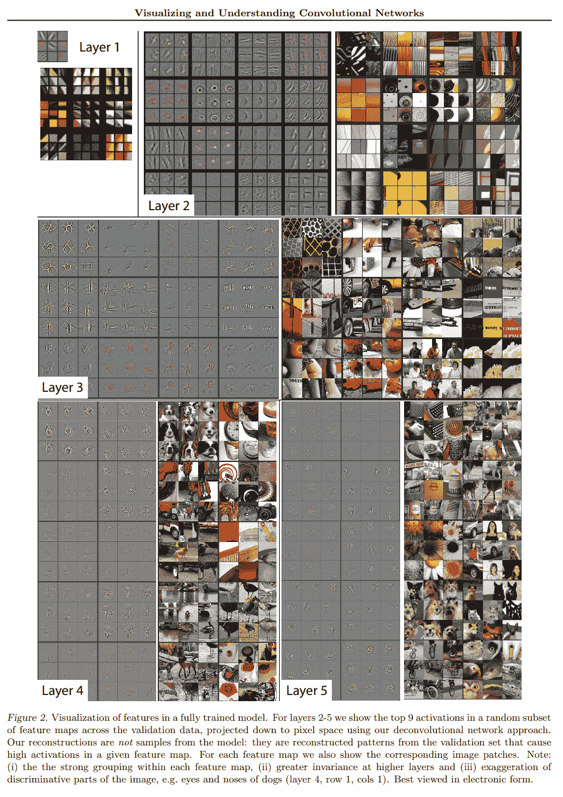
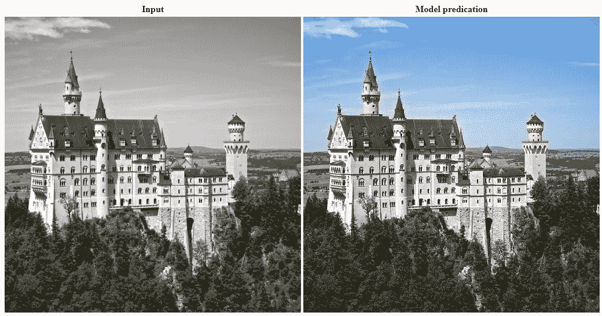

# 基于特征激活和风格损失的损失函数。

> 原文：<https://towardsdatascience.com/loss-functions-based-on-feature-activation-and-style-loss-2f0b72fd32a9?source=collection_archive---------9----------------------->

Feature activations in Convolutional Neural Networks. Source: [https://arxiv.org/pdf/1311.2901.pdf](https://arxiv.org/pdf/1311.2901.pdf)

使用这些技术的损失函数可以在基于 U-Net 的模型架构的训练期间使用，并且可以应用于正在生成图像作为其预测/输出的其他卷积神经网络的训练。

我已经将这一点从我关于超分辨率的文章中分离出来([https://towards data science . com/deep-learning-based-Super-Resolution-without-use-a-gan-11 C9 bb 5b 6 CD 5](/deep-learning-based-super-resolution-without-using-a-gan-11c9bb5b6cd5))，以更加通用，因为我在其他基于 U-Net 的模型上使用类似的损失函数对图像数据进行预测。将此分开，便于参考，也便于理解我的其他文章。

这是基于 Fastai 深度学习课程中演示和教授的技术。

该损失函数部分基于论文《实时风格传输和超分辨率的损失》中的研究以及 Fastai 课程(v3)中所示的改进。

本文重点研究特征损失(文中称为感知损失)。这项研究没有使用 U-Net 架构，因为当时机器学习社区还不知道它们。

Source: Convolutional Neural Network (CNN) Perceptual Losses for Real-Time Style Transfer and Super-Resolution: [https://arxiv.org/abs/1603.08155](https://arxiv.org/abs/1603.08155)

所使用的损失函数类似于论文中的损失函数，使用 VGG-16，但是也结合了像素均方误差损失和 gram 矩阵风格损失。Fastai 团队发现这非常有效。

## VGG-16

VGG 是 2014 年设计的另一种卷积神经网络(CNN)架构，16 层版本用于训练该模型的损失函数。

VGG-16 Network Architecture. Source: [https://neurohive.io/wp-content/uploads/2018/11/vgg16-1-e1542731207177.png](https://neurohive.io/wp-content/uploads/2018/11/vgg16-1-e1542731207177.png)

VGG 模式。在 ImageNet 上预先训练的网络用于评估发电机模型的损耗。通常这将被用作分类器来告诉你图像是什么，例如这是一个人，一只狗还是一只猫。

VGG 模型的头部是最后几层，在上图中显示为全连接和 softmax。该头部被忽略，损失函数使用网络主干中的中间激活，其代表特征检测。

Different layers in VGG-16\. Source: [https://neurohive.io/wp-content/uploads/2018/11/vgg16.png](https://neurohive.io/wp-content/uploads/2018/11/vgg16.png)

这些激活可以通过查看 VGG 模型找到所有的最大池层。这些是检测网格大小变化和特征的地方。

下图显示了各种图像的图层激活热图。这显示了在网络的不同层中检测到的各种特征的例子。

Visualisation of feature activations in CNNs. Source: page 4 of [https://arxiv.org/pdf/1311.2901.pdf](https://arxiv.org/pdf/1311.2901.pdf)

基于 VGG 模型的激活，模型的训练可以使用这个损失函数。损失函数在整个训练过程中保持固定，不像 GAN 的关键部分。

## 特征损失

特征图有 256 个 28×28 的通道，用于检测毛发、眼球、翅膀和类型材料等特征以及许多其他类型的特征。使用基本损失的均方误差或最小绝对误差(L1)误差来比较(目标)原始图像和生成图像在同一层的激活。这些是特征损失。该误差函数使用 L1 误差。

这使得损失函数能够了解目标地面真实影像中的特征，并评估模型预测的特征与这些特征的匹配程度，而不仅仅是比较像素差异。这允许用该损失函数训练的模型在生成/预测的特征和输出中产生更精细的细节。

## 格拉姆矩阵风格损失

gram 矩阵定义了关于特定内容的样式。通过计算目标/地面真实图像中每个特征激活的 gram 矩阵，允许定义该特征的风格。如果从预测的激活中计算出相同的 gram 矩阵，则可以比较这两者来计算特征预测的风格与目标/地面真实图像的接近程度。

gram 矩阵是每个激活和激活矩阵的转置的矩阵乘法。

这使得模型能够学习并生成图像的预测，这些图像的特征在其风格和上下文中看起来是正确的，最终结果看起来更有说服力，并且看起来与目标/背景真相更接近或相同。

## 用此损失函数训练的模型的预测

使用基于这些技术的损失函数从训练模型生成的预测具有令人信服的细节和风格。风格和细节可能是预测精细像素细节或预测正确颜色的图像质量的不同方面。

用基于这种技术的损失函数训练的模型的两个例子，显示了用这种特征和风格损失函数训练的模型是多么有效:

来自我的超分辨率实验:[https://towardsdatascience . com/deep-learning-based-super-resolution-without-use-a-gan-11 c 9 bb 5b 6 CD 5](/deep-learning-based-super-resolution-without-using-a-gan-11c9bb5b6cd5)

Super resolution on an image from the Div2K validation dataset

根据我的着色实验，文章发表时会添加一个链接:

Enhancement of a Greyscale 1 channel image to a 3 channel colour image.

# 法斯泰

感谢 Fastai 团队，没有你们的课程和软件库，我怀疑我是否能够学习这些技术。