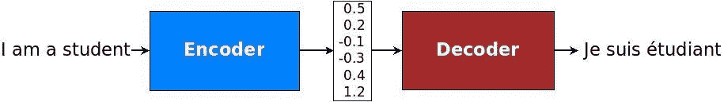
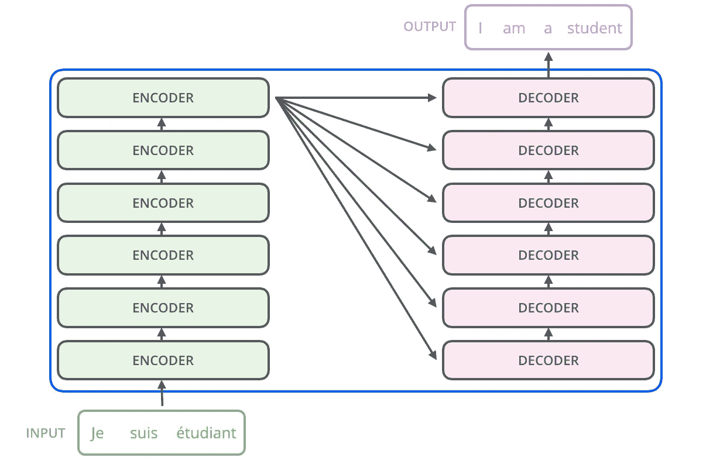
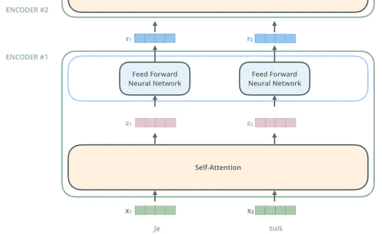
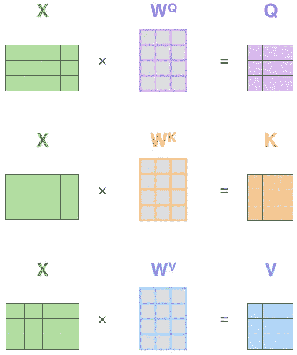
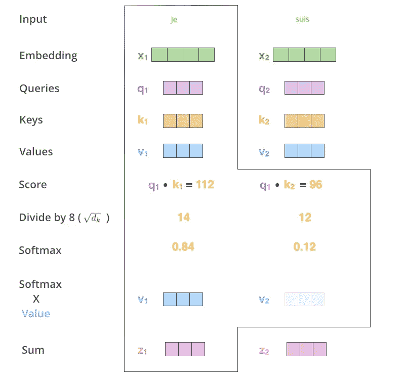
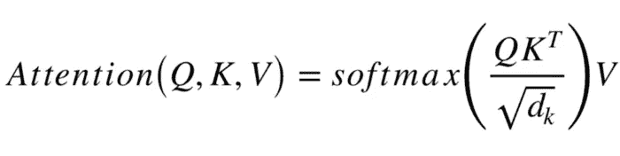
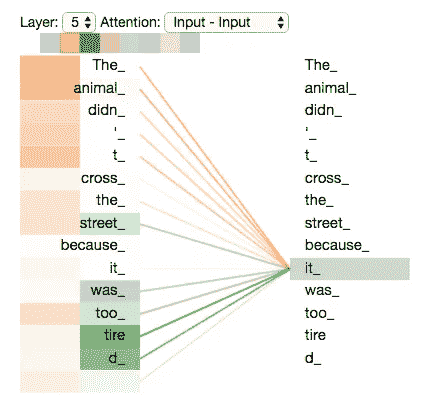
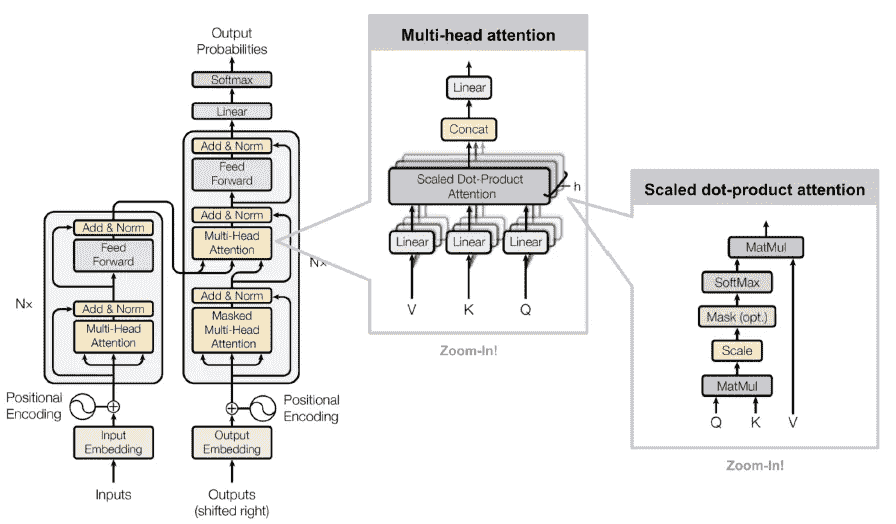
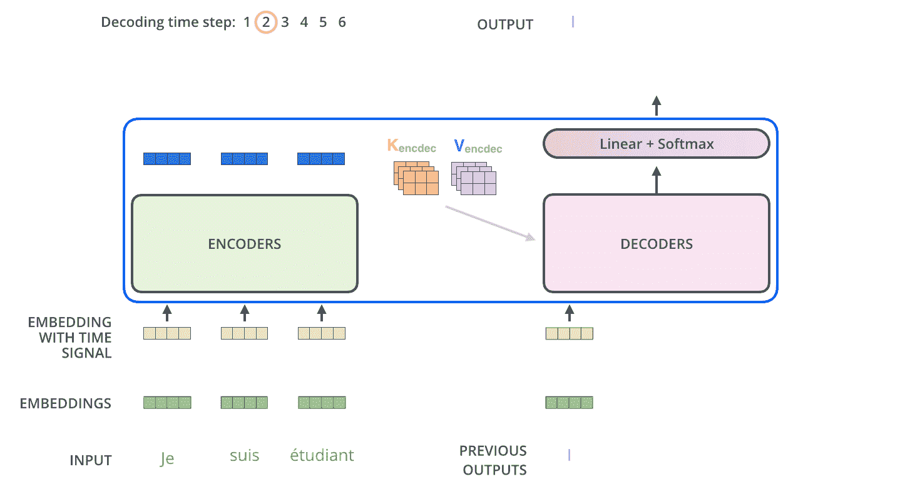

# 迷失在翻译中。被变形金刚发现。伯特解释道。

> 原文：<https://towardsdatascience.com/lost-in-translation-found-by-transformer-46a16bf6418f?source=collection_archive---------4----------------------->

## 打造下一个聊天机器人？伯特，GPT-2:解决变压器模型的奥秘。

通过这篇文章，你将了解为什么有可能产生假新闻。基于 Transformer 的语言模型，如 OpenAI 的 [GPT-2，最近已经使计算机能够对他们选择的主题生成现实而连贯的延续。应用可以在](https://openai.com/blog/better-language-models/)[人工智能写作助手、对话代理](https://www.technologyreview.com/s/614143/nvidia-just-made-it-easier-to-build-smarter-chatbots-and-slicker-fake-news/)、语音识别系统中找到。基于变形金刚的模型在[产生误导性新闻](https://papers.ssrn.com/sol3/papers.cfm?abstract_id=3213954)方面也很成功，在网上假冒他人，创建虚假内容发布在社交媒体上，扩大网络钓鱼内容的生产。令人惊讶的是，同样的基于变压器的方法也可以用来检测虚假内容。

source: Hendrik Strobelt and Sebastian Gehrmann

Transformer 是 Vaswani 等人在论文[Attention is All You needle](https://arxiv.org/abs/1706.03762)中提出的一种机器学习模型。由于并行化，它在特定任务中的表现优于谷歌神经机器翻译模型，这与序列到序列模型的顺序性质相反。

为了理解 Transformer 是如何工作的，我们来看看它是如何执行机器翻译的。

# 再见 LSTM 和 GRU？

当序列到序列模型由 [Sutskever 等人，2014](https://papers.nips.cc/paper/5346-sequence-to-sequence-learning-with-neural-networks.pdf) ， [Cho 等人，2014](http://emnlp2014.org/papers/pdf/EMNLP2014179.pdf) 发明时，机器翻译的质量有了量子跳跃。我们最近写了序列对序列模型的工作。

 [## 基于序列对序列模型的自然语言理解

### 如何预测客户询问背后的意图？Seq2Seq 型号说明。在 ATIS 数据集上演示的槽填充…

towardsdatascience.com](/natural-language-understanding-with-sequence-to-sequence-models-e87d41ad258b) 

由于序列到序列的方法，我们第一次能够将源文本编码到内部固定长度的上下文向量中。一旦编码，不同的解码系统可以用来翻译成不同的语言。

[source](https://github.com/tensorflow/nmt)

序列到序列模型通常通过注意机制连接编码器和解码器来增强，正如我们在之前的文章中所展示的。

 [## NLU 任务注意机制实用指南

### 测试动手策略以解决注意力问题，从而改进序列到序列模型

towardsdatascience.com](/practical-guide-to-attention-mechanism-for-nlu-tasks-ccc47be8d500) 

Transformer 是一种不同的架构，用于在编码器和解码器这两个部分的帮助下将一个序列转换为另一个序列。然而，它超越了自 2014 年以来统治机器翻译世界的序列对序列范式。

> 变形金刚完全建立在注意力机制上。也就是说，这并不意味着任何循环网络:注意力是你所需要的。

# 变压器架构

原始论文建议将编码组件作为六个编码器和六个解码器的堆栈，如下所示。所有六个编码器都是相同的，但是它们不共享重量。这同样适用于六个解码器。

(source: [Jay. Alammar](https://jalammar.github.io/illustrated-transformer/), 2018)

每个编码器有两层:一个**自关注**层和一个**前馈**层。正如我们所见，没有使用循环层。给定一个输入单词(其嵌入，建议大小为 512)，自我关注层查看输入句子中的其他单词，以寻找有助于对该单词进行更好编码的线索。为了更好地掌握这一机制，您可能想体验一下 Tensor2Tensor 笔记本中的动画。

adapted from (source: [Jay. Alammar](https://jalammar.github.io/illustrated-transformer/), 2018)

# 自我关注不是利己主义

Transformer 使用 64 维向量计算自我关注度。对于每个输入单词，有一个查询向量 *q* ，一个关键向量 *k* ，以及一个值向量 *v，*被维护。将所有这些放在一起，他们构建了矩阵 ***Q*** ， ***K*** 和 ***V*** 。这些矩阵通过将输入单词 ***X*** 的嵌入乘以三个矩阵***【Wq】******Wk******Wv***来创建，这三个矩阵在训练过程中被初始化和学习。

在下图中， *X* 有 3 行，每行代表输入句子“je suis étudiant”中的一个单词。通过填充，矩阵 *X* 将被扩展到 512。为了说明的目的，每个单词通过四维嵌入来编码。最初的变形金刚使用 512 维嵌入。在我们的例子中， *W* 矩阵应该具有形状(4，3)，其中 4 是嵌入维度，3 是自我关注维度。原变压器用 64。因此 *Q，K，V* 是(3，3)-矩阵，其中第一个 3 对应于字数，第二个 3 对应于自我注意维度。

adapted from (source: [Jay. Alammar](https://jalammar.github.io/illustrated-transformer/), 2018)

## 那么，我们如何计算自我关注度呢？

现在让我们假设在这些向量中有一些值。我们需要根据当前输入单词对输入句子的每个单词进行评分。让我们给单词“je”打分，它在法语中是“I”的意思。分数决定了对输入句子“je suis étudiant”的其他部分“suis”和“étudiant”的关注程度。

分数就是查询向量 *q_1* 与单词“je”的关键向量 *k_1* 的点积。这在下面的示例中给出了 112。我们对第二个单词“suis”做同样的操作，得到它的分数 96。我们也对最后一个单词“étudiant”这样做。

Transformer 的作者发现，当我们将分数除以关键向量的维数的平方根(sqrt 为 64，即 8)时，这会导致更稳定的梯度。

结果通过 softmax 操作进行标准化，使分数都为正，加起来等于 1 (0.84 表示“je”，0.12 表示“suis”，0.04 表示“étudiant”)。显然“suis”这个词比“étudiant”这个词与“je”更相关。现在，我们可以通过将每个值向量乘以 softmax 分数来淹没不相关的词，如“étudiant”，并减少对“suis”的关注。

自我关注层对于“je”的输出*Z1*最终通过对加权值向量求和得到。产生的向量被发送到前馈神经网络。

adapted from (source: [Jay. Alammar](https://jalammar.github.io/illustrated-transformer/), 2018)

这种自我注意的计算以矩阵的形式对序列中的每个单词重复进行，速度非常快。 ***Q*** 是包含序列中所有单词的所有查询向量的矩阵， ***K*** 是键的矩阵， ***V*** 是所有值的矩阵。

自我关注的整个计算过程将在下面很好地呈现。

## 多头注意力

现在，我们知道如何计算自我关注。你可能已经注意到，注意力会一遍又一遍地被吸引到同一个单词上。这就像那个受到老板所有关注的同事。如果我们重新洗牌以避免偏见的关注。想象一下，我们有更多的那些****Wk******Wv***矩阵，它们被用来计算 *Q，K* 和 *V* 矩阵，这些矩阵被进一步用来计算所有单词的自我关注度。我们回忆一下，*Wq* ， *Wk* ， *Wv* 都是在训练中学会的。因此，如果我们有多个这样的矩阵，我们可以克隆自我注意计算，每次都会导致我们的文本的不同视图。因此，我们将输入嵌入投影到不同的表示子空间中。例如，如果我们用 8 个不同的 *Wq* 、 *Wk* 、 *Wv* 权重矩阵做同样的自我关注计算，我们最终得到 8 个不同的 ***Z*** 矩阵。事实上，这正是《变形金刚》的作者所做的。他们将所有八个 *Z* 矩阵串联起来，然后将得到的巨大矩阵乘以一个附加的权重矩阵 ***Wo*** 。*

*结果是惊人的。下面，我们来看一个来自 [Tensor2Tensor 笔记本](https://colab.research.google.com/github/tensorflow/tensor2tensor/blob/master/tensor2tensor/notebooks/hello_t2t.ipynb)的图形示例。它包含一个动画，显示了 8 个注意力头在 6 个编码器层中的每一层中观察的位置。下图显示了对单词“it”进行编码时，第 5 层中的两个注意头。显然，“它”根据橙色的注意头指的是“动物”，根据绿色的更多的是指“累”。因此，“它”的模型表征包括“动物”和“疲倦”的表征。*

**

# *编码*

*Transformer 的编码部分做了额外的神奇的事情，我们在这里只做介绍。*

## ***位置信息***

*学习每个单词的位置或单词之间的距离可以提高翻译质量，特别是对于像德语这样的语言，动词经常出现在句子的末尾。Transformer 生成并学习一个特殊的**位置向量**，该向量在输入到第一个编码器层之前被添加到输入嵌入中。*

## ***残差***

*在每个编码器内，自关注层输出的 *Z* 经过使用输入嵌入的 [**层归一化**](https://arxiv.org/abs/1607.06450) (添加位置向量后)。它具有与批量规范化类似的效果，并且减少了训练和推理时间。*

## ***堆叠编码器***

*来自层标准化的 *Z* 输出被馈入前馈层，每个字一个。最后，通过层标准化收集来自前馈层的结果，以产生下一个编码器层的输入表示。这一过程发生在 6 个编码器层的每一层中。变压器的原始完整架构如下所示。*

**

*[Vaswani, et. al. (2017)](http://papers.nips.cc/paper/7181-attention-is-all-you-need.pdf)*

# ***解码***

*在最后一个编码器层产生了 *K* 和 *V* 矩阵之后，解码器可以启动。每个解码器都有一个**编码器-解码器关注层**，用于关注源语言输入序列中的适当位置。编码器-解码器关注层使用来自前一解码器层的查询 *Q* ，以及来自最后一个编码器层的输出的存储键 *K* 和值 *V* 。在第一个解码时间步骤中，在我们的示例中，解码器产生第一个目标单词“I”，作为法语中“je”的翻译。在第二步中，“I”被用作第一解码器层的输入，以及来自编码器的 K，V，以预测第二目标字“am”。在第三解码步骤中，“我是”被用作预测“a”的输入。第四步，用“我是 a”来预测“学生”。最后用“我是学生”来预测“<句尾>”。*

*下面你可以看到一个由 Jay Alammar 创作的精彩动画。他的博客以一种非常有创意和简单的方式解释了 Transformer。写这篇文章时，它启发了我们。检查一下！*

**

# *结论*

*通过对输入进行加权平均来专注于输入的显著部分的简单想法已被证明是 DeepMind [AlphaStar](https://deepmind.com/blog/alphastar-mastering-real-time-strategy-game-starcraft-ii/) 成功的关键因素，该模型击败了顶级职业星际争霸玩家。AlphaStar 的行为是由基于 Transformer 的模型生成的，该模型从原始游戏界面接收输入数据(单位及其属性的列表)。该模型输出一系列指令，这些指令构成游戏中的一个动作。*

*在这篇文章中，我们委婉地解释了变压器如何工作，以及为什么它已经成功地用于序列转导任务。在下一篇文章中，我们将把这种方法应用到处理意图分类的自然语言理解任务中。*

* [## 伯特为假人-一步一步教程

### 变压器 DIY 实用指南。经过实践验证的 PyTorch 代码，用于对 BERT 进行微调的意图分类。

towardsdatascience.com](/bert-for-dummies-step-by-step-tutorial-fb90890ffe03)*