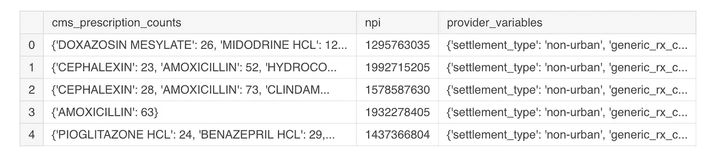
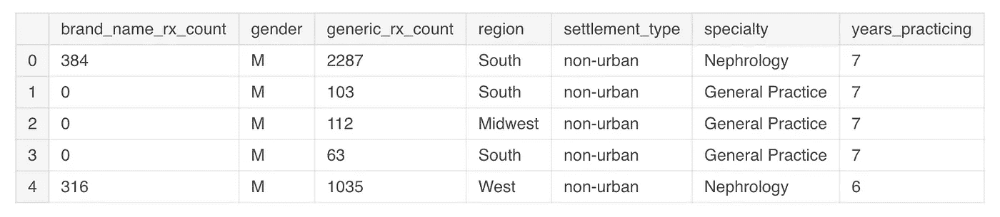
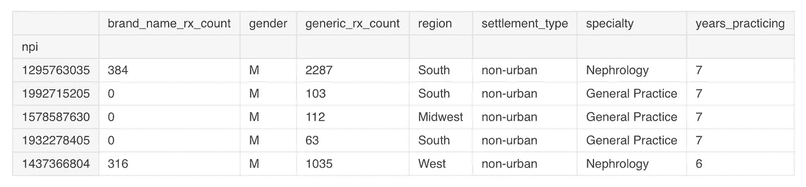

# 为数据科学导入 JSON 文件

> 原文：<https://towardsdatascience.com/lots-of-json-29873d3abfdf?source=collection_archive---------10----------------------->

## 用 Python 操作 JSON 文件的方法


Photo by [Lorenzo Herrera](https://unsplash.com/photos/p0j-mE6mGo4?utm_source=unsplash&utm_medium=referral&utm_content=creditCopyText) on [Unsplash](https://unsplash.com/?utm_source=unsplash&utm_medium=referral&utm_content=creditCopyText)

最近看了一篇[的博文](https://veekaybee.github.io/2019/02/13/data-science-is-different/)，关于 2019 年数据科学家的重要工具。其中一个工具是 JSON……很多 JSON。

在我学习的早期，我在 kaggle 上偶然发现了基于[处方的预测数据集](https://www.kaggle.com/roamresearch/prescriptionbasedprediction)。太完美了。作为一名药学背景的学生，我想探索药物数据。只有一个问题…

> 数据在 JSON 里…

JSON 或 JavaScript Object Notation 是一种“轻量级的数据交换格式…机器很容易解析和生成。”

他们说“对人类来说读和写很容易”。但是，当我第一次将 JSON 文件加载到 dataframe 中时，我会有不同的看法。

在这里，我们将探索一些在数据科学工作流的数据清理和预处理步骤中有用的方法，并希望让您相信 JSON 确实易于人类读写。

# 入门指南

我们可以使用`%%bash` magic 打印我们的文件样本:

```
%%bash 
head ../input/roam_prescription_based_prediction.jsonl{
  "cms_prescription_counts": {
    "CEPHALEXIN": 23, 
    "AMOXICILLIN": 52, 
    "HYDROCODONE-ACETAMINOPHEN": 28},
  "provider_variables": {
    "settlement_type": "non-urban", 
    "generic_rx_count": 103, 
    "specialty": "General Practice", 
    "years_practicing": 7, 
    "gender": "M", 
    "region": "South", 
    "brand_name_rx_count": 0}, 
  "npi": "1992715205"}
```

从这里我们可以看到 JSON 数据看起来像一个 Python 字典。那没那么可怕！

在我们的字典里很容易读懂。使用 pandas read_json 方法的 json 文件:

```
raw_data = pd.read_json("../input/roam_prescription_based_prediction.jsonl",
                        lines=True,
                        orient='columns')

raw_data.head()
```



现在唯一的问题是，我们有嵌套的列值…并且在这一点上不完全可用。让我们探索一些解包这些值的方法。

# 列表理解

列表理解是解开 provider_variables 列中数据的一种简单方法。

```
provider = pd.DataFrame([md for md in df.provider_variables])
```



完美！我们现在有了提供者变量的数据框架！但是我想说，如果没有某种密钥，这些数据不会给我们带来太多好处。让我们将提供商的 npi 编号添加到该数据帧中，并将 NPI 列设置为索引:

```
provider['npi'] = raw_data.npi
provider.set_index('npi', inplace=True)
provider.head()
```



# JSON 正常化

Pandas 的 [json_normalize](https://pandas.pydata.org/pandas-docs/stable/reference/api/pandas.io.json.json_normalize.html) 方法是展平数据的另一个选择:

```
from pandas.io.json import json_normalize
provider = json_normalize(data=raw_data.provider_variables)
provider.head()
```


## 方法效率

因此，我们有两个选项可以产生相同的结果。使用哪种方法更好？

我们可以使用[魔法](https://ipython.readthedocs.io/en/stable/interactive/magics.html)命令`%timeit`来查找每个语句的执行时间:

**列表理解:**

729 毫秒，每循环 8.21 毫秒(平均标准时间戴夫。7 次运行，每次 1 个循环)

**JSON 正常化:**

每循环 4.72 秒 104 毫秒(平均标准偏差。戴夫。7 次运行，每次 1 个循环)

这里我们可以看到列表理解方法执行得更快。

# 结论

在本文中，我们学习了如何用 Python 操作 JSON 数据。我们学习了如何展平嵌套数据并将其转换为数据帧。

我们希望了解到 JSON 文件并没有那么糟糕！