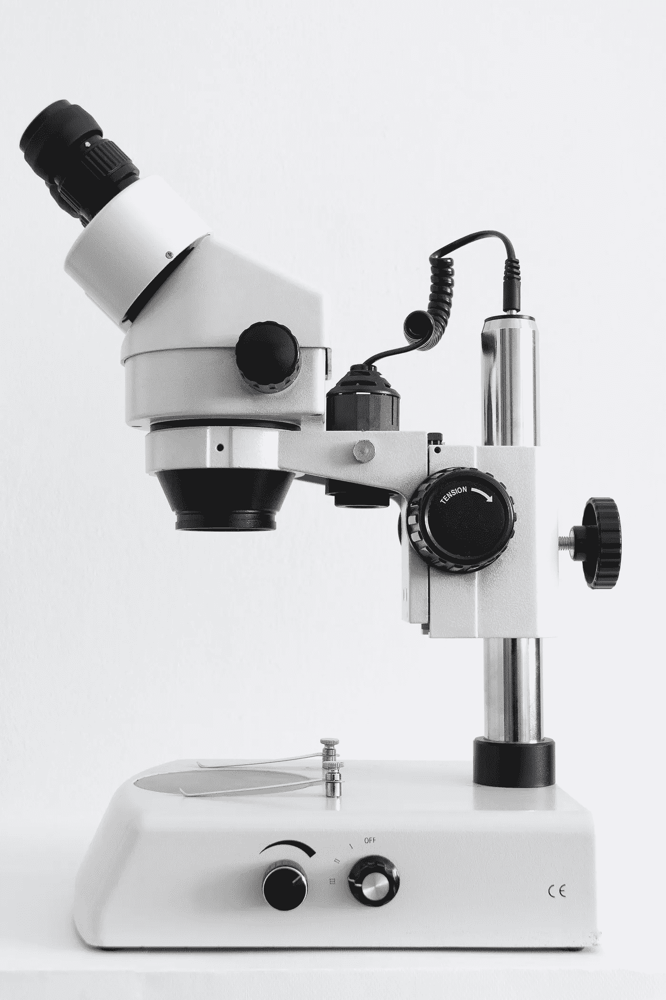
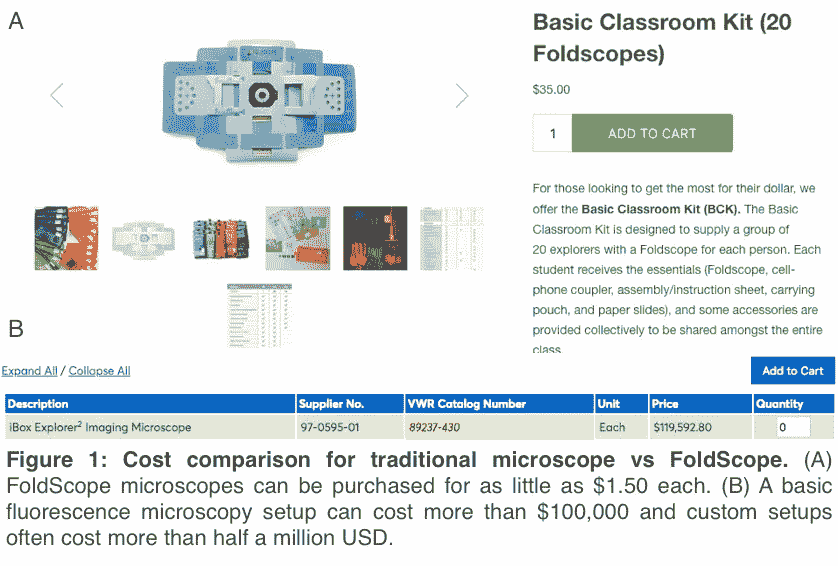
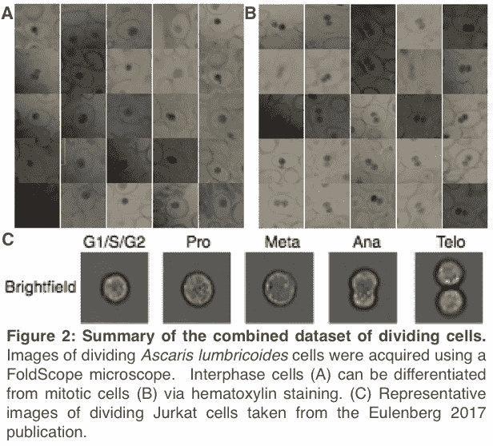
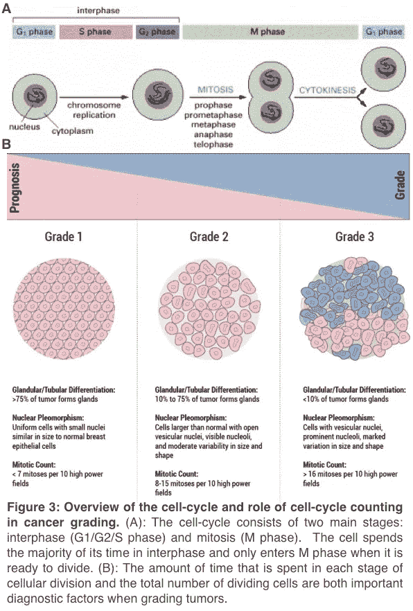
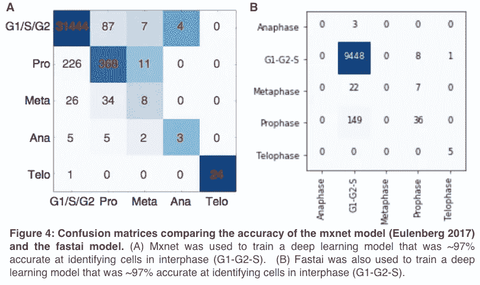

# 面向数据科学家的低成本细胞生物学实验

> 原文：<https://towardsdatascience.com/low-cost-cell-biology-experiments-for-data-scientists-45fab25867b?source=collection_archive---------20----------------------->

## 纸显微镜、公共数据存储库和托管笔记本电脑解决方案



***简介:***

没有昂贵的实验室设备，“公民科学家”能做真正的科学吗？

简而言之:是的。在这篇博文中，我们指出了一种替代的低成本方法来解决生物学问题，这种方法适合有抱负的业余科学家。具体来说，我们强调将低成本成像设备([折叠显微镜](https://www.foldscope.com/))和公共图像数据 [(Kaggle 数据集](https://www.kaggle.com/datasets?utm_medium=blog&utm_source=medium&utm_campaign=mooneyp-medium))与用于执行计算数据分析的免费工具( [Kaggle 内核](https://www.kaggle.com/kernels?utm_medium=blog&utm_source=medium&utm_campaign=mooneyp-medium))相结合的好处。此外，我们提供了一个通用框架，使用这些工具来解决生物科学中的图像分类问题。我们希望这些指导方针鼓励更多的数据科学家发表细胞生物学数据集，并分享他们所学到的东西。

***第一部分:获取图像数据***

高通量和超分辨率显微镜方法对细胞生物学的研究非常有价值[1，2]，但这些技术对许多或大多数研究实验室来说过于昂贵。然而，好消息是像 [FoldScope](https://www.foldscope.com/) 显微镜这样的创新技术可以显著降低研究成本【3】。 [FoldScope](https://www.foldscope.com/) 显微镜实际上是纸显微镜，由一个纸框架和一个高倍物镜组成(图 1)。这些多功能显微镜已被证明能够对传染性病原体进行成像，如恶性疟原虫和埃及血吸虫，并且可以连接到手机的摄像头上。FoldScope 显微镜目前的零售价仅为每台 1.5 美元，其低廉的价格激发了一个活跃的公民科学家社区。

在这项工作中，我们使用 [FoldScope](https://www.foldscope.com/) 显微镜获取了新的细胞图像。我们选择从由[卡罗莱纳生物供应公司](https://www.carolina.com)出售的商业制备的载玻片开始，其中包含正在分裂的*蛔虫*细胞和苏木精染色。使用配备有 500 倍放大镜头和 800 万像素数码相机(iPhone 5)的 [FoldScope](https://www.foldscope.com/) 显微镜获取图像。通过这种方式，我们用最少的投资生成了一个细胞分裂不同阶段的细胞图像数据集。



***第二部分:共享图像数据***

使用 [FoldScope](https://www.foldscope.com/) 显微镜采集 90 张苏木精染色的*蛔虫*子宫中分裂细胞的图像(图 2)。这些[图像](https://www.kaggle.com/paultimothymooney/cell-cycle-experiments/?utm_medium=blog&utm_source=medium&utm_campaign=mooneyp-medium)作为一个公共数据集在 Kaggle 上共享，同时还有一些[起始代码](https://www.kaggle.com/paultimothymooney/interphase-vs-mitosis-classification?utm_medium=blog&utm_source=medium&utm_campaign=mooneyp-medium)演示如何处理这些数据。只有 90 个图像的数据集不可避免地受到限制，并且不会对计算环境提出合适的挑战。因此，我们确定了一个相对较大的 Jurkat 细胞在不同细胞分裂阶段的标记图像数据集[5]，并将其添加到我们的 [Kaggle 数据集](https://www.kaggle.com/paultimothymooney/cell-cycle-experiments/?utm_medium=blog&utm_source=medium&utm_campaign=mooneyp-medium)。有了这个大约 32，000 个细胞图像的补充数据集，我们可以充分测试免费的 [Kaggle 内核](https://www.kaggle.com/kernels?utm_medium=blog&utm_source=medium&utm_campaign=mooneyp-medium)产品执行复杂计算分析的能力。



***第三部分:分析图像数据***

深度学习算法令人兴奋，部分是因为它们有可能自动化生物医学研究任务[6，7]。例如，深度学习算法可用于自动化耗时的手动计数乳腺组织病理学图像中的有丝分裂结构的过程[8，9]。细胞分裂速率的差异和细胞分裂每个阶段所用时间的差异都是健康细胞和癌细胞之间的重要区别[10，11]。同样，癌细胞在细胞分裂过程中经常形成错误的有丝分裂结构，这些错误的结构会导致疾病进一步发展[12，13]。因此，对细胞分裂及其机制的研究导致了许多抗癌药物的开发[14，15]。在这项工作中，我们使用图 2 中的细胞分裂数据集来训练一个深度学习模型，该模型可用于识别分裂细胞图像中的细胞周期阶段(图 3)。



[这里](https://www.kaggle.com/paultimothymooney/interphase-vs-mitosis-classification?utm_medium=blog&utm_source=medium&utm_campaign=mooneyp-medium)我们提出了一种简单的方法，将 [Kaggle 内核](https://www.kaggle.com/kernels?utm_medium=blog&utm_source=medium&utm_campaign=mooneyp-medium)与图 2 中的细胞分裂数据集相结合，以训练一个深度神经网络来识别细胞周期阶段。免费的 [Kaggle 内核](https://www.kaggle.com/kernels?utm_medium=blog&utm_source=medium&utm_campaign=mooneyp-medium)将数据、代码和基于云的计算环境结合在一起，使得工作易于复制。事实上，你可以复制这项工作，你可以在一个相同的基于云的计算环境中运行它，只需按下 Kaggle 网站上的“Fork Kernel”按钮。(关于研究再现性的其他讨论和一套推荐指南可在[这里](http://blog.kaggle.com/2018/09/19/help-i-cant-reproduce-a-machine-learning-project/.)找到)。通过使用 32，266 幅图像的数据集来训练深度神经网络，我们希望我们已经展示了免费的 [Kaggle 内核](https://www.kaggle.com/kernels?utm_medium=blog&utm_source=medium&utm_campaign=mooneyp-medium)环境可以执行与生物医学科学相关的复杂计算分析。

在这种新方法下训练的 ML 模型给出了与原始分析相当的结果(图 4)。有趣的是，这两个模型在识别一些更少观察到的细胞周期阶段方面仍有改进的空间，但这可能通过产生额外的数据来纠正。图 4B 中的[代码是通用的，应该可以很好地处理不同的图像类型和图像类别:T2 fastai。imagedata bunch . from _ folder()](https://www.kaggle.com/paultimothymooney/figure-4-from-low-cost-cell-biology-blog-post?utm_medium=blog&utm_source=medium&utm_campaign=mooneyp-medium)函数可用于加载和处理任何兼容的图像， [fastai.create_cnn()](https://docs.fast.ai/vision.learner.html#create_cnn) 函数可用于自动学习新的模型特征。

```
*# Code to generate Figure 4A:* [https://github.com/theislab/deepflow](https://github.com/theislab/deepflow) *# Code to generate Figure 4B: (below)*from fastai import *
from fastai.vision import *
from fastai.callbacks.hooks import *
import numpy as np; import pandas as pd
import matplotlib; import matplotlib.pyplot as pltimg_dir='../input/'; path=Path(img_dir)
data=ImageDataBunch.from_folder(path, train=".",valid_pct=0.3,                               ds_tfms=get_transforms(do_flip=True,flip_vert=True,max_rotate=90,max_lighting=0.3),size=224,bs=64,num_workers=0).normalize(imagenet_stats)learn=create_cnn(data, models.resnet34, metrics=accuracy, model_dir="/tmp/model/")
learn.fit_one_cycle(10)
interp=ClassificationInterpretation.from_learner(learn)
interp.plot_confusion_matrix(figsize=(10,10), dpi=60)
```



这项工作描述了一个可重用的框架，可以应用于细胞生物学数据集，以解决图像分类问题。讨论的具体图像分类问题是细胞分裂期间细胞周期阶段的自动识别，该方法值得注意是因为设备的低成本以及训练模型的容易程度(使用免费云计算和开源 ML 算法)。想要训练自己的图像分类模型的数据科学家和细胞生物学家可以通过创建自己的 [FoldScope](https://www.foldscope.com/) 图像的[数据集](https://www.kaggle.com/datasets?utm_medium=blog&utm_source=medium&utm_campaign=mooneyp-medium)，将训练数据组织到与每个图像标签对应的文件夹中，然后将相同的数据集附加到包含图 4 中描述的 [Fastai](https://docs.fast.ai/) 代码的[内核](https://www.kaggle.com/kernels?utm_medium=blog&utm_source=medium&utm_campaign=mooneyp-medium)来轻松复制这种方法。我们希望未来的研究人员利用我们共享的[数据集](https://www.kaggle.com/paultimothymooney/cell-cycle-experiments/?utm_medium=blog&utm_source=medium&utm_campaign=mooneyp-medium)和[起始代码](https://www.kaggle.com/paultimothymooney/interphase-vs-mitosis-classification?utm_medium=blog&utm_source=medium&utm_campaign=mooneyp-medium)，以便快速派生、修改和改进我们的模型。

**结论:**

自 17 世纪第一台复合显微镜问世以来，医疗成像和实验室设备的生产和拥有成本一直很高。分析软件要新得多，但在许多情况下同样昂贵。最近，像 1.50 美元[的 FoldScope 显微镜](https://www.foldscope.com/)和 0.00 美元[的 Kaggle 内核](https://www.kaggle.com/kernels?utm_medium=blog&utm_source=medium&utm_campaign=mooneyp-medium)这样的低成本工具已经被开发出来，它们可以以很少的成本执行许多相同的功能。这项工作描述了一个低成本和可重用的框架，可以应用于细胞生物学数据集，以解决图像分类问题。我们希望这些指南将鼓励更多的数据科学家探索和发布细胞生物学数据集，并分享他们的结果和发现。

***作品引用:***

[1] Miller MA，Weissleder R. [单细胞中抗癌药物作用的成像](https://www.ncbi.nlm.nih.gov/pubmed/28642603)。*自然评论癌症*。2017.第 17 卷(7):第 399-414 页。

[2]刘 TL，Upadhyayula S，米尔基，*等*。[观察细胞的自然状态:多细胞生物的亚细胞动力学成像](https://www.ncbi.nlm.nih.gov/pubmed/29674564)。*科学*。2018 第 360 卷(6386)。

[3] Cybulski J，Clements J，Prakash M. [Foldscope:基于折纸术的纸显微镜](https://www.ncbi.nlm.nih.gov/pubmed/24940755)。 *PLoS One* 。2014;第九卷第六期。

[4]伊弗雷姆·R、杜阿赫·E 等[在加纳使用安装在移动电话上的折叠镜和反镜细胞镜诊断埃及血吸虫感染](https://www.ncbi.nlm.nih.gov/pubmed/25918211)。T21 医院。2015.第 92 卷第 6 期:第 1253-1256 页。

[5] Eulenberg P，Kö hler N，等[利用深度学习重建细胞周期和疾病进展。*自然通讯*](https://www.ncbi.nlm.nih.gov/pubmed/28878212) 。2017.第八卷第一期:第 463 页。

[6] Esteva A，Robicquet A，等[医疗保健领域深度学习指南](https://www.nature.com/articles/s41591-018-0316-z)。*自然医学*。2019.第 25 卷:第 24-29 页。

[7]托普，埃里克 J. [高性能医学:人类与人工智能的融合](https://www.ncbi.nlm.nih.gov/pubmed/30617339)。*自然医学*。2019.第一卷:第 44-56 页。

[8]李 C，王 X，刘 W，拉泰基 LJ。[深度有丝分裂:通过深度检测、验证和分割网络进行有丝分裂检测](https://www.ncbi.nlm.nih.gov/pubmed/29455111)。*医学图像分析*。2018.第 45 卷:

[9] Saha M，Chakraborty C，Racoceanu D. [使用乳腺组织病理学图像进行有丝分裂检测的高效深度学习模型](https://www.ncbi.nlm.nih.gov/pubmed/29409716)。*计算医学成像与图形学*。2018.第 64 卷:第 29-40 页。

[10]谢尔·希杰。[癌细胞周期](https://www.ncbi.nlm.nih.gov/pubmed/8939849)。*科学*。1996.第 274 卷(5293):p 1672–7。

[11]维斯康帝 R，莫尼卡路，格列科 D. [癌症中的细胞周期检查点:一把治疗靶向的双刃剑](https://www.ncbi.nlm.nih.gov/pmc/articles/PMC5037895/)。*2016 年临床癌症研究杂志*。第 35 卷:153 页。

[12]米卢诺维奇-耶夫蒂奇、穆尼·P .、*等人*。[中心体聚集导致染色体不稳定和癌症](https://www.ncbi.nlm.nih.gov/pubmed/27046071)。*当前生物技术观点*。2016 年第 40 卷:p113–118。

[13]巴克豪姆·SF，坎特利·LC。[染色体不稳定性在癌症及其微环境中的多方面作用](https://www.ncbi.nlm.nih.gov/pubmed/30193109) t. *细胞*。2018 卷 174(6):p 1347–1360。

[14]弗洛里安·S·米切尔森[抗微管药物](https://www.ncbi.nlm.nih.gov/pubmed/27193863)。*分子生物学方法。* 2016 第 1413 卷:p403–411。

[15]斯坦梅茨·莫，普罗塔·艾。[微管靶向剂:劫持细胞骨架的策略](https://www.ncbi.nlm.nih.gov/pubmed/29871823)。*细胞生物学趋势。* 2018 年第 28 卷第 10 期:p776–792。

[16]图 3A 中的[图 3A 中的](https://www.ncbi.nlm.nih.gov/books/NBK21065/figure/A3332/?report=objectonly)、[图 3B 中的](https://pathology.jhu.edu/breast/my-results/staging-grade)以及[封面照片中的](https://unsplash.com/photos/JdtUKqGdqw8)的图片来源可以在各自的超链接中找到。