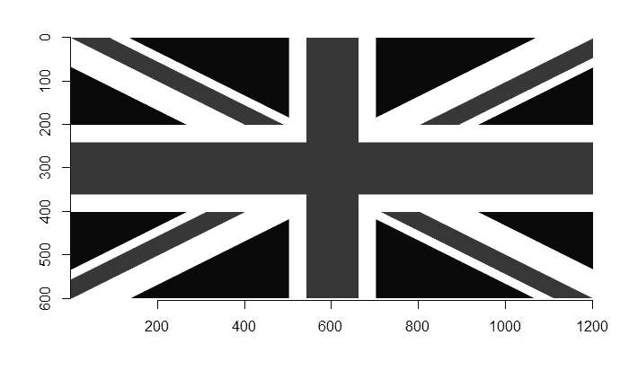
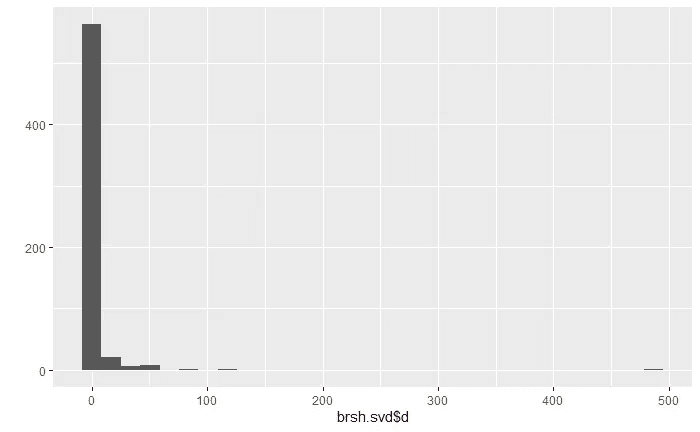
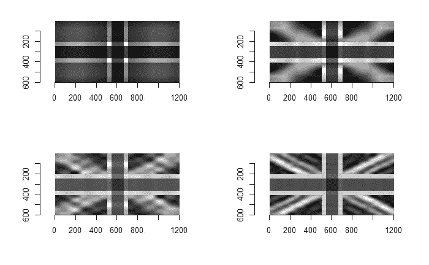
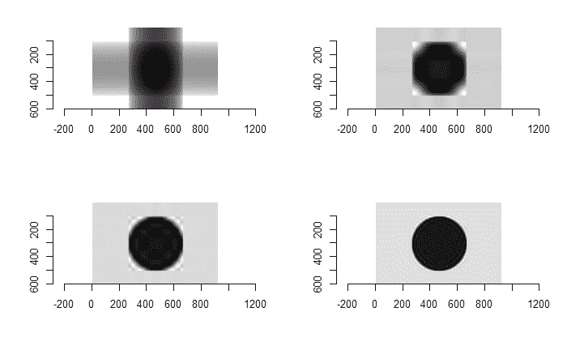
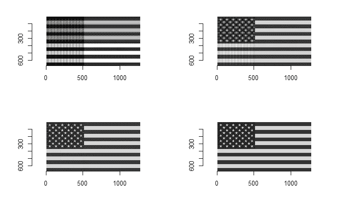

# 标志的低秩近似

> 原文：<https://towardsdatascience.com/low-rank-approximation-for-flags-316cb19f7aba?source=collection_archive---------25----------------------->

## 这个世界充满了低秩矩阵，我们可以对它们进行低秩近似。

这篇文章的灵感来自亚历克斯·汤森关于快速递减奇异值的精彩演讲，可以在[这里](https://youtu.be/9BYsNpTCZGg)找到。


Photo by [Farzad Mohsenvand](https://unsplash.com/@farzadme?utm_source=medium&utm_medium=referral) on [Unsplash](https://unsplash.com?utm_source=medium&utm_medium=referral)

在讲座中，汤森教授用不同国家的国旗作为低秩矩阵的例子。然而，没有关于低秩矩阵在多大程度上逼近原始标志的直观图示。

对于我们的分析，我们将从快速复习低秩近似的含义开始，然后将进行标志的实际分析。

下面的分析我就用 R。近似的基本思想就是分解。我们把它分成小块，然后重新组装，但不包括小块。

假设我们有一个矩阵 **A** ，分解矩阵的一个常用方法是使用所谓的奇异值分解。幸运的是，R 基为我们提供了这个函数。

```
A = matrix(c(4,7,-1,8,-5,-2,4,2,-1,3,-3,6), nrow = 4)
```

矩阵看起来会像这样:

```
 [,1] [,2] [,3]
[1,]    4   -5   -1
[2,]    7   -2    3
[3,]   -1    4   -3
[4,]    8    2    6
```

以下代码显示了奇异值分解的作用，即任何矩阵都可以写成一个正交矩阵、一个对角矩阵和另一个正交矩阵的乘积。

```
A.svd <- svd(A) # decompose A and save result to A.svdA.svd$u %*% diag(A.svd$d) %*% t(A.svd$v) #this line will reproduce A
```

需要注意的一点是，上述关系可以改写为秩 1 矩阵的和。这构成了低秩近似的基础，我们将用 flags 来进一步研究它。下面的代码显示，我们可以用三个秩为 1 的矩阵的和来恢复矩阵。

```
# for cleaner code, extract three components
u <- A.svd$u
v <- A.svd$v
d <- A.svd$dA.restored <- d[1]*u[, 1] %*% t(v[, 1]) + 
              d[2]*u[, 2] %*% t(v[, 2]) + 
              d[3]*u[, 3] %*% t(v[, 3])all.equal(A.restored, A) # proof that the we restore the matrix
#> TRUE
```

现在，我们准备处理旗帜。我们接下来要做的与上面非常相似，除了我们将只保留几个组件。我们可以这样做的原因是，标志的秩正好高，但数值低，这意味着奇异值急剧下降(还记得上面提到的讲座标题吗？).

我将使用下面的包进行分析(如果您想重现结果，只需保存我在这里使用的标志，但我猜任何标志都可以)。

```
library(imager)
library(purrr)
# library(ggplot2) --- for one plot only, omissible
```

有相当多的旗帜，显然是像法国的低排名。所以让我们从更有趣的东西开始:英国国旗。我找到的旗子是这样的:


为了简单一点，我将使用这些标志的灰度版本。下面的代码显示了图像的加载和展平。

```
brsh <- load.image("./british-flag.jpg") #brsh denote Britishgry.brsh <- as.array(brsh)[,,1,] %>% apply(1:2, mean) 
gry.brsh %>% as.cimg() %>% plot
```



接下来，我们将 SVD 应用于标志矩阵。我们也可以画出奇异值，以显示它们下降的速度。

```
brsh.svd <- svd(gry.brsh)ggplot2::quickplot(brsh.svd$d, ylab = "")
```



为了便于我们的分析，我们可以定义两个函数:一个用于组件提取，一个用于快速绘制那些恢复的标志(我在这里使用了‘purrr’包，如果需要，可以随意查看这里的[文档](https://purrr.tidyverse.org/)进行刷新)。

```
# extract first n component
first_n_comp <- function(n, .svd){

  u <- .svd$u
  d <- .svd$d
  v <- .svd$v

  c(1:n) %>% map( ~ d[.]*u[, .] %*% t(v[, .])) %>% reduce(`+`)

}# draw plot with only 1, 3, 5, 10 components respectivelydraw_stepwise <- function(.svd) {

  par(mfrow = c(2,2)) # set 2 x 2 layout
  walk(c(1,3,5,10), ~ first_n_comp(., .svd) %>% as.cimg() %>% plot)
}
```

现在，让我们把这些应用到英国的国旗上。从下面我们可以看到，水平和垂直模式最容易恢复，而对角线模式最难恢复。

```
draw_stepwise(brsh.svd)
```



接下来，我们来看看日本的国旗。下面是原文(确实有背景)。


这是复原的照片:



最后但同样重要的是，让我们以美国的旗帜来结束这次分析。这是我发现的一个。


这些是我找到的:



今天就到这里，下次见。