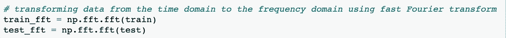

# 用于异常检测的 LSTM 自动编码器

> 原文：<https://towardsdatascience.com/lstm-autoencoder-for-anomaly-detection-e1f4f2ee7ccf?source=collection_archive---------0----------------------->

## 使用 Python、Keras 和 TensorFlow 创建 AI 深度学习异常检测模型

Photo by [Ellen Qin](https://unsplash.com/@ellenqin?utm_source=medium&utm_medium=referral) on [Unsplash](https://unsplash.com?utm_source=medium&utm_medium=referral)

这篇文章的目标是通过使用 Python，Keras 和 TensorFlow 创建和训练用于异常检测的人工智能深度学习神经网络的步骤。我不会过多地钻研底层理论，并假设读者对底层技术有一些基本的了解。不过，我会提供更多详细信息的链接，你可以在我的 [GitHub repo](https://github.com/BLarzalere/LSTM-Autoencoder-for-Anomaly-Detection) 中找到这项研究的源代码。

## **分析数据集**

我们将使用 NASA 声学和振动数据库中的振动传感器读数作为本次研究的数据集。在美国宇航局的研究中，传感器读数取自四个轴承，这些轴承在持续多天的恒定负载下发生故障。我们的数据集由单个文件组成，这些文件是以 10 分钟为间隔记录的 1 秒振动信号快照。每个文件包含每个方位的 20，480 个传感器数据点，这些数据点是通过以 20 kHz 的采样率读取方位传感器而获得的。

你可以在这里下载传感器数据。由于 GitHub 大小的限制，方位传感器数据被分成两个 zip 文件(Bearing_Sensor_Data_pt1 和 2)。您需要解压缩它们，并将它们合并到一个单独的数据目录中。

## 异常检测

异常检测的任务是确定什么时候某些东西偏离了“正常”。使用神经网络的异常检测以无监督/自监督的方式建模；与监督学习相反，在监督学习中，输入特征样本与其对应的输出标签之间存在一对一的对应关系。假设正常行为以及可用“正常”数据的数量是正常的，异常是正常的例外，在这种情况下，“正常”建模是可能的。

我们将使用自动编码器深度学习神经网络模型来从传感器读数中识别振动异常。目标是在未来轴承故障发生之前预测它们。

## LSTM 网络公司

这项研究的概念部分来自 Vegard Flovik 博士的一篇优秀文章“异常检测和条件监控的机器学习”。在那篇文章中，作者在自动编码器模型中使用了密集的神经网络单元。这里，我们将在我们的自动编码器模型中使用长短期记忆(LSTM)神经网络细胞。LSTM 网络是更一般的递归神经网络(RNN)的子类型。递归神经网络的一个关键属性是它们保持信息或细胞状态的能力，以供以后在网络中使用。这使得它们特别适合于分析随时间演变的时态数据。LSTM 网络用于语音识别、文本翻译等任务，在这里，用于异常检测的顺序传感器读数的分析。

有许多优秀的文章，作者远比我更有资格讨论 LSTM 社交网络的细节。所以如果你好奇，这里有一个链接，链接到 LSTM 网络上的一篇优秀的[文章。这里也是所有 LSTM 事物的事实上的地方——](http://colah.github.io/posts/2015-08-Understanding-LSTMs/)[安德烈·卡帕西的博客](http://karpathy.github.io/2015/05/21/rnn-effectiveness/)。理论讲够了，让我们继续写代码吧…

## 加载、预处理和检查数据

我将使用 Anaconda 发行版 Python 3 Jupyter 笔记本来创建和训练我们的神经网络模型。我们将使用 TensorFlow 作为我们的后端，Keras 作为我们的核心模型开发库。第一项任务是加载我们的 Python 库。然后，我们设置我们的随机种子，以创造可重复的结果。

假设轴承中的机械退化随着时间逐渐发生；因此，我们将在分析中每 10 分钟使用一个数据点。通过使用 20，480 个数据点上振动记录的平均绝对值，汇总每 10 分钟的数据文件传感器读数。然后我们把所有的东西合并成一个熊猫数据帧。

接下来，我们定义用于训练和测试神经网络的数据集。为此，我们执行一个简单的分割，在数据集的第一部分进行训练，这代表正常的操作条件。然后，我们测试数据集的剩余部分，该部分包含导致轴承故障的传感器读数。

现在，我们已经加载、聚合和定义了我们的训练和测试数据，让我们回顾一下传感器数据随时间变化的趋势模式。首先，我们绘制代表轴承正常运行条件的训练集传感器读数。

接下来，我们来看看测试数据集传感器读数随时间的变化。

在测试集时间框架的中途，传感器模式开始改变。在故障点附近，轴承振动读数变得更强，并剧烈振荡。为了获得稍微不同的数据视角，我们将使用傅立叶变换将信号从时域变换到频域。

我们先来看频域的训练数据。

正常运行的传感器读数没有什么值得注意的。现在，让我们看看导致轴承故障的传感器频率读数。

我们可以清楚地看到，系统中频率振幅和能量的增加导致了轴承故障。

为了完成我们数据的预处理，我们将首先把它归一化到 0 和 1 之间的范围。然后，我们将数据改造成适合输入 LSTM 网络的格式。LSTM 单元期望一个形式为[数据样本，时间步长，特征]的三维张量。这里，输入到 LSTM 网络的每个样本代表一个时间步长，并包含 4 个特征-在该时间步长的四个方位的传感器读数。

使用 LSTM 像元的优势之一是能够在分析中包含多元特征。这里是每个时间步的四个传感器读数。但是，在在线欺诈异常检测分析中，可能是时间、金额、购买的商品、每个时间步长的互联网 IP 等特征。

## 神经网络模型

我们将为我们的异常检测模型使用自动编码器神经网络架构。自动编码器架构本质上学习“身份”功能。它将获取输入数据，创建该数据的核心/主要驱动特征的压缩表示，然后再次学习重构它。例如，输入一张狗的图像，它会将数据压缩到构成狗图像的核心成分，然后学习从数据的压缩版本中重建原始图像。

使用这种架构进行异常检测的基本原理是，我们根据“正常”数据训练模型，并确定产生的重建误差。然后，当模型遇到超出正常范围的数据并试图重建它时，我们将看到重建错误的增加，因为模型从未被训练为准确地重建超出正常范围的项目。

我们使用 Keras 库创建我们的自动编码器神经网络模型作为 Python 函数。

在 LSTM 自动编码器网络结构中，第一对神经网络层创建输入数据的压缩表示，即编码器。然后，我们使用一个重复矢量层来跨解码器的时间步长分布压缩的表示矢量。解码器的最终输出层为我们提供重建的输入数据。

然后，我们实例化该模型，并使用 Adam 作为我们的神经网络优化器来编译它，并平均绝对误差来计算我们的损失函数。

最后，我们将模型拟合到我们的训练数据，并对其进行 100 个时期的训练。然后，我们绘制训练损失图来评估我们的模型的性能。

## 损失分布

通过绘制训练集中计算损失的分布，我们可以确定用于识别异常的合适阈值。在这样做时，可以确保该阈值被设置在“噪声水平”之上，从而不会触发假阳性。

基于上述损失分布，让我们尝试使用阈值 0.275 来标记异常。然后，我们计算训练集和测试集中的重建损失，以确定传感器读数何时超过异常阈值。

请注意，我们已经将所有内容合并到一个数据帧中，以可视化随时间变化的结果。红线表示我们的阈值 0.275。

我们的神经网络异常分析能够通过检测传感器读数何时开始偏离正常运行值，在实际的物理轴承故障之前很好地标记即将发生的轴承故障。

最后，我们以 h5 格式保存神经网络模型架构及其学习到的权重。经过训练的模型可以用于异常检测。

## 更新:

在下一篇[文章](https://medium.com/swlh/containerized-ai-for-anomaly-detection-eb3e08225235)中，我们将使用 Docker 和 Kubernetes 将我们训练过的 AI 模型部署为 REST API，以将其公开为服务。