# 喀拉斯极端罕见事件分类的 LSTM 自动编码器

> 原文：<https://towardsdatascience.com/lstm-autoencoder-for-extreme-rare-event-classification-in-keras-ce209a224cfb?source=collection_archive---------0----------------------->

## 在这里，我们将学习 LSTM 模型的数据准备的细节，并为罕见事件分类建立一个 LSTM 自动编码器。

<<download the="" free="" book="" class="ae lb" href="https://www.understandingdeeplearning.com" rel="noopener ugc nofollow" target="_blank">了解深度学习，了解更多> ></download>

这篇文章是我上一篇文章[使用自动编码器进行极端罕见事件分类](/extreme-rare-event-classification-using-autoencoders-in-keras-a565b386f098)的延续。在上一篇文章中，我们谈到了一个极其罕见的事件数据中的挑战，这些数据中只有不到 1%的数据被正面标记。我们使用异常检测的概念为此类流程构建了一个自动编码器分类器。

但是，我们掌握的数据是一个时间序列。但是之前我们使用了密集层自动编码器，它不使用数据中的时间特征。因此，在这篇文章中，我们将通过构建一个 LSTM 自动编码器来改进我们的方法。

在这里，我们将学习:

*   LSTM 模型的数据准备步骤，
*   构建和实现 LSTM 自动编码器，以及
*   使用 LSTM 自动编码器进行罕见事件分类。

**快速回顾 LSTM** :

*   LSTM 是一种递归神经网络(RNN)。一般来说，RNNs，特别是 LSTM，用于序列或时间序列数据。
*   这些模型能够自动提取过去事件的影响。
*   众所周知，LSTM 有能力提取过去事件长期和短期影响。

下面，我们将直接开发一个 LSTM 自动编码器。建议阅读[逐步理解 LSTM 自动编码器层](/step-by-step-understanding-lstm-autoencoder-layers-ffab055b6352)以更好地理解和进一步改进下面的网络。

简而言之，关于数据问题，我们有来自造纸厂的纸张断裂的真实数据。我们的目标是提前预测中断。有关数据、问题和分类方法的详细信息，请参考[使用自动编码器的极端罕见事件分类](/extreme-rare-event-classification-using-autoencoders-in-keras-a565b386f098)。

# 多元数据的 LSTM 自动编码器

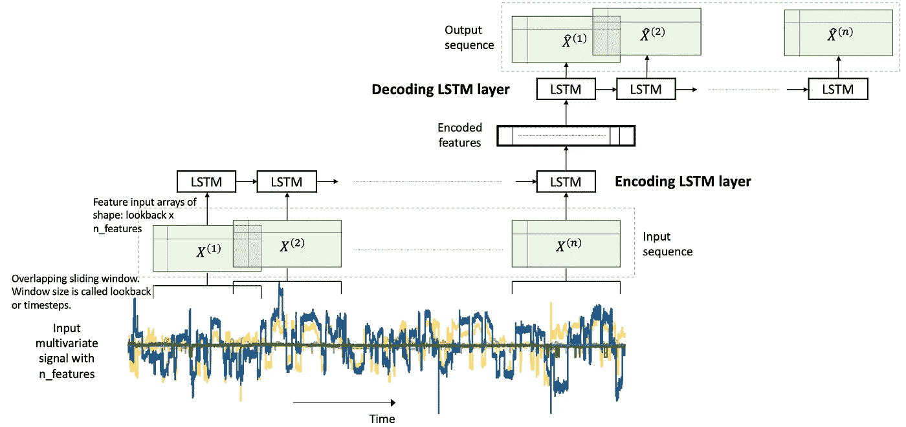

Figure 1\. An LSTM Autoencoder.

在我们的问题中，我们有一个多元时间序列数据。多元时间序列数据包含在一段时间内观察到的多个变量。我们将在这个多元时间序列上建立一个 LSTM 自动编码器来执行稀有事件分类。如[ [1](/extreme-rare-event-classification-using-autoencoders-in-keras-a565b386f098) 中所述，这是通过使用异常检测方法实现的:

*   我们在*正常*(负标签)数据上建立一个自动编码器，
*   用它来重建一个新样本，
*   如果重建误差很高，我们将其标记为断纸。

LSTM 几乎不需要特殊的数据预处理步骤。在下文中，我们将对这些步骤给予足够的重视。

让我们开始实现。

# 图书馆

我喜欢先把库和全局常量放在一起。

```
%matplotlib inline
**import** **matplotlib.pyplot** **as** **plt**
**import** **seaborn** **as** **sns**

**import** **pandas** **as** **pd**
**import** **numpy** **as** **np**
**from** **pylab** **import** rcParams

**import** **tensorflow** **as** **tf**
**from** **keras** **import** optimizers, Sequential
**from** **keras.models** **import** Model
**from** **keras.utils** **import** plot_model
**from** **keras.layers** **import** Dense, LSTM, RepeatVector, TimeDistributed
**from** **keras.callbacks** **import** ModelCheckpoint, TensorBoard

**from** **sklearn.preprocessing** **import** StandardScaler
**from** **sklearn.model_selection** **import** train_test_split
**from** **sklearn.metrics** **import** confusion_matrix, precision_recall_curve
**from** **sklearn.metrics** **import** recall_score, classification_report, auc, roc_curve
**from** **sklearn.metrics** **import** precision_recall_fscore_support, f1_score

**from** **numpy.random** **import** seed
seed(7)
**from** **tensorflow** **import** set_random_seed
set_random_seed(11)**from** **sklearn.model_selection** **import** train_test_split

SEED = 123 *#used to help randomly select the data points*
DATA_SPLIT_PCT = 0.2

rcParams['figure.figsize'] = 8, 6
LABELS = ["Normal","Break"]
```

# 数据准备

如前所述，LSTM 要求在数据准备中采取一些具体步骤。LSTMs 的输入是从时间序列数据创建的三维数组。这是一个**容易出错的步骤**，所以我们将查看细节。

## 读出数据

数据取自 [2](https://arxiv.org/abs/1809.10717) 。到数据的链接在这里是[这里是](https://docs.google.com/forms/d/e/1FAIpQLSdyUk3lfDl7I5KYK_pw285LCApc-_RcoC0Tf9cnDnZ_TWzPAw/viewform)。

```
df = pd.read_csv("data/processminer-rare-event-mts - data.csv") 
df.head(n=5)  *# visualize the data.*
```

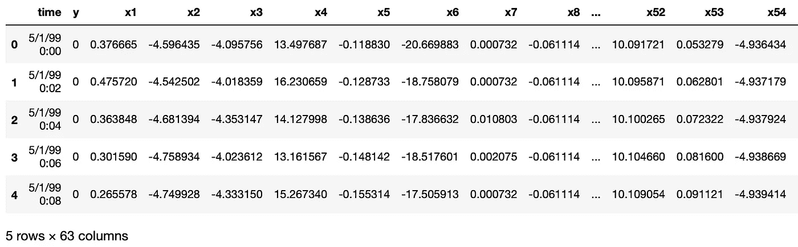

## **曲线移动**

正如在[ [1](/extreme-rare-event-classification-using-autoencoders-in-keras-a565b386f098) 中提到的，这个罕见事件问题的目标是在板块断裂发生之前预测它。我们将尝试提前 4 分钟预测**到**的休息时间。对于这些数据，这相当于将标签上移两行。直接用`df.y=df.y.shift(-2)`就可以了。然而，在这里我们需要做以下事情:

*   对于标签为 1 的任意一行 *n* ，使( *n* -2):( *n* -1)为 1。这样，我们就可以教会分类器预测**到** 4 分钟前的情况。而且，
*   拆下排 *n* 。行 *n* 被删除，因为我们对训练分类器预测已经发生的中断不感兴趣。

我们开发了以下函数来执行这种曲线移动。

```
sign = **lambda** x: (1, -1)[x < 0]

**def** curve_shift(df, shift_by):
    *'''*
 *This function will shift the binary labels in a dataframe.*
 *The curve shift will be with respect to the 1s.* 
 *For example, if shift is -2, the following process*
 *will happen: if row n is labeled as 1, then*
 *- Make row (n+shift_by):(n+shift_by-1) = 1.*
 *- Remove row n.*
 *i.e. the labels will be shifted up to 2 rows up.*

 *Inputs:*
 *df       A pandas dataframe with a binary labeled column.* 
 *This labeled column should be named as 'y'.*
 *shift_by An integer denoting the number of rows to shift.*

 *Output*
 *df       A dataframe with the binary labels shifted by shift.*
 *'''*

    vector = df['y'].copy()
    **for** s **in** range(abs(shift_by)):
        tmp = vector.shift(sign(shift_by))
        tmp = tmp.fillna(0)
        vector += tmp
    labelcol = 'y'
    *# Add vector to the df*
    df.insert(loc=0, column=labelcol+'tmp', value=vector)
    *# Remove the rows with labelcol == 1.*
    df = df.drop(df[df[labelcol] == 1].index)
    *# Drop labelcol and rename the tmp col as labelcol*
    df = df.drop(labelcol, axis=1)
    df = df.rename(columns={labelcol+'tmp': labelcol})
    *# Make the labelcol binary*
    df.loc[df[labelcol] > 0, labelcol] = 1

    **return** df
```

我们现在将转换我们的数据，并验证转换是否正确。在接下来的部分中，我们还有一些测试步骤。建议使用它们来确保数据准备步骤按预期运行。

```
print('Before shifting')  *# Positive labeled rows before shifting.*
one_indexes = df.index[df['y'] == 1]
display(df.iloc[(np.where(np.array(input_y) == 1)[0][0]-5):(np.where(np.array(input_y) == 1)[0][0]+1), ])

*# Shift the response column y by 2 rows to do a 4-min ahead prediction.*
df = curve_shift(df, shift_by = -2)

print('After shifting')  *# Validating if the shift happened correctly.*
display(df.iloc[(one_indexes[0]-4):(one_indexes[0]+1), 0:5].head(n=5))
```

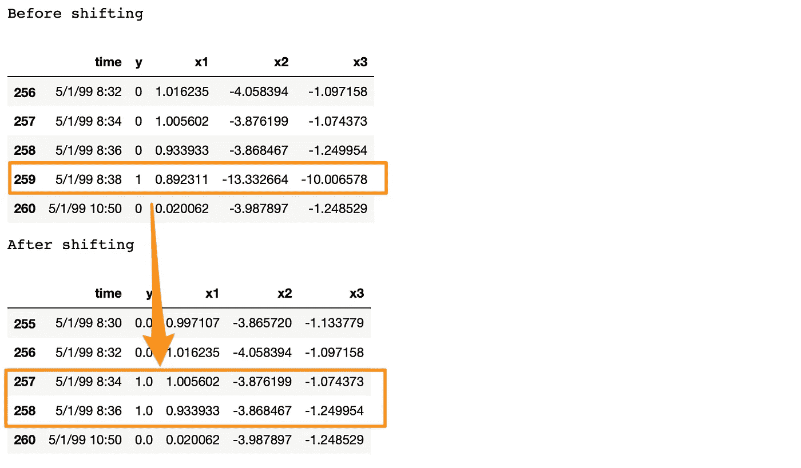

如果我们在这里注意到，我们将 1999 年 5 月 1 日 8:38 的正标签移动到了 *n* -1 和 *n* -2 时间戳，并删除了第 *n* 行。此外，在中断行和下一行之间有超过 2 分钟的时间差。这是因为，当发生中断时，机器会在中断状态停留一段时间。在此期间，连续行的 y = 1。在所提供的数据中，这些连续的中断行被删除，以防止分类器学习预测已经发生的之后的中断**。详见[ [2](https://arxiv.org/pdf/1809.10717.pdf) 。**

在继续之前，我们通过删除时间和另外两个分类列来清理数据。

```
*# Remove time column, and the categorical columns*
df = df.drop(['time', 'x28', 'x61'], axis=1)
```

## 为 LSTM 准备输入数据

LSTM 比其他车型要求更高一些。在准备适合 LSTM 的数据时可能会花费大量的时间和精力。然而，这通常是值得努力的。

LSTM 模型的输入数据是一个三维数组。数组的形状是*样本* x *回看* x *特征*。让我们来理解它们，

*   *样本*:这就是观察的数量，或者换句话说，就是数据点的数量。
*   回顾过去:LSTM 模特是用来回顾过去的。也就是说，在时间 *t* 时，LSTM 将处理数据直到( *t* - *回看*)以做出预测。
*   *特征*:输入数据中出现的特征数量。

首先，我们将提取特征和响应。

```
input_X = df.loc[:, df.columns != 'y'].values  *# converts the df to a numpy array*
input_y = df['y'].values

n_features = input_X.shape[1]  *# number of features*
```

这里的`input_X`是一个大小为*样本* x *特征*的二维数组。我们希望能够将这样的 2D 数组转换成大小为:*样本* x *回看* x *特征*的 3D 数组。请参考上面的图 1 以获得直观的理解。

为此，我们开发了一个函数`temporalize`。

```
**def** temporalize(X, y, lookback):
    *'''*
 *Inputs*
 *X         A 2D numpy array ordered by time of shape:* 
 *(n_observations x n_features)*
 *y         A 1D numpy array with indexes aligned with* 
 *X, i.e. y[i] should correspond to X[i].* 
 *Shape: n_observations.*
 *lookback  The window size to look back in the past* 
 *records. Shape: a scalar.*

 *Output*
 *output_X  A 3D numpy array of shape:* 
 *((n_observations-lookback-1) x lookback x* 
 *n_features)*
 *output_y  A 1D array of shape:* 
 *(n_observations-lookback-1), aligned with X.*
 *'''*
    output_X = []
    output_y = []
    **for** i **in** range(len(X) - lookback - 1):
        t = []
        **for** j **in** range(1, lookback + 1):
            *# Gather the past records upto the lookback period*
            t.append(X[[(i + j + 1)], :])
        output_X.append(t)
        output_y.append(y[i + lookback + 1])
    **return** np.squeeze(np.array(output_X)), np.array(output_y)
```

为了测试和演示这个功能，我们将在下面用`lookback = 5`看一个例子。

```
print('First instance of y = 1 in the original data')
display(df.iloc[(np.where(np.array(input_y) == 1)[0][0]-5):(np.where(np.array(input_y) == 1)[0][0]+1), ])lookback = 5  # Equivalent to 10 min of past data.
# Temporalize the data
X, y = temporalize(X = input_X, y = input_y, lookback = lookback)print('For the same instance of y = 1, we are keeping past 5 samples in the 3D predictor array, X.')
display(pd.DataFrame(np.concatenate(X[np.where(np.array(y) == 1)[0][0]], axis=0 )))
```

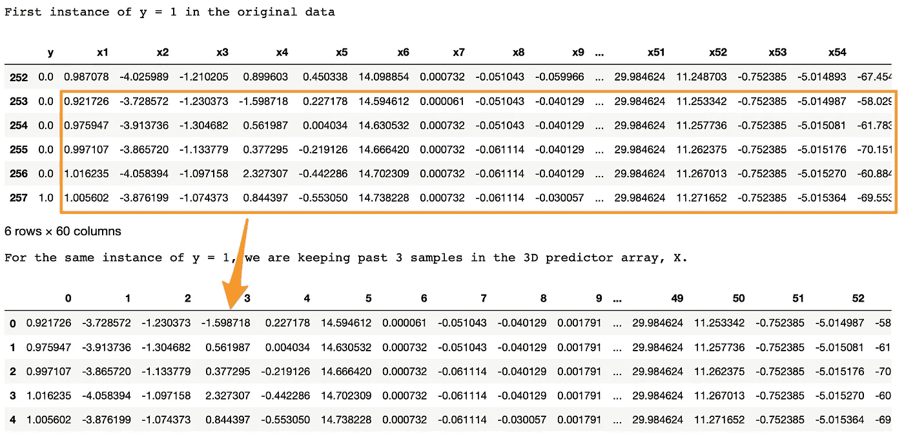

我们在这里寻找的是，

*   在原始数据中，第 257 行的 y = 1。
*   使用`lookback = 5`，我们希望 LSTM 查看 257 行之前的 5 行(包括它自己)。
*   在 3D 阵列`X`中，`X[i,:,:]`处的每个 2D 块表示对应于`y[i]`的预测数据。打个比方，在回归中`y[i]`对应一个 1D 向量`X[i,:]`；在 LSTM `y[i]`对应一个 2D 阵列`X[i,:,:]`。
*   这个 2D 块`X[i,:,:]`应该具有在`input_X[i,:]`和直到给定`lookback`的先前行的预测器。
*   正如我们在上面的输出中看到的，底部的`X[i,:,:]`块与顶部显示的 y=1 的过去五行相同。
*   类似地，这适用于所有 y 的全部数据。此处的示例显示了 y=1 的情况，以便于可视化。

# 分为训练、有效和测试

这对于`sklearn`功能来说很简单。

```
X_train, X_test, y_train, y_test = train_test_split(np.array(X), np.array(y), test_size=DATA_SPLIT_PCT, random_state=SEED)X_train, X_valid, y_train, y_valid = train_test_split(X_train, y_train, test_size=DATA_SPLIT_PCT, random_state=SEED)
```

为了训练自动编码器，我们将使用仅来自负标签数据的 X。所以我们把 y = 0 对应的 X 分开。

```
X_train_y0 = X_train[y_train==0]
X_train_y1 = X_train[y_train==1]X_valid_y0 = X_valid[y_valid==0]
X_valid_y1 = X_valid[y_valid==1]
```

我们将把 X 的形状重塑成所需的 3D 尺寸:*样本* x *回看* x *特征*。

```
X_train = X_train.reshape(X_train.shape[0], lookback, n_features)
X_train_y0 = X_train_y0.reshape(X_train_y0.shape[0], lookback, n_features)
X_train_y1 = X_train_y1.reshape(X_train_y1.shape[0], lookback, n_features)X_valid = X_valid.reshape(X_valid.shape[0], lookback, n_features)
X_valid_y0 = X_valid_y0.reshape(X_valid_y0.shape[0], lookback, n_features)
X_valid_y1 = X_valid_y1.reshape(X_valid_y1.shape[0], lookback, n_features)X_test = X_test.reshape(X_test.shape[0], lookback, n_features)
```

## 使数据标准化

对于自动编码器，通常最好使用标准化数据(转换为高斯数据，平均值为 0，标准偏差为 1)。

> 一个常见的标准化错误是:我们将整个数据标准化，然后分成训练测试。这是不正确的。在建模过程中，测试数据应该是完全不可见的。因此，我们应该规范化训练数据，并使用其汇总统计数据来规范化测试数据(对于规范化，这些统计数据是每个特征的平均值和方差)。

标准化这些数据有点棘手。这是因为 X 矩阵是 3D 的，我们希望标准化发生在原始 2D 数据上。

为此，我们需要两个 UDF。

*   `flatten`:该功能将重新创建原始的 2D 阵列，3D 阵列是从该阵列创建的。这个函数是`temporalize`的倒数，意思是`X = flatten(temporalize(X))`。
*   `scale`:这个函数将缩放我们创建的 3D 数组，作为 LSTM 的输入。

```
**def** flatten(X):
    *'''*
 *Flatten a 3D array.*

 *Input*
 *X            A 3D array for lstm, where the array is sample x timesteps x features.*

 *Output*
 *flattened_X  A 2D array, sample x features.*
 *'''*
    flattened_X = np.empty((X.shape[0], X.shape[2]))  *# sample x features array.*
    **for** i **in** range(X.shape[0]):
        flattened_X[i] = X[i, (X.shape[1]-1), :]
    **return**(flattened_X)

**def** scale(X, scaler):
    *'''*
 *Scale 3D array.*

 *Inputs*
 *X            A 3D array for lstm, where the array is sample x timesteps x features.*
 *scaler       A scaler object, e.g., sklearn.preprocessing.StandardScaler, sklearn.preprocessing.normalize*

 *Output*
 *X            Scaled 3D array.*
 *'''*
    **for** i **in** range(X.shape[0]):
        X[i, :, :] = scaler.transform(X[i, :, :])

    **return** X
```

> 为什么我们不首先归一化原始 2D 数据，然后创建三维阵列？因为，为了做到这一点，我们将:把数据分成训练和测试，然后对它们进行规范化。然而，当我们在测试数据上创建 3D 阵列时，我们丢失了最初的样本行，直到*回看。*拆分为训练有效测试将导致验证集和测试集都出现这种情况。

我们将安装一个来自`sklearn`的标准化对象。该函数将数据标准化为正态(0，1)。注意，我们需要展平`X_train_y0`数组以传递给`fit`函数。

```
*# Initialize a scaler using the training data.*
scaler = StandardScaler().fit(flatten(X_train_y0))
```

我们将使用我们的 UDF`scale`，用合适的转换对象`scaler`来标准化`X_train_y0`。

```
X_train_y0_scaled = scale(X_train_y0, scaler)
```

**确保** `**scale**` **正常工作？**

`X_train`的正确转换将确保展平的`X_train`的每一列的均值和方差分别为 0 和 1。我们测试这个。

```
a = flatten(X_train_y0_scaled)
print('colwise mean', np.mean(a, axis=0).round(6))
print('colwise variance', np.var(a, axis=0))
```

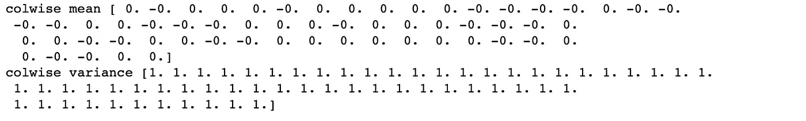

上面输出的所有均值和方差分别为 0 和 1。因此，缩放是正确的。我们现在将扩展验证和测试集。我们将再次在这些器械包中使用`scaler`对象。

```
X_valid_scaled = scale(X_valid, scaler)
X_valid_y0_scaled = scale(X_valid_y0, scaler)X_test_scaled = scale(X_test, scaler)
```

# LSTM 自动编码器培训

首先，我们将初始化一些变量。

```
timesteps =  X_train_y0_scaled.shape[1] *# equal to the lookback*
n_features =  X_train_y0_scaled.shape[2] *# 59*

epochs = 200
batch = 64
lr = 0.0001
```

现在，我们开发一个简单的架构。

```
lstm_autoencoder = Sequential()
*# Encoder*
lstm_autoencoder.add(LSTM(32, activation='relu', input_shape=(timesteps, n_features), return_sequences=**True**))
lstm_autoencoder.add(LSTM(16, activation='relu', return_sequences=**False**))
lstm_autoencoder.add(RepeatVector(timesteps))
*# Decoder*
lstm_autoencoder.add(LSTM(16, activation='relu', return_sequences=**True**))
lstm_autoencoder.add(LSTM(32, activation='relu', return_sequences=**True**))
lstm_autoencoder.add(TimeDistributed(Dense(n_features)))

lstm_autoencoder.summary()
```

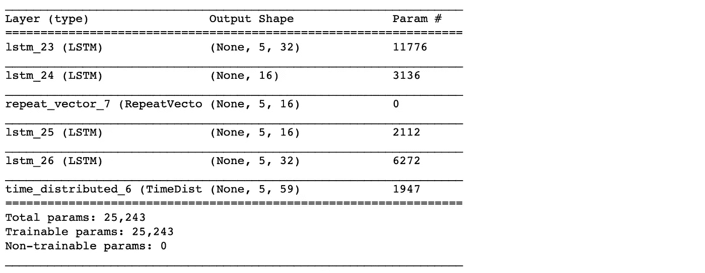

从 summary()来看，参数的总数是 5，331。这大约是训练规模的一半。因此，这是一个合适的模型。为了有一个更大的架构，我们将需要添加正规化，例如辍学，这将在下一篇文章中讨论。

现在，我们将训练自动编码器。

```
adam = optimizers.Adam(lr)
lstm_autoencoder.compile(loss='mse', optimizer=adam)

cp = ModelCheckpoint(filepath="lstm_autoencoder_classifier.h5",
                               save_best_only=**True**,
                               verbose=0)

tb = TensorBoard(log_dir='./logs',
                histogram_freq=0,
                write_graph=**True**,
                write_images=**True**)

lstm_autoencoder_history = lstm_autoencoder.fit(X_train_y0_scaled, X_train_y0_scaled, 
                                                epochs=epochs, 
                                                batch_size=batch, 
                                                validation_data=(X_valid_y0_scaled, X_valid_y0_scaled),
                                                verbose=2).history
```

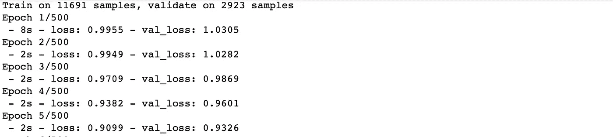

绘制各时期损失的变化。

```
plt.plot(lstm_autoencoder_history['loss'], linewidth=2, label='Train')
plt.plot(lstm_autoencoder_history['val_loss'], linewidth=2, label='Valid')
plt.legend(loc='upper right')
plt.title('Model loss')
plt.ylabel('Loss')
plt.xlabel('Epoch')
plt.show()
```

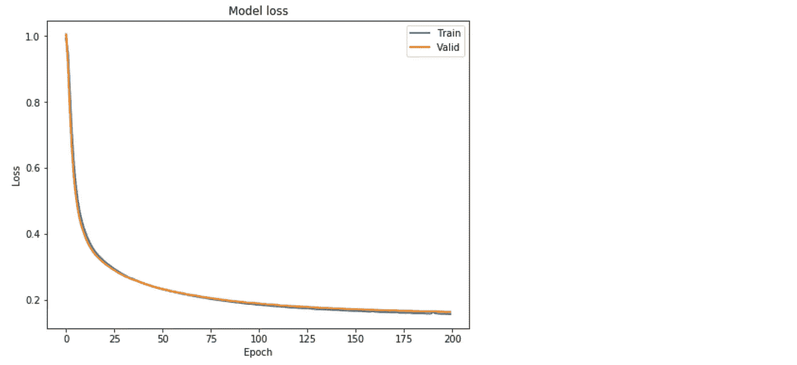

Figure 2\. Loss function over the epochs.

## **分类**

类似于[之前的文章](/extreme-rare-event-classification-using-autoencoders-in-keras-a565b386f098) [ [1](/extreme-rare-event-classification-using-autoencoders-in-keras-a565b386f098) ]，这里我们展示了如何使用自动编码器重建误差进行罕见事件分类。我们遵循这个概念:自动编码器被期望重建一个 noi。如果重建误差很高，我们将把它分类为一个断页。

我们需要确定这方面的门槛。另外，请注意，这里我们将使用包含 y = 0 或 1 的整个验证集。

```
valid_x_predictions = lstm_autoencoder.predict(X_valid_scaled)
mse = np.mean(np.power(flatten(X_valid_scaled) - flatten(valid_x_predictions), 2), axis=1)

error_df = pd.DataFrame({'Reconstruction_error': mse,
                        'True_class': y_valid.tolist()})

precision_rt, recall_rt, threshold_rt = precision_recall_curve(error_df.True_class, error_df.Reconstruction_error)
plt.plot(threshold_rt, precision_rt[1:], label="Precision",linewidth=5)
plt.plot(threshold_rt, recall_rt[1:], label="Recall",linewidth=5)
plt.title('Precision and recall for different threshold values')
plt.xlabel('Threshold')
plt.ylabel('Precision/Recall')
plt.legend()
plt.show()
```

注意，我们必须对数组进行`flatten`运算来计算`mse`。

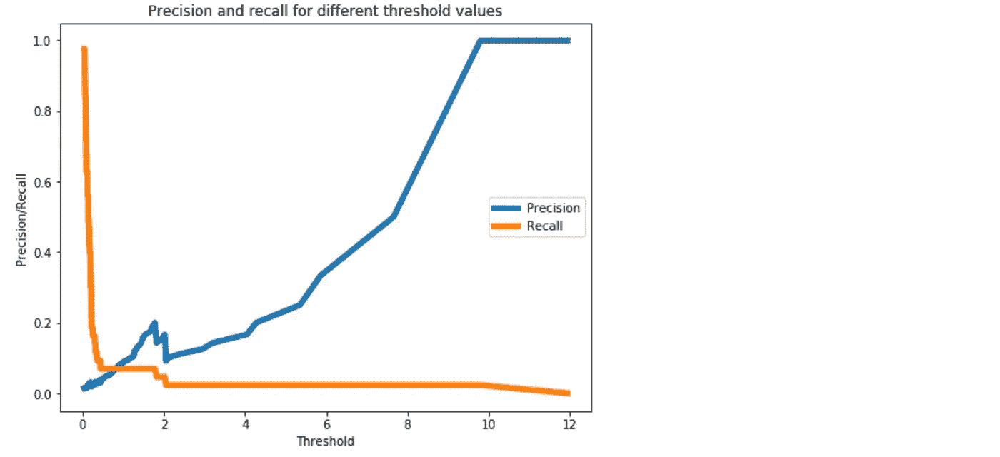

Figure 3\. A threshold of 0.3 should provide a reasonable trade-off between precision and recall, as we want to higher recall.

现在，我们将对测试数据进行分类。

> **我们不应该从测试数据中估计分类阈值。这将导致过度拟合。**

```
test_x_predictions = lstm_autoencoder.predict(X_test_scaled)
mse = np.mean(np.power(flatten(X_test_scaled) - flatten(test_x_predictions), 2), axis=1)

error_df = pd.DataFrame({'Reconstruction_error': mse,
                        'True_class': y_test.tolist()})

threshold_fixed = 0.3
groups = error_df.groupby('True_class')
fig, ax = plt.subplots()

**for** name, group **in** groups:
    ax.plot(group.index, group.Reconstruction_error, marker='o', ms=3.5, linestyle='',
            label= "Break" **if** name == 1 **else** "Normal")
ax.hlines(threshold_fixed, ax.get_xlim()[0], ax.get_xlim()[1], colors="r", zorder=100, label='Threshold')
ax.legend()
plt.title("Reconstruction error for different classes")
plt.ylabel("Reconstruction error")
plt.xlabel("Data point index")
plt.show();
```

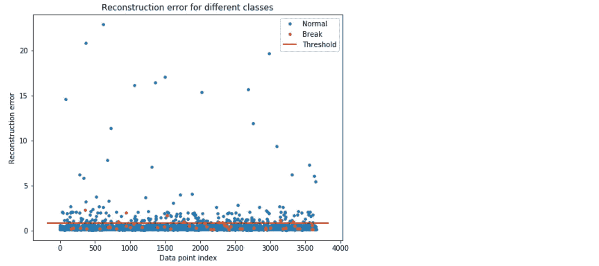

Figure 4\. Using threshold = 0.8 for classification. The orange and blue dots above the threshold line represents the True Positive and False Positive, respectively.

在图 4 中，阈值线上方的橙色和蓝色圆点分别代表真阳性和假阳性。如我们所见，我们有很多误报。

让我们看看准确度的结果。

## **测试精度**

**混淆矩阵**

```
pred_y = [1 if e > threshold_fixed else 0 for e in error_df.Reconstruction_error.values]conf_matrix = confusion_matrix(error_df.True_class, pred_y)

plt.figure(figsize=(6, 6))
sns.heatmap(conf_matrix, xticklabels=LABELS, yticklabels=LABELS, annot=**True**, fmt="d");
plt.title("Confusion matrix")
plt.ylabel('True class')
plt.xlabel('Predicted class')
plt.show()
```

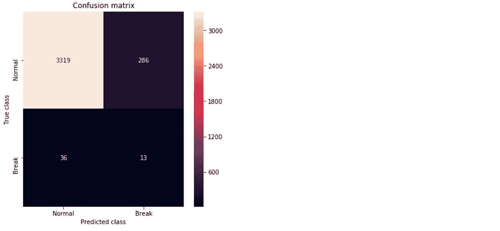

Figure 5\. Confusion matrix showing the True Positives and False Positives.

**ROC 曲线和 AUC**

```
false_pos_rate, true_pos_rate, thresholds = roc_curve(error_df.True_class, error_df.Reconstruction_error)
roc_auc = auc(false_pos_rate, true_pos_rate,)

plt.plot(false_pos_rate, true_pos_rate, linewidth=5, label='AUC = **%0.3f**'% roc_auc)
plt.plot([0,1],[0,1], linewidth=5)

plt.xlim([-0.01, 1])
plt.ylim([0, 1.01])
plt.legend(loc='lower right')
plt.title('Receiver operating characteristic curve (ROC)')
plt.ylabel('True Positive Rate')
plt.xlabel('False Positive Rate')
plt.show()
```

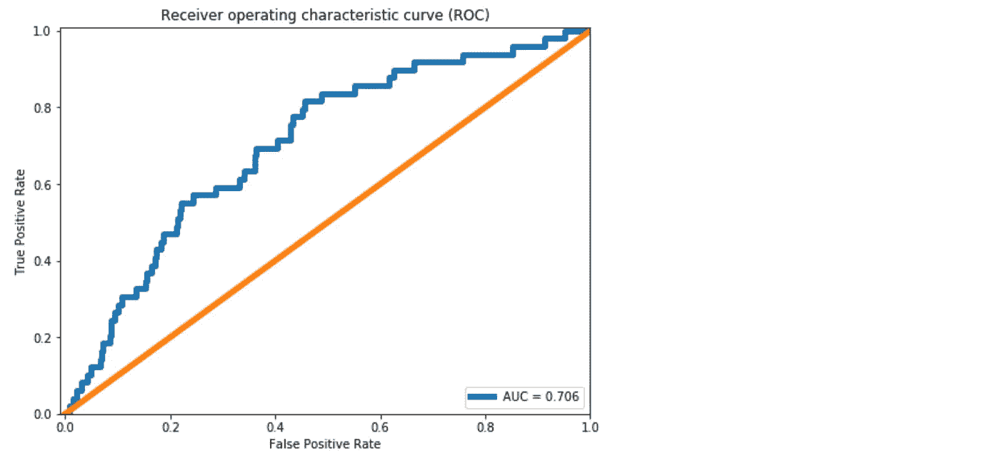

Figure 6\. The ROC curve.

与[ [1](/extreme-rare-event-classification-using-autoencoders-in-keras-a565b386f098) 中的密集层自动编码器相比，我们看到 AUC 提高了大约 10%。根据图 5 中的混淆矩阵，我们可以预测 39 个中断实例中的 10 个。正如[ [1](/extreme-rare-event-classification-using-autoencoders-in-keras-a565b386f098) 中所讨论的，这对造纸厂来说意义重大。然而，与密集层自动编码器相比，我们实现的改进是微小的。

主要原因是 LSTM 模型有更多的参数需要估计。对 LSTMs 使用正则化变得很重要。正则化和其他模型改进将在下一篇文章中讨论。

## [Github 知识库](https://github.com/cran2367/lstm_autoencoder_classifier/blob/master/lstm_autoencoder_classifier.ipynb)

[](https://github.com/cran2367/lstm_autoencoder_classifier/blob/master/lstm_autoencoder_classifier.ipynb) [## cran 2367/lstm _ 自动编码器 _ 分类器

### 用于罕见事件分类的 LSTM 自动编码器。通过…为 cran 2367/lstm _ auto encoder _ classifier 开发做出贡献

github.com](https://github.com/cran2367/lstm_autoencoder_classifier/blob/master/lstm_autoencoder_classifier.ipynb) 

# 什么可以做得更好？

在下一篇文章中，我们将学习调优自动编码器。我们会过去，

*   CNN LSTM 自动编码器，
*   脱落层，
*   LSTM 辍学(辍学和辍学)
*   高斯漏失层
*   SELU 激活，以及
*   阿尔法辍学与 SELU 激活。

# 结论

这篇文章继续了[ [1](/extreme-rare-event-classification-using-autoencoders-in-keras-a565b386f098) ]中关于极端罕见事件二进制标记数据的工作。为了利用时间模式，LSTM 自动编码器被用来建立一个多元时间序列过程的罕见事件分类器。详细讨论了 LSTM 模型的数据预处理步骤。一个简单的 LSTM 自动编码器模型被训练并用于分类。发现密集自动编码器的精度有所提高。为了进一步改进，我们将在下一篇文章中探讨如何改进具有 Dropout 和其他技术的自动编码器。

# 后续阅读

建议阅读[逐步理解 LSTM 自动编码器层](/step-by-step-understanding-lstm-autoencoder-layers-ffab055b6352)以明确 LSTM 网络概念。

# 参考

1.  [使用 Keras 中的自动编码器进行极端罕见事件分类](/extreme-rare-event-classification-using-autoencoders-in-keras-a565b386f098)
2.  Ranjan、m . Mustonen、k . pay nabar 和 k . pour AK(2018 年)。数据集:多元时间序列中的稀有事件分类。 [*arXiv 预印本 arXiv:1809.10717*](https://arxiv.org/pdf/1809.10717.pdf)
3.  [深度学习时间序列预测& LSTM 自动编码器](https://www.kaggle.com/dimitreoliveira/time-series-forecasting-with-lstm-autoencoders)
4.  完整代码: [LSTM 自动编码器](https://github.com/cran2367/lstm_autoencoder_classifier/blob/master/lstm_autoencoder_classifier.ipynb)

*免责声明:这篇文章的范围仅限于构建 LSTM 自动编码器并将其用作罕见事件分类器的教程。通过网络调优，从业者有望获得更好的结果。这篇文章的目的是帮助数据科学家实现 LSTM 自动编码器。*