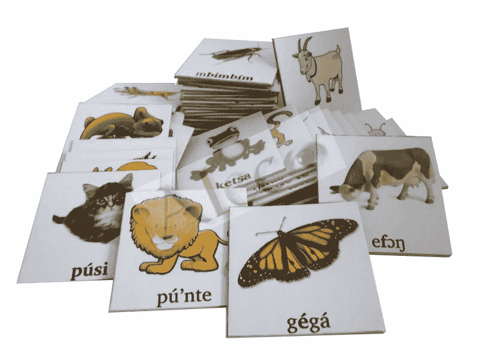
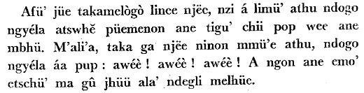
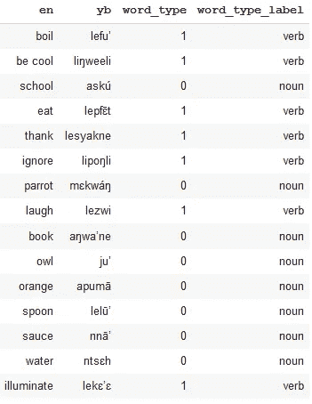
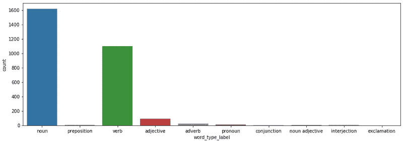
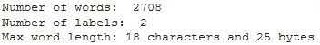
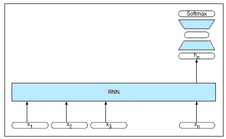
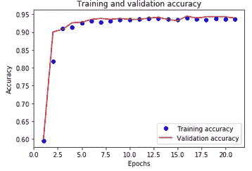
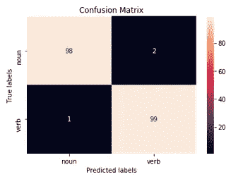
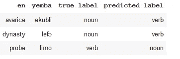

# 非洲语言的位置标记

> 原文：<https://towardsdatascience.com/lstm-based-african-language-classification-e4f644c0f29e?source=collection_archive---------12----------------------->

## 我们如何为耶姆巴语建立世界上第一个 LSTM 分类器。

[source](http://yemba.net)

在本文中，我们实现了一个 LSTM 网络，用于根据序列中已经观察到的字符来预测序列中下一个字符的概率。

我们从非洲语言中构建了第一个基于 LSTM 的单词分类器， *Yemba* 。没有边界可以阻止 LSTMs。可能是变形金刚。

# 耶姆巴语

我们的序列将从一种不太流行的语言中取词，叫做*。你可能从未听说过这种语言。放心看下面的象形图来了解一下 *Yemba* 的写法。*

**

*[source](http://yemba.net)*

*Yemba 是一种非洲语言，如今只有几千人以此为母语。尽管最初只是一种口头语言，但耶姆巴语是在大约公元 2000 年发展起来的。 [90 年前](http://www.eajournals.org/wp-content/uploads/The-Yemba-Language-Cameroon-90-Years-of-Tone-Orthography.pdf)。和世界上那么多语言一样， *Yemba* 是声调语言，类似于[越南语](https://pdfs.semanticscholar.org/a014/bedc1e57528f1b59f2e0fa82bebd84fd78e9.pdf)。*

*在声调语言中，单词由辅音、元音组成；音调——伴随音节发音的音高变化。*

*1928 年，设计第一个 *Yemba* 字母表的先驱,**Foreke-Dschang**的 Djoumessi Mathias 陛下建立了 *Yemba* 音调正字法的基础模型。后来，在 1997 年，作为一项联合国际研究努力的结果，一部现代的耶姆巴-法语词典诞生了。*

**

*source: Djoumessi, M. (1958) Syllabaire bamiléké,Yaoundé, Saint-Paul.*

*我们的目标是将 *Yemba* 单词编码为嵌入向量，并建立一个 LSTM 网络，该网络能够通过仅查看单词中存在的字符和音调来预测 *Yemba* 单词是名词还是动词。*

*我们的目标不是实现完整的词性标注。相反，我们将训练网络学习常见于 *Yemba* 名词中的字母和音调组，而不是那些特定于 *Yemba* 动词的字母和音调组。*

*为此，我们使用一个预处理过的 [*英语-Yemba* 数据集](https://gist.github.com/michelkana/37ccb5c68b3c72148c2b490c917b13aa)，它是从[Yemba.net](http://yemba.net/wdict/)在线词典下载的。我们鼓励您访问该页面，点击一些从英语、法语、德语、捷克语、汉语、西班牙语、意大利语到 Yemba 的翻译。很好玩。*

**

*上面我们可以从字典中看到一些单词。如果你想有好心情，你可以试着阅读它们。实际上， *Yemba* 写法是基于[国际音标语言](http://www.internationalphoneticalphabet.org/ipa-sounds/ipa-chart-with-sounds/)。任何有语音学知识的人实际上都能够阅读和说话！理论上。*

*虽然我们将数据集限制为名词和动词，但是 *Yemba* 还包括形容词、副词、连词、代词等。，但是与名词和动词相比数量有限。单词类型的分布如下图所示。*

**

*下面我们展示一些关于数据集的统计数据。*

**

*我们的 Yemba 单词是由 45 个字母组成的。词汇表用一个唯一的整数来表示每个 Yemba 字母。这是自然语言处理中典型的预处理步骤。*

*在将单词输入 LSTM 之前，我们必须对每个单词进行标记，用词汇表中的索引替换单词中的每个字母。这个过程将单词转化为数字向量 *X* 。为了使所有单词的向量大小相同，我们将向量填充到数据集中最长单词的长度。*

*我们的 LSTM 将学习将这些向量与正确的单词类型相匹配:0 代表名词，1 代表动词。因此，我们还构建了一个标签向量 *Y* 来存储正确的类。*

*接下来，我们将向量分成 2166 个单词的训练集和 542 个单词的验证集。*

*我们建立了一个有 100 个细胞的单层 LSTM。我们不直接向 LSTM 馈送单词向量。相反，我们首先学习它们在 8 维空间中的嵌入表示。*

*众所周知，嵌入是为了捕捉构成单词的字母之间的语义关系。LSTM 的输出由具有 sigmoid 激活的全连接层转换，以产生 0 和 1 之间的概率。*

*我们用二进制交叉熵作为损失函数，Adam 作为优化器来训练网络。分类精度被用作评估分类性能的度量，因为我们的两个类相当平衡。*

****

*如上图所示，网络实现收敛的速度非常快。LSTM 做得很好，在测试数据集上预测的分类准确率为 93.91%。*

*我们还在我们的 *Yemba* 分类问题上尝试了 GRUs，通过用具有相同单元数量(100)的 GRU 层替换 LSTM 层。训练稍微快了一点，准确性稍微好了一点，在验证集上达到了 94.19%，而不是 LSTM 的 93.91%。*

*现在让我们在 100 个随机名词和 100 个随机动词上评估经过训练的 LSTM 网络，并检查混淆矩阵。*

**

*混淆矩阵显示出很少的假阳性和假阴性:100 个动词中有 1 个被预测为名词，2 个被预测为动词。分类错误的单词如下所示。*

**

*事实是， *Yemba* 中的动词通常有一个引人注目的前缀“e”、“了”或“里”，这与英语中的“to”相对应。看来这个语义或语法结构被我们基于角色的 LSTM 正确地提取出来了。“eku bil”这个词在英语中是“贪婪”的意思，以“e”开头。因此，LSTM 预言它为动词，尽管它是名词。“lefɔ”也是一样，意思是“王朝”。因为它的前缀是“了”，所以被认为是动词。*

# *结论*

*这个实际案例显示了 LSTMs 在掌握语义方面的魔力，即使是在词汇和语音差异都很奇怪的偏远难懂的语言中，如 *Yemba* 。*

*在后续文章中，我们实现了一个 seq2seq 神经翻译模型，将英语句子翻译成 Yemba。*

* [## 假人的神经机器翻译——5 分钟指南

### AI 能让濒危语言不消失吗？

towardsdatascience.com](/heres-how-to-build-a-language-translator-in-few-lines-of-code-using-keras-30f7e0b3aa1d)*