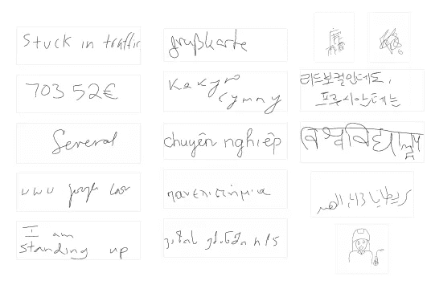
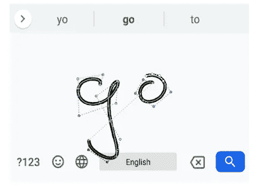
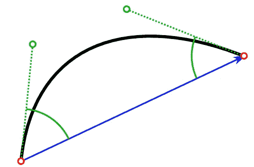
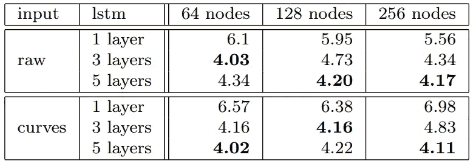
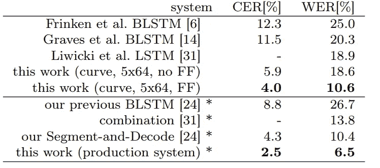
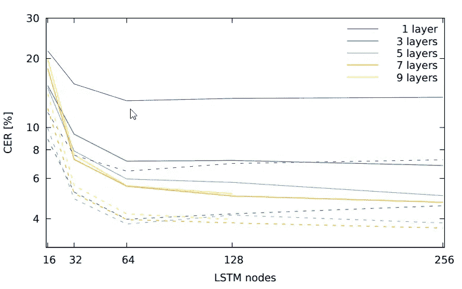

# 谷歌基于 LSTM 的手写识别

> 原文：<https://towardsdatascience.com/lstm-based-handwriting-recognition-by-google-eb99663ca6de?source=collection_archive---------13----------------------->

## 人类最初是如何在我们的大脑中进行手写识别的？

Photo by [Edward Ma](https://unsplash.com/@makcedward?utm_source=medium&utm_medium=referral) on [Unsplash](https://unsplash.com?utm_source=medium&utm_medium=referral)

手写是自然语言处理任务中的挑战之一。这是因为它在不同的人之间是不同的。另一方面，有些字符(如英语)非常相似。作为人类的开端，我们利用语境化信息，词汇匹配。

有时，“O”可以写成“0 ”,而人类 begin 有能力从上下文信息中区分它是“O”还是“0”。例如，“0”将用于电话号码，而“O”将用作英语单词的一部分。另一项技能是词汇搜索。即使我们不能识别每一个字符，猜测单词也是有帮助的。

Handwriting in different language (Carbune et al., 2019)

我们如何通过深度学习应对时代？本故事将讨论[基于 LSTM 的快速多语言在线手写识别](https://arxiv.org/pdf/1902.10525.pdf)(carburne 等人，2019 年)，并将涵盖以下内容:

*   数据
*   体系结构
*   实验

# 数据

Carbune 等人利用开放和封闭数据集来验证模型。像往常一样， [IAM-OnDB](http://www.fki.inf.unibe.ch/databases/iam-on-line-handwriting-database) 数据集用于训练模型。在实验过程中，他们使用了两种表征，分别是`Raw Touch Points`和`Bézier Curves`。

## 原始接触点

数据将被转换为 5 维点，即 x 坐标、y 坐标、自第一次触摸以来触摸点的时间戳、提笔或落笔以及是否有新的笔画。一些预处理是必要的

*   由于图像的大小可能是不同的，x 和 y 坐标的标准化是必要的。如果书写区域未知，代理比观察到的触摸点大 20%
*   值为 0.05 时沿笔划的等距线性重采样。换句话说，长度为 1 的直线将有 20 个点。

## 贝塞尔曲线

作者还评价了`Bézier Curves`是否优于`Raw Touch Points`。从实验来看，`Bézier Curves`表现出了较好的效果。`Bézier Curves`是一种呈现空间轨迹的自然方式。作者发现`Raw Touch Points`更有前途。作者使用`Bézier curves`的三次多项式来计算特征。

Show “go” in bézier curve method ([Google AI Blog](https://ai.googleblog.com/2019/03/rnn-based-handwriting-recognition-in.html))

如果你想重温一下`Bézier Curves`的概念，你可以看看这个[故事](https://medium.com/@Acegikmo/the-ever-so-lovely-b%C3%A9zier-curve-eb27514da3bf)。计算曲线后，将生成 10 维向量并输入神经网络。它们是:

*   端点之间的向量(红点)。图中是蓝线。
*   控制点(绿点)和端点之间的距离。它们是图中的绿色虚线。
*   每个控制点和端点之间的角度。图中的绿色弧线。
*   三个时间系数(图中未显示)
*   一个布尔指示器，指示这是提笔还是落笔

Bézier curve used to feed the network (Carbune et al., 2019)

# 体系结构

手写挑战是一个明确定义的问题，有多种方法来处理它。分段解码分类器就是其中的一个例子。它将单词拆分为子单词，并逐个进行分类。另一种方法是使用隐马尔可夫模型(HMM)。它使用链概念来识别手写和返回字符串。

Carbune 等人使用`Bézier Curves`作为特征，并输入双向 LSTM 来学习该特征，并使用 softmax 层来获得所有可能字符的概率分布。这并不是模型的结束，softmax 层生成一系列的类，Carbune 等人使用连接主义时态分类(CTC)对其进行解码并得到最终的输出。

# 实验

作者在 IAM-OnDb 上测量了不同模型之间的字符错误率(CER)。对 CER 来说，越低越好。你可能会注意到，较深的 LSTM 比原始接触点更好，曲线也更好。

Comparison on IAM-OnDB for different input representation and layers (Carbune et al., 2019)

Comparison among different models (Carbune et al., 2019)

CER of `Bézier Curves model (Carbune et al., 2019)`

# 拿走

*   不同于先前研究，该方法计算输入特征(即`Bézier Curves`)而不是使用 CNN 或其他神经网络来学习特征。
*   `Bézier Curves`似乎很有道理，它可以表示输入而不丢失任何数据。

# 关于我

我是湾区的数据科学家。专注于数据科学、人工智能，尤其是 NLP 和平台相关领域的最新发展。欢迎在 [LinkedIn](https://www.linkedin.com/in/edwardma1026) 上与我联系，或者在 [Medium](http://medium.com/@makcedward/) 或 [Github](https://github.com/makcedward) 上关注我。

# 延伸阅读

关于`[Bézier Curves](https://medium.com/@Acegikmo/the-ever-so-lovely-b%C3%A9zier-curve-eb27514da3bf)`的更多信息

# 参考

动词 （verb 的缩写）Carbune，P. Gonnet，T. Deselaers，H. A. Rowley，A. Daryin，M . Calvo，L. L. Wang，D. Keysers，S. Feuz，P. Gervais。[基于 LSTM 的快速多语言在线手写识别](https://arxiv.org/pdf/1902.10525.pdf)。2019.