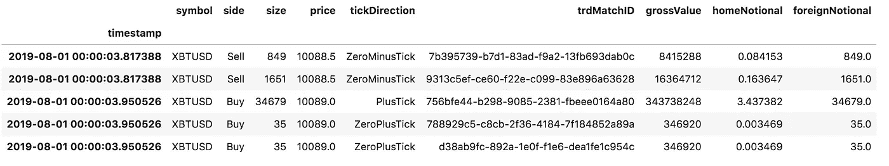
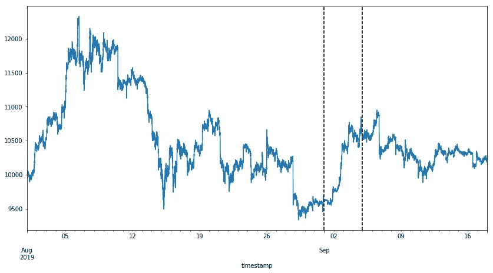
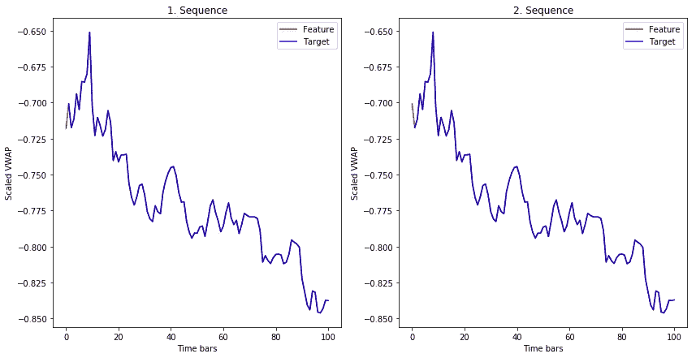
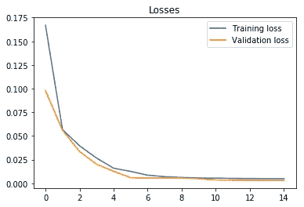
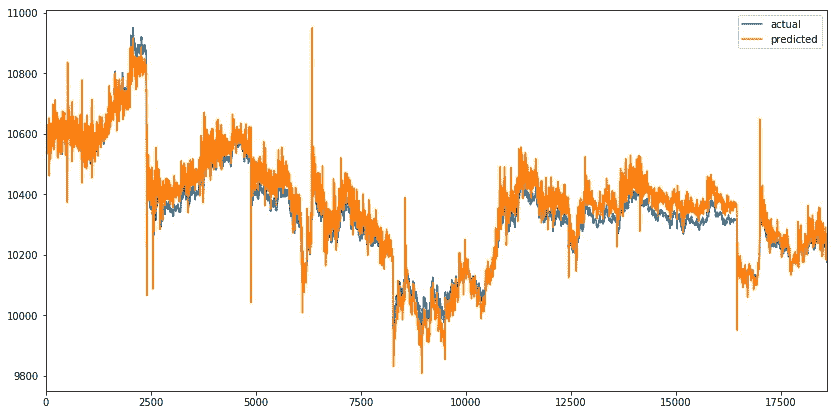
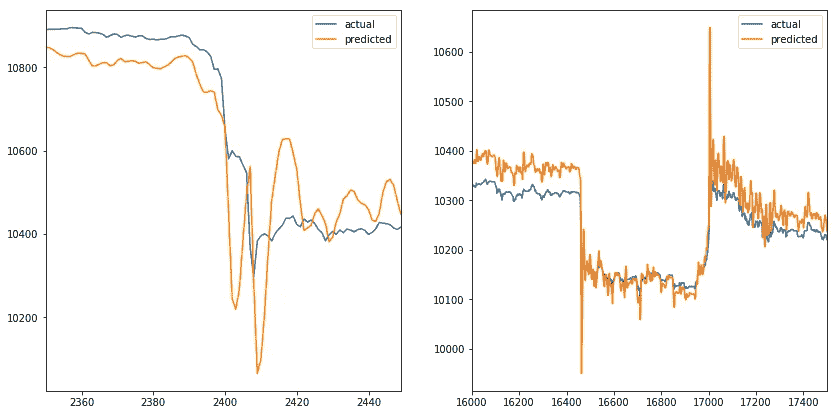
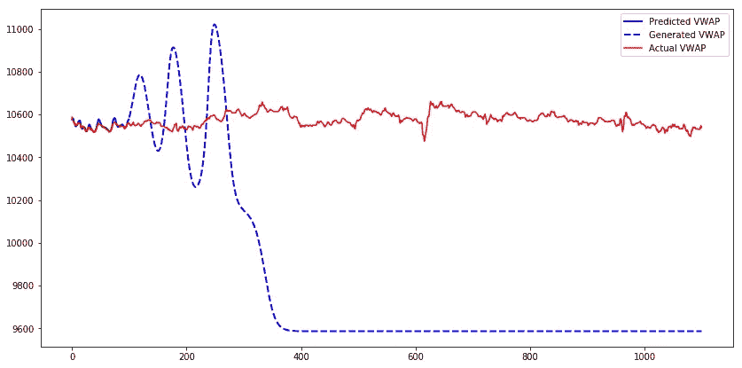
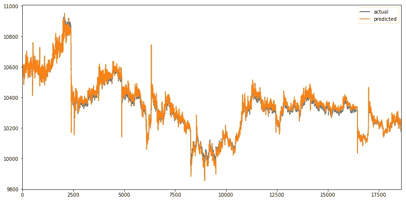
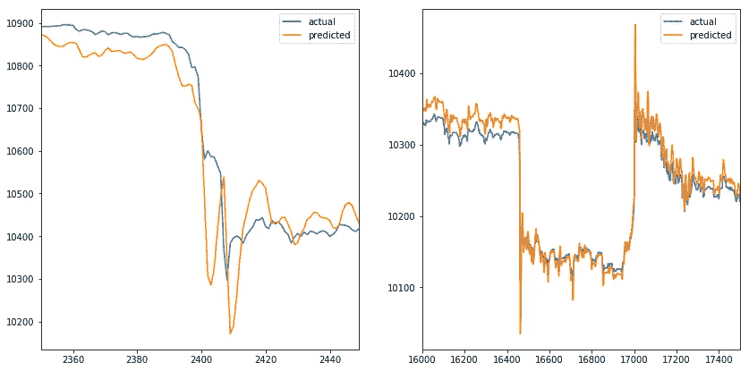
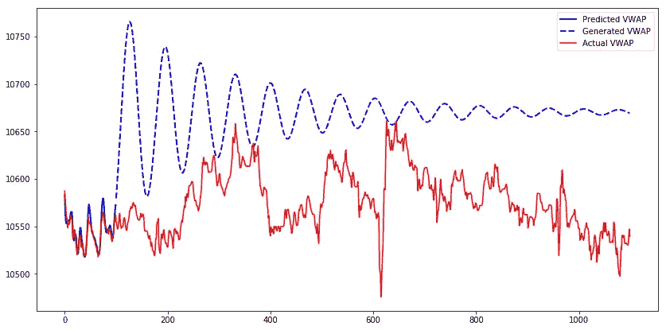

# 时间序列预测的 LSTM

> 原文：<https://towardsdatascience.com/lstm-for-time-series-prediction-de8aeb26f2ca?source=collection_archive---------1----------------------->


Time series prediction [Photo by rawpixel.com from Pexels](https://www.pexels.com/photo/photograph-of-a-document-1418347/)

使用神经网络(NN)来预测市场上的股票价格运动的想法与神经网络一样古老。凭直觉，只看过去似乎很难预测未来的价格走势。有很多关于如何预测价格走势或其威力的教程，把问题简单化了。我决定尝试用 LSTM 预测成交量加权平均价格，因为这看起来很有挑战性，也很有趣。

在这篇博客文章中，我将使用 PyTorch 对比特币交易数据训练一个长短期记忆神经网络(LSTM ),并使用它来预测未见过的交易数据的价格。我在寻找中级教程时遇到了相当大的困难，其中有一个训练 LSTM 进行时间序列预测的可重复示例，所以我整理了一个 [Jupyter 笔记本](https://romanorac.github.io/assets/notebooks/2019-09-27-time-series-prediction-with-lstm.ipynb)来帮助你开始。

## **这里有几个你可能会感兴趣的链接:**

```
- [Complete your Python analyses 10x faster with Mito](https://trymito.io/) [Product]- [Free skill tests for Data Scientists & ML Engineers](https://aigents.co/skills) [Test]- [All New Self-Driving Car Engineer Nanodegree](https://imp.i115008.net/c/2402645/1116216/11298)[Course]
```

*你愿意多读一些这样的文章吗？如果是这样，你可以点击上面的任何链接来支持我。其中一些是附属链接，但你不需要购买任何东西。*

# 正在加载必要的依赖项

让我们导入将要用于数据操作、可视化、模型训练等的库。我们将使用 PyTorch 库来训练 LSTM。

```
**%**matplotlib inlineimport glob
import matplotlib
import numpy **as** np
import pandas **as** pd
import sklearn
import torch
```

# 加载数据

我们要分析 BitMex 的 XBTUSD 交易数据。每日文件公开[下载](https://public.bitmex.com/?prefix=data/trade/)。我没有费心编写自动下载数据的代码，我只是简单地点击几次来下载文件。

让我们列出所有文件，将它们读取到一个 pandas 数据框架中，并通过 XBTUSD 符号过滤交易数据。按时间戳对数据帧进行排序很重要，因为有多个每日文件，这样它们就不会混淆。

```
files **=** sorted(glob**.**glob('data/*.csv.gz'))df **=** pd**.**concat(map(pd**.**read_csv, files))df **=** df[df**.**symbol **==** 'XBTUSD']df**.**timestamp **=** pd**.**to_datetime(df**.**timestamp**.**str**.**replace('D', 'T')) # covert to timestamp typedf **=** df**.**sort_values('timestamp')df**.**set_index('timestamp', inplace**=**True) # set index to timestampdf**.**head()
```



BitMex trade data

每行代表一种交易:

*   以微秒为单位的时间戳精度，
*   交易合约的符号，
*   交易的一方，买或卖，
*   大小代表合约数量(交易的美元数量)，
*   合同价格，
*   tickDirection 描述了自上次交易以来价格的上涨/下跌，
*   trdMatchID 是唯一的交易 ID，
*   grossValue 是交换的 satoshis 的数量，
*   家名义是交易中 XBT 的数量，
*   外币名义金额是交易中的美元金额。

我们将使用 3 列:时间戳，价格和外国名义。

# 数据预处理

让我们以 1 分钟的时间间隔计算[成交量加权平均价格(VWAP)](https://www.investopedia.com/terms/v/vwap.asp) 。我们根据预先定义的时间间隔对交易进行分组的数据表示叫做时间棒。这是表示交易数据进行建模的最佳方式吗？根据洛佩兹·德·普拉多的说法，市场上的交易并不是随时间均匀分布的。有一些活动频繁的时段，例如在期货合约到期之前，在预定义的时间间隔内对数据进行分组会在一些时间条内对数据进行过采样，而在其他时间条内对数据进行欠采样。[金融机器学习第 0 部分:条](/financial-machine-learning-part-0-bars-745897d4e4ba)是洛佩兹·德·普拉多的书[金融机器学习书籍](https://www.amazon.com/Advances-Financial-Machine-Learning-Marcos/dp/1119482089)第二章的一个很好的总结。时间条可能不是最好的数据表示，但无论如何我们都要使用它们。

```
df_vwap **=** df**.**groupby(pd**.**Grouper(freq**=**"1Min"))**.**apply(
    **lambda** row: pd**.**np**.**sum(row**.**price ***** row**.**foreignNotional) **/** pd**.**np**.**sum(row**.**foreignNotional))
```



Time bars showing XBTUSD VWAP from 1st of August till the 17th of September 2019

该图显示了 2019 年 8 月 1 日至 9 月 17 日 VWAP 的时间条。我们将把数据的第一部分用于训练集，中间部分用于验证集，最后一部分用于测试集(竖线是分隔符)。我们可以观察 VWAP 的波动性，那里的价格在 8 月上旬达到最高点，在 8 月底达到最低点。高点和低点在训练集中被捕获，这很重要，因为模型很可能在看不见的 VWAP 区间上工作得不好。

# 缩放数据

为了帮助 LSTM 模型更快地收敛，缩放数据是很重要的。输入中的大值可能会降低学习速度。我们将使用 sklearn 库中的 StandardScaler 来缩放数据。定标器安装在训练集上，用于转换验证集和测试集上的未知交易数据。如果我们在所有数据上拟合标量，模型将会过度拟合，并且它将在该数据上获得良好的结果，但是在真实世界的数据上性能会受到影响。

```
from sklearn.preprocessing import StandardScalerscaler **=** StandardScaler()
train_arr **=** scaler**.**fit_transform(df_train)
val_arr **=** scaler**.**transform(df_val)
test_arr **=** scaler**.**transform(df_test)
```

# 转换数据

缩放后，我们需要将数据转换成适合用 LSTM 建模的格式。我们将长数据序列转换成许多较短的序列(每个序列有 100 个时间条),每个时间条移动一个时间条。

```
from torch.autograd import Variable**def** **transform_data**(arr, seq_len):
    x, y **=** [], []
    **for** i **in** range(len(arr) **-** seq_len):
        x_i **=** arr[i : i **+** seq_len]
        y_i **=** arr[i **+** 1 : i **+** seq_len **+** 1]
        x**.**append(x_i)
        y**.**append(y_i)
    x_arr **=** np**.**array(x)**.**reshape(**-**1, seq_len)
    y_arr **=** np**.**array(y)**.**reshape(**-**1, seq_len)
    x_var **=** Variable(torch**.**from_numpy(x_arr)**.**float())
    y_var **=** Variable(torch**.**from_numpy(y_arr)**.**float())
    **return** x_var, y_varseq_len **=** 100x_train, y_train **=** transform_data(train_arr, seq_len)
x_val, y_val **=** transform_data(val_arr, seq_len)
x_test, y_test **=** transform_data(test_arr, seq_len)
```

下图显示了训练集中的第一个和第二个序列。两个序列的长度都是 100 倍棒。我们可以观察到，两个序列的目标几乎与特征相同，不同之处在于第一个和最后一个时间条。



The feature and target of the first and second sequence in the training set

**LSTM 在训练阶段如何使用这个序列？**

让我们关注第一个序列。该模型采用索引 0 处的时间条的特征，并尝试预测索引 1 处的时间条的目标。然后，它采用索引 1 处的时间条的特征，并试图预测索引 2 处的时间条的目标，等等。第二序列的特征从第一序列的特征偏移 1 个时间条，第三序列的特征从第二序列偏移 1 个时间条，等等。通过这一过程，我们得到了许多较短的序列，它们被一个时间条所移动。

请注意，在分类或回归任务中，我们通常有一组特征和一个我们试图预测的目标。在这个 LSTM 的例子中，特征和目标来自相同的序列，唯一的区别是目标移动了 1 倍。

# 长短期记忆神经网络

长短期记忆神经网络是一种递归神经网络(RNN)。rnn 使用先前的时间事件来通知后面的时间事件。例如，为了对电影中正在发生的事件进行分类，模型需要使用以前事件的信息。如果问题只需要最近的信息来执行当前的任务，那么 RNNs 工作得很好。如果问题需要长期依赖，RNN 将很难对其建模。LSTM 旨在学习长期依赖性。它能长时间记住信息。LSTM 是在 1997 年由舒米胡伯介绍的。要了解更多关于 LSTMs 的信息，请阅读一篇伟大的 [colah 博客文章](https://colah.github.io/posts/2015-08-Understanding-LSTMs/)，它提供了一个很好的解释。

下面的代码是时序预测的有状态 LSTM 的实现。它有一个 LSTMCell 单元和一个线性图层来模拟时间序列。该模型可以生成时间序列的未来值，并且可以使用教师强制(我将在后面描述这个概念)来训练它。

```
import torch.nn **as** nn
import torch.optim **as** optim **class** **Model**(nn**.**Module):
    **def** **__init__**(self, input_size, hidden_size, output_size):
        super(Model, self)**.**__init__()
        self**.**input_size **=** input_size
        self**.**hidden_size **=** hidden_size
        self**.**output_size **=** output_size
        self**.**lstm **=** nn**.**LSTMCell(self**.**input_size, self**.**hidden_size)
        self**.**linear **=** nn**.**Linear(self**.**hidden_size, self**.**output_size) **def** **forward**(self, input, future**=**0, y**=**None):
        outputs **=** [] *# reset the state of LSTM*
        *# the state is kept till the end of the sequence*
        h_t **=** torch**.**zeros(input**.**size(0), self**.**hidden_size, dtype**=**torch**.**float32)
        c_t **=** torch**.**zeros(input**.**size(0), self**.**hidden_size, dtype**=**torch**.**float32) **for** i, input_t **in** enumerate(input**.**chunk(input**.**size(1), dim**=**1)):
            h_t, c_t **=** self**.**lstm(input_t, (h_t, c_t))
            output **=** self**.**linear(h_t)
            outputs **+=** [output] **for** i **in** range(future):
            **if** y **is** **not** None **and** random**.**random() **>** 0.5:
                output **=** y[:, [i]]  *# teacher forcing*
            h_t, c_t **=** self**.**lstm(output, (h_t, c_t))
            output **=** self**.**linear(h_t)
            outputs **+=** [output]
        outputs **=** torch**.**stack(outputs, 1)**.**squeeze(2)
        **return** outputs
```

# 训练 LSTM

我们用 21 个隐藏单位训练 LSTM。使用的单位数量较少，这样 LSTM 就不太可能完全记住这个序列。我们使用均方误差损失函数和 Adam 优化器。学习率被设置为 0.001，并且每 5 个时期衰减一次。我们用每批 100 个序列训练该模型 15 个时期。从下面的图中，我们可以观察到训练和验证损失在第六个历元之后收敛。



Training and validation loss

让我们在测试集上评估模型。future 参数设置为 5，这意味着模型输出它认为在接下来的 5 个时间条(在我们的示例中为 5 分钟)中的 VWAP。这将使价格变化在发生前的几个时间段内可见。

在下图中，我们可以观察到预测值与 VWAP 的实际值非常接近，乍一看这似乎很好。但是 future 参数被设置为 5，这意味着橙色线应该在尖峰出现之前做出反应，而不是覆盖它。



Actual and predicted VWAP on the test set

当我们放大尖峰时(一个在时间序列的开始，另一个在时间序列的结束)。我们可以观察到预测值模拟了实际值。当实际值改变方向时，预测值也跟着改变，这对我们没有太大帮助。同样的情况发生在我们增加未来参数的时候(就像不影响预测线一样)。



Two VWAP spikes with actual and predicted values

让我们用模型为第一个测试序列生成 1000 个时间条，并比较预测的、生成的和实际的 VWAP。我们可以观察到，虽然模型输出预测值，但它们接近实际值。但是当它开始产生值时，输出几乎类似正弦波。经过一段时间后，数值收敛到 9600。



Predicted, generated and actual VWAP of the first test sequence

之所以会出现这种情况，是因为模型仅使用真实输入进行了训练，而从未使用生成的输入进行过训练。当模型从输入中获得生成的输出时，它在生成下一个值方面做得很差。教师强迫是处理这个问题的一个概念。

# 教师强迫

[教师强制](https://machinelearningmastery.com/teacher-forcing-for-recurrent-neural-networks/)是一种训练递归神经网络的方法，它使用前一时间步的输出作为输入。当训练 RNN 时，它可以通过使用先前的输出作为当前输入来生成序列。在训练期间可以使用相同的过程，但是模型可能变得不稳定或者不收敛。教师强迫是在培训中解决这些问题的一种方法。它通常用在语言模型中。

我们将使用教师强制的扩展，称为[预定抽样](https://arxiv.org/abs/1506.03099)。该模型将在训练期间使用其生成的输出作为具有一定概率的输入。起初，模型看到其生成输出的概率很小，然后在训练期间逐渐增加。注意，在这个例子中，我们使用随机概率，它在训练过程中不会增加。

让我们使用与之前相同的参数训练一个模型，但是启用了教师强制。在 7 个时期之后，训练和验证损失收敛。


Training and validation loss with teacher forcing



Actual and predicted VWAP on the test set with teacher forcing

我们可以观察到和以前相似的预测序列。当我们放大峰值时，可以观察到模型的类似行为，其中预测值模拟实际值。好像老师强迫并没有解决问题。



Two VWAP spikes with actual and predicted values with teacher forcing

让我们用教师强制训练的模型为第一个测试序列生成 1000 个时间条。



Predicted, generated and actual VWAP of the first test sequence with teacher forcing

通过教师强制训练的模型生成的序列需要更长的时间来收敛。关于生成序列的另一个观察结果是，当它增加时，它将继续增加到某个点，然后开始减少，模式重复，直到序列收敛。该模式看起来像一个振幅递减的正弦波。

# 结论

这个实验的结果是模型的预测模拟了序列的实际值。第一个和第二个模型在价格变化发生之前不检测价格变化。添加另一个要素(如交易量)可能有助于模型在价格变化发生之前检测到价格变化，但随后模型将需要生成两个要素，以将这些要素的输出用作下一步的输入，这将使模型变得复杂。使用更复杂的模型(多个 LSTMCells，增加隐藏单元的数量)可能没有帮助，因为该模型具有预测 VWAP 时间序列的能力，如上图所示。更先进的教师强制方法可能会有所帮助，因此该模型将提高序列生成技能。

# 参考

*   [时间序列预测](https://github.com/pytorch/examples/tree/master/time_sequence_prediction)
*   [了解 LSTM 网络](https://colah.github.io/posts/2015-08-Understanding-LSTMs/)
*   [什么是递归神经网络的教师强迫？](https://machinelearningmastery.com/teacher-forcing-for-recurrent-neural-networks/)
*   [用递归神经网络进行序列预测的预定采样](https://arxiv.org/abs/1506.03099)

# 在你走之前

在 [Twitter](https://twitter.com/romanorac) 上关注我，在那里我定期[发布关于数据科学和机器学习的](https://twitter.com/romanorac/status/1328952374447267843)消息。


Photo by [Courtney Hedger](https://unsplash.com/@cmhedger?utm_source=medium&utm_medium=referral) on [Unsplash](https://unsplash.com/?utm_source=medium&utm_medium=referral)