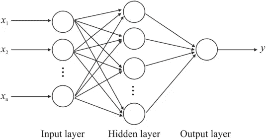
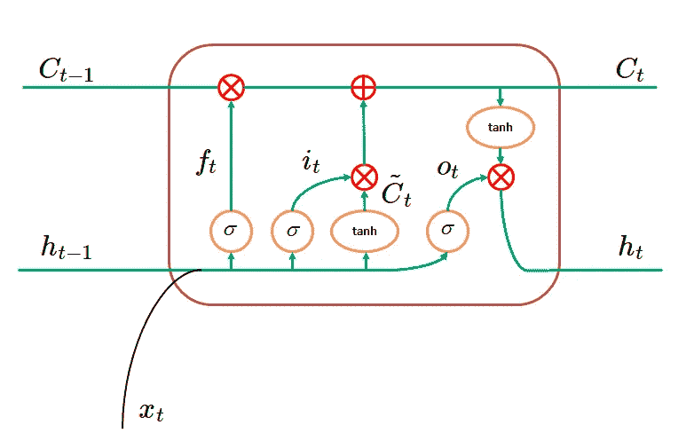

# LSTM:如何训练神经网络像洛夫克拉夫特一样写作

> 原文：<https://towardsdatascience.com/lstm-how-to-train-neural-networks-to-write-like-lovecraft-e56e1165f514?source=collection_archive---------11----------------------->


近年来，LSTM 神经网络在文本和音乐生成以及时间序列预测方面有着广泛的应用。

今天，我将教你如何训练一个用于文本生成的 LSTM 神经网络，使它能够以 H. P. Lovecraft 的风格写作。

为了训练这个 LSTM，我们将使用 TensorFlow 的 Keras API for Python。

我从这本很棒的 [LSTM 神经网络教程](http://colah.github.io/posts/2015-08-Understanding-LSTMs/)中了解到这个主题。我的代码紧跟这个[文本生成教程](https://chunml.github.io/ChunML.github.io/project/Creating-Text-Generator-Using-Recurrent-Neural-Network/)。

我将像往常一样向您展示我的 Python 示例和结果，但是首先，让我们做一些解释。

# 什么是 LSTM 神经网络？

最普通的神经网络，称为多层感知器，只是完全连接的层的组合。

在这些模型中，输入是特征向量，每个后续层是一组“神经元”。

每个神经元对前一层的输出执行仿射(线性)变换，然后对该结果应用一些非线性函数。

一层神经元的输出，一个新的向量，被提供给下一层，以此类推。



[Source](https://www.researchgate.net/figure/A-hypothetical-example-of-Multilayer-Perceptron-Network_fig4_303875065)

LSTM(长短期记忆)神经网络只是另一种类型的[人工神经网络](http://www.datastuff.tech/machine-learning/autoencoder-deep-learning-tensorflow-eager-api-keras/)，在其某些层中包含 LSTM 细胞作为神经元。

很像[卷积层](http://www.datastuff.tech/machine-learning/convolutional-neural-networks-an-introduction-tensorflow-eager/)帮助神经网络学习图像特征，LSTM 细胞帮助网络学习时态数据，这是其他机器学习模型传统上难以解决的问题。

LSTM 细胞是如何工作的？我现在将解释它，尽管我强烈建议你也给那些教程一个机会。

# LSTM 细胞是如何工作的？

LSTM 图层将包含许多 LSTM 像元。

我们的神经网络中的每个 LSTM 细胞将只查看其输入的单个列，并且还查看前一列的 LSTM 细胞的输出。

通常，我们将一个完整的矩阵作为 LSTM 神经网络的输入，其中每一列对应于下一列“之前”的内容。

这样，每个 LSTM 单元将有**两个不同的输入向量**:前一个 LSTM 单元的输出(给它一些关于前一个输入列的信息)和它自己的输入列。

# 行动中的 LSTM 细胞:一个直观的例子。

例如，如果我们正在训练一个 LSTM 神经网络来预测股票交易值，我们可以向它输入一个向量，其中包含股票在过去三天的收盘价。

在这种情况下，第一个 LSTM 单元将使用第一天作为输入，并将一些提取的特征发送到下一个单元。

在为下一个单元生成新的输入之前，第二个单元将查看第二天的价格，以及前一个单元从昨天获得的任何信息。

对每个单元格执行此操作后，最后一个单元格实际上会有很多时态信息。它将从前一个单元接收从昨天收盘价和前两个单元(通过其他单元提取的信息)获得的信息。

您可以尝试不同的时间窗口，也可以改变查看每天数据的单位(神经元)数量，但这是总体思路。

# LSTM 细胞如何工作:数学。

每个细胞从前一个细胞中提取的信息背后的实际数学要复杂一些。

## 忘记大门

“遗忘门”是一个 sigmoid 层，它调节前一个细胞的输出对这个细胞的影响程度。

它将前一个单元的“隐藏状态”(另一个输出向量)和前一层的实际输入作为输入。

因为它是一个 sigmoid，所以它将返回一个“概率”向量:介于 0 和 1 之间的值。

他们将**乘以前一个单元的输出**来调节他们拥有多大的影响力，从而创建这个单元的状态。

例如，在极端的情况下，sigmoid 可能返回一个零向量，整个状态将被乘以 0，从而被丢弃。

例如，如果该层在输入分布中看到非常大的变化，则可能发生这种情况。

## 输入门

与遗忘门不同，输入门的输出被加到前一个单元的输出上(在它们乘以遗忘门的输出之后)。

输入门是两个不同层的输出的点积，尽管它们都采用与遗忘门相同的输入(前一个单元的隐藏状态和前一层的输出):

*   一个 **sigmoid 单元**，调节新信息对该细胞输出的影响程度。
*   一个 **tanh 单元**，它实际上提取新的信息。注意 tanh 取-1 和 1 之间的值。

这两个单元的**乘积(也可以是 0，或者正好等于 tanh 输出，或者介于两者之间的任何值)被添加到该神经元的细胞状态中。**

## LSTM 细胞的输出

单元格的状态是下一个 LSTM 单元格将接收的输入，以及该单元格的隐藏状态。

隐藏状态将是**应用于该神经元状态的另一个双曲正切单位**，乘以另一个 **sigmoid 单位**，后者获取前一层和细胞的输出(就像遗忘门一样)。

这是每个 LSTM 细胞的可视化效果，借用我刚才链接的教程:



Source: [Text Generating LSTMs](https://chunml.github.io/ChunML.github.io/project/Creating-Text-Generator-Using-Recurrent-Neural-Network/)

既然我们已经讨论了理论，让我们继续讨论一些实际应用吧！

像往常一样，所有的代码都可以在 GitHub 上找到，如果你想试试的话，或者你也可以跟着去看看要点。

# 用张量流 Keras 训练 LSTM 神经网络

在这个任务中，我使用了这个包含 60 个爱情故事的[数据集。](https://github.com/vilmibm/lovecraftcorpus)

由于他的大部分作品是在 20 年代创作的，他于 1937 年去世，所以现在大部分作品都在公共领域，所以不难得到。

我认为训练一个神经网络像他一样写作会是一个有趣的挑战。

这是因为，一方面，他有非常鲜明的风格(有丰富的紫色散文:使用怪异的词语和精心制作的语言)，但另一方面，他使用了非常复杂的词汇，一个网络可能很难理解它。

例如，这是数据集中第一个故事的随机句子:

> *到了晚上，外面黑暗的城市里微妙的骚动，老鼠在爬满虫子的隔墙里阴险的窜来窜去，还有百年老屋里隐藏的木头吱吱作响，这些都足以给他一种刺耳的混乱感*

如果我能让一个神经网络写出“pandemonium”，那我会印象深刻。

# 预处理我们的数据

为了训练 LSTM 神经网络生成文本，我们必须首先预处理我们的文本数据，以便它可以被网络使用。

在这种情况下，由于神经网络将向量作为输入，我们需要一种方法将文本转换为向量。

对于这些例子，我决定训练我的 LSTM 神经网络来预测字符串中接下来的 M 个字符，将前面的 N 个字符作为输入。

为了能够输入 N 个字符，我对它们中的每一个都进行了一次性编码，因此网络的输入是 CxN 个元素的矩阵，其中 C 是我的数据集中不同字符的总数。

首先，我们读取文本文件并连接它们的所有内容。

我们限制我们的字符是字母数字，加上一些标点符号。

然后我们可以将字符串一次性编码成矩阵，其中第 *j* 列的每个元素都是 0，除了对应于语料库中第 *j* 个字符的元素。

为了做到这一点，我们首先定义一个字典，为每个字符分配一个索引。

请注意，如果我们希望对数据进行采样，我们可以将变量*切片*变小。

我还为*SEQ _ 长度*选择了一个值 50，让网络接收 50 个字符并尝试预测接下来的 50 个字符。

# 在 Keras 中训练我们的 LSTM 神经网络

为了训练神经网络，我们必须首先定义它。

该 Python 代码创建了一个具有两个 LSTM 层的 LSTM 神经网络，每个层具有 100 个单元。

请记住，每个单元在输入序列中的每个字符都有一个单元格，即 50。

这里的 *VOCAB_SIZE* 只是我们将使用的字符数量，而 *TimeDistributed* 是一种将给定层应用到每个不同单元格的方式，保持时间顺序。

对于这个模型，我实际上尝试了许多不同的学习速率来测试收敛速度与过度拟合。

以下是培训代码:

你看到的是在损失最小化方面表现最好的产品。

然而，在最后一个时期(500 个时期之后)的 binary_cross_entropy 为 0.0244 时，模型的输出看起来是这样的。

```
Tolman hast toemtnsteaetl nh otmn tf titer aut tot tust tot ahen h l the srrers ohre trrl tf thes snneenpecg tettng s olt oait ted beally tad ened ths tan en ng y afstrte and trr t sare t teohetilman hnd tdwasd hxpeinte thicpered the reed af the satl r tnnd Tev hilman hnteut iout y techesd d ty ter thet te wnow tn tis strdend af ttece and tn aise ecn
```

这个输出有许多**好的方面**，也有许多**不好的方面**。

设置间距的方式与语料库中实际的单词长度分布非常相似，单词长度大多在 2 到 5 个字符之间，有一些更长的异常值。

我还注意到**字母**、【T】、【E】和【I】在**中出现得非常普遍**，而【y】或【x】出现得不太频繁**。**

**当我在样本输出和语料库中查看**字母相对频率**时，它们非常相似。是**命令**使**完全脱离**。**

**关于大写字母如何只出现在空格之后，也有一些要说的，在英语中通常是这样。**

**为了生成这些输出，我简单地要求模型为语料库中不同的 50 个字符子集预测接下来的 50 个字符。如果训练数据如此糟糕，我认为测试或随机数据不值得检查。**

**这些废话实际上让我想起了 H. P .洛夫克拉夫特最著名的故事之一，“克苏鲁的召唤”，在那里人们开始对这个宇宙的、邪恶的存在产生幻觉，他们说这样的话:**

> **Ph ' nglui mglw ' nafhCthulhu R ' lyeh*wgah ' nagl FH tagn。***

**遗憾的是，这个模型也没有过度拟合，显然是**欠拟合**。**

**所以我试图把它的任务变小，把模型变大:125 个单元，只预测 30 个字符。**

# **更大的模型，更小的问题。有结果吗？**

**有了这个更小的模型，又过了 500 个纪元，一些模式开始出现。**

**即使损失函数没有那么小(在 210)，字符的频率仍然与语料库相似。**

**尽管字符的排序有了很大的改进:这里有一个来自其输出的随机样本，看看您是否能发现一些单词。**

```
the sreun troor Tvwood sas an ahet eae rin and t paared th te aoolling onout The e was thme trr t sovtle tousersation oefore tifdeng tor teiak uth tnd tone gen ao tolman aarreed y arsred tor h tndarcount tf tis feaont oieams wnd toar Tes heut oas nery tositreenic and t aeed aoet thme hing tftht to te tene Te was noewked ay tis prass s deegn aedgireean ect and tot ced the sueer anoormal -iuking torsarn oaich hnher tad beaerked toring the sars tark he e was tot tech
```

**科技，这个，那个，曾经… **小词**才是重点！它还意识到许多单词以常用后缀结尾，如-ing、-ed 和-tion。**

**在 10000 个单词中，有 740 个单词是“ *the* ”，37 个单词以“ *tion* 结尾(其中只有 3 个单词没有结尾)，115 个单词以— *ing* 结尾。**

**其他常见的单词是“than”和“than”，尽管该模型显然仍然无法生成英语句子。**

# **更大的模型**

**这给了我希望。神经网络显然在学习某些东西，只是还不够。**

**所以当你的模型不合适时，我做了你做的事情:我尝试了一个更大的神经网络。**

**考虑到这一点，我正在我的笔记本电脑上运行。**

**凭借适中的 16GB 内存和 i7 处理器，这些型号需要数小时才能学会。**

**因此，我将单位数量设置为 150，并在 50 个字符处再次尝试。**

**我想也许给它一个更小的时间窗口会让网络变得更困难。**

**经过几个小时的训练后，这个模型的输出是这样的。**

```
andeonlenl oou torl u aote targore -trnnt d tft thit tewk d tene tosenof the stown ooaued aetane ng thet thes teutd nn aostenered tn t9t aad tndeutler y aean the stun h tf trrns anpne thin te saithdotaer totre aene Tahe sasen ahet teae es y aeweeaherr aore ereus oorsedt aern totl s a dthe snlanete toase af the srrls-thet treud tn the tewdetern tarsd totl s a dthe searle of the sere t trrd eneor tes ansreat tear d af teseleedtaner nl and tad thre n tnsrnn tearltf trrn T has tn oredt d to e e te hlte tf the sndirehio aeartdtf trrns afey aoug ath e -ahe sigtereeng tnd tnenheneo l arther ardseu troa Tnethe setded toaue and tfethe sawt ontnaeteenn an the setk eeusd ao enl af treu r ue oartenng otueried tnd toottes the r arlet ahicl tend orn teer ohre teleole tf the sastr ahete ng tf toeeteyng tnteut ooseh aore of theu y aeagteng tntn rtng aoanleterrh ahrhnterted tnsastenely aisg ng tf toueea en toaue y anter aaneonht tf the sane ng tf the
```

**纯粹的废话，除了一大堆“这个”和“那个”**

**实际上，它说“the”的次数比前一个多，但它还没有学会动名词(no -ing)。**

**有趣的是，这里很多单词以“-ed”结尾，这意味着它有点领会了**过去式**的意思。**

**我让它多经历了几百个时代(总共 750 个)。**

**输出没有太大变化，仍然有很多“The”、“a”和“an”，仍然没有更大的结构。这是另一个例子:**

```
Tn t srtriueth ao tnsect on tias ng the sasteten c wntnerseoa onplsineon was ahe ey thet tf teerreag tispsliaer atecoeent of teok ond ttundtrom tirious arrte of the sncirthio sousangst tnr r te the seaol enle tiedleoisened ty trococtinetrongsoa Trrlricswf tnr txeenesd ng tispreeent T wad botmithoth te tnsrtusds tn t y afher worsl ahet then
```

**这里出现了一个有趣的现象，介词和代词的使用。**

**网络上写过几次“我”“你”“她”“我们”“的”等类似的词。总之，**介词和代词**约占总样本词的 **10%。****

**这是一个进步，因为网络显然在学习低熵单词。**

**然而，它仍然远远不能产生连贯的英语文本。**

**我让它多训练了 100 个纪元，然后杀了它。**

**这是它最后的输出。**

```
thes was aooceett than engd and te trognd tarnereohs aot teiweth tncen etf thet torei The t hhod nem tait t had nornd tn t yand tesle onet te heen t960 tnd t960 wndardhe tnong toresy aarers oot tnsoglnorom thine tarhare toneeng ahet and the sontain teadlny of the ttrrteof ty tndirtanss aoane ond terk thich hhe senr aesteeeld Tthhod nem ah tf the saar hof tnhe e on thet teauons and teu the ware taiceered t rn trr trnerileon and
```

**我知道它已经尽了最大努力，但它并没有真正取得任何进展，至少还不够快。**

**我想到了用**批量归一化**加快收敛速度。**

**然而，我在 StackOverflow 上读到 BatchNorm 不应该与 LSTM 神经网络一起使用。**

**如果你们中的任何人对 LSTM 篮网更有经验，请在评论中告诉我这是否正确！**

**最后，我用 10 个字符作为输入，10 个字符作为输出，尝试了同样的任务。**

**我想这个模型没有得到足够的上下文来足够好地预测事情:结果很糟糕。**

**我认为实验暂时结束了。**

# **结论**

**虽然很明显，看着其他人的工作，LSTM 神经网络*可以*像 Lovecraft 一样学习写作，但我不认为我的个人电脑足够强大，可以在合理的时间内训练一个足够大的模型。**

**或者可能它需要比我更多的数据。**

**将来，我想用基于单词的方法而不是基于字符的方法来重复这个实验。**

**我查了一下，语料库里大概有 10%的词只出现一次。**

**如果我在培训前移除它们，有什么好的做法可以遵循吗？比如把所有名词都换成同一个，从[簇](http://www.datastuff.tech/machine-learning/k-means-clustering-unsupervised-learning-for-recommender-systems/)中取样，或者其他什么？请让我知道！我敢肯定，你们中的许多人在 LSTM 神经网络方面比我更有经验**

**你认为这在不同的架构下会更好吗？一些我应该用不同方式处理的事情？也请让我知道，我想了解更多关于这一点。**

**你在我的代码中发现任何新的错误了吗？你认为我不去 XYZ 是个白痴吗？或者你真的觉得我的实验很有趣，或者你甚至从这篇文章中学到了什么？**

**如果你想讨论这个或任何相关话题，请在 [Twitter](http://www.twitter.com/strikingloo) 、 [LinkedIn](http://linkedin.com/in/luciano-strika) 、 [Medium](http://medium.com/@strikingloo) 或 [Dev.to](http://www.dev.to/strikingloo) 上联系我。**

***如果你想成为一名数据科学家，或者想学习新的东西，可以看看我的* [*机器学习阅读清单*](http://www.datastuff.tech/data-science/3-machine-learning-books-that-helped-me-level-up-as-a-data-scientist/) *！***

***原载于 2019 年 6 月 24 日*[*http://www . data stuff . tech*](http://www.datastuff.tech/machine-learning/lstm-how-to-train-neural-networks-to-write-like-lovecraft/)*。***