# LSTM 探测尼安德特人的 DNA

> 原文：<https://towardsdatascience.com/lstm-to-detect-neanderthal-dna-843df7e85743?source=collection_archive---------6----------------------->

## [生命科学的深度学习](https://towardsdatascience.com/tagged/dl-for-life-sciences)

## 用于古代基因组学的长记忆神经网络

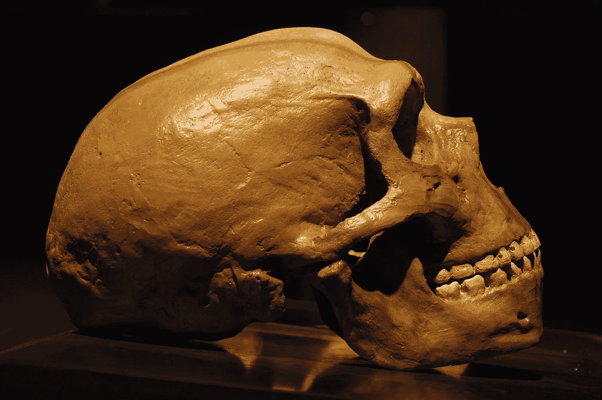

Image licence from [iStock](https://www.istockphoto.com)

这是我的专栏 [**生命科学深度学习**](https://towardsdatascience.com/tagged/dl-for-life-sciences) 的第八篇文章，在这里我演示了如何将深度学习用于[古代 DNA](/deep-learning-on-ancient-dna-df042dc3c73d) 、[单细胞生物学](/deep-learning-for-single-cell-biology-935d45064438)、[组学数据集成](/deep-learning-for-data-integration-46d51601f781)、[临床诊断](/deep-learning-for-clinical-diagnostics-ca7bc254e5ac)和[显微成像](/deep-learning-on-microscopy-imaging-865b521ec47c)。在关于尼安德特人基因**的 [**深度学习中，我强调了深度学习和**](/deep-learning-on-neanderthal-genes-ad1478cf37e7) **[NLP](https://en.wikipedia.org/wiki/Natural_language_processing) 对于 [**古代基因组**](https://en.wikipedia.org/wiki/Ancient_DNA) 的巨大潜力，并演示了如何实际开始使用它来推断现代人类基因组中 [**尼安德特人渗入**](https://en.wikipedia.org/wiki/Interbreeding_between_archaic_and_modern_humans) 的区域。现在，我们将运用长记忆[递归神经网络](https://en.wikipedia.org/wiki/Long_short-term_memory)的全部力量，更好地预测现代人类基因组中尼安德特人祖先的片段。****

# **HMM 对 LSTM 的古基因组学**

**DNA 是一个具有**长记忆**的序列，这是通过沿着序列的**长程相关性**表现出来的，这被称为 [**连锁不平衡**](https://en.wikipedia.org/wiki/Linkage_disequilibrium) 。然而，古代基因组学中的许多分析都是使用[隐马尔可夫模型(HMM)](https://en.wikipedia.org/wiki/Hidden_Markov_model) 进行的，这是一种**无记忆**模型，只能考虑前面的几个步骤。 [**长短期记忆(LSTM)**](https://en.wikipedia.org/wiki/Long_short-term_memory) 人工神经网络[已经显示出](http://karpathy.github.io/2015/05/21/rnn-effectiveness/)到**在许多应用中胜过****HMM**，例如语音识别、文本生成等。假设有足够的数据可用，通过利用他们独特的能力来按顺序记忆**许多先前的步骤**。**

**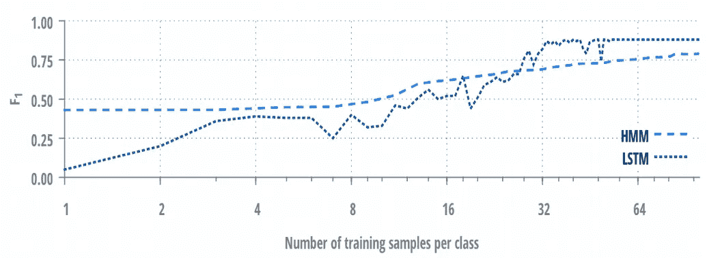**

**[From Panzner and Cimiano, Machine Learning, Optimization, and Big Data, 2016](https://link.springer.com/chapter/10.1007/978-3-319-51469-7_8)**

**基因组学和古代基因组学代表了一个真正的大数据资源，这要归功于[下一代测序(NGS)](https://en.wikipedia.org/wiki/DNA_sequencing) ，它提供了**数百万和数十亿个** **序列**，可以用作训练 LSTMs 的训练示例/统计观察。因此，古代基因组数据是深度学习的一份礼物！**

**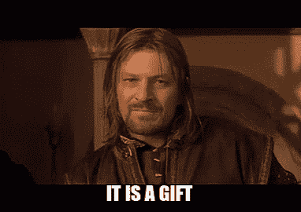**

**[Image source](https://tenor.com/search/boromir-gifs)**

**尽管基因组学/古代基因组学的培训资源**繁荣**，大多数分析仍然是在**模拟的**基因组数据上进行的，其中 [**合并理论**](https://en.wikipedia.org/wiki/Coalescent_theory) 可能是最流行的[模拟人口统计学和群体遗传学中的选择](https://www.ncbi.nlm.nih.gov/pmc/articles/PMC2916717/)的框架。**

# **尼安德特人 DNA 上的 LSTM +单词嵌入**

**在这里，我将扩展我在之前的帖子 [**中表达的关于使用**](/deep-learning-on-neanderthal-genes-ad1478cf37e7) **[NLP](https://en.wikipedia.org/wiki/Natural_language_processing) 进行古代基因组学的想法，并展示 LSTMs** 在分析测序数据方面的**优势。你可能已经注意到，前一篇文章中的深度学习不是特别“深”，而是相当“广”，此外，随机森林似乎在[单词袋](https://en.wikipedia.org/wiki/Bag-of-words_model)模型中表现得更好。在这里，我将实现一个 LSTM 模型，它可以达到 99%的准确率来检测从尼安德特人那里继承的 DNA 片段。我在[之前的帖子中展示了如何提取尼安德特人渐渗和耗尽的序列，](/deep-learning-on-neanderthal-genes-ad1478cf37e7)所以在这里我将从读取序列开始，将它们分割成 200 个核苷酸长的子序列，每个子序列代表一个句子，这样我们可以进一步将每个句子分割成 **k-mers** /句子的单词。****

**我们最终得到了 737，340 个句子，它们属于两类:尼安德特人渗入和耗尽。下一步是通过使用 Python 中的**标记器**类将 k-mers /单词转换成**整数**来对句子进行热编码。注意，在我们的例子中并不需要填充，因为所有的句子都是一样长的， **191 k-mers 长**，但是我把它包含在这里是为了通用性。**

**在我们的例子中，词汇量为 964 114，小于 4^10 = 1 048 576，这意味着不是所有可能的由 4 个字符组成的 10 聚体都存在于序列中。最后，我们定义了一个**序列模型**，从 **Keras 嵌入层**开始，该嵌入层在对序列进行分类时学习**单词嵌入**，随后是**双向 LSTM** 和密集层。**

**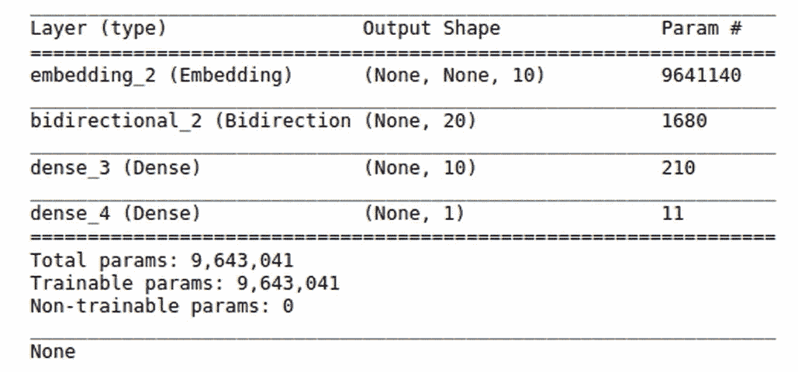**

**在第一层使用**字嵌入**的优点是**维数从 964×114 减少到 10 维。这通过强制**相似单词**共享拟合参数/权重来减少过度拟合并提高模型的**可推广性**。现在我们可以开始训练我们的模型了。****

**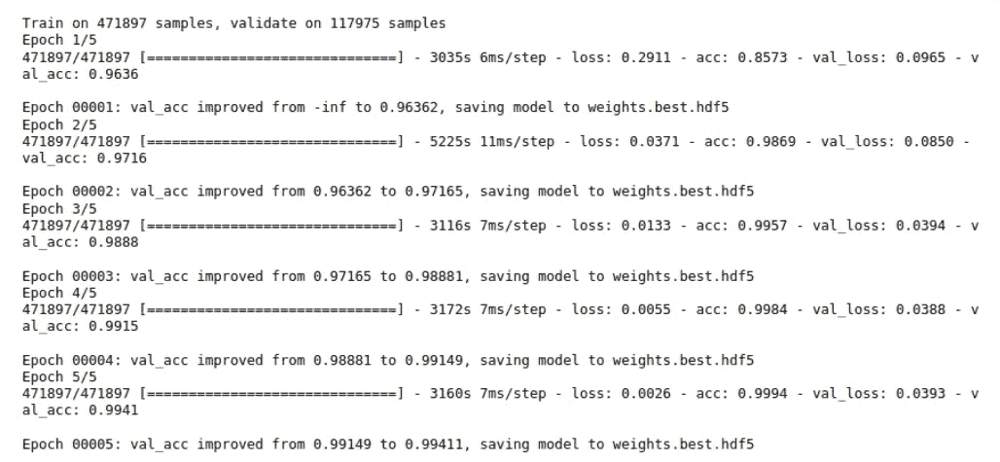**

**仅执行 5 个时期的训练就足够了，因为模型在验证数据集上很快达到了令人惊讶的 99% 的**准确度。****

**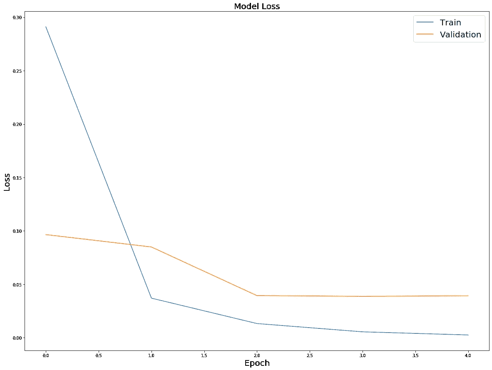****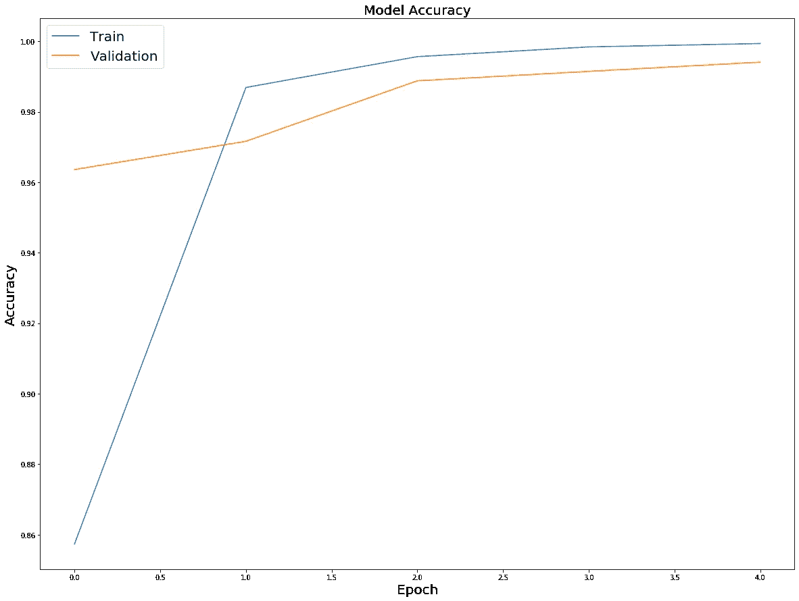**

**在**测试数据集**上评估模型性能，我们再次获得对尼安德特人渐渗序列与耗尽序列进行分类的准确度的 **99%** **。****

**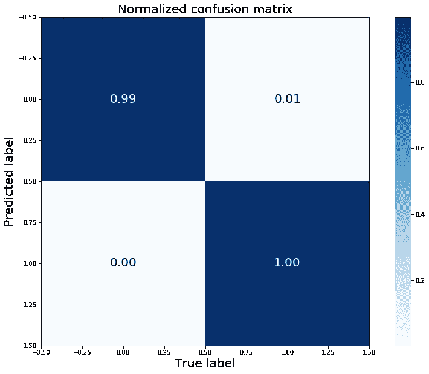**

**现在我们有了一个经过训练的 LSTM 模型，我们稍后将使用它来预测从尼安德特人那里继承的基因序列。现在是对模型进行**解释**的时候了，这包括词汇表的可视化和检测驱动分类的最具预测性的 k-mers。**

# **可视化单词嵌入**

**目前，每个 k-mer /单词由一个 **10 维向量**表示，因为我们在网络前端应用了一个**嵌入层**。为了可视化嵌入层已经学习了什么，我们首先需要保存层的**权重**和词汇表的**单词**。**

**为了可视化，我们可以在这里使用 **Tensorflow 嵌入式投影仪**[http://projector.tensorflow.org/](http://projector.tensorflow.org/)并使用 [**UMAP**](https://arxiv.org/abs/1802.03426) 非线性降维技术研究 k-mers 的**聚类。****

**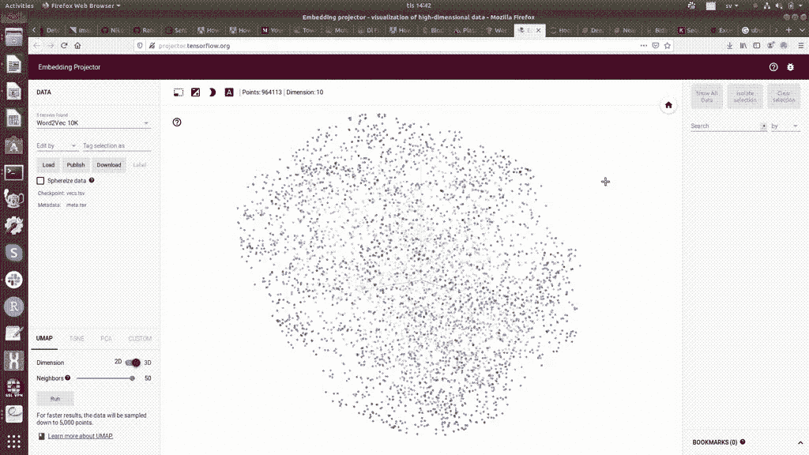**

**嵌入层学习到的 k-mers 之间的关系看起来与[上一篇文章](/deep-learning-on-neanderthal-genes-ad1478cf37e7)中提出的 Word2Vec 嵌入非常不同，并且没有揭示富含 AT 和富含 GC 的 k-mers 的任何明显聚类。**

# **识别最具预测性的 K-mers**

**为神经网络构建特征重要性的一种方法是对输入数据施加一些**扰动**，并在网络输出端监控预测准确度的**变化**。这里，我们希望找到**最具** **信息量的 k-mers** ，然而，在我们的例子中，输入矩阵 X 具有维度(737340，191)，其中第一维表示神经网络的训练样本的数量，第二维对应于每个句子/序列中的单词数量。这意味着每个单词/ k-mer 的**索引**(或句子中的**位置**)是输入矩阵 x 的**特征**。因此，如果我们在 737340 个样本中一次一个地混洗 191 个特征中的每一个，并检查与未扰动的输入矩阵相比准确度的下降，我们可以根据它们对最终预测的重要性对特征进行排序。在我们的例子中，排列特征相当于确定单词/ k-mers 在所有句子/序列中最重要的位置。**

**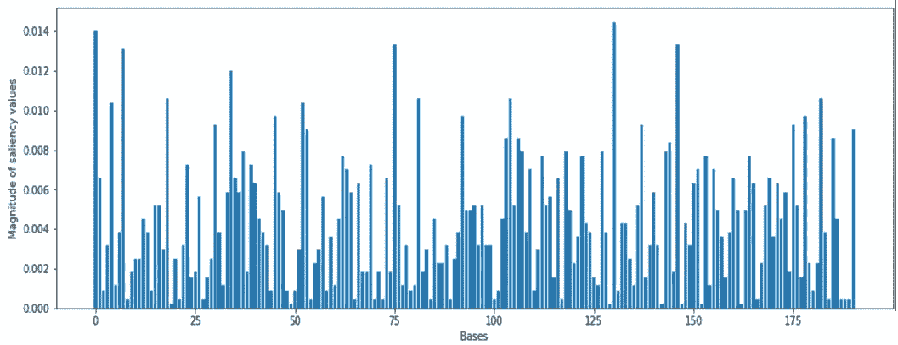**

**如果我们选择改变准确度高于 0.01 的单词的位置/索引，我们得出单词 0、4、7、18、34、52、75、81、104、130、146 和 182 是最重要的。也许，我们在句子的开头的**处观察到一些重要单词的浓缩。现在，我们简单地检查一下在上述位置的所有句子中最常见的单词/ k-mers。****

**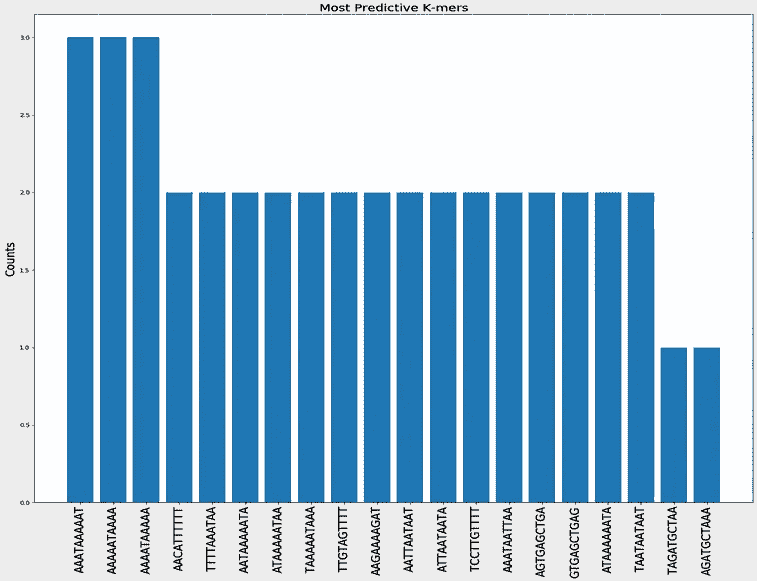**

**令人放心的是，我们观察到**富含 at 的 k-mers** 在尼安德特人渐渗序列和耗尽序列之间的区分度最高，这也在[之前的帖子](/deep-learning-on-neanderthal-genes-ad1478cf37e7)中显示过。**

# **预测尼安德特人的基因**

**现在我们将考虑人类基因序列和经过训练的 LSTM 模型，以预测每个人类基因从尼安德特人遗传的可能性。在[之前的帖子](/deep-learning-on-neanderthal-genes-ad1478cf37e7)中，我解释了如何将基因序列提取到一个单独的 fasta 文件中，所以现在我们将读取这些序列，将它们分成 k-mers，用 Tokenizer 将 k-mers 转换成整数，并使用训练好的 LSTM 模型预测尼安德特人的祖先。**

**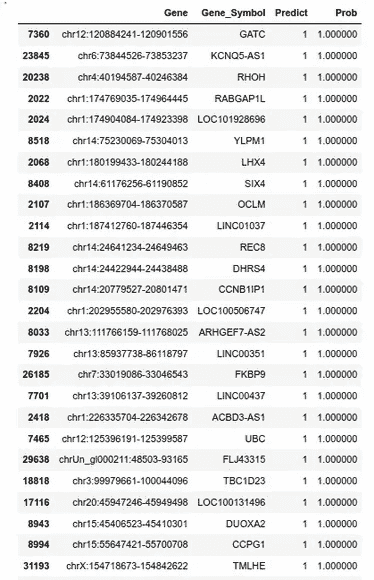**

**检查被预测为从尼安德特人遗传而来的**基因的数量，我们确认了来自[先前帖子](/deep-learning-on-neanderthal-genes-ad1478cf37e7)的结果，即**的绝大多数基因**，即 31 000 个被分析的人类基因中的 22 000 个**与尼安德特人的祖先**无关。因此，我们再次得出结论，由于某种原因，进化将尼安德特人的祖先从人类基因组中最具功能的基因中挤出来了。仔细看看**尼安德特人基因列表，并将其与[上一篇](/deep-learning-on-neanderthal-genes-ad1478cf37e7)帖子中随机森林模型的预测进行比较，我们观察到许多基因与各种人类特征和疾病有关。例如， **ANK3** 基因被>预测为尼安德特人祖先的概率为 99%。已知这种基因与**双相情感障碍**有关，并且主要在**人脑**中表达。******

**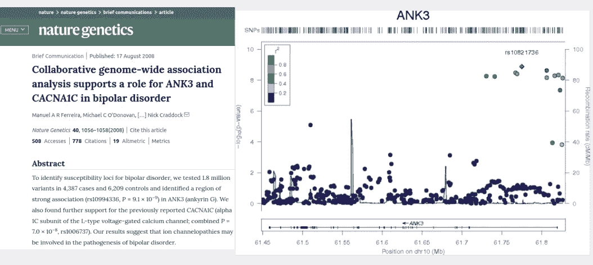**

**ANK3 gene predicted to be of Neanderthal origin is [linked to Bipolar Disorder](https://www.nature.com/articles/ng.209)**

**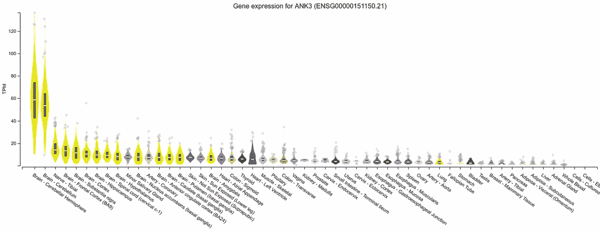**

**ANK3 is a human brain-specific gene based on [GTEX human tissue expression data](https://gtexportal.org/home/gene/ANK3)**

**此外，[一些研究](https://www.nature.com/articles/s41598-017-06587-0#additional-information)表明，人类大脑中与**精神疾病**有关的部分可能是由尼安德特人的基因遗传形成的。**

**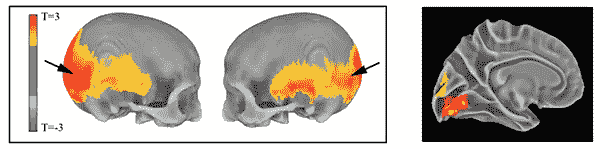**

**Human brain harbors “residual echo” of Neanderthal genes, [image source](https://www.nimh.nih.gov/news/science-news/2017/our-brains-harbor-residual-echo-of-neanderthal-genes.shtml)**

**这就是进化科学能够告知生物医学导致现代人类疾病的特征的历史发展和起源的地方。**

# **摘要**

**在这篇文章中，我们了解到将长记忆模型如 **LSTM** 应用于已知拥有**长程相关性**的 DNA 测序数据可能是有利的。我们展示了 LSTM 取得了令人印象深刻的准确性，并且在检测现代人类基因组中的尼安德特人基因渗入区域时，**优于所有其他模型。对模型的解释揭示了富含 AT 的 k-mers 是尼安德特人和本土现代人类 DNA 序列的关键区别。我们预测大多数人类基因都没有尼安德特人的祖先，这意味着在进化过程中**对**尼安德特人祖先的强烈**否定选择**。许多被预测会从尼安德特人身上遗传的基因与有趣的人类特征相关联，例如双相情感障碍。****

**像往常一样，让我在评论中知道你最喜欢的生命科学领域，你希望在深度学习框架中解决的领域。在媒体[关注我，在 Twitter @NikolayOskolkov 关注我，在](https://medium.com/u/8570b484f56c?source=post_page-----843df7e85743--------------------------------) [Linkedin 关注我。完整的 Jupyter 笔记本可以在我的](http://linkedin.com/in/nikolay-oskolkov-abb321186) [github](https://github.com/NikolayOskolkov/LSTMNeanderthalDNA) 上找到。我计划写下一篇关于**如何用深度学习**及时预测人口规模的帖子，敬请关注。**