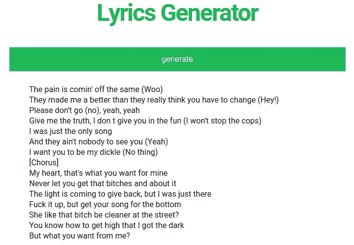

# 面向网络的歌词生成模型

> 原文：<https://towardsdatascience.com/lyrics-generation-model-to-the-web-f5e03dc5d8b5?source=collection_archive---------40----------------------->


Photo by [Willian Justen de Vasconcellos](https://unsplash.com/@willianjusten?utm_source=medium&utm_medium=referral) on [Unsplash](https://unsplash.com?utm_source=medium&utm_medium=referral)

## 迷你项目

## 一种创建和托管文本生成模型的极简方式

Python 有一个很棒的库，叫做 [textgenrnn](https://github.com/minimaxir/textgenrnn) ，可以很容易地在你的文本上训练神经网络。我一直使用的[文本数据](https://raw.githubusercontent.com/deinal/predict-spotify-top-global/master/data/processedlyrics.txt)由 2017-2019 年期间 Spotify 全球 200 强曲目组成。这是使用 textgenrnn 训练模型所需的全部代码:

它相当快，开箱后就有几个重量文件可供您自己尝试。无论如何，当你有一个训练好的模型时，生成新的文本也同样简单:

大多数时候，输出是可笑的无意义的。这里有一个例子:

```
Hold on, now she got the heart (Oh, it's so safe)
I want you to be my man comes on a time
When I was the light
[Verse 1]
I can't have to change you the beat us (Yeah, yeah)
(Hey, hey, hey, hey, hey)
And I can't pop a bag (I made it)
Hold on, but you don't like what, what you want, where were?
I'm drowning on the morning, she wanna keep going for the morning
I can't have a little bitch (Skrrt)
I can't be a bad llon low
She wanted me a little bit of the booty
```

我把这个上传到网上，让其他人在 lyrics-gen.herokuapp.com 的 T4 试一试。主机是 Heroku 的免费层，因此网站在 30 分钟不活动后会休眠，这意味着如果它碰巧休眠了，可能需要几秒钟才能访问。创作一首歌曲大约需要 15 秒钟。

我用 Python 的 Flask 库创建了这个站点。[这个](https://github.com/hd4niel/Lyrics-generation-webpage)库包含了整个网页。我创建了一个尽可能简单的 main.py 文件，放在我之前训练过的权重所在的文件夹中:

函数 generate 使用如上所述的 textgenrnn 来生成歌词。这些可以通过异步 AJAX 请求在 HTML 文件中调用。AJAX 可以更新网页的一部分，而不需要重新加载整个页面。

单击 generate 按钮会触发一个 AJAX 函数，该函数从主文件中的 generate 函数接收一个由换行符分隔的字符串作为响应。ajax 方法内部的循环从响应中创建了一个无序列表，最终的列表被传递给 id 为“textlist”的 div 元素。默认情况下，HTML 将项目符号添加到无序列表中，但是在这里通过将 list-style 设置为 none 来删除它们。

我添加了少量的 CSS 样式和 tadaa，这样我们就完成了:)



TL；DR I 热情推荐 [textgenrnn](https://github.com/minimaxir/textgenrnn) 用于生成文本，并利用该包创建了一个[网站](https://lyrics-gen.herokuapp.com)。

祝你愉快！