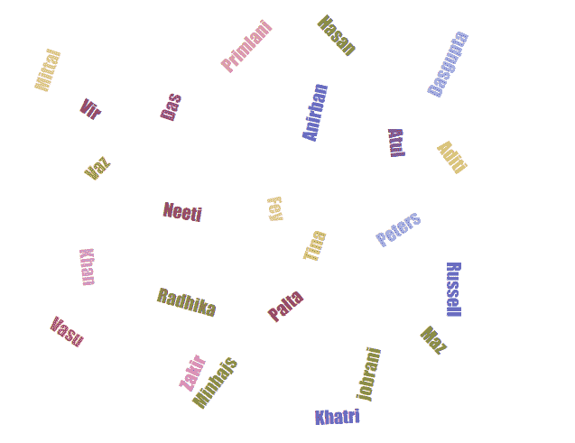
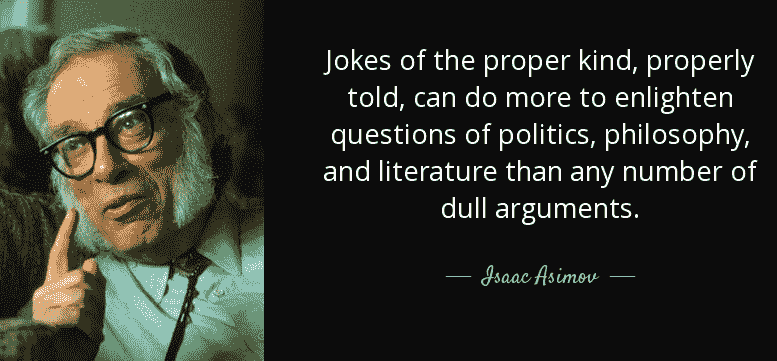

# 机器开玩笑:我们到了吗？

> 原文：<https://towardsdatascience.com/machine-joking-are-we-there-yet-1d3db78b6d61?source=collection_archive---------15----------------------->

> 什么东西可以放在鞋盒里，解决复杂的问题，并且可以依靠一个 masala dosa 的能量运行几个小时？
> 人脑。

拉塞尔·皮特斯、马兹·乔布拉尼、扎基尔·汗、阿图尔·卡特里、维尔·达斯、尼提·帕尔塔……不会让我们只是微笑。他们让我们发笑。使劲笑。感谢 youtube，这仅仅是个开始。我们看到斯坦福大学的博士同事(杰格迪什·查图维迪博士)、MBA 毕业生(拉胡尔·萨勃拉曼尼亚)以及微软游戏总监(安舒·莫尔)作为单口相声演员一夜成名。

喜剧是一门困难的艺术，然而，人工智能研究人员正在测试边界，看是否可以将引发笑声和提供娱乐的认知技能放入机器中。基本上，他们想看看机器人是否有趣。疯狂？当然可以。这主要是因为幽默依赖于多种因素，其中许多是内在的，并且会发生变化——今天可能有趣的事情明天可能就不有趣了。

语言学和心理学家认为好的笑话都有相同的特性——它们让我们开心——所以系统分析应该能揭示它们，对吗？不完全是。

密歇根大学的计算机科学家德拉戈米尔·拉德夫和他在雅虎实验室、哥伦比亚大学和《纽约客》的朋友们一直在研究卡通字幕，看看幽默是否可以用计算机用算术来表达。Radev 和他的同事的研究发表在 arXiv 上。《纽约客》著名的漫画字幕大赛已经举办了十多年。每周，编辑们都会发布一幅无标题的漫画，超过 5000 名读者会提交一个有趣的标题。编辑挑选出前三名，并让读者选出最有趣的。

在论文中，该研究的作者采用了一种计算方法来确定最有趣的字幕与其他字幕的区别。他们使用许多标准的语言技术来排列所有 30 万个标题。标准包括情感水平、字幕是否指的是人、它们指的是漫画中的特定物体有多清晰等等。然后，拉德夫和他的同事们选择了排名最高的标题，并将其与黄金标准进行比较:《纽约客》读者选择的最有趣的标题。这是通过使用亚马逊的机械土耳其人(Mechanical Turk)的众筹意见完成的，在这个地方，公司执行计算机目前无法完成的任务。基于这种方法，很容易想象一台计算机能够产生最好的字幕。但是研究人员离实现这一目标还有很长的路要走。

一个问题是，对于一台真正幽默的计算机，大多数人都同意，首先你必须给它编程，到底是什么让事情变得有趣——这是专家们千百年来一直在努力的事情。例如，柏拉图和亚里士多德长期思考这个问题，并提出了优越感理论，即人们嘲笑他人的不幸。与此同时，西格蒙德·弗洛伊德(Sigmund Freud)为他的缓解理论辩护，该理论认为幽默是人们释放被压抑的性和暴力思想所压抑的精神能量的一种方式。然后是不一致理论，这是由 17 世纪法国哲学家布莱士·帕斯卡提出的观点，即当人们发现他们期望发生的事情和实际发生的事情不一致时，幽默就会产生。

计算机生成幽默的另一个绊脚石是:计算机擅长处理简单、固定的数据集。这就是为什么迄今为止大多数笑话生成程序都专注于双关语和其他文字游戏，因为有限的单词列表和特定的定义很容易被计算机扫描和解析。但是大多数喜剧的概念并不简单，也不固定。最好的喜剧挖掘了态度、假设、道德和禁忌的广阔天地，其中大部分甚至没有在笑话中提到，只是微妙地暗示了一下。因此，如果我们的目标是让计算机真正“理解”笑话——更不用说自己想出笑话，并知道何时和向谁讲笑话了——我们基本上是要把所有的人类上传到它们里面。

***笑和幽默有什么区别？***

开发理解喜剧的机器最常见的挑战之一是缺乏科学有效的、公认的幽默定义。

关于笑和幽默以及它们之间的区别的研究仍然很少。很难分析和量化如此微妙的人类事物。前一分钟可能会让我们发笑的东西，下一分钟就不一定了。笑声被用作交流的辅助工具；从温柔的轻笑到开怀大笑，它帮助我们传达我们对各种社交场合的反应。我们不只是对一些有趣的事情发笑，我们可以用它来建立融洽的关系，显示信任和接受，以及填补谈话中的空白。幽默可以被定义为有趣的艺术，或发现有趣事物的能力；这是双向的。它充满了微妙的细微差别，依赖于正确的社会解释和互动——这是人类与生俱来的。

***自发性可以被编程吗？***

当涉及到人工智能时，幽默的自发性质是一个令人困惑的因素。即使是最复杂的机器也需要编程和某种类型的模板来处理输入。但是很多喜剧依赖于不可预测的结果，这是计算机通常缺乏的技能。

虽然计算机可以被训练在多个模板或假设之间切换，但它们仍然无法处理超出其知识库边界的真正原创的概念。为了理解自发的笑话并真正拥有幽默感，机器必须获得对现实更广泛的上下文评价。

计算机科学家渴望解决喜剧问题是有原因的:笑话是对他们程序的一些最艰难的测试。如果人工智能程序真的要模拟人类智能，它们必须能够掌握人们让事情变得有趣的所有聪明方法。

事实上，几十年来，科学家们一直在努力设计机器人小丑。其中包括笑话分析和制作引擎**JAPE**；**单口相声**，使用双关语增强非说话者对话的系统； **LIBJOB** ，灯泡笑话生成器；SASI，一个侦测讽刺的程序；和**偏差**，通过名词转移程序的双重双关语，它在自然语言中找到完美的地方插入“那是她说的。”此外，对于正在为下一台大型喜剧计算机寻找合适的诙谐缩写的计算机程序员来说，还有 **HAHAcronym Generator** 。

**讲笑话不是笑话！**

对于人类来说，幽默的时机和幽默已经够难的了，所以当试图将这些能力转移到机器人身上时，挑战是巨大的。喜剧时机是一件非常微妙的事情，很难实现。参与任何形式的幽默都需要大量的实时思考，识别和应对社会细微差别，以及一定程度的同理心，以了解何时发表观点，并预测人们会如何接受。

那么，如果可能的话，我们将如何制造有趣的机器人呢？Dragomir Radev 回答道:“简单——松开几个螺丝”。

***参考文献***a .是喜剧演员 vs 电脑在一场幽默至上的战斗，连线，乔尔·华纳，乔尔·华纳和彼得·麦格劳。 *b .人工智能中的幽默和笑声，Nao 博客
c .机器人能让你笑吗？、新政治家
d .集体话语中的幽默:纽约客漫画字幕大赛中的无监督滑稽检测，Radev 等人，2015 年 4 月(https://arxiv.org/pdf/1506.08126.pdf)
e .神经开玩笑机器:幽默图像字幕，Kota Yoshida 等人，2018 年 5 月 30 日(https://arxiv.org/abs/1805.11850)*

***献词***
*这篇文章是献给艾萨克·阿西莫夫博士的。就在 1992 年 4 月，他离开了我们..以科幻作品的形式留下了他的遗产。《小丑》是他的杰作之一，是一部关于机器幽默的有趣的短篇小说。
故事链接:*[*http://blog . AC-Versailles . fr/villaroylit/public/joke ster . pdf*](http://blog.ac-versailles.fr/villaroylit/public/Jokester.pdf)

