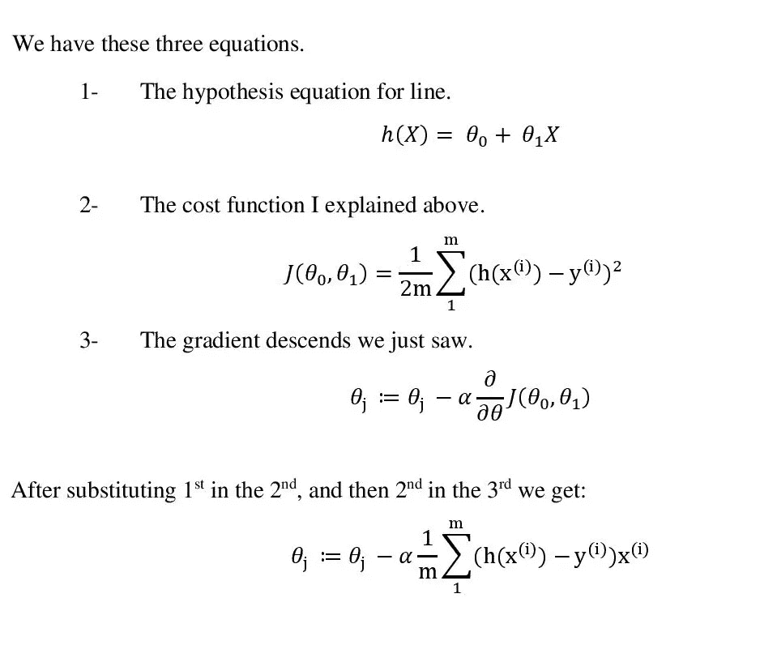

# 初学者:成本函数和梯度下降

> 原文：<https://towardsdatascience.com/machine-leaning-cost-function-and-gradient-descend-75821535b2ef?source=collection_archive---------6----------------------->

Credited to “Machine Learning and Human Bias”. *Google.* [https://www.youtube.com/watch?v=59bMh59JQDo](https://www.youtube.com/watch?v=59bMh59JQDo)

讲故事有两种方式，一种是艰难的方式，你被期望达到演讲者或作者的标准，另一种是作者或演讲者期望观众必须理解故事在讲什么，不管你听起来有多天真。因此，在这里，我试图停留在后一类，同时试图给读者一个直观的成本函数的理解，以及 2 种不同的方法来减少成本函数。

注意:我假设读者是拥有二维和三维平面的家庭。

## 介绍

假设给你三个数字(1，1)，(2，2)，(3，3)，它们可以在二维平面上表示，这意味着它们可以在 x-y 平面上表示，如下图所示。

(a)

现在，有人要求你拟合一条线，尽可能接近你已经得到的所有的点。拟合线是指尽可能接近二维平面中所有点的线。这些线将遵循的等式如下所示:

这里θ0 是直线的截距，θ1 是直线的斜率。截距是直线与 y 轴相交的值，斜率表示 x 轴上一个单位的变化会改变 y 轴上的值。

根据这个等式，假设我们得出了三种不同的直线，它们有三种不同的斜率和截距值，如下所示。该表的上线、中线和下线为θ0，上线、中线和下线为θ1。

(b)

这些图形显示的线的值也以表格形式显示。

很明显，中间的线与图(a)中显示的所有三个点相匹配，但是上面的线和下面的线与这三个点并不完全匹配。那是什么意思？让我看看…

# 价值函数

成本函数基本上意味着你的预测线离我们已经知道的实际点有多远。换句话说，你已经得到了一些点，然后你预测了θ0 和θ1 的值，利用这些，你在图上画了一条线；这样做之后，你意识到新的线并不完全触及你已经拥有的所有三个数据点，所以现在你计算原始点和你预测的线有多远。你可以用成本函数来计算。计算公式如下:

让我们分解一下，看看这是什么意思。

第一项 1/2m 是一个常数项，其中 m 表示我们已经拥有的数据点的数量，在我们的例子中是 3。然后我们有一个求和符号，这个符号意味着对于下标' I '中的每一个变化的值，我们不断地把结果相加。h(x^i 项表示我们的假设对于 I 的特定值的输出，换句话说，您使用等式 h(x)=θ0+xθ1 预测的线，而 y^i 项表示我们已经拥有的数据点的值。值“I”表示我们已经计算出的数据点的数量。为了更清楚地了解情况，我们来看一些例子:

## 中线

原始点有值(1，1)，(2，2)，(3，3)。

θ0 和θ1 分别预测为 0 和 1。利用假设方程我们画了一条线，现在要计算成本。我们画的这条线经过的点和我们已经知道的点完全一样。所以我们的假设值 *h(x)是 1，2，3* 并且 *y^i 的值也是 1，2，3* 。

我们可以看到，成本函数给我们的中间线为零。下面的红线是我们的假设线，黑点是我们的点。

## 上线

θ0 和θ1 分别预测为 1.5 和 1.25。这意味着 y 轴上的截距是 1.5，对于 x 轴上的每个单位机会，假设 h(x)在 y 轴上变化 1.25。

这样，我们计算出我们的 *h(x)值如下— (1.5，2.75 和 4)* 。而 y^i(原始数据点)保持不变— *(1，2，3)* 。使用成本函数，我们得到以下值:

## 下部线

下线条的θ0 和θ1 值分别为 1.25 和 0.75。这意味着它在 1.25 处截取 y 轴，并且对于 x 值的每个单位变化，假设 h(x)将以 0.75 的速率变化。

我们已经知道，原始点 *y 的值是(1，2 和 3)* ，我们预测的点 *h(x)的值是-1.25，1.5，2。现在，使用成本函数我们可以计算成本，如下图所示。*

# 降低成本函数

你还记得上面预测的θ-0 和θ-1 的值，因为它们只是预测，只有中间那个是完美的。但是在现实生活中，找到θ-0 和θ-1 的完美值几乎是不可能的。然而，你有能力操纵θ-0 和θ-1 的值，对于任何给定的一组值 *(x1，x2，x3…xn)* 您正在寻找具有最低成本函数值的线。

让我们得出θ-0 和θ-1 的不同值。θ-0 和θ-1 分别为 0 和 1.42。它创建的线看起来像下面这样。

但是，因为你需要降低成本，你需要创建一条符合这三点的线。大概是这样的:

所以你使用一种叫做梯度下降的降低成本的方法。永远记住，你只是减少θ-0 和θ-1 的值，通过这样做，你从那边的红线到下面的黑线。见下文，以便更好地理解。

因为我们知道改变θ-0 和θ-1 的值，所以线的方向可以改变，并且为了达到尽可能接近这三个点的线，我们一点一点地减少所有θ的值(在我们的情况下只有 2θ),以这样的方式，我们达到成本函数的最小值。

术语“阿尔法”的意思是——你的价值减少了多少。这里的θ-j 代表解中的每个θ，所以对所有θ都用这个方程，在我们的例子中，θ是 2，但也可以是 3，4 或 10，这取决于手头的问题。所以，上图中最上面的线有一定的θ-0 和θ-1 的值，然后，使用这里的公式，你将方程中所有θ的值减少一些α值，并随着你的预测线移动一点。然后你再次运行那个公式，减少θs 的值，看看那条线看起来像什么，计算成本，为下一次迭代做准备。然后你再降低θ的值，再看这条线，计算成本。你一直这样做，直到你的线到达成本最小的点，在我们的例子中，可以看到上面的图片值为 1，2，3。相对于原始数据点 1、2、3，成本为零的完美线条。公式的分解更有意义，见下图。

# 总结:

1-你有一些数据点。

2-使用它们，你可以计算θ的值，并使用假设方程绘制图形。

3-您使用成本函数计算成本，成本函数是您绘制的数据点和原始数据点之间的距离。

你看到成本函数给了你一些你想减少的值。

5-使用梯度下降，将θ的值减少α的量级。

6-使用一组新的θ值，再次计算成本。

7-你一个接一个地重复步骤 5 和步骤 6，直到你达到成本函数的最小值。