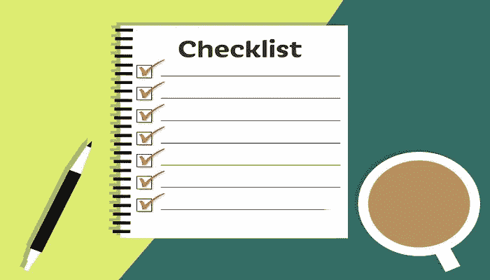

# 机器学习 101 和数据科学:来自行业专家的提示

> 原文：<https://towardsdatascience.com/machine-learning-101-data-science-tips-from-an-industry-expert-1294af5ffc21?source=collection_archive---------23----------------------->

## 向微软高级人工智能工程师学习数据科学的机器学习的基本组件。

作为一名实践数据科学家，你需要熟悉机器学习的概念。数据科学和机器学习都有重叠，但最基本的术语是:

*   数据科学用于获得对数据的洞察和理解。
*   机器学习用于基于数据产生预测。

也就是说，它们之间的界限并不明显，大多数数据科学从业者需要能够在这两个领域之间来回切换。

知道从哪里开始你的数据科学之旅可能会令人不知所措，因此在微软高级人工智能工程师 [Samia Khalid](https://www.linkedin.com/in/samiakhalid/) 的帮助下，这篇文章将分解你在数据科学领域开始职业生涯所需要知道的事情。如果你正在寻找更深入和动手的东西，你可以访问 Samia 的交互式数据科学课程， [**探索数据科学**](https://www.educative.io/courses/grokking-data-science) 。

以下是今天将要讲述的内容:

1.  数据科学家必备的 Python 库
2.  Jupyter 笔记本快速提示:数据科学家的必备之物
3.  面向数据科学家的机器学习 101
4.  机器学习的主要组件
5.  机器学习算法:分类和最常用的算法
6.  机器学习项目清单

# 数据科学家必备的 Python 库

## NumPy

NumPy (Numerical Python)是一个强大的、广泛用于存储和计算的库。它是为处理数字数据而设计的。它通过提供数据结构、算法和其他有用的工具，允许数据存储和计算。例如，这个库包含基本的线性代数函数、傅立叶变换和高级随机数功能。它还可以用于将数据加载到 Python 并从中导出。

以下是您应该开始熟悉的一些数字基础知识:

**NumPy 基础知识**

*   创建 NumPy 数组和数组属性
*   数组索引和切片
*   重塑和连接

**NumPy 算法和统计基础**

*   计算和聚合
*   比较和布尔掩码

## 熊猫

Pandas 是在数据科学项目中使用 Python 时不可避免的库。这是一个强大的数据辩论工具，这是一个准备数据的过程，以便可以实际用于分析和模型构建。

Pandas 包含各种各样的数据导入、导出、索引和数据操作功能。它还提供了方便的数据结构，如 DataFrames(一系列列和行，以及一系列(一维数组))，以及处理它们的有效方法。例如，它允许您重塑、合并、拆分和聚合数据。

以下是一些你应该开始熟悉的熊猫基本概念:

**熊猫核心部件**

*   系列对象
*   DataFrame 对象

**熊猫数据框操作**

*   阅读、查看和提取信息
*   选择、切片和过滤
*   分组和排序
*   处理缺失和重复
*   数据透视表和函数

## sci kit-学习

Scikit-learn 是一个易于使用的机器学习库。它附带了各种用于机器学习和统计建模的高效工具，例如:

*   **分类模型**(例如，支持向量机、随机森林、决策树)
*   **回归分析**(例如，线性回归、岭回归、逻辑回归)
*   **聚类方法**(例如，k 均值)
*   **数据简化方法**(例如，主成分分析、特征选择)
*   **模型调整**和，
*   **具有网格搜索、交叉验证等功能**的选择。它还允许对数据进行预处理。

## Matplotlib 和 Seaborn

Matplotlib 广泛用于数据可视化练习，如绘制直方图、线图和热图。

Seaborn 是另一个很棒的库，用于创建有吸引力的、信息丰富的图形。它的目标是让数据探索和理解更容易，它做得很好。基本上，Seaborn 是基于 Matplotlib 的，Matplotlib 是它的孩子。

# Jupyter 笔记本快速提示:数据科学家的必备之物

Jupyter 笔记本是开发和展示数据科学项目的一个非常强大和时尚的工具。它可以将代码及其输出集成到单个文档中，结合可视化、叙述性文本、数学方程和其他富媒体。简直牛逼。

Jupyter Notebook 也可以处理许多其他语言，比如 R。其直观的工作流程、易用性和零成本使其成为任何数据科学项目的核心工具。

# 面向数据科学家的机器学习 101

本节的要点:

*   介绍机器学习的基本概念。
*   了解几种最重要的机器学习算法，并对它们如何工作以及何时何地适用有一种直觉。
*   通过一个真实的端到端的例子来了解什么是必要的步骤，以及如何将它们应用到机器学习项目中。

# 机器学习的主要组件

训练机器学习系统需要三个基本组件:

## 数据

可以手动和自动收集数据。例如，用户的个人信息，如年龄和性别，他们的所有点击和购买历史都是在线商店的宝贵数据。你还记得迫使你“选择所有街道标志”的“ReCaptcha”吗？那是一些免费体力劳动的例子！数据不总是图像；它可以是具有许多变量(特征)、文本、传感器记录、声音样本等的数据表。，取决于手头的问题。

## 特征

特征通常也称为变量或参数。这些基本上是机器要考虑的因素——正在讨论的“对象”的属性，例如，用户的年龄、股票价格、租赁物业的面积、句子的字数、花瓣长度、细胞的大小。选择有意义的特性是非常重要的，但是需要实践和思考来决定使用什么样的特性，因为它们并不总是像这个小例子中那样清晰。

## 算法

机器学习是基于通用算法的。例如，一种算法是分类。分类允许您将数据放入不同的组中。有趣的是，用于识别手写数字的相同分类算法也可以用于将电子邮件分类为垃圾邮件和非垃圾邮件，而无需更改一行代码！这怎么可能呢？虽然算法是相同的，但是输入的数据不同，所以会产生不同的分类逻辑。然而，这并不意味着一种算法可以解决所有类型的问题！算法的选择对于确定最终机器学习模型的质量很重要。获取尽可能多的数据是开始使用机器学习系统非常重要的第一步。

# 机器学习算法:分类和最常用的算法

机器学习算法可以大致分为以下四类:

*   监督学习
*   无监督学习
*   半监督学习
*   强化学习

## 监督学习

在监督学习中，作为算法输入的训练数据包括最终的解决方案，称为标签或类别，因为算法通过“查看”具有正确答案的示例来学习。换句话说，该算法有一个主管或老师，他首先向它提供所有的答案，比如它是否是图片中的猫。而机器利用这些例子一个一个学习。

另一个不同类型的典型任务是根据一组特征(如大小、位置、卧室数量)预测目标数值(如房价)。为了训练该系统，您再次需要提供许多已知房价的正确示例，包括它们的特征和标签。

虽然对电子邮件进行分类或识别图片是猫还是狗是一种监督学习算法，但预测房价被称为回归。

有什么区别？

在回归中，输出是一个连续值或者像房价这样的小数。在分类中，输出是类似“垃圾邮件或非垃圾邮件”的标签，而不是十进制数；输出只接受像 0 或 1 这样的值，其中 1 表示“垃圾邮件”，0 表示“非垃圾邮件”。基本上，您选择的算法类型(分类或回归)取决于您想要的输出类型。

**最常用的监督学习算法:**

*   线性回归
*   逻辑回归
*   支持向量机
*   决策树
*   随机森林
*   k-最近邻
*   人工神经网络

## 无监督学习

在无监督学习中，数据没有标签；该算法的目标是找到数据中的关系。这个系统需要在没有老师的情况下学习，并根据数据中的一些隐藏模式找到关系。这种类型的分割是所谓的聚类的一个例子，没有预定义的类别并且基于一些未知特征的分类。

**最常用的无监督学习算法:**

*   聚类:K 均值
*   可视化和降维
*   主成分分析(PCA)，t 分布
*   随机邻居嵌入(t-SNE)
*   关联规则学习:先验

## 半监督学习

半监督学习处理部分标记的训练数据，通常是大量未标记的数据和一些标记的数据。大多数半监督学习算法是无监督和监督算法的结合。

## 强化学习

强化学习是一种特殊的更高级的类别，学习系统需要学习做出具体的决定。学习系统观察它所暴露的环境，它选择并执行动作，并得到奖励或惩罚作为回报。它的目标是选择随着时间的推移回报最大化的行动。因此，通过反复试验，并基于过去的经验，系统自己学习最佳策略，称为策略。

# 机器学习项目清单

你被聘为新的数据科学家，你有一个令人兴奋的项目要做！你应该怎么做呢？

这里有一些最佳实践和一个清单，当你在一个端到端的 ML 项目中工作时，你应该考虑采用。

1.  把问题框起来，看大图:

*   正式和非正式地理解这个问题
*   弄清楚要问的正确问题以及如何设计这些问题
*   理解基于领域知识的假设

2.获取数据:不要忘记这里的数据隐私和合规性，它们至关重要！如有必要，提出问题并与利益相关者进行交流。

3.探索数据，获取真知灼见:

*   总结数据:找到变量的类型或绘制出基本的数据结构，找到变量之间的相关性，确定最重要的变量，检查数据中缺失的值和错误等。
*   将数据可视化，以便全面了解模式、趋势、异常和异常值。使用数据汇总和数据可视化技术来理解数据告诉你的故事。

4.从简单开始:从一个非常简单的模型开始，像线性或逻辑回归，具有最小的和突出的特征(直接观察和报告的特征)。这将让你对手头的问题有一个很好的了解，也为接下来的步骤设定正确的方向。

5.更多的特性工程:准备数据以提取更复杂的数据模式。合并和修改现有要素以创建新要素。

6.探索许多不同的模型，并根据比较评估筛选出最佳模型，例如，比较不同模型的 RMSE 或 ROC-AUC 得分。

7.微调模型的参数，并考虑组合它们以获得最佳结果。

8.以简单、吸引人、视觉上吸引人的方式向利益相关者展示您的解决方案。运用讲故事的艺术，它能创造奇迹！

*   记得根据目标受众的技术水平来定制您的演示文稿。例如，当向非技术利益相关者演示时，记住不要使用沉重的技术术语来传达关键的见解。他们可能不会对你采用的所有酷的 ML 技术感兴趣，而是对最终结果和关键见解感兴趣。

9.如果您的项目范围不仅仅是从数据中提取和展示见解，那么就继续启动、监控和维护您的系统。

当然，这个清单只是入门的参考。一旦你开始在真实的项目中工作，适应，随机应变，并且在每个项目结束时反思收获，从错误中学习是必不可少的！

# 从这里去哪里？

我们已经为数据科学家介绍了一些机器学习的基础知识，但如果你真的想开始你的职业生涯，还有很多东西需要学习和探索，你不必独自经历这些。

行业专家、微软高级人工智能工程师萨米亚·哈立德(Samia Khalid)将自己的所学编成了一门综合课程， [**钻研数据科学**](https://www.educative.io/courses/grokking-data-science) 。Samia 在一个地方列出了您在数据科学职业生涯中起步和发展所需的一切。

快乐学习！