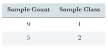

# 机器学习 101-ID3 决策树与熵计算(1)

> 原文：<https://towardsdatascience.com/machine-learning-101-id3-decision-trees-and-entropy-calculation-1-a1d66ee9f728?source=collection_archive---------10----------------------->

## 这一系列包括我在博士课程阶段收集的机器学习课程笔记

# 培训方法

机器学习训练方法分为 3 种；

1.  监督学习
2.  无监督学习
3.  强化学习

# ID3 决策树

*   这种方法被称为监督和非参数决策树类型。
*   大多数情况下，它用于分类和回归。
*   一棵树由一个中间决策节点和末端叶子组成。终端叶子有输出。输出显示分类中的类值，但显示回归的数值。
*   将子集划分为决策树的目的是使每个子集尽可能的相似。决策树算法的缺点是它们是贪婪的方法。**贪婪算法**是任何遵循问题解决启发法的算法，在每个阶段做出局部最优选择，目的是找到全局最优。在许多问题中，贪婪策略通常不会产生最优解，但是贪婪启发式算法可以在合理的时间内产生近似全局最优解的局部最优解。

# 熵

熵被称为决策树的控制器，用于决定在哪里拆分数据。ID3 算法使用熵来计算样本的同质性。如果样本是完全同质的，则熵为零，如果样本是等分的，则熵为 1[1]。

n 类熵-> E(S) = ∑ -(pᵢ*log₂pᵢ)

二类熵:(S) =-(p₁ * log₂p₁ + p₂ * log₂p₂)

# 例 1:

9 samples in the Class 1 and 5 samples in the Class 2

p₁ = 9/(9+5) =9/14(样本与 1 类在同一训练类中的概率)

p₂ = 5/14(与 2 类在同一个培训类中的样本的概率)

e =-(2014 年 9 月 14 日* log₂(9/14)+(2014 年 5 月* log₂(5/14))

E = 0.94

# 信息增益

根、节点和叶的边界由信息增益(IG)定义。

**增益(S，A) = E(前)- G(后 _ 分裂)**

**注意:**你可以在 WEKA 工具里找到 ID3 作为 C4.5。

**例 2:**

首先，选择以最精确的方式分割整个表的特征。为此，应确定增益最高的特性。【T10 个训练示例的值划分如下:
* 6 电影院
* 2 网球
* 1 房子
* 1 购物
熵值必须从这些值开始计算，以定义根特征。

e(S)=-((6/10)* log2(6/10)+(2/10)* log2(2/10)+(1/10)* log2(1/10)+(1/10)* log2(1/10))

***E(S) = 1.571***

通过计算所有单个特征的增益值，具有最高增益值的特征被选为根节点:

***增益(S，天气)=？***

Sunny = 3 (1 家电影院+ 2 网球)

风= 4 (3 家电影院+ 1 购物)

雨天= 3 (2 家电影院+ 1 家)

熵(S*sunny*)=—(1/3)* log2(1/3)—(2/3)* log2(2/3)= 0.918

熵(S *风大*)=—(3/4)* log2(3/4)—(1/4)* log2(1/4)= 0.811

熵(S *多雨*)=—(2/3)* log2(2/3)—(1/3)* log2(1/3)= 0.918

Information Gain Formula

Gain(S，Weather)= 1.571—(((1+2)/10)* 0.918+((3+1)/10)* 0.811+((2+1)/10)* 0.918

**增益(S，天气)= 0.70**

Gain(S，Parental_Availability) =？

是= 5 (5 家电影院)

否= 5 (2 个网球+ 1 个电影院+ 1 个购物+ 1 个家)

熵(S *是* ) = - (5/5)*log2(5/5) = 0

熵(S*no*)=-(2/5)* log2(2/5)-3 *(1/5)* log2(1/5)= 1.922

增益(S，Parental_Availability) =熵(S) — (P(是)*熵(S *是* ) + P(否)*熵(S *否*))

Gain(S，Parental _ avail ability)= 1.571—((5/10)*熵(S *是*)+(5/10)*熵(S *否*))

**Gain(S，Parental _ avail ability)= 0.61**

收益(S，财富)=？

有钱= 7 (3 家电影院+ 2 网球+ 1 购物+ 1 家居)

差= 3 (3 西内马)

熵(S *富* ) = 1.842

熵(S *差* )=0

增益(S，财富)=熵(S)——(P(富)*熵(S *富* ) + P(穷)*熵(S *穷*))

**增益(S，财富)= 0.2816**

最后，逐一列出所有增益值，并选择具有最高增益值的特征作为根节点。在这种情况下，天气有最高的增益值，所以它将是根。

**增益(S，天气)= 0.70**

增益(S，Parental_Availability) = 0.61

增益(S，财富)= 0.2816

如上面的例子所示，在选择根之后，特征的每个单独的值被确定为叶，并且这一次用这些单独的值定制数据集。换句话说，上表已被转换为一个单独的数据集，显示天气晴朗时其他要素可以采用的值。因此，根据该表，当天气晴朗时，inter 节点的可能类别如下:

*   1 家电影院
*   2 网球

熵(S*sunny*)=-(1/3)* log2(1/3)-(2/3)* log2(2/3)= 0.918

Gain(S *sunny* ，Parental_Availability) =？

增益(S *sunny* ，Parental_Availability) =熵(S*sunny*)——(P(是| S*sunny*)*熵(S *是* ) + P(否| S*sunny*)*熵(S *否*)

熵(S *是* ) = -(1/3)*log2(0) — 0 = 0

熵(S*no*)=-(2/3)* log2(0)—0 = 0

**增益(S *sunny* ，Parental _ avail ability)**= 0.928—((1/3)* 0+(2/3)* 0)=**0.928**

**增益(S *晴*，财富)**= 0.918—((3/3)* 0.918+(0/3)* 0)=**0**

因为 Parental_Availability 特性的增益更大，所以晴天状态的叶子将是 **Parental_Availability** 。根据为晴天条件设置的数据，如果是，将决定电影院，如果不是，则将决定网球:

当对刮风和下雨的情况进行同样的计算时，最终的决策树就完成了。

# 过度拟合

*   这是学习到记忆的转变。
*   性能图是在某个时刻之后，性能的增加停止并开始减少。
*   当你的培训成功率很高，而测试成功率却相反时，就是过度适应的例子。
*   此外，如果我们的数据中存在噪声样本，可能会导致过拟合。
*   当树长得太大时，几乎每个可能的分支都会产生一个结果，这会导致过度拟合。

为了**避免过度修剪**，有必要在树生长时或树形成后修剪。

**参考文献:**

[1]决策树，[https://www.saedsayad.com/decision_tree.htm](https://www.saedsayad.com/decision_tree.htm)