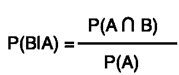
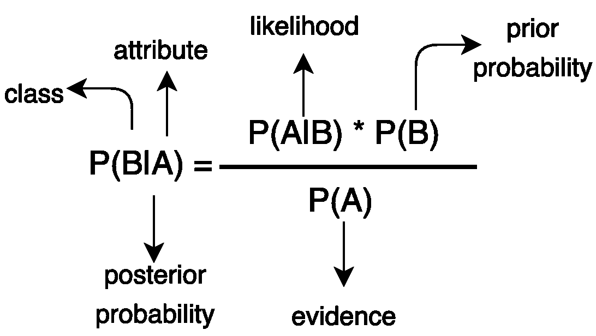
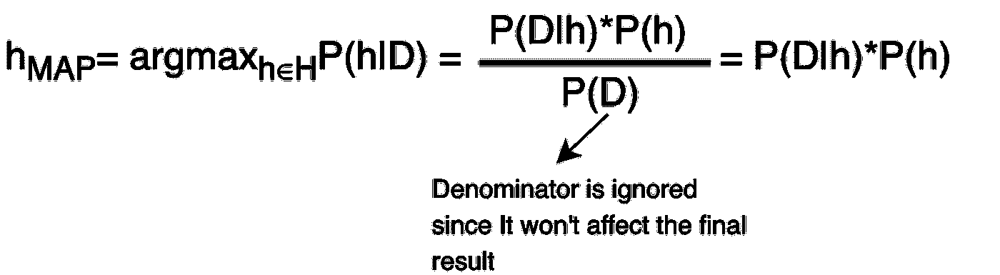
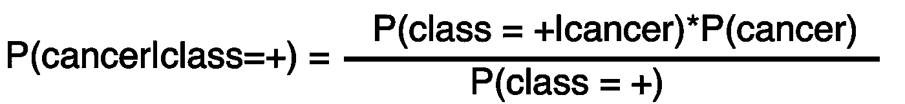
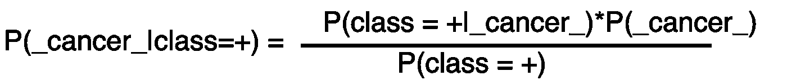
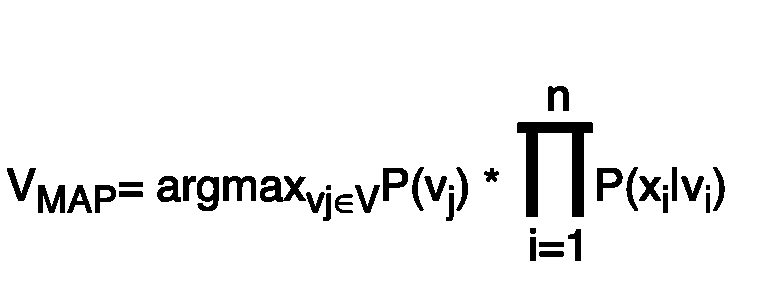
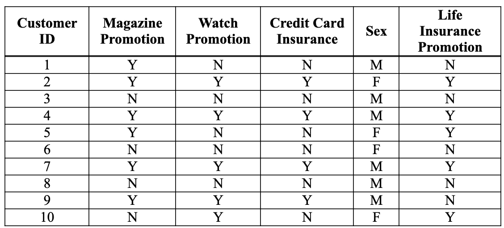
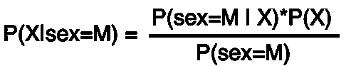
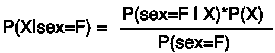
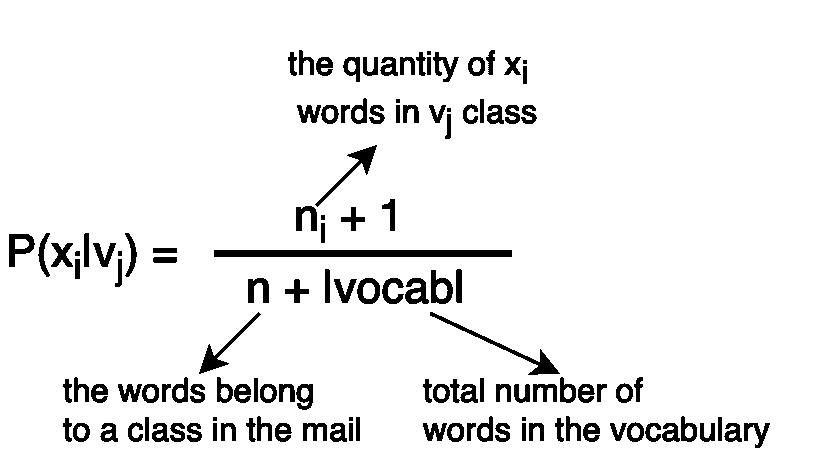

# 机器学习 101 -朴素贝叶斯(2)

> 原文：<https://towardsdatascience.com/machine-learning-101-naive-bayes-2-ccb6e0217d82?source=collection_archive---------24----------------------->

这是我的机器学习 101 系列的第二部分，在我的系列的第一篇文章中，我试图解释决策树和熵计算。下面是链接:[机器学习 101- (1)](/machine-learning-101-id3-decision-trees-and-entropy-calculation-1-a1d66ee9f728)

# 条件概率

在概率论中，条件概率是一个事件发生的**概率**的度量，假设又有一个事件发生。更具体地说，P(B|A)隐含着 A 发生时 B 的概率。

The formula of conditional probability

# 贝叶斯规则

Bayesian Rule

# 最大后验概率

它用于估计未知的决策。对于所有给定的数据，在所有假设中选择哪个类别的可能性更大。

The formula of Maximum A Posteriori

如果你不明白为什么分母在公式中被忽略，不要担心，下面的例子会让你明白。

## **Ex:**

*   P(class=+|cancer)=0.98(患者被诊断为癌症的概率，并且测试结果也是癌症(+)
*   P(class= — |_cancer_)=0.97(患者被诊断为非癌症的概率，并且测试结果也不是癌症(—))
*   p(癌症)= 0.008(被诊断为癌症的患者比率)

根据给定的约束条件，一个检测结果为阳性的患者属于癌类还是不属于癌(_cancer_)类？

**P(？|class=+)=？**

一个类中给定概率的总和应该总是 1so；

P(_ 癌 _) = 1- P(癌)

所以；

p(_ cancer _)= 1–0.008 = 0.992

P(cancer | class =+)=(0.98 * 0.008)/P(class =+)=**0.008/P(class =+)**

P(_ cancer _ | class =+)= 0.03 * 0.992/P(class =+)=**0.02976/P(class =+)**

由于 **0.02976** 大于 **0.008，P(？|class=+)=_cancer_**

我们忽略了 P(class=+)，因为它是两种情况下的共同常数。即使我们把 P(class=+)计算在内，结果也不会改变。

# 朴素贝叶斯定理

朴素贝叶斯定理认为所有的特征都是相互独立的。朴素贝叶斯是文本分类的首选，其成功率相当高。

The formula of Naive Bayes

**例如:**根据下表中的数据集，对杂志促销说**是**，对手表促销说**是**，对人寿保险说**否**，对信用卡保险说**否**的人是什么性别？

[1]

问题的简化版本；如果(是，是，不是，不是)->性别=？

我们有两个假设需要检验，结果是男(M)还是女(F)？为此，我们将分别计算两者的结果(因为它们互不影响)，并选择值较大的一个作为答案。

**X =(是，是，否，否)**

**假设 1:**

在第一个假设中，我们接受性是男性的，并根据它寻找结果。

P(sex=M|X)=？由于右侧概率首先由独立的特征组成，我们将分别找到每个特征的概率结果，然后将它们相乘以获得最终的解。

P(magazine_promotion=Y|sex=M)(一个是男性的人对杂志促销说“是”的概率)= 4/6(一个是男性的人对杂志促销说“是” **/** 男性总数)P(watch _ Promotion = Y | sex = M)= 2/6
P(life _ insurance = N | sex = M)= 4/6
P(credit _ card _ insurance = N | sex = M)= 4/6

**既然都是独立功能:**

**P(X | sex = M)**= P(magazine _ promotion = Y | sex = M)* P(watch _ promotion = Y | sex = M)* P(life _ insurance =N|sex=M)* P(信用卡 _ 保险= N | sex = M)

**P(X | sex = M)**=(4/6)*(2/6)*(4/6)*(4/6)= 0.0988

P(sex = M)= 0.6
**P(sex = M | X)= 0.0988 * 0.6 =*0.0593***

**假设二:**

最后，在第二个假设中，我们接受性是男性的，并根据它寻找结果。

p(X | sex = F)=(3/4)*(2/4)*(1/4)*(3/4)= 0.07

p(性别=F)=0.4

**P(sex=F|X)= 0.0281**

由于 0.0593 > 0.0281，贝叶斯分类器得出**男**的可能性较高。

## **拉普拉斯平滑**

例如，如果我们使用朴素贝叶斯对电子邮件中的单词进行分类，并确定该邮件是垃圾邮件还是良性邮件。当我们遇到一个不包含在训练集中的单词时，该值将被赋为 0。而概率值会以 0 结束，因为乘法计算中 0 占优势。在这种情况下，可以使用**拉普拉斯(1-up)平滑**。

**例如:**

**A 类:**“猫蟹呱呱叫下楼梯”

**B 类:**《下着倾盆大雨》

根据上面的分类，对 X =“猫吃老鼠，狗吃兔子骨头”的下列文字进行分类

**词汇**= {猫、蟹、小曲、楼梯、雨、狗}

P(vⱼ) = 1/2(班级将是 a 或 b，所以一半的机会)

|Vocab|=6

nA=4

nB=3

在 X 文本中，猫和狗的单词是在词汇中发现的唯一的单词。所以我们只使用它们:

e=ij

P(xᵢ|vⱼ)=(nₑ+ 1)/(nⱼ + 6)

**假设 1:** P(A|X) = P(A)*P(猫|A)*P(狗| A)= 1/2 *(1+1)/(4+6)*(0+1)/4+6 =**0.01**

**假设二:** P(B|X) = P(B)*P(猫|B)*P(狗| B)= 1/2 *(1+1)/(3+6)*(1+1)/(3+6)=**0.024**

因为 0.024>0.01，所以 X 文本属于 B 类

## 参考

[1][http://www.cs.ust.hk/~qyang/521/Readings/sample06.html](http://www.cs.ust.hk/~qyang/521/Readings/sample06.html)