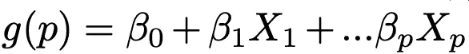
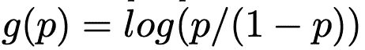
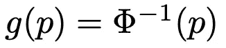
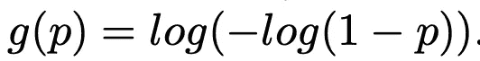
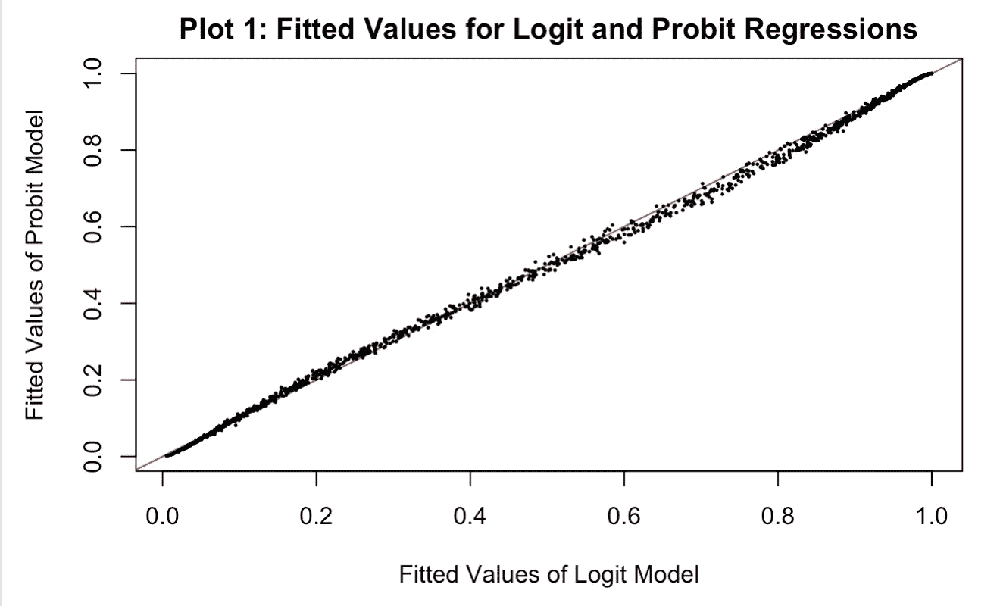
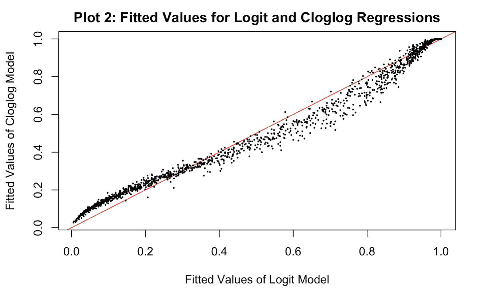

# 机器学习 101:使用逻辑回归预测 R

> 原文：<https://towardsdatascience.com/machine-learning-101-predicting-drug-use-using-logistic-regression-in-r-769be90eb03d?source=collection_archive---------30----------------------->

## 机器学习:监督学习

## 基础、链接功能和图


[Mike MacKenzie](https://www.flickr.com/photos/mikemacmarketing/) on Flickr

**执行摘要**

*   广义线性模型(GLM)
*   三种类型的链接函数:Logit、Probit 和互补双对数(cloglog)
*   建立逻辑回归来预测药物使用并比较这三种类型的 GLM

在机器学习 101 课程中，统计学教授介绍了线性回归后的 GLM，作为成为数据科学家的下一个垫脚石。GLM 有几种形式，最著名的是 logit、probit 和 cloglog。

这些 glm 非常适合分类问题:生存还是死亡，投票还是不投票，点击还是不点击。

*完整的项目描述和完整的 R 代码，请查看我的* [*Github*](https://github.com/LeihuaYe/Logistic-Regression) *。*

**基础知识**

通常，二进制数据的 GLM 可以用以下形式表示:



其中 g 表示概率 p 的预测值(在右边)的线性关系，g 是将 p ∈[0，1]映射到ℝ.的函数

有三种方法可以连接左侧和右侧的组件。

Logit:



在文字中，p 的对数形式。

概率单位:



换句话说，正态分布的累积密度函数的倒数。

Cloglog:



换句话说，不发生概率的对数形式的负值的对数形式。迷茫？至少，我是。这个函数的链接功能很简单。

好吧，让我们继续，建立 GLM 模型来预测谁更容易吸毒，并学习阅读情节。


Photo by [Nicole Honeywill / Sincerely Media](https://unsplash.com/@nicolehoneywill_sincerelymedia?utm_source=unsplash&utm_medium=referral&utm_content=creditCopyText) on [Unsplash](https://unsplash.com/s/photos/surfing?utm_source=unsplash&utm_medium=referral&utm_content=creditCopyText)

1.  **加载、清理和分割数据集**

```
library(readr)
drug_use <- read_csv(‘drug.csv’,col_names=c(‘ID’,’Age’,’Gender’,’Education’,’Country’,’Ethnicity’,’Nscore’,’Escore’,’Oscore’,’Ascore’,’Cscore’,’Impulsive’,’SS’,’Alcohol’,’Amphet’,’Amyl’,’Benzos’,’Caff’,’Cannabis’,’Choc’,’Coke’,’Crack’,’Ecstasy’,’Heroin’,’Ketamine’,’Legalh’,’LSD’,’Meth’,’Mushrooms’,’Nicotine’,’Semer’,’VSA’))
library(dplyr)
drug_use <- drug_use %>% mutate_at(as.ordered, .vars=vars(Alcohol:VSA)) 
drug_use <- drug_use %>%
 mutate(Gender = factor(Gender, labels=c(“Male”, “Female”))) %>%
 mutate(Ethnicity = factor(Ethnicity, labels=c(“Black”, “Asian”, “White”,
 “Mixed:White/Black”, “Other”,
 “Mixed:White/Asian”,
 “Mixed:Black/Asian”))) %>%
 mutate(Country = factor(Country, labels=c(“Australia”, “Canada”, “New Zealand”, 
 “Other”, “Ireland”, “UK”,”USA”)))#create a new factor variable called recent_cannabis_use
drug_use = drug_use %>% 
mutate(recent_cannabis_use=as.factor(ifelse(Cannabis>=”CL3",”Yes”,”No”)))#create a new tibble that includes a subset of the original variable 
#data split into training and test sets
drug_use_subset <- drug_use %>% select(Age:SS, recent_cannabis_use)
set.seed(1)
traint.indices = sample(1:nrow(drug_use_subset),1500)
drug_use_train = drug_use_subset[traint.indices,]
drug_use_test = drug_use_subset[-traint.indices,]
dim(drug_use_train)
dim(drug_use_test)[1] 1500   13
[1] 385  13
```

因此，训练集的尺寸为 1500*13，测试集的尺寸为 385*13。

**2。拟合逻辑回归**

```
#use logit as the link function
glm_fit = glm(recent_cannabis_use ~ .,data=drug_use_train,family=binomial(link= “logit”))
summary(glm_fit)Call:
glm(formula = recent_cannabis_use ~ ., family = binomial(link = "logit"), 
    data = drug_use_train)

Deviance Residuals: 
    Min       1Q   Median       3Q      Max  
-3.0024  -0.5996   0.1512   0.5410   2.7525  

Coefficients:
                           Estimate Std. Error z value Pr(>|z|)    
(Intercept)                1.33629    0.64895   2.059 0.039480 *  
Age                       -0.77441    0.09123  -8.489  < 2e-16 ***
GenderFemale              -0.65308    0.15756  -4.145 3.40e-05 ***
Education                 -0.41192    0.08006  -5.145 2.67e-07 ***
CountryCanada             -0.67373    1.23497  -0.546 0.585377    
CountryNew Zealand        -1.24256    0.31946  -3.890 0.000100 ***
CountryOther               0.11062    0.49754   0.222 0.824056    
CountryIreland            -0.50841    0.69084  -0.736 0.461773    
CountryUK                 -0.88941    0.39042  -2.278 0.022720 *  
CountryUSA                -1.97561    0.20101  -9.828  < 2e-16 ***
EthnicityAsian            -1.19642    0.96794  -1.236 0.216443    
EthnicityWhite             0.65189    0.63569   1.025 0.305130    
EthnicityMixed:White/Black 0.10814    1.07403   0.101 0.919799    
EthnicityOther             0.66571    0.79791   0.834 0.404105    
EthnicityMixed:White/Asian 0.48986    0.96724   0.506 0.612535    
EthnicityMixed:Black/Asian13.07740  466.45641   0.028 0.977634    
Nscore                    -0.08318    0.09163  -0.908 0.363956    
Escore                    -0.11130    0.09621  -1.157 0.247349    
Oscore                     0.64932    0.09259   7.013 2.33e-12 ***
Ascore                     0.09697    0.08235   1.178 0.238990    
Cscore                    -0.30243    0.09179  -3.295 0.000984 ***
Impulsive                 -0.14213    0.10381  -1.369 0.170958    
SS                         0.70960    0.11793   6.017 1.78e-09 ***
---
Signif. codes:  0 ‘***’ 0.001 ‘**’ 0.01 ‘*’ 0.05 ‘.’ 0.1 ‘ ’ 1
```

的解释很简单，也是重要的变量

包括:年龄、女性、教育程度、国家变量(ZJ、英国、美国)、oscore、分数和 SS。

**3。Probit 和 cloglog**

```
#probit link function
glm_fit_probit = glm(recent_cannabis_use ~ .,data=drug_use_train,family = binomial(link = “probit”))
prob_training_probit = predict(glm_fit_probit, type=”response”)#c-log-log” link
glm_fit_clog = glm(recent_cannabis_use ~ .,data=drug_use_train,family = binomial(link = “cloglog”))
prob_training_clog = predict(glm_fit_clog, type=”response”)
```

**4。比较这三个图**

```
# compare logit and probit
plot(prob_training_logit,prob_training_probit,xlab = “Fitted Values of Logit Model”,ylab= “Fitted Values of Probit Model”, main= “Plot 1: Fitted Values for Logit and Probit Regressions”, pch=19, cex=0.2,abline(a=0,b=1,col=”red”))
```



众所周知，probit 和 logit 预测几乎相同的值，因为它们紧密地排列在 45 度线上。可能，唯一的区别在于 0.5 到 0.8 之间的中间范围，其中 probit 模型预测的值略低于 abline。

```
# compare logit and cloglog
plot(prob_training_logit,prob_training_clog,xlab = “Fitted Values of Logit Model”,ylab= “Fitted Values of Cloglog Model”, main= “Plot 2: Fitted Values for Logit and Cloglog Regressions”, pch=19, cex=0.2,abline(a=0,b=1,col=”red”))
```



这是一个有趣的情节。C-loglog 在早期生成的预测值较高，随后是比中间范围的 logit 更低的离散预测值。

在机器学习中，逻辑回归是数据科学家可以应用的 101 技术。

# 喜欢读这本书吗？

> 请在 [LinkedIn](https://www.linkedin.com/in/leihuaye/) 和 [Youtube](https://www.youtube.com/channel/UCBBu2nqs6iZPyNSgMjXUGPg) 上找到我。
> 
> 还有，看看我其他关于人工智能和机器学习的帖子。