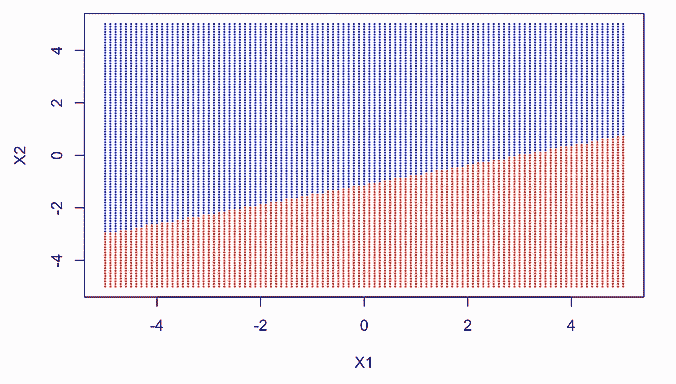

# 机器学习 102:具有多项式特征的逻辑回归

> 原文：<https://towardsdatascience.com/machine-learning-102-logistic-regression-with-polynomial-features-98a208688c17?source=collection_archive---------15----------------------->

## 机器学习:监督学习

## 有非线性成分时如何分类


Photo by [Harley-Davidson](https://unsplash.com/@harleydavidson?utm_source=unsplash&utm_medium=referral&utm_content=creditCopyText) on [Unsplash](https://unsplash.com/?utm_source=unsplash&utm_medium=referral&utm_content=creditCopyText)

> 数据科学家是摇滚明星！
> 
> 摇滚！

在我之前的 [ML 101 文章](/machine-learning-101-predicting-drug-use-using-logistic-regression-in-r-769be90eb03d)中，我解释了我们如何应用逻辑回归来分类线性问题。在这篇文章中，我想通过包含非线性特征来使事情变得复杂一点。就像现实世界一样，事物盘根错节，杂乱无章。

让我们深入研究一下 r。

```
# Load the dataset 
library(tidyverse)
data5 = read_csv("nonlinear.csv")
require(ggplot2)
qplot(X1,X2,colour = Y,data=data5)
```


我们可以看到，黑点被蓝点包围着。我们的工作是找到一种 ML 技术来巧妙地分离这两种类型的点。

```
# build a regular logistic regression
glm_5b = glm(Y~X1+X2,data=data5)
summary(glm_5b)Call:
glm(formula = Y ~ X1 + X2, data = data5)Deviance Residuals: 
    Min       1Q   Median       3Q      Max  
-0.6944  -0.5504   0.1937   0.3584   0.6213 Coefficients:
            Estimate Std. Error t value Pr(>|t|)    
(Intercept)  0.71038    0.05672  12.524   <2e-16 ***
X1          -0.05446    0.02496  -2.182   0.0325 *  
X2           0.04278    0.02708   1.580   0.1187    
---
Signif. codes:  0 ‘***’ 0.001 ‘**’ 0.01 ‘*’ 0.05 ‘.’ 0.1 ‘ ’ 1(Dispersion parameter for gaussian family taken to be 0.2109993) Null deviance: 16.000  on 71  degrees of freedom
Residual deviance: 14.559  on 69  degrees of freedom
AIC: 97.238Number of Fisher Scoring iterations: 2
```

可以看出，常规逻辑回归没有考虑非线性特征，并且表现不佳。

接下来，让我们将类标签投影到精细采样的网格点上，并在网格上用类标签着色的每个点上绘制预测。

```
# grid of points over sample space
gr <- expand.grid(X1=seq(-5, 5, by=0.1), # sample points in X1
 X2=seq(-5, 5, by=0.1)) # sample points in X2#predict class label
probability_pred = predict(glm_5b,gr,type=”response”)# set the cutoff point at 0.5
class_pred = as.factor(ifelse(probability_pred<=0.5, “0”, “1”))
color_array <- c(“red”, “blue”)[as.numeric(class_pred)] 
plot(gr,col=color_array,pch=20,cex=0.25)
```


从上面的图来看，一个常规的逻辑回归模型并没有那么好。

让我们包括 x1 和 x2 的二次多项式项。

```
glm_5c =glm(Y~poly(X1,deg=2)*poly(X2,deg=2),data=data5)
summary(glm_5c)
```


```
probability_pred_5c = predict(glm_5c,gr,type=”response”)
class_pred_5c = as.factor(ifelse(probability_pred_5c<=0.5, “0”, “1”))
color_array_5c <- c(“red”, “blue”)[as.numeric(class_pred_5c)] 
plot(gr,col=color_array_5c,pch=20,cex=0.25)
```


从 ANOVA 输出可以看出，以下变量具有统计显著性:X1、X1、X2、X2、X1*(X2)和(X1) *(X2)。由于二阶项意义重大，我们无法进行简单的线性分类。

此外，从图中可以看出，具有更高项的逻辑斯蒂模型比简单模型表现得更好。

为了安全起见，让我们尝试一个没有任何交互项的 5 次多项式逻辑模型。

```
glm_5d =glm(Y~poly(data5$X1,deg=5)+poly(data5$X2,deg=5),data=data5)
summary(glm_5d)Call:
glm(formula = Y ~ poly(data5$X1, deg = 5) + poly(data5$X2, deg = 5), 
    data = data5)Deviance Residuals: 
     Min        1Q    Median        3Q       Max  
-0.51652  -0.15930  -0.06256   0.17439   0.73943 Coefficients:
                         Estimate Std. Error t value Pr(>|t|)    
(Intercept)               0.66667    0.03309  20.145  < 2e-16 ***
poly(data5$X1, deg = 5)1 -0.70547    0.30163  -2.339  0.02264 *  
poly(data5$X1, deg = 5)2  0.94681    0.28791   3.289  0.00167 ** 
poly(data5$X1, deg = 5)3  0.82225    0.28386   2.897  0.00523 ** 
poly(data5$X1, deg = 5)4 -0.24777    0.29833  -0.831  0.40948    
poly(data5$X1, deg = 5)5 -0.00171    0.29624  -0.006  0.99541    
poly(data5$X2, deg = 5)1  0.62673    0.28989   2.162  0.03456 *  
poly(data5$X2, deg = 5)2  1.70311    0.30479   5.588 5.69e-07 ***
poly(data5$X2, deg = 5)3 -1.60001    0.29074  -5.503 7.84e-07 ***
poly(data5$X2, deg = 5)4 -0.83690    0.28945  -2.891  0.00531 ** 
poly(data5$X2, deg = 5)5  0.88545    0.29321   3.020  0.00369 ** 
---
Signif. codes:  0 ‘***’ 0.001 ‘**’ 0.01 ‘*’ 0.05 ‘.’ 0.1 ‘ ’ 1(Dispersion parameter for gaussian family taken to be 0.07885262) Null deviance: 16.00  on 71  degrees of freedom
Residual deviance:  4.81  on 61  degrees of freedom
AIC: 33.498Number of Fisher Scoring iterations: 2probability_pred_5d = predict(glm_5d,gr,type=”response”)
class_pred_5d = as.factor(ifelse(probability_pred_5d<=0.5, “0”, “1”))
color_array_5d <- c(“red”, “blue”)[as.numeric(class_pred_5d)]
plot(gr,col=color_array_5d,pch=20,cex=0.25)
```


五次多项式不会提高性能。

综上所述，让我们从偏倚和方差权衡的角度来比较所比较的模型。

没有交互作用和高阶项的一般 logistic 模型具有最低的方差，但具有最高的偏差。

具有 5 阶多项式项的模型具有最高的方差和最低的偏差。

具有二阶多项式和交互项的模型在偏差-方差权衡方面表现最佳。

```
# let's create three additional bootstrap replicates of the original dataset and fit regression models to the replicates.
Boot_sample_5f <- lapply(1:3,function(i)data5[sample(1:nrow(data5),replace = TRUE),])
for (i in 1:3) {
 glm_5b = glm(Y~X1+X2,data=Boot_sample_5f[[i]])
 probability_pred_5f = predict(glm_5b,gr,type=”response”)
 class_pred_5f = as.factor(ifelse(probability_pred_5f<=0.5, “0”, “1”))#plot class predictions on the grid of values for each of both linear and 5th order modelscolor_array_5f <- c(“red”, “blue”)[as.numeric(class_pred_5f)] 
 plot(gr,col=color_array_5f,pch=20,cex=0.25)
}# the 5th order polynomial term.
Boot_sample_5f_2 <- lapply(1:3,function(i)data5[sample(1:nrow(data5),replace = TRUE),])for (i in 1:3) {
 glm_5order = glm(Y~poly(data5$X1,deg=5)+poly(data5$X2,deg=5),data=Boot_sample_5f_2[[i]]) probability_pred_5order = predict(glm_5order,gr,type=”response”)
 class_pred_5order = as.factor(ifelse(probability_pred_5order<=0.5, “0”, “1”))
 color_array_5order <- c(“red”, “blue”)[as.numeric(class_pred_5order)] 
 plot(gr,col=color_array_5order,pch=20,cex=0.25)
}
```



Plots 1–3


Plots 4–6

从图 1-3 中，网格被一条直线分成两部分，指的是大偏差和小方差。

从图 4-6 中，我们观察到一个相反的模式:它有一个小的偏差，因为有更多的变量来最小化预测和真实值之间的距离。它有很大的差异，因为点分布在整个图表。

*Medium 最近进化出了自己的* [*作家伙伴计划*](https://blog.medium.com/evolving-the-partner-program-2613708f9f3c) *，支持像我这样的普通作家。如果你还不是订户，通过下面的链接注册，我会收到一部分会员费。*

[](https://leihua-ye.medium.com/membership) [## 阅读叶雷华博士研究员(以及其他成千上万的媒体作家)的每一个故事

### 作为一个媒体会员，你的会员费的一部分会给你阅读的作家，你可以完全接触到每一个故事…

leihua-ye.medium.com](https://leihua-ye.medium.com/membership) 

# 喜欢读这本书吗？

> 请在 [LinkedIn](https://www.linkedin.com/in/leihuaye/) 和 [Youtube](https://www.youtube.com/channel/UCBBu2nqs6iZPyNSgMjXUGPg) 上找到我。
> 
> 还有，看看我其他关于人工智能和机器学习的帖子。