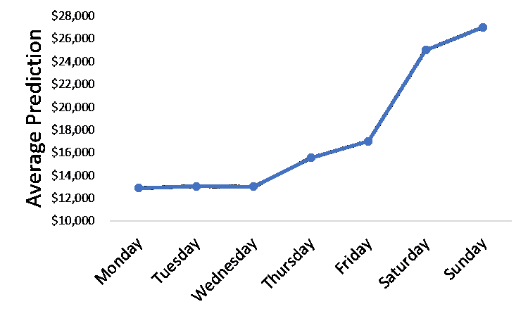
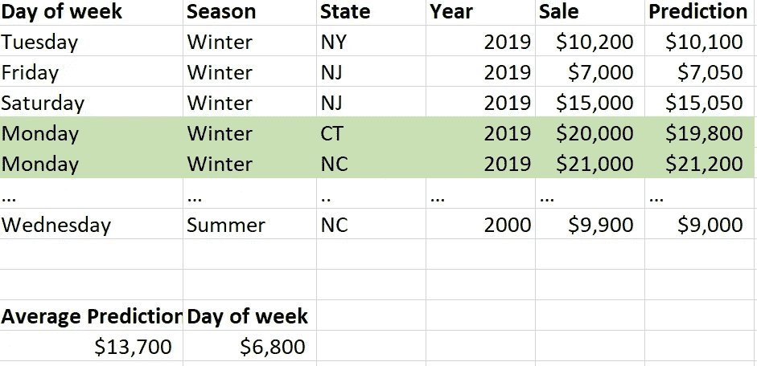
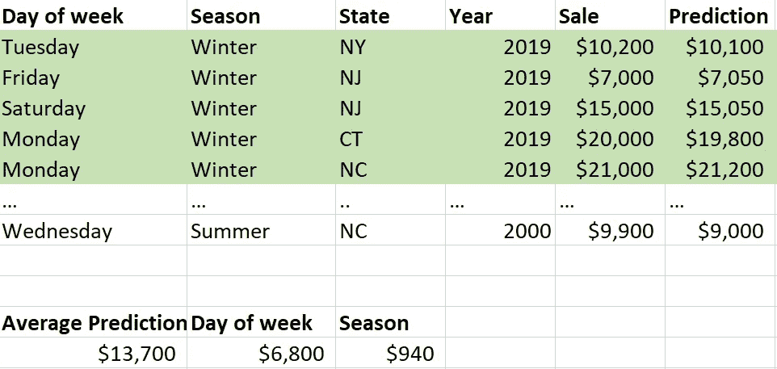

# 机器学习算法不是黑盒

> 原文：<https://towardsdatascience.com/machine-learning-algorithms-are-not-black-boxes-541ddaf760c3?source=collection_archive---------11----------------------->

## 神经网络解释指南

数据科学是一个非常新的领域，几乎没有一成不变的标准。这使得它成为一个令人兴奋的工作领域，因为它取决于当前的数据科学家来创建和设置这些标准。然而，因为数据科学是一个如此新的领域，所以有很多错误的信息。我经常听到的第一个错误信息是*机器学习算法是黑盒*。**我坚决不同意这种说法。**我相信几乎任何机器学习都是高度可解释的。说机器学习算法是黑盒的人也说他们通常使用线性模型，因为它们更容易解释。我也强烈不同意这种说法，认为很多机器学习算法(如神经网络、随机森林)比线性模型更容易解释。这篇博客文章的目标是讨论机器学习算法的可解释性，并提出可以用来解释这些算法的方法。

# 为什么您应该关注模型的可解释性

在深入本质细节之前，让我们讨论一下为什么您应该关心模型的可解释性。数据科学不同于许多其他科学，因为大多数数据科学家都在工业界工作。这意味着大多数数据科学家使用机器学习来解决*商业问题*。这可能是该领域不是基于理论而是基于经验的原因——在大多数情况下，数据科学家不太关心算法在理论上有多优雅，而是关心它是否工作良好。**模型的可解释性通常对解决商业问题至关重要。**该领域的许多人认为，机器学习仅用于自动化流程。这是机器学习的一种用途，但在很多情况下，我训练机器学习模型不是因为我想自动化一个过程，而是我想解释它。在商业环境中，你可能想知道一个预测最重要的特征是什么，以及我能否以某种方式操纵或使用这些特征来解决一个感兴趣的问题。例如，假设您训练了一个模型，该模型采用一些特征并预测客户是否会停止使用您的产品(客户保留问题)。如果你不能真正留住客户(即改变客户的行为)，自动检测客户是否会停止使用你的产品的过程是完全无用的。因此，识别高停药风险客户只是第一步。下一步也是最重要的一步是确定应该做些什么来改变这些客户的行为。这就是模型可解释性的来源。我们可能想研究一下对于客户保持预测来说最重要的特征是什么。在这些重要特性之外，确定我们实际上可以控制的特性，以防止客户停止购买。机器学习非常适合为这个问题提供数据驱动的解决方案。这个过程的这一部分需要一些创造力，我鼓励所有读者阅读 [*设计伟大的数据产品*](https://www.oreilly.com/ideas/drivetrain-approach-data-products) ，其中更深入地讨论了这个问题。

# **为什么线性模型实际上很难解释**

好了，我们已经讨论了为什么模型的可解释性如此重要，但你可能仍然认为，由于线性模型并不复杂，它更适合解释。我认为事实并非如此，原因如下。首先，恰当地拟合线性模型是非常困难的。这是因为线性模型(线性回归/分类)具有非常严格的统计假设(例如，正态性、非共线)。对于“真实世界”数据，数据很少遵循这些统计假设。可以对数据进行预处理/转换，以满足这些统计假设，但是即使这样做了，数据仍然不满足所有这些假设的情况也是非常常见的。

第二，解释β系数通常是有缺陷的。通常，当个人在解释一个线性模型时，他们想要检查模型中最重要的特征。这是通过在训练模型之后，检查β系数和检查这些系数的幅度来完成的。然而，这种方法通常是有缺陷的。为了使β系数实际上是可解释的，模型必须被完美地构建，这意味着每一个主要的影响和相互作用都必须被完美地建模。但是在几乎所有的情况下，不可能知道什么主要效应和相互作用需要被建模，所以β系数基本上是没有用的。顺便说一下，这都是假设特征和因变量之间的关系是线性的，这种情况很少发生。

# 为什么复杂的机器学习算法更容易解释

我希望现在我已经让你相信解释一个线性模型并不像大多数人想的那么简单。现在，你可能想知道为什么我认为机器学习算法更容易解释。**首先**，大部分机器学习算法的统计假设很少。这是我 99%时间使用的机器学习算法的情况，它们是基于集成的算法(例如，随机森林)或神经网络。因此，这些方法能够处理“真实世界”的数据。**第二个**，这些算法中有许多能够学习复杂的交互。随机森林和神经网络通常包含许多参数。具有传统统计学背景的个人通常不喜欢使用有许多参数的模型。他们经常担心这些模型会过度适应训练数据。但是，通过使用正则化，通常可以避免过度拟合。此外，典型的“真实世界”数据极其复杂，拥有许多参数的**通常是充分建模数据所必需的。**我还想向读者指出，检验一个模型是否过度拟合是一个经验性的问题。有经验的机器学习实践者能够识别模型是欠拟合还是过拟合，并且你可以检查(并且应该总是检查！)如果你的模型过拟合。总之，机器学习算法更容易解释，因为它们通常可以更准确地模拟你的数据。

# 你如何解释机器学习算法

好了，最后让我们谈谈你如何解释机器学习算法。在这里，我将讨论解释神经网络的表格数据(所以你通常在电子表格中找到的数据)。您可能会想，为什么要使用包含表格数据的神经网络，而不是像随机森林这样的其他算法。嗯，我确实经常使用随机森林，但最近我发现神经网络很多时候都优于随机森林(即使是在处理小数据集时！).从我自己的经验来看，在处理分类变量时似乎就是这种情况。我相信这是因为我在我的神经网络中使用了实体嵌入。实体嵌入超出了本文的范围，但是如果您不使用它们，您应该考虑使用它们，因为它们对我帮助很大。我向有兴趣了解更多关于实体嵌入的读者推荐 [*表格数据深度学习介绍*](https://www.fast.ai/2018/04/29/categorical-embeddings/) 。

我在这里展示的所有方法都受到了与除神经网络之外的其他机器学习算法一起使用的方法的启发(例如，随机森林)。因此，这意味着这些方法可以适用于任何机器学习算法。此外，以下所有方法都假设您已经训练了您的模型，因此这是您在模型被训练后要做的事情。

让我们开始吧。与解释一个你经常查看参数的线性模型不同，当解释一个神经网络时，我使用询问方法。我经常会对数据进行某种类型的实验操作，看看这会如何影响我的模型输出。在这里，我提出了三种模型解释方法:特性重要性、部分依赖图和单独的行解释器。对于我所有的例子，我使用了一个假的数据集(**图 1** )，我试图根据一些特征(星期几、季节、州和年份)来预测杂货店的销售额。

Fig. 1

# 特征重要性

通常情况下，您希望了解模型预测的最重要的特征。例如，在我们的杂货店示例中，您可能想知道预测杂货店销售额的最重要的特征是什么。首先，你可以得到最终模型的损失(基线损失)。然后，你将选取一个特征(这里假设一周中的某一天，如图**图 2** 所示)，随机排列(即洗牌)这些值(如图**图 3** 所示)，通过训练好的模型运行数据集，并记录你的损失(洗牌损失)。接下来，取基线损耗和洗牌损耗之差的绝对值。这就是你的特性重要性。**因此，如果改变一个值会导致损失发生很大的变化，那么你可以推断这个特性对于你的模型所预测的任何东西都是非常重要的。**

Fig. 2

Fig. 3

您将对每个特征重复此过程。然后比较这些要素重要性值，以确定最重要的要素。正如您可能看到的，特性重要性是一个相对的度量，因此实际的特性重要性值本身并不太重要，但是它与该特定模型中使用的所有其他特性相比如何才是重要的。一旦您确定了最重要的特性，您可能希望在解决您的业务问题时关注这些特性。

# 部分相关图

特征重要性分析告诉我们最重要的特征，但是它没有告诉我们具体的特征是如何与因变量相关的。部分相关图的目标是检查一个特征(或几个特征)如何与控制模型中所有其它特征的模型因变量相关。所以部分依赖图真正有用的部分是控制所有其他特征。创造这些情节的技巧非常聪明，但也很简单。假设您有一个预测杂货店销售额的模型，并且您希望了解一周中的每一天(星期一到星期日)与销售额之间的关系。同样，你的模型必须已经被训练过。我们所做的是从我们感兴趣的特征中提取一个值，假设是星期一，我们将数据集中星期几列中的每一行都更改为星期一(**图 4** )。然后，我们通过我们的模型运行修改后的数据集，并获得预测。这是保持其他一切不变的一个非常聪明的方法。因此，在我们的示例中，在每一行中，季节、州和年份都保持完全相同，但是如果该行中的星期几不是星期一，则更改为星期一。这显示了星期一对预测销售额的具体影响。然后，我们取平均预测值，并将这个值存储起来。

Fig. 4

然后我们在星期二做同样的事情。用星期二替换每一行，通过我们训练好的模型运行修改后的数据集，并计算平均预测值(**图 5** )。

Fig. 5

我们对一周中的每一天重复这个过程，并绘制我们的结果——这是一个部分相关图(**图 6** )。该图显示了星期几和平均销售预测之间的关系，控制了我们模型中的所有其他功能。正如你在下面看到的(注意:这个数据是不真实的)，看起来食品杂货销售在周六和周日是最高的。

Fig. 6

我认为这种类型的分析非常有用。在不使用机器学习模型的情况下，很难检查控制我们所有其他特征的这种关系。我们正在利用神经网络在模型训练期间学习的复杂交互作用。你可能会想，这种类型的分析很容易用线性模型来完成，但是，为了检查这种类型的关系，所有的数据都必须满足线性模型的统计假设，我们必须对数据进行完美的建模，这在 99%的情况下是不可能的。通过使用神经网络，模型学习如何正确地对数据建模。

# 单行解释程序

正如您所看到的，特征重要性分析和部分相关性图正在检查组平均效应，但通常情况下，您可能想知道为什么单个观察会给出某个预测。例如，在我们的杂货店销售示例中，您可能想知道哪些特性可能会产生特定行的预测。我们可以通过单独的行解释器来实现。我不得不承认，这种方法比特性重要性分析和部分依赖图更具实验性，但是我发现它确实表现得相当好。

这种方法受到启发，非常类似于用于解释随机森林的树解释器。有一篇非常好的关于树解释器的博文，我强烈推荐读者去看看— [*解释随机森林*](http://blog.datadive.net/interpreting-random-forests/) 。

首先，您需要选择您想要解释的行(**图 7** )。现在，我们将对整个数据集进行平均预测。在本例中，它是 13，700 美元。

Fig. 7

接下来，我们将计算每个特性的*特性贡献*。让我们从星期几开始。对于这个特定的行，星期几是星期一。因此，我们遍历数据集，找到所有将星期一作为星期几的行(**图 8** )。然后对于所有这些行，我们取平均预测值。然后，我们获得星期一行的平均预测，并从中减去整个数据集的平均预测，得到 6800 美元。这就是特色贡献。我们可以推断，如果特定要素类型(例如，星期一)的平均预测值确实不同于整个数据集的平均预测值，则该要素确实很重要。此外，特征贡献的方向很重要。如果该值为正值，则可能导致预测值高于数据集的平均值，但如果该值为负值，则可能导致预测值低于数据集的平均值。如您所见，就像特性重要性一样，这将是一个相对的度量。

Fig. 8

现在，让我们为我们的下一个功能，这是季节。对于我们正在解释的特定行，季节是冬天。因此，我们将找到季节为冬季的所有行，获得平均预测，并将冬季平均预测与整个数据集的平均预测进行比较；这里，季节的特征贡献是$940 ( **图 9** )。

Fig. 9

我们将对所有其他特征重复该过程(**图 10** )。现在我们可以看到这个特定行最重要的特性。在这种情况下，它是一周中的某一天—也显示在图中(**图 11** )。在我们的例子中，所有的贡献都是积极的，但也要记住，贡献可能是消极的。如果你有一个积极和消极贡献的组合，并且你正在努力寻找最重要的特征(所以你可能不关心变化的方向)，你当然可以只取这些贡献的绝对值。

Fig. 10

Fig. 11

在我们的例子中，我们所有的特征都是分类变量，所以你可能想知道如何处理连续变量。这也是实验性的，但是对于一个连续变量，我把值分成两个不同的类别。我的方法是从特定要素的数据集中提取所有值，并对唯一值进行排序。然后，我找到可以将数据集分成两组的值(因此，将低于或等于分割点值的值和高于分割点值的值打包),平均预测的差异最大(非常类似于决策树！).计算此连续变量的特征贡献时，您可以查看该值，看它是属于小于或等于分割点值的类别，还是属于大于分割点值的类别。然后，你正常计算特征贡献。

# 结论

正如你可以从这些方法中看到的，它们都不复杂，我希望这些能启发读者开发其他/更好的解释机器学习算法的方法。我希望我已经让你相信，机器学习算法不仅是高度可解释的，**，而且它们在解决商业问题(或任何类型的问题)时都非常有用。**机器学习解释提供的许多见解往往无法用简单的描述性统计来实现。

机器学习模型解释仍处于起步阶段，因此非常欢迎反馈和新想法——无论是这里的评论还是新的博客帖子！尽情探索你的机器学习算法吧！