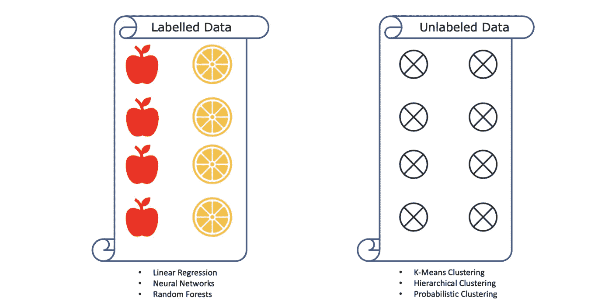
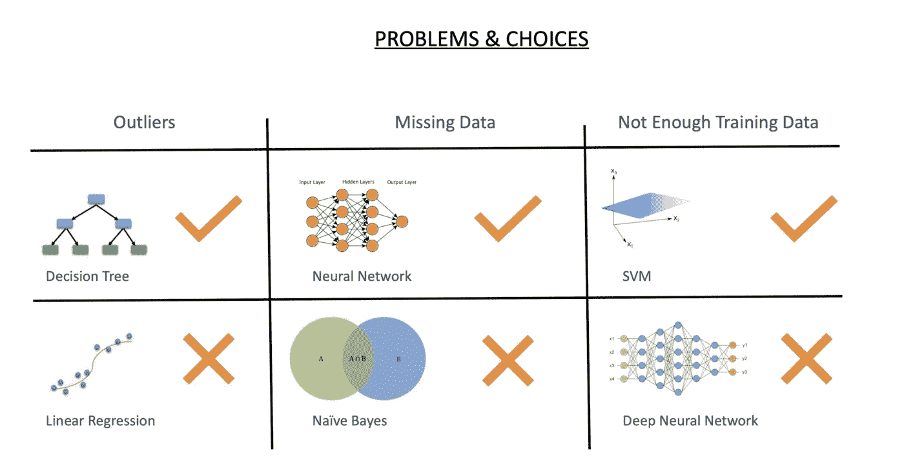
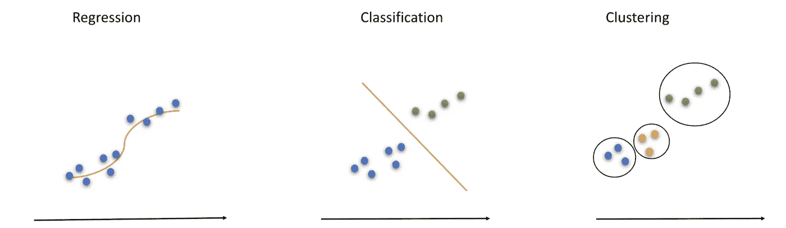
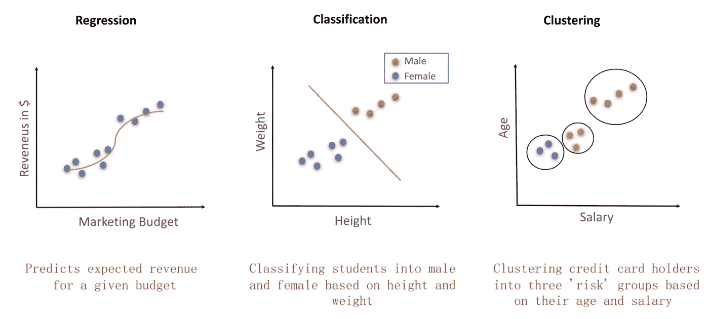
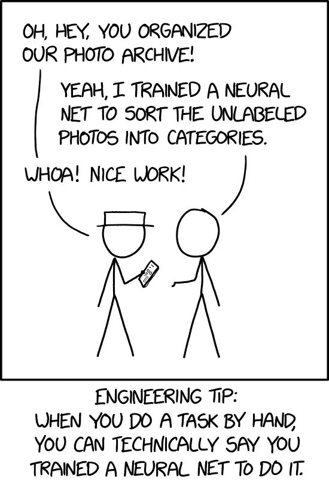
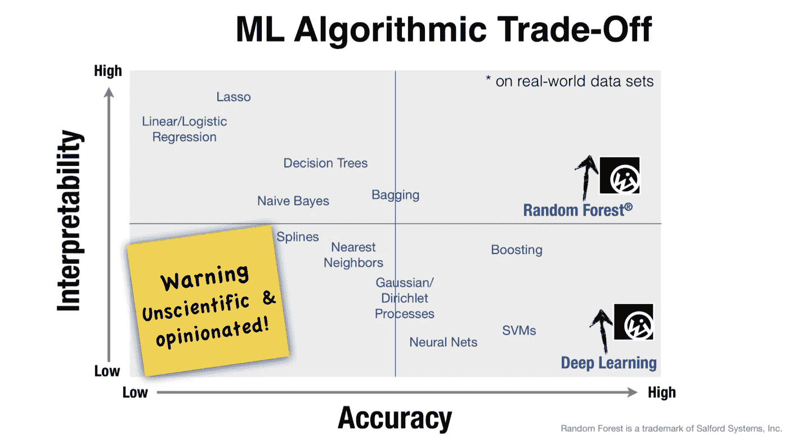

# 适合各种场合的机器学习算法

> 原文：<https://towardsdatascience.com/machine-learning-algorithms-for-every-occasion-90a0ef2e63b6?source=collection_archive---------11----------------------->

## 对您选择的算法做出明智的决定

机器学习算法是一种方法，它为系统**提供自动学习**和**的能力，并根据经验**进行改进，而不需要**明确编程**。像[线性回归](/laymans-introduction-to-linear-regression-8b334a3dab09)，深度学习，c [选择性神经网络](https://medium.com/x8-the-ai-community/cnn-9c5e63703c3f)和[推荐系统](https://medium.com/x8-the-ai-community/recommendation-system-db51c868f13d)这样的算法被广泛使用和解释。

人们很容易迷失在信息的海洋中。了解哪种算法适合任何给定的情况成为一种制胜的品质。通常这个角色由产品经理来扮演。不管谁发号施令，重要的是要明白不同的情况需要不同的算法。

Photo by [Jean-Philippe Delberghe](https://unsplash.com/@jipy32?utm_source=medium&utm_medium=referral) on [Unsplash](https://unsplash.com?utm_source=medium&utm_medium=referral)

# 指导原则

您对算法的选择主要取决于 3 个因素。

1.  输入数据的质量
2.  所需的输出类型
3.  业务限制

## 1)输入数据的质量

根据所有输入数据包含的信息，可以选择算法。即使是数据是否被标记的简单概念也会极大地影响算法的选择。监督算法最适合标记良好的数据。像[线性回归](/x8-the-ai-community/linear-regression-in-r-example-in-code-a84af29222fb)、[逻辑回归](/x8-the-ai-community/practical-aspects-logistic-regression-in-layman-terms-73fbcae58625)、神经网络、[随机森林](/x8-the-ai-community/building-intuition-for-random-forests-76d36fa28c5e)等算法。都是监督算法的例子。

另一方面，如果您的数据没有标签或具有稀疏标签，则可以使用无监督学习算法，如聚类。

没有完美的数据集。真实世界的数据收集充斥着各种问题，比如缺失数据、噪声数据、少于算法所需的数据。

**比如说**你的数据中有很多异常值，那么线性回归的表现会非常差，但是决策树会是一个相当稳定的解决方案。

类似地，缺失数据对朴素贝叶斯的影响远远大于对神经网络的影响。当没有足够的训练数据时，SVM 会比深度神经网络表现得更好。

## 2)所需输出的类型

如果你需要你的输出来预测明天的股票价格，那么算法将是一个**时间序列**模型。另一方面，如果你只需要一封邮件是否是垃圾邮件的输出，你可以使用**分类。**您需要的输出类型直接取决于您需要回答的业务问题。

**商业问题 1 —** 假设一家初创公司的营销团队想要决定营销预算的规模。他们希望基于它将产生的收入。解决这个业务问题会产生一个**营销预算与销售收入的关系图**的输出。这种问题属于线性回归的范畴。(最左边的曲线)

**商业问题 2 —** 而如果同一家公司想根据他们的**身高和体重将他们的用户分为男性和女性，**那么这就变成了一个**分类的问题。**

**业务问题 3 —** 如果同一家公司想要对他们的用户进行分析，以了解他们的信用风险，那么选择的算法将是无监督学习。是因为数据没有标注。新的信用卡用户没有一个风险评分或风险档案，在此基础上他们可以被分类。因此，这些公司喜欢根据年龄、工资和地点等因素对用户进行聚类。这将成为一个**集群**问题。

**算法与数据的关系**

*   在回归中，你拟合了一条预测趋势的线，这条线上的任何新点都能很容易地告诉你你需要什么。
*   另一方面，分类**通过一条明确的线将两个类别**分开。两边的分数都归入了整齐的类别。
*   最后，聚类试图观察可以在整个数据集中识别的所有**小组(聚类)**。然后可以对每个集群进行不同的处理。

[xkcd](https://xkcd.com/2173/)

有趣的是，回归和分类都是有监督的算法。例如，在趋势预测示例中，我们已经知道一些对应于(营销预算、收入)值的数据点。由于我们事先已经知道了几双鞋**，我们可以开始预测营销预算新值的收入。**

同样，我们已经知道用户细分问题中的一些男性和女性。我们有他们的体重和身高数据。在此基础上，我们画了一条线将它们分开。**任何具有给定体重和身高的新人都会落在这条线的两侧，并立即被归类**。

然而，第三个问题略有不同。它属于无监督学习的情况，因为我们没有新用户的信用记录。因此，基于他们的年龄和工资，我们试图形成三个群体，观察他们的行为。这些集群中的一些将成为高风险个体，而一些将成为低风险个体**。基于此，公司可以选择提供信用卡。**

## 3)业务限制

最后，业务约束指导算法的选择。业务约束以下列形式出现:涉及的**成本**、**上市时间**、**向客户承诺的速度**以及**能源效率**。

像 Fitbit 或其他智能设备这样的边缘物联网公司将需要消耗更少能量的算法(因为**电池限制**)并具有足够好的准确性。他们不需要 99%的准确率。因此，他们会选择线性回归算法或最近邻法或支持向量机。

[Wise.io + UC Berkley](https://cdn.oreillystatic.com/en/assets/1/event/105/Overcoming%20the%20Barriers%20to%20Production-Ready%20Machine-Learning%20Workflows%20Presentation%201.pdf)

但像特斯拉这样需要自动驾驶汽车的公司，并不太在乎能效。它储存了很多能量。它非常关心准确性，所以它使用深度学习。

同样，斯坦福大学的机器学习研究团队对模型的可解释性比对准确性更感兴趣。因此团队使用决策树和朴素贝叶斯。

**计算复杂性也很重要**,因为它会影响成本，进而影响硬件选择。与谷歌这样的巨头相比，初创公司的资金较少，因此初创公司会部署决策树算法，而谷歌会选择由 1000 棵决策树组成的随机森林。

知道使用哪种算法是一项非常方便的技能。在众多的算法中，找到正确的算法是必须的。

> 没有选择是糟糕的，有太多选择更糟糕！