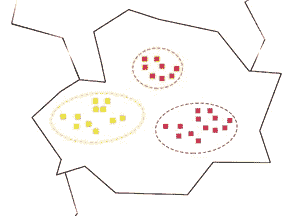

# 简单的机器学习算法(第 1 部分)

> 原文：<https://towardsdatascience.com/machine-learning-algorithms-from-the-easy-side-part-1-14f2dee005ab?source=collection_archive---------13----------------------->

机器学习(ML)通常用于许多不同的事情，例如欺诈检测、图像识别、语音识别、视频推荐、自动驾驶汽车、垃圾邮件检测、教计算机如何烹饪或如何下棋等等。

ML 的好处有很多，其中一个就是学起来并不难。因此，我们有人类，他们使用不同的交流方式进行交流，如面部表情、手势、语调、节奏……我们有计算机，他们使用数据进行交流。两者之间的一个很大的区别是，人类从过去的经验中学习，而计算机需要由人类给予信息，这涉及到教授计算机相应的编程。

ML 是一个新概念，它教会计算机像人类一样学习，根据过去的经验完成任务。在本文中，我们将探索一些不同的算法和例子，其中计算机从以前的信息(或数据)中学习。所以让我们开始吧。

**决策树**

假设你是一名汽车销售人员，你想向你的客户推荐汽车，比如 E-Porsche、宝马 i8 和奔驰 EQS。

您有关于客户的各种信息，如年龄和就业形式(自雇或受雇)。下表列出了所有数据:

例如，在表格的第二行，我们有一位客户，29 岁，有工作，有一辆 E-Porsche。有了给定的数据，这里的任务是根据客户的职业或年龄来预测应该向客户推荐哪种汽车。

看看不同的就业形式并把它们分开，自营职业者和受雇者都拥有 E-Porsche，这不适合分开。

在另一种情况下，我们可以使用特征年龄进行分割。通过观察“年龄”数据，35 岁以下的客户拥有 Mission-E 汽车，35 岁以上的客户拥有其他类别的汽车。

最能区分数据的特征是年龄。

一旦我们按年龄分开，我们可以继续就业的特点。

通过分离特征，我们现在可以向 35 岁以下的自雇人士推荐 i8，如果客户超过 35 岁并有雇主，我们可以推荐 EQS。这种方法被称为决策树。

决策来自于提出的问题。顾客多大了？是自雇还是受雇？如果有新客户，我们可以用决策树，给他推荐一辆车。如果新客户年龄在 35 岁以下，我们向他推荐 Mission-E。这种方法可以处理分类和数字特征，并且易于理解。它为视觉表现提供了很好的解释。我们将继续下一个方法。下一个方法将帮助我们过滤数据。

**朴素贝叶斯**

ML 的另一种方法是朴素贝叶斯，这是一种分类技术。这是一个概率最大似然模型。对于垃圾邮件和文档分类这样的任务，它工作得很好。这种方法的一个常见例子是垃圾邮件过滤。我们将使用它作为分类器来检测垃圾邮件和非垃圾邮件。它是如何工作的？对于这项任务，我们必须看一看我们已经收到的数据。该数据集包含 50 个非垃圾邮件和 20 个垃圾邮件，它们已被手动标记。这使得总共有 70 封电子邮件。

让我们来定义和分析一些可以成为垃圾邮件的特征。例如，特征可以是没有主题的电子邮件。现在我们查看至少 70 封邮件，发现 50 封非垃圾邮件中有 4 封，20 封垃圾邮件中有 10 封是没有主题的邮件。

有了记录的数据，我们会试着找出一封没有主题的邮件是垃圾邮件的概率。我们可以看到，从我们没有主题的邮件中，四封是非垃圾邮件，而十封是垃圾邮件。这给了我们以下的答案:

71.43%是没有主题的邮件是垃圾邮件的概率。然后，我们可以使用以下规则将未来的电子邮件标记为非垃圾邮件或垃圾邮件:如果收到没有对象的电子邮件，则该电子邮件是垃圾邮件的概率为 71.43%，并将该电子邮件分类为垃圾邮件或不是垃圾邮件。通过使用其他功能，如包含句子“你是大赢家”或“要求你的报价”。然后，我们可以结合所有的特征对电子邮件进行分类。这种算法被称为朴素贝叶斯分类器。该方法也用于推荐、情感分析。这很容易实现。下一个方法，我们将看到，也是一个简单的方法，非常适合分析大量的数据。

**K-均值聚类**

K-Means 是用于对对象进行分组(聚类分析)的最常用的 ML 方法之一。我们有自行车，并希望将它们用于我们的自行车租赁系统。为此，我们决定在一个地区设置三个自行车租赁站。我们正在对一个地区进行研究，发现更多骑自行车出行的人住在公寓里，如下图所示。

用这种安排将每个站放在一个组中听起来更正确。因为公寓离得很近。

然而，正如我们在开始时所说的，事实是必须教会计算机如何完成一项任务。这意味着他不知道此时该如何做。在这种情况下，我们需要使用一种新的方法来找到一个好的位置。我们首先随机放置三个车站，在照片中自行车所在的位置。

在安置好车站后，我们希望人们能从最近的车站租到自行车。也就是说，靠近橙色车站的从橙色公寓租，靠近粉色车站的从粉色租，靠近黄色车站的从黄色租。

但是，如果我们观察黄色公寓中的居民与黄色车站的距离，我们会发现将车站放在黄色公寓的中心更有意义，并对粉色和黄色车站重复此步骤。

通过简单地改变车站的位置，我们现在可以将公寓重新安排到最近的车站。通过查看五个橙色公寓旁边的三个公寓，我们可以看到它们离橙色车站比离粉红色车站更近，然后我们将这些公寓标记为橙色，并对粉红色公寓旁边的两个黄色公寓进行同样的操作。

通过将粉色车站移动到其客户的中心，我们发现三个黄色公寓比黄色车站更靠近粉色车站，因此我们将它们着色为粉色。

然后，我们将黄色车站移动到黄色公寓的中心，因为它们离这个车站更近。

这种方法被称为 k-means。如果我们知道我们最终想要多少个聚类，那么我们可以使用 k-means。如果我们不知道我们想要多少个集群。还有另一种算法，叫做层次聚类。

**层次聚类**

在不指定组或群、群的数量的情况下，分层聚类是可以用来对该地区中的公寓或建筑物进行聚类的另一种方法。由于公寓在一个地区的位置，如果两个公寓很近，那么公寓的居民可以在同一个车站租自行车。根据此规则，我们可以将公寓分组如下:

然后，我们将下两个最近的公寓分组。

我们重复上一步，我们将得到以下结果

那么最接近的可能附近公寓就是图中标注的图片。但是他们彼此离得有点远。

如果距离达到一定长度，算法的执行停止。这种方法称为层次聚类，如果我们不知道想要的聚类数，但知道应该是什么样子，就可以使用这种方法。

**线性回归**

在这个例子中，我们试图根据汽车的长 x 宽 x 高(LxWxH)来估计汽车的价格。

为此我们做了一个小研究。通过这个小小的学习，我们有了三辆车。最小的汽车花费 15000€，最大的汽车花费 45000€。我们现在想估算一辆大小介于两辆车之间的汽车的价格。

为此，我们将汽车排列在一个网格中，其中 x 轴对应汽车的大小，y 轴对应汽车的价格。为了使任务变得简单一点，我们使用了之前从其他汽车上记录的数据。这些用这些棕色的点来表示。

我们可以看到这些点可以形成一条线。然后我们画一条最适合这些棕色点的线。

在这条线的帮助下，我们可以估计中间那辆车的价格，这相当于 30.000 €。

这种方法称为线性回归。为了找到上面那条最符合数据的绿线，我们使用了一种叫做梯度下降的不同方法。我们稍作停留，谈谈这个方法。

**梯度下降**

让我们假设我们在山顶，我们需要找到到山脚的最短距离。

我们可以一步一步走到山脚下。我们首先需要找到合适的方向，让我们可以走得更远。然后我们朝那个方向前进。

之后，我们重复这个过程，朝着正确的方向迈出一步。

我们重复这个动作，直到到达山脚。

这是梯度下降算法。它在机器学习中被大量使用。为了解决我们的高山问题，我们朝着正确的方向迈出一小步，直到到达山脚(解决方案)。

**线性回归—套件**

我们现在回到使用线性线来寻找数据的最佳匹配的方法。我们仍然在线性回归中试图解释如何找到与数据最匹配的直线。

让我们用四个点试一试，找到一条更适合这四个点的线。作为一台计算机，我们不知道如何做到这一点，所以我们首先偶然画一条线。

现在我们检查这条线与数据拟合的好坏程度。这是通过计算误差来实现的。为此，我们计算四个点到直线的距离。然后我们把这些距离相加得到误差。

然后我们把线往不同的方向移动，计算误差，看到误差变小了。

我们采取这一步，重复这一过程，并尽量减少误差，直到我们找到一个好的解决方案。

这个最小化误差的过程是通过梯度下降来完成的。当我们在山顶时，我们有一个很大的误差。我们沿着正确的方向迈出的每一步，都将误差降到最低。在真实的例子中，我们不想使用负距离，所以我们使用正方形来代替。这就是所谓的最小二乘法。

**逻辑回归**

对于这个例子，我们接受了对良性和恶性脑瘤进行分类的任务。

基本上，良性脑瘤可以与恶性脑瘤相区别，其特征在于良性脑瘤通常生长缓慢(并且主要通过增加压力来损伤周围组织),并且与恶性肿瘤相比，良性脑瘤不太可能复发，恶性肿瘤生长迅速并具有侵入健康组织的能力。我们将在这里使用这两个特征肿瘤的生长速度和复发程度来分类这两种类型的脑肿瘤。

在这个例子中，我们已经记录了一些具有参数的数据，例如，对于数据 x，生长速度梯度为 20%，复发梯度为 20%，数据 x 是良性肿瘤。对于数据 y，我们有一个 79%的增长速度梯度，61%的复发梯度，这是一个恶性肿瘤。我们现在有了新的数据，增长速度等级为 62%，复发等级为 45%。颜色定义了每个实例所属的类标签。根据我们掌握的数据，我们想确定这是哪种类型的肿瘤。为此，我们将数据排列在一个网格中，其中 x 轴对应于增长率，y 轴对应于复发等级。

我们使用以前记录的恶性和良性肿瘤的数据。

仔细观察这些点，我们可以看到这些点可以用一条线分开。这条线是模型。

大部分红点在绿线之上，大部分灰点在线之下。每当我们有一个新的点，我们将能够使用该模型将其分配给肿瘤类型。关于线的数据是恶性肿瘤，线下的数据是良性肿瘤。对于具有坐标的新数据，我们可以说这个肿瘤是恶性的。这种方法被称为逻辑回归。

与线性回归一样，我们检查找出这条分隔数据的直线的方法。让我们举一个简单的例子，试着找出最能区分数据的线，红点和红点。

在我们的例子中，我们有两个红点和一个红点，这意味着三个错误。我们试图通过使用梯度下降来最小化误差。如果我们把线向正确的方向移动，我们可以看到误差被最小化了。

现在我们只有两个错误。然后我们重复这个过程，直到我们不再有错误。

对于真实的例子，我们并不试图最小化误差，而是使用一个称为对数损失函数的函数，该函数对误差的数量进行加权。我们有八个点中的两个没有正确分类。

对数损失函数将对不正确的点分配较大的罚分，对正确的点分配较小的罚分。我们将各个点的所有惩罚相加，得到对数损失函数。为了更清楚地说明这一点，我们用数字代替了大罚分和小罚分。第二步，我们看到误差比下一步大。

这里的步骤是最小化误差函数，并找到最好地分隔数据的线。

现在我们知道一点机器学习算法。让我们在[下一页](https://medium.com/@itembe2a/machine-learning-algorithms-from-the-easy-side-part-2-8b54e1cc4efb?source=friends_link&sk=d08caa77cabaf85fc534517173f6d02b)看到更多。

**一些不错的参考资料**

[1]安德鲁·摩尔。K-means 和层次聚类-教程幻灯片。网址 http://www-2.cs.cmu.edu/~awm/tutorials/kmeans.html。

迈克尔·尼尔森。神经网络和深度学习。网址 http://neuralnetworksanddeeplearning.com/index.html。