# 通俗易懂的机器学习算法，第 1 部分

> 原文：<https://towardsdatascience.com/machine-learning-algorithms-in-laymans-terms-part-1-d0368d769a7b?source=collection_archive---------2----------------------->

## (即如何向你奶奶解释机器学习算法)

【**更新:**第二部现已上线！点击这里查看[。]](https://medium.com/@AudreyLorberfeld/machine-learning-algorithms-in-laymans-terms-part-2-a0a74df9a9ac)

作为熨斗学院[数据科学训练营](https://flatironschool.com/free-courses/data-science-bootcamp-prep/)的一名应届毕业生，我收到了大量关于如何在技术面试中胜出的建议。一项不断涌现的软技能是向非技术人员解释复杂的机器学习算法的能力。

[https://wordstream-files-prod.s3.amazonaws.com/s3fs-public/machine-learning.png](https://wordstream-files-prod.s3.amazonaws.com/s3fs-public/machine-learning.png)

这一系列帖子是我与世界分享我将如何解释我经常遇到的所有机器学习主题...给我奶奶。有些比较深入，有些不太深入，但我认为所有这些对非数据科学家都有用。第一部分的主题是:

*   [梯度下降/最佳拟合线](https://medium.com/p/d0368d769a7b/edit#9c09)
*   [线性回归(包括正则化)](https://medium.com/p/d0368d769a7b/edit#cdab)
*   [逻辑回归](https://medium.com/p/d0368d769a7b/edit#ef31)

在本系列接下来的部分中，我将回顾:

*   决策树
*   随机森林
*   SVM
*   朴素贝叶斯
*   RNNs 和 CNN
*   k-神经网络
*   k 均值
*   DBScan
*   分层聚类
*   凝聚聚类
*   极端梯度推进
*   adaboost 算法

在我们开始之前，先简单说说算法和模型之间的区别，摘自[这篇伟大的 Quora 帖子](https://www.quora.com/What-is-the-difference-between-an-algorithm-and-a-model-in-machine-learning):

> “一个模型就像一个自动售货机，给你一个输入(钱)，就会给你一些输出(也许是一罐汽水)。。。**算法**用于训练**模型，**模型基于给定输入做出的所有决策，以给出预期输出。例如，一种算法将根据给定资金的美元价值、你选择的产品、资金是否足够、你应该获得多少余额等等做出决定。”

总而言之，算法是模型背后的数学生命力。区分模型的是它们使用的算法，但是没有模型，算法只是一个数学方程，没有任何关系。

就这样，往前走！

# **梯度下降/最佳拟合线**

(虽然第一种算法传统上并不被认为是机器学习算法，但理解梯度下降对于理解多少机器学习算法有效并得到优化是至关重要的。)

> 我对奶奶:

“基本上，梯度下降有助于我们根据一些数据获得最准确的预测。

让我再解释一下——假设你有一份你认识的每个人的身高和体重的清单。假设你把这些数据制成图表。它可能看起来像这样:

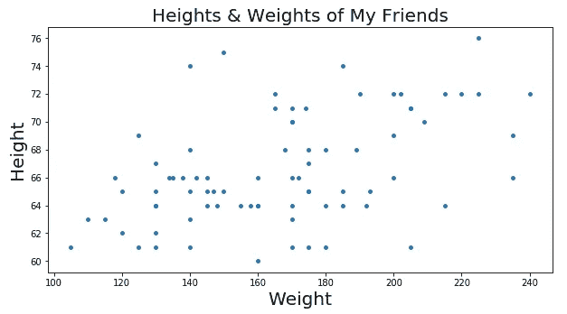

Our fake height and weight data set (…strangely geometric)

现在让我们假设有一个当地的猜谜比赛，根据身高猜对某人体重的人将获得现金奖励。除了用你的眼睛来判断一个人，你还必须非常依赖你手头的身高和体重列表，对吗？

因此，根据上面的数据图表，如果你在图表上有一条线显示数据的趋势，你可能会做出一些很好的预测。有了这样一条线，如果给你一个人的身高，你就可以在 x 轴上找到那个身高，一直向上，直到你碰到你的趋势线，然后看看 y 轴上相应的体重是多少，对吗？

但是你怎么找到那条完美的线呢？你也许可以手动完成，但是这将会花费很长时间。这就是梯度下降的用武之地！

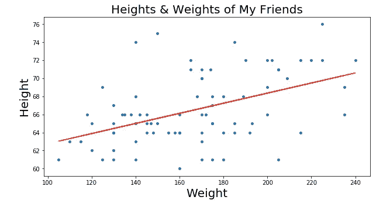

Our “line of best fit” is in red above.

它通过尝试最小化称为 RSS(残差平方和)的东西来做到这一点，RSS 基本上是我们的点和我们的线之间的差异的平方和，即我们的真实数据(点)离我们的线(红线)有多远。通过改变我们的线在图上的位置，我们得到越来越小的 RSS，这有直观的意义——我们希望我们的线在最接近我们大多数点的任何地方。

我们实际上可以更进一步，在一个叫做*成本曲线*的东西上绘制每条不同生产线的参数。使用梯度下降，我们可以得到我们的成本曲线的底部。在我们成本曲线的底部是我们最低的 RSS！

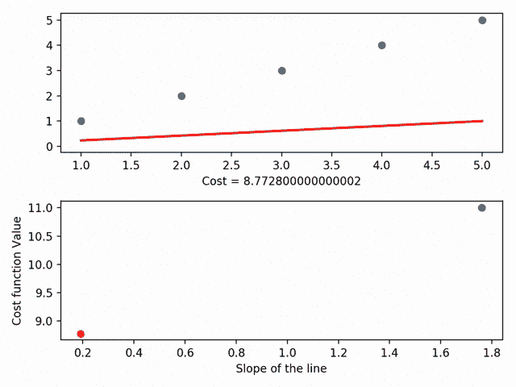

Gradient Descent visualized (using MatplotLib), from the incredible Data Scientist [Bhavesh Bhatt](https://www.linkedin.com/feed/update/urn:li:ugcPost:6503460920944099328)

梯度下降还有更细粒度的方面，如“步长”(即我们希望以多快的速度接近滑板斜坡的底部)和“学习率”(即我们希望以什么方向到达底部)，但本质上:梯度下降通过最小化我们的点和最佳拟合线之间的空间来获得我们的最佳拟合线。反过来，我们的最佳拟合线允许我们做出预测！"

# 线性回归

> 我对奶奶:

简单地说，线性回归是一种分析 1 个变量(我们的“结果变量”)和 1 个或更多其他变量(我们的“自变量”)之间关系强度的方法。

线性回归的一个标志，顾名思义，就是自变量和我们的结果变量之间的关系是*线性*。就我们的目的而言，这意味着当我们绘制自变量相对于结果变量的曲线时，我们可以看到这些点开始呈现线形，如下图所示。

(如果你不能绘制数据，思考线性的一个好方法是回答这个问题:我的自变量的一定量的变化会导致我的结果变量的相同量的变化吗？如果是，你的数据是线性的！)

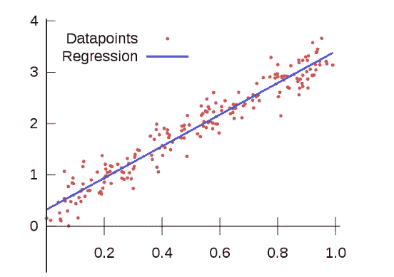

This looks a ton like what we did above! That’s because the line of best fit we discussed before IS our “regression line” in linear regression. The line of best fit shows us the best possible linear relationship between our points. That, in turn, allows us to make predictions.

关于线性回归要知道的另一件重要的事情是，结果变量，或者根据我们如何改变其他变量而改变的东西，总是*连续的*。但这意味着什么呢？

假设我们想测量海拔高度对纽约州降雨量的影响:我们的结果变量(或者我们希望看到变化的变量)是降雨量，我们的独立变量是海拔高度。使用线性回归，结果变量必须是具体的*多少英寸的降雨量*，而不是仅仅一个真/假的类别来指示在 *x* 高度是否下雨。这是因为我们的结果变量必须是连续的——这意味着它可以是数字范围内的任何数字(包括分数)。

关于线性回归最酷的事情是，它可以使用我们之前谈到的最佳拟合线来预测事情！如果我们对上面的降雨量与海拔情景进行线性回归分析，我们可以找到最佳拟合线，就像我们在梯度下降部分所做的那样(这次用蓝色显示)，然后我们可以使用该线做出有根据的猜测，即在某个海拔高度下合理预期的降雨量。"

## 岭和套索回归

> 我继续满怀希望地——不太害怕地——对奶奶说:

“所以线性回归没那么可怕，对吧？这只是一种方法，用来观察一件事对另一件事有什么影响。酷毙了。

现在我们知道了简单的线性回归，我们可以讨论更酷的线性回归，比如岭回归。

就像梯度下降与线性回归的关系一样，我们需要了解一个背景故事来理解岭回归，那就是**正则化。**

简而言之，数据科学家使用正则化方法来确保他们的模型只关注对其结果变量有重大影响的独立变量。

你可能想知道为什么我们关心我们的模型是否使用没有影响的独立变量。如果它们没有影响，我们的回归不就是忽略它们吗？答案是否定的！我们可以稍后深入研究机器学习的细节，但基本上我们是通过向它们提供一堆“训练”数据来创建这些模型的。然后，我们通过在一堆“测试”数据上测试我们的模型来看看它们有多好。因此，如果我们用一堆独立变量训练我们的模型，其中一些重要，一些不重要，我们的模型在我们的训练数据上表现得非常好(因为我们在欺骗它，让它认为我们喂它的所有东西都重要)，但在我们的测试数据上表现得非常差。这是因为我们的模型不够灵活，不足以很好地处理新数据。单身。很少。我们在训练阶段喂它的东西。当这种情况发生时，我们说模型“过度拟合”

为了理解过度拟合，让我们看一个(冗长的)例子:

> 假设你是一位新妈妈，你的小男孩喜欢意大利面。几个月过去了，你养成了开着厨房窗户给宝宝喂意大利面的习惯，因为你喜欢微风。然后你宝宝的表弟给他买了一件连体衣，你就开始了一个传统，当他穿着特殊的连体衣时，只给他吃意大利面。然后你收养了一只狗，它在宝宝吃意大利面的时候，勤奋地坐在宝宝的高脚椅下面去抓流浪面。在这一点上，你只能在你的宝宝穿着特殊的连体衣的时候喂他吃意大利面…厨房的窗户开着…狗在高脚椅下面。作为一个新妈妈，你会很自然地把你儿子对意大利面的喜爱与所有这些特征联系起来:敞开的厨房窗户、连体衣和狗。现在，你对婴儿饮食习惯的心理模型相当复杂！
> 
> 一天，你去奶奶家旅行。你必须给你的宝宝喂晚餐(当然是意大利面)，因为你要在这里过周末。你陷入恐慌，因为这个厨房没有窗户，你把他的连体衣忘在家里，狗和邻居在一起！你吓坏了，以至于忘记了给宝宝喂饭，只是让他上床睡觉。
> 
> 哇哦。当你面对一个你从未面对过的场景时，你表现得相当糟糕。不过，在家里你做得很好！没道理啊！
> 
> 在重新审视你对宝宝饮食习惯的心理模型并忽略所有“噪音”，或你认为可能对你的儿子**实际上**喜欢意大利面没有帮助的事情后，你意识到唯一真正重要的事情是它是由你做的**。**
> 
> 第二天晚上在奶奶家，你在她没有窗户的厨房里喂他最爱的意大利面，而他只穿着尿布，没有狗。一切都很好！你对他为什么喜欢意大利面的想法现在简单多了。

这正是正则化可以为机器学习模型做的事情。

因此，正则化有助于您的模型只关注数据中重要的内容，并消除噪声。

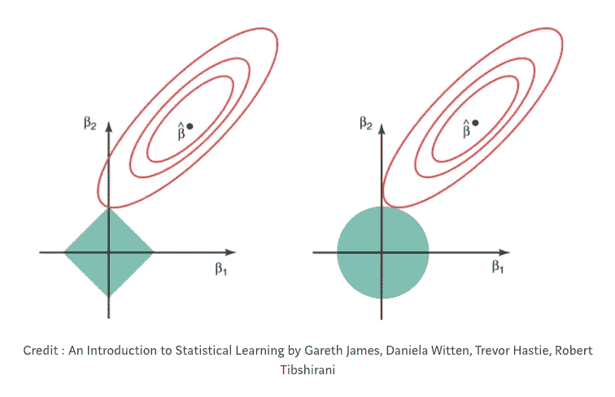

On the left: LASSO regression (you can see that the coefficients, represented by the red rungs, can equal zero when they cross the y-axis). On the right: Ridge regression (you can see that the coefficients approach, but never equal zero, because they never cross the y-axis). Meta-credit: “[Regularization in Machine Learning](/regularization-in-machine-learning-76441ddcf99a)” by [Prashant Gupta](https://towardsdatascience.com/@prashantgupta17)

在所有类型的正则化中，有一种叫做**惩罚项**的东西(希腊字母 lambda: λ)。这个惩罚项在数学上缩小了我们数据中的噪声。

在岭回归中，有时被称为“L2 回归”，惩罚项是变量系数的平方和。(线性回归中的系数基本上只是附加在每个独立变量上的数字，告诉你每个独立变量对结果变量的影响有多大。有时我们称它们为“重量”)在岭回归中，罚项缩小了自变量的系数，但实际上从未完全消除它们。这意味着通过岭回归，你的数据中的噪声将总是被你的模型考虑进去一个*小*位。

另一种类型的正规化是拉索，或“L1”正规化。在套索正则化中，不是惩罚数据中的每个要素，而是只惩罚*高*系数的要素。此外，套索有能力缩小系数的所有方式为零。这实际上是从数据集中删除了这些要素，因为它们现在的“权重”为零(即它们实际上被乘以零)。“使用 LASSO 回归，您的模型有可能消除数据集中的大部分噪声。这在某些场景下超级有帮助！

# 逻辑回归

> 我对奶奶:

“所以，酷，我们已经线性回归下来了。线性回归=一个变量对另一个变量的影响，假设 1)结果变量是连续的，2)变量和结果变量之间的关系是线性的。

但是如果你的结果变量是“绝对的”呢？这就是逻辑回归的用武之地！

分类变量就是只能属于一个类别的变量。一周中的几天就是很好的例子——如果你有一堆关于一周中某几天发生的事情的数据点，你不可能得到一个可能发生在周一到周二之间的数据点。如果周一发生了什么，那就发生在周一，就这样。

但是，如果我们想想我们的线性回归模型是如何工作的，我们怎么可能找出一条最适合某种分类的线呢？这是不可能的！这就是为什么逻辑回归模型输出你的数据点在一个或另一个类别中的概率，而不是常规的数值。这就是为什么逻辑回归模型主要用于分类。

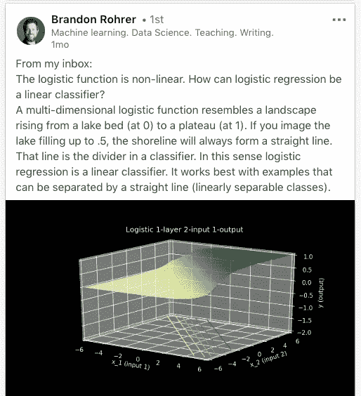

Scary looking graph that’s actual super intuitive if you stare at it long enough. From [Brandon Rohrer](https://www.linkedin.com/feed/update/urn:li:activity:6493249916125663232/) via LinkedIn.

但是回到线性回归和逻辑回归都是“线性的”如果我们不能在逻辑回归中找到一条最佳拟合线，那么逻辑回归的*线性*部分从何而来？在逻辑回归的世界中，结果变量与自变量的*对数优势*有线性关系。

但是这种可能性到底有多大呢？好了，我们开始吧…

## **赔率**

逻辑回归的核心=赔率。

直觉上，几率是我们理解的东西——它们是成功的概率与失败的概率之比。换句话说，它们是某件事发生的概率与某件事不发生的概率的比较。

对于赔率的具体例子，我们可以想到一类学生。假设女性通过测试的几率是 5:1，而男性通过测试的几率是 3:10。这意味着，6 名女性中有 5 名可能通过测试，13 名男性中有 3 名可能通过测试。这里的班级总人数是 19 名学生(6 名女生+ 13 名男生)。

## 那么…赔率不就和概率一样吗？

可悲的是，没有！概率衡量的是某件事情发生的次数与所有事情发生的总次数的比率(例如，10 次正面对 30 次硬币投掷)，而赔率衡量的是某件事情发生的次数与某件事情没有发生的次数的比率(例如，10 次正面对 20 次反面)。

这意味着，虽然概率总是被限制在 0-1 的范围内，但几率可以从 0 持续增长到正无穷大！这给我们的逻辑回归模型带来了一个问题，因为我们知道我们的预期输出是一个*概率*(即一个从 0 到 1 的数字)。

## 那么，我们如何从赔率到概率呢？

让我们来考虑一个分类问题…假设你最喜欢的足球队赢了另一个足球队。你可能会说你的团队失败的几率是 1:6，或者 0.17。你的团队获胜的几率是 6:1，或者 6，因为他们是一个伟大的团队。你可以用下面的数字线来表示这些概率:

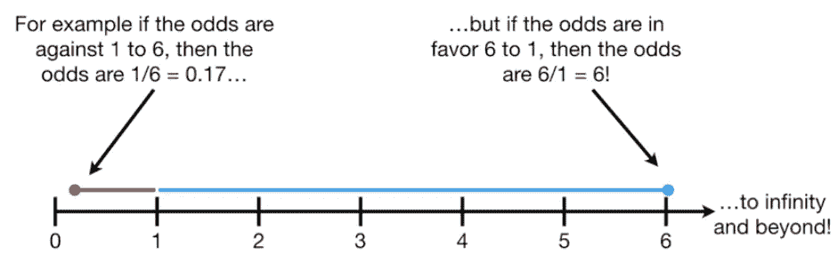

[https://www.youtube.com/watch?v=ARfXDSkQf1Y](https://www.youtube.com/watch?v=ARfXDSkQf1Y)

现在，你不会希望你的模型预测你的团队会在未来的比赛中获胜，只是因为他们过去获胜的几率比他们过去失败的几率大得多，对吗？你希望你的模型考虑的东西太多了(也许是天气，也许是首发球员，等等。)!所以，为了让几率的大小均匀分布，或者说*对称*，我们计算了一种叫做 *log-* 的几率。

## **对数赔率**

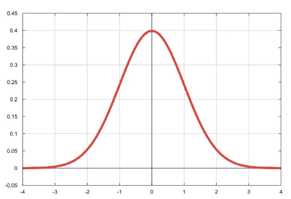

What we mean by “normally distributed”: the classic bell-shaped curve!

对数赔率是一种简写方式，指的是取赔率的自然对数。当你取某事物的自然对数时，你基本上使它更正态分布。当我们使一些东西更正态分布时，我们本质上是把它放在一个超级容易处理的尺度上。

当我们采用对数赔率时，我们将赔率的范围从 0-正无穷大转换为负无穷大-正无穷大。你可以在上面的钟形曲线上看到这口井。

即使我们仍然需要我们的输出在 0-1 之间，我们通过取对数优势获得的对称性使我们比以前更接近我们想要的输出！

## Logit 函数

“logit 函数”就是我们用来计算对数几率的数学方法！

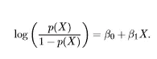

Some scary math thingymabob. Er, I mean the logit function.

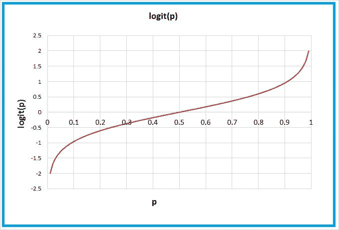

The logit function, graphed.

logit 函数通过取它们的自然对数，将我们的赔率放在负无穷大到正无穷大的范围内，正如你在上面看到的。

## Sigmoid 函数

好的，但是我们仍然没有达到我们的模型给出概率的程度。现在，我们只有负无穷大到正无穷大范围内的数字。输入:sigmoid 函数。

sigmoid 函数，因其在绘制时呈现 s 形而得名，正好是对数几率的倒数。通过取对数几率的倒数，我们将数值从负无穷大-正无穷大映射到 0-1。这反过来让我们得到概率，这正是我们想要的！

与 logit 函数图中 y 值范围从负无穷大到正无穷大相反，sigmoid 函数图中 y 值范围从 0 到 1。耶！

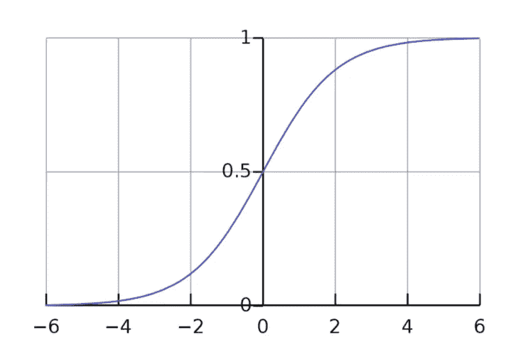

[The lovely sigmoid function](https://hackernoon.com/introduction-to-machine-learning-algorithms-logistic-regression-cbdd82d81a36).

这样，我们现在可以插入任何 x 值，并将其追溯到预测的 y 值。该 y 值将是该 x 值在一个或另一个类中的*概率*。

## 最大似然估计

…还没有完成。

还记得我们如何通过最小化 RSS(一种有时被称为“普通最小二乘法”，或 OLS 方法)在线性回归中找到最佳拟合线吗？在这里，我们使用一种叫做**的最大似然估计** (MLE)来得到我们最准确的预测。

MLE 通过确定最能描述我们数据的概率分布参数来获得最准确的预测。

我们为什么要关心数据的分布呢？因为很酷！…但实际上，这只是使我们的数据更容易处理，并使我们的模型*可推广到*许多不同的数据。

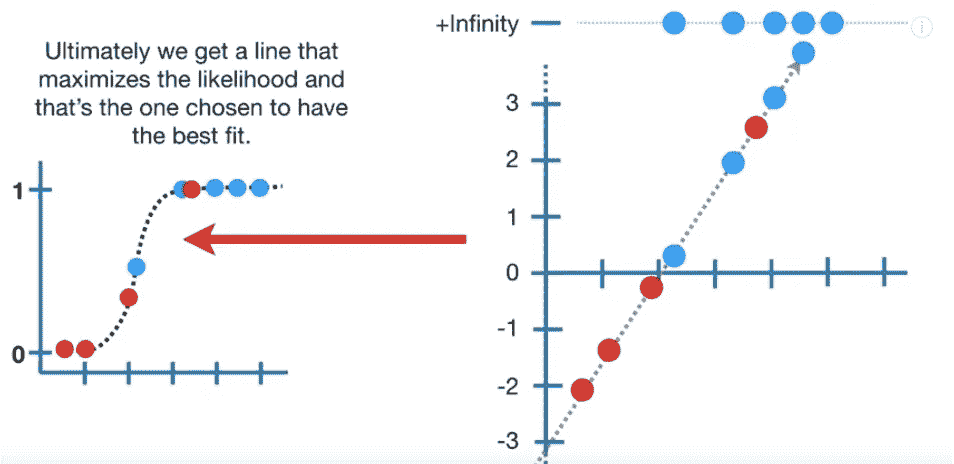

[Logistic Regression Details, Part 2](https://www.youtube.com/watch?v=BfKanl1aSG0)

一般来说，为了得到数据的最大似然估计，我们取 s 曲线上的数据点，并把它们的对数似然性相加。基本上，我们希望找到最大化数据对数似然的 s 曲线。我们只是不断计算每条对数优势线的对数似然性(有点像我们在线性回归中对每条最佳拟合线的 RSS 所做的)，直到我们得到最大的数字。

(题外话——我们回到自然对数的世界，因为有时对数是最容易处理的数字形式。这是因为对数是“单调递增”的函数，这基本上意味着它持续增加或减少。)

在最大似然估计过程中，我们得出的估计值是那些最大化“似然函数”的估计值(我们不会在这里深入讨论)。"

[http://incolors.club/collectiongdwn-great-job-funny-meme.htm](http://incolors.club/collectiongdwn-great-job-funny-meme.htm)

就是这样！现在你知道梯度下降，线性回归和逻辑回归。"

# 接下来

接下来奥黛丽向她奶奶解释机器学习算法:决策树，随机森林和 SVM。敬请期待！

**更新:**第二部现已上线！点击这里查看[。](https://medium.com/@AudreyLorberfeld/machine-learning-algorithms-in-laymans-terms-part-2-a0a74df9a9ac)

如果你有任何反馈，请对这篇文章发表评论，在 [LinkedIn](https://www.linkedin.com/in/audreysage/) 上给我发消息，或者给我发电子邮件。