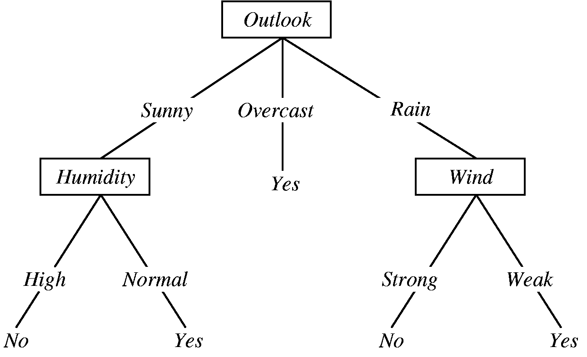
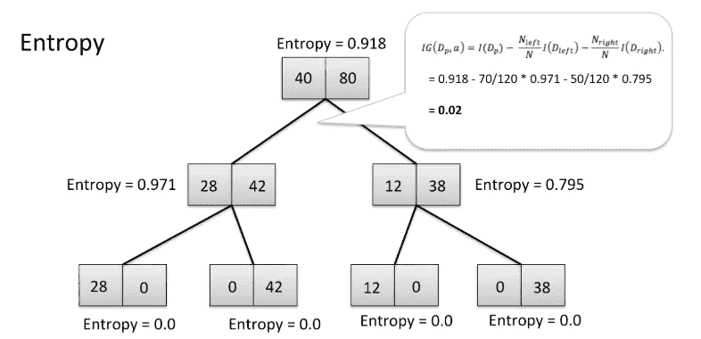
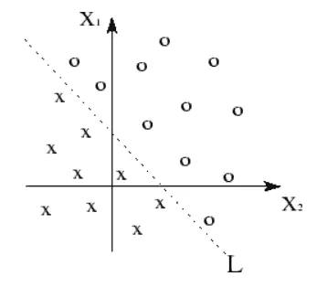
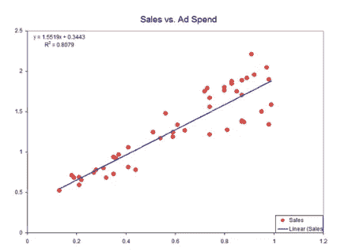
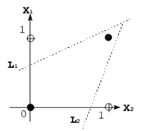
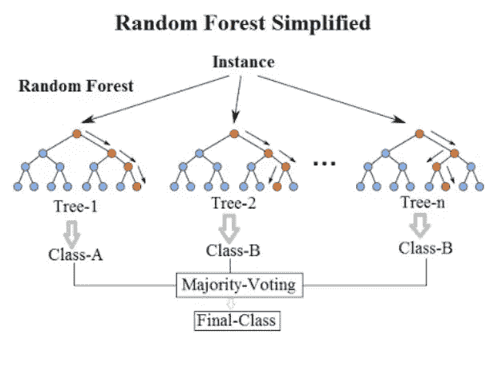
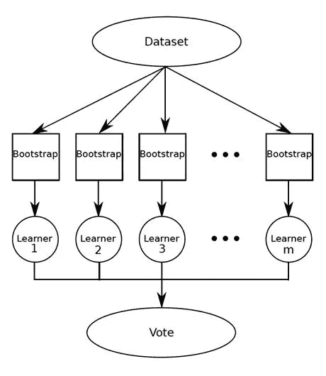
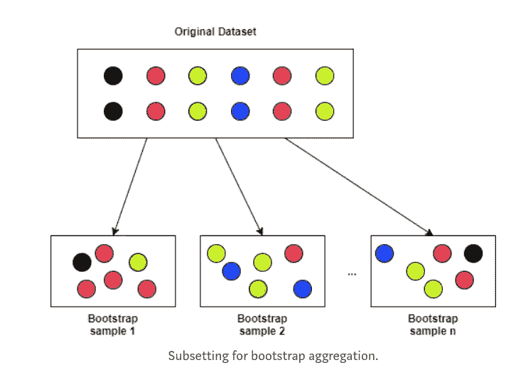
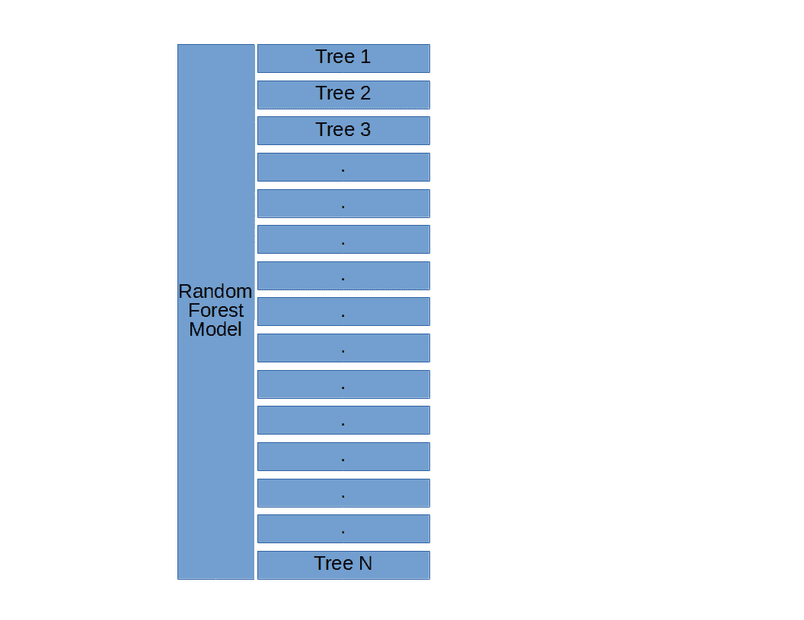

# 通俗易懂的机器学习算法，第 2 部分

> 原文：<https://towardsdatascience.com/machine-learning-algorithms-in-laymans-terms-part-2-a0a74df9a9ac?source=collection_archive---------10----------------------->

## (即如何向任何人解释机器学习算法)

> **重要通知:**在本系列的[第一篇帖子中，我](/machine-learning-algorithms-in-laymans-terms-part-1-d0368d769a7b)[犯了一个错误](https://twitter.com/cazencott/status/1107561592135315457)，将非技术人员等同于技术文盲老奶奶的刻板印象。数据科学界的一些成员让我注意到这个流行比喻背后的性别歧视和年龄歧视。他们完全正确。作为一名女性，我永远不会想削弱我的社区中的任何人，尤其是那些认同女性的人，和/或年长的专业人士。毫无疑问，如果没有前辈们辛勤的、往往不为人知的工作，我们这些年轻女性不可能取得今天的成就。
> 
> 在这种情况下，这第二个帖子是献给所有那些在董事会上对抗微攻击的同时教他们(孙子)孩子线性代数的祖母们；对年长的女性来说，在养家糊口后重返工作岗位时，她们要求被认真对待；对于 STEM 领域的所有女性来说，如果我们抓住每一个机会相互扶持，我们会因此变得更加强大。

就这样，进入数据科学！

既然我们已经在第 1 部分中介绍了[梯度下降、线性回归和逻辑回归，让我们来看看决策树和随机森林模型。](/machine-learning-algorithms-in-laymans-terms-part-1-d0368d769a7b)

# 决策树

决策树是我们日常头脑中使用的一种超级简单的结构。这只是我们如何做决定的一种表现，就像一个如果这个那么那个的游戏。首先，你从一个问题开始。然后你写出这个问题的可能答案和一些后续问题，直到每个问题都有答案。

让我们来看一个决定某人是否应该在某一天打棒球的决策树:

From “[Machine Learning with Decision Trees](https://dzone.com/articles/machine-learning-with-decision-trees)” by [Ramandeep Kaur](https://dzone.com/users/3015261/ramandeepkaur.html)

上面的树以这个问题开始:今天天气如何？有三种可能的答案:晴天、阴天或下雨。

*   假设这是一个阳光明媚的日子:我们将沿着“阳光”分支
*   “阳光”分支将我们引向“湿度”，这促使我们问自己这是高湿度的一天还是正常的一天
*   假设是高湿度的一天；然后我们会沿着“高”分支
*   既然现在没有其他问题需要回答，我们已经做出了最后的决定，那就是*不*，我们今天不应该打棒球，因为天气既晴朗*又非常潮湿*

这就是理解决策树的全部内容！

…开个玩笑。还有一些更快捷的事情:

*   决策树用于建模*非线性*关系(与线性回归模型和逻辑回归模型相反)。
*   决策树可以模拟分类和连续结果变量，尽管它们主要用于分类任务(即分类结果变量)。
*   决策树很容易理解！您可以轻松地将它们可视化，并准确地计算出每个分割点发生了什么。您还可以看到哪些功能是最重要的。
*   决策树容易过度拟合。这是因为不管你在一个决策树中运行多少次你的数据，因为它只是一系列如果-这个-那么-那个的语句，你将总是以相同的确切结果结束。这意味着您的决策树将会非常精确地适合您的训练数据，但是当您向它传递新数据时，它可能无法提供有用的预测。

## 那么决策树是如何知道何时分裂的呢？

(我所说的“分裂”是指形成更多的分支。)

决策树可以使用许多算法，但最流行的两种是 ID3 (ID 代表“迭代二分法”)和 CART (CART 代表“分类和回归树”)。这些算法中的每一种都使用不同的方法来决定何时拆分。ID3 树使用*信息增益*，而 CART 树使用*基尼指数*。

让我们从 ID3 树开始。

## ID3 树和信息增益

基本上，ID3 树都是关于以最大化信息增益的方式获得最大的回报。(因此，它们也被称为贪婪的树。)

但是什么是信息增益呢？从技术上讲，信息增益是一个使用熵作为杂质测量的标准。让我们稍微解释一下。

**熵**

简而言之，熵是对(无序)次序的一种度量——它告诉你一个东西丢失了多少信息，或者你的数据有多乱。丢失大量信息的东西被认为是无序的(即具有高熵值)，反之亦然。

让我们看一个具体的例子来巩固这背后的直觉:

> 假设你的任务是打扫一个脏乱的房间。地板上有脏衣服，可能还有一些狗玩具，还有一些书散落一地。这个房间乱极了！如果我们可以测量它的熵，它会超级高，它的信息增益会非常低。在这种状态下，这是非常不可行的。
> 
> 但是你看到壁橱里有一些盒子，和一个大的记号笔。你开始给每个盒子贴上标签，标明你打算放进去的东西的类别。然后你开始打扫房间，把每件衣服/狗玩具/书放在各自的盒子里。你现在已经打扫完房间了！如果我们现在可以测量房间的熵，它会相当低(它的信息增益会很高)。干得好！

类似地，ID3 树将总是做出使它们在信息中获得最高增益的决定。*更多的信息=更少的熵。*这意味着随着决策树的每一次分裂，算法将朝着越来越低的熵移动。

[Visualizing entropy in a decision tree](https://sebastianraschka.com/faq/docs/decisiontree-error-vs-entropy.html)

在上面的树中，你可以看到起点的熵为 0.918，而停止点的熵为 0。这棵树以高信息增益和低熵结束，这正是我们想要的。

**(Im)纯度**

除了向低熵方向发展，ID3 树还会做出决定，使它们获得最大的纯度。ID3 树这样做是因为他们希望每个决策都尽可能的清晰。熵低的东西也有高纯度。*高信息增益=低熵=高纯度。*

这具有直观的意义——如果某样东西令人困惑和无序(即具有高*熵)，你对那件东西的理解是模糊的、不清楚的或者不纯的。*

## 大车树&基尼指数

由 ID3 算法驱动的决策树旨在*最大化每次分割的*信息增益，而使用 CART 算法的决策树旨在*最小化*一种称为*基尼指数*的度量。

基尼指数基本上告诉你从数据集中随机选择的数据点被错误分类的频率。在购物车树中(以及在生活中)，我们总是希望最小化错误标记数据任何部分的可能性。真的就这么简单！

## 好吧，这些都有一定的道理，但是你之前提到的非线性的东西呢？

[Visualization of linearly-separable data](https://www.quora.com/How-are-linear-classifiers-different-from-non-linear-classifiers)

在本系列的第 1 部分中，我们了解到线性关系是由线条定义的。

[Visualization of linear function underlying a linear model.](http://www.simafore.com/blog/critical-model-steps-for-practical-multiple-linear-regression-pt-2)

基本上，当我们可以使用一条线(或线性平面)将我们的数据点分成几组时，我们知道我们的数据具有某种线性，就像最上面的图一样。

类似地，当我们可以用某种线来描绘变量之间的关系时，我们知道模型是线性的。这条线是支撑线性模型的线性函数的可视化，就像上面第二张图中的蓝线。

**非**线性真的和这个正好相反。您可以用几种不同的方式来考虑非线性数据和函数:

[Visualization of non-linearly-separable data](https://www.quora.com/How-are-linear-classifiers-different-from-non-linear-classifiers)

*   对于非线性数据，您将无法显示分割数据的线性平面。当您无法线性分离数据时，您的模型依赖于非线性函数。这反过来意味着你的模型是非线性的！
*   线性函数具有恒定的斜率(因为 x 的微小变化会导致 y 的微小变化)，而非线性函数则没有。例如，它们的斜率可能会呈指数增长。
*   你也可以使用与第 1 部分相同的类比，但是当你处理非线性函数时，你的自变量的小变化不会导致因变量的小变化，而是你的自变量的小变化会导致因变量的巨大变化，或者超级小的变化。

决策树非常擅长建模非线性关系，因为它们不依赖于线性平面来分离数据。(虽然这句话听起来很可怕，但实际上并不可怕——我们凭直觉知道决策树不会线性分离数据。你只要看看我们的树形结构就能证明这一点！你如何只用一条线将所有的“是”归入一个区域，将所有的“否”归入另一个区域？不可以！)

## …好的，现在关于过度合身的东西呢？

所以，是的，当你想做探索性的分析时，决策树(不管他们使用哪种算法)是很棒的。它们擅长概述数据中的重要要素，并允许您查看每个要素是如何相互作用的。然而，他们倾向于过度拟合你的数据。反过来，这意味着决策树不擅长预测或分类他们以前没有见过的数据。

为了应对这种过度拟合，数据科学家提出了被称为*集合*模型的模型。这些模型基本上只是将许多决策树聚集在一起，并利用它们的集体力量来做出经得起严格测试的预测。

# 进入:随机森林

对于初学数据的科学家来说，随机森林可以说是最受欢迎的集合模型。

[https://cdn.firespring.com/images/442c053c-745c-4bf3-b4a2-21b6fa79ddca.jpg](https://cdn.firespring.com/images/442c053c-745c-4bf3-b4a2-21b6fa79ddca.jpg)

## 你说合奏？

因此，正如我们上面所说，一个集合模型只是许多其他模型的*集合*。

(Sorry for the blurriness, but I just love this image.) Random Forest structure from [KDNuggets](https://www.kdnuggets.com/2017/10/random-forests-explained.html).

如左图所示，像随机森林这样的集合模型只是一堆决策树。在这里，您可以看到有 3 个决策树。

像随机森林这样的集合模型被设计成*通过使用 bagging 算法来减少过度拟合和方差。*

我们知道决策树容易过度拟合。换句话说，单个决策树可以很好地找到特定问题的解决方案，但如果应用于从未见过的问题，则非常糟糕。类似于谚语“两个脑袋比一个好”，集成模型使用许多擅长特定任务的决策树来建立一个更大的模型，该模型在许多不同的任务上都很棒。这么想吧——你是更有可能通过听取一个员工的建议做出一个好的商业决策，还是听取带来多样化经验的许多员工的建议？大概是后者吧。M *矿决策树=更少的过拟合。*

## 好吧，我过度拟合了，但是你说的方差是什么？

在数据科学的世界里，我们要对抗的不仅仅是过度拟合。我们还必须反击所谓的*方差。*

[Don’t fall, lil guy!](https://garryrogers.com/2017/05/09/the-human-ecological-predicament-wages-of-self-delusion-mahb/)

具有“高方差”的模型是这样一种模型，如果它的输入发生哪怕是最微小的变化，其结果也会发生变化。与过度拟合非常相似，这意味着具有高方差的模型不能很好地推广到新数据。

我喜欢从身体平衡的角度来考虑变化:如果你站在坚实的地面上单脚平衡，你就不太可能摔倒。但是如果突然有时速 100 英里的阵风呢？我打赌你会摔倒。那是因为你单腿平衡的能力高度依赖于你所处环境的因素。如果有一点改变，它会让你完全陷入困境！当模型具有高方差时就是这样。如果我们扰乱了训练数据中的任何因素，我们就可以完全改变结果。这是不稳定的，因此不是我们想要做出决策的模型。

## 打包算法

在我们深入研究随机森林非常依赖的 bagging 算法之前，有一件事我们仍然需要涉及，那就是*学习者*的想法。

在机器学习中，有弱学习者和强学习者，bagging 算法(或“Bootstrap AGGregatING”算法)处理弱学习者。

(我们不会在这里讨论强学习者，但是在本系列的后续部分中，请关注他们！)

**弱学习者**

弱学习者构成了随机森林模型的主干。

The bottom row of this ensemble model (let’s call it a Random Forest) is where our “weak learners” live!

简而言之，弱学习者是预测/分类数据的算法，其准确度(或其他评估指标)*略好于机会*。这些家伙有用的原因是，我们可以将他们聚集在一起，制作一个预测/分类超级好的更大的模型！

**…好了，回到装袋环节**

像 Random Forest 这样的集合模型使用 bagging 算法来避免较简单的模型(如个体决策树)容易出现的高方差和过度拟合的缺陷。

装袋算法的超级威力在于，它们与**随机样本的数据** ***配合替换。***

这基本上意味着，当算法通过随机数据样本构建决策树时，没有它不能使用的数据点。例如，仅仅因为一个决策树是由 20 个数据点组成的，并不意味着另一个决策树不能由这 20 个数据点中的 12 个数据点组成。耶，概率！

From [Decision Trees and Random Forests for Classification and Regression pt.2](/decision-trees-and-random-forests-for-classification-and-regression-pt-2-2b1fcd03e342), by [Haihan Lan](https://towardsdatascience.com/@hhl60492)

随机森林模型很酷的一点是，它们可以同时(或“并行”)对每个决策树进行所有这些随机抽样替换。因为我们处在随机抽样替换的世界中，我们也可以假设我们的每一个决策树都是相互独立的。

> 综上:随机森林模型使用 bagging 算法构建小决策树，每一棵都是用你的数据的随机子集同时构建的。

**…但还有更多！**

随机森林模型中的每棵树不仅只包含您的数据的一个子集，每棵树还只使用您的数据中的一个*特征子集*(即列)。

The basic structure of a Random Forest model ([Random Forests, Decision Trees, and Ensemble Methods Explained](https://www.datascience.com/blog/random-forests-decision-trees-ensemble-methods), by Dylan Storey)

例如，假设我们试图根据作者、出版日期、页数和语言将一本书分类为已售或未售。我们的数据集中有 10，000 本书。在一个随机森林模型中，不仅我们的每个决策树只使用 10，000 本书的随机样本，每个决策树也只使用随机样本的特征:也许一个决策树会使用作者和出版日期，而另一个决策树会使用作者和页数。而另一个决策树可以使用语言和出版日期。这一点是，当我们对所有这些决策树(即“弱学习者”)的预测进行平均时，我们会得到一个超级健壮的预测！

差不多就是这样了！当我们使用随机森林模型进行分类时，我们采用所有决策树的多数投票，并将其作为结果。当我们使用随机森林模型进行回归时，我们对每个决策树的所有概率进行平均，并使用该数字作为结果。

通过这篇文章，我们了解了决策树、非线性、过度拟合和方差以及像随机森林这样的集合模型。请关注第 3 部分——我们将讨论两个比我们在第 1 部分[中讨论的更高级的线性模型:SVM 和朴素贝叶斯。](/machine-learning-algorithms-in-laymans-terms-part-1-d0368d769a7b)

一如既往，请联系我，提出任何更正或意见。你可以通过评论这篇文章、在 LinkedIn 上给我发信息或者给我发电子邮件来联系我。