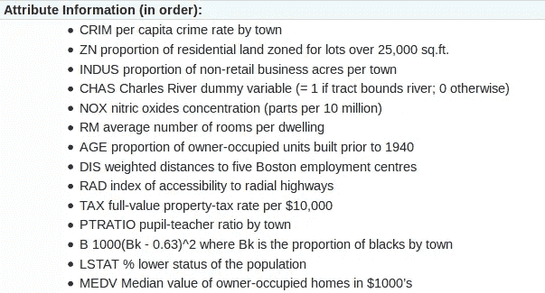
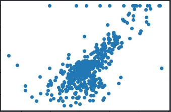
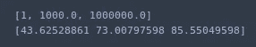
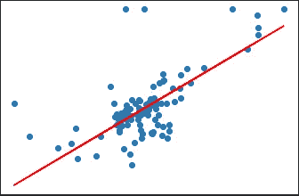

# 使用 Sklearn Python 的 K-Fold 交叉验证示例

> 原文：<https://towardsdatascience.com/machine-learning-algorithms-part-14-cross-validation-and-ridge-regression-example-in-python-2d9e0c4de875?source=collection_archive---------10----------------------->


Photo by [Lukas Blazek](https://unsplash.com/@goumbik?utm_source=medium&utm_medium=referral) on [Unsplash](https://unsplash.com?utm_source=medium&utm_medium=referral)

最终，机器学习模型被用来对我们还没有答案的数据进行预测。例如，这可以采取推荐系统的形式，试图预测用户是否会喜欢这首歌或产品。

开发模型时，我们必须非常小心，不要过度适应我们的训练数据。换句话说，我们必须确保模型捕捉到了潜在的模式，而不是简单地记忆数据。因此，在生产中使用模型之前，我们必须检查它如何处理不可预见的数据。这通常是通过将数据分成两个子集来完成的，一个子集用于训练，另一个子集用于测试模型的准确性。

某些机器学习算法依赖于超参数。本质上，超参数是一个由用户设置的变量，它决定了算法的行为方式。超参数的一些例子是梯度下降中的步长和岭回归中的α。当涉及到超参数时，没有放之四海而皆准的方法。数据科学家必须通过反复试验来确定最佳超参数值。我们称这个过程为**超参数调谐。**

不幸的是，如果我们不断地使用测试集来衡量我们的模型对于不同超参数值的性能，我们的模型将会对测试集中的数据产生亲和力。换句话说，关于测试集的知识可能会泄漏到模型中，并且评估度量不再反映一般的性能。

为了解决这个问题，我们可以进一步分解数据(即验证、训练和测试集)。训练在训练集上进行，之后在验证集上进行评估，当我们对结果满意时，可以在测试集上执行最终评估。

然而，通过将可用数据分成三组，我们大大减少了可用于训练模型的样本数量。此外，结果可能取决于对样本的特定随机选择。例如，假设我们建立了一个模型，试图对手写数字进行分类，我们可能会得到这样一个场景，其中我们的训练集包含非常少的数字 7 的样本。

解决这些问题的方法是一种叫做交叉验证的程序。在交叉验证中，测试集仍然被放在一边进行最终评估，但是不再需要验证集。交叉验证有多种，最常见的叫做 *k 倍*交叉验证。在 *k-fold* 交叉验证中，训练集被分割成 *k* 个更小的集合(或折叠)。然后，使用褶皱的 *k-1* 训练模型，最后一个褶皱用作验证集，以计算精度等性能指标。


[https://scikit-learn.org/stable/_images/grid_search_cross_validation.png](https://scikit-learn.org/stable/_images/grid_search_cross_validation.png)

让我们看一个例子。对于前面的示例，我们将使用波士顿房价数据集。



[https://scikit-learn.org/stable/modules/generated/sklearn.datasets.load_boston.html](https://scikit-learn.org/stable/modules/generated/sklearn.datasets.load_boston.html)

首先，导入所有必需的库。

```
from sklearn.datasets import load_boston
from sklearn.linear_model import RidgeCV
from sklearn.model_selection import train_test_split
import numpy as np
import pandas as pd
from matplotlib import pyplot as plt
```

接下来，我们将使用 sklearn 为我们的数据导入特征和标签。

```
boston = load_boston()boston_features = pd.DataFrame(boston.data, columns=boston.feature_names)X = boston_features['RM'].values.reshape(-1,1)y = boston.target
```

我们将使用 matplotlib 来绘制房价和每个住宅的平均房间数之间的关系。

```
plt.scatter(X, y);
plt.title('boston house prices')
plt.xlabel('average number of rooms per dwelling')
plt.ylabel('house prices')
plt.show()
```



如前所述，我们希望将一部分数据留到最后评估时使用。

```
train_X, test_X, train_y, test_y = train_test_split(X, y, test_size=0.2, random_state=0)
```

我们将使用交叉验证来确定最佳 alpha 值。默认情况下，岭回归交叉验证类使用*留一个*策略(k-fold)。我们可以通过观察均方误差来比较我们的模型在不同 alpha 值下的性能。

```
regressor = RidgeCV(alphas=[1, 1e3, 1e6], store_cv_values=True)regressor.fit(train_X, train_y)cv_mse = np.mean(regressor.cv_values_, axis=0)print(alphas)
print(cv_mse)
```



RidgeCV 类将自动选择最佳 alpha 值。我们可以通过访问以下属性来查看它。

```
# Best alpha
print(regressor.alpha_)
```

我们可以使用该模型来预测测试集的房价。

```
predict_y = regressor.predict(test_X)
```

最后，我们绘制测试集中的数据和在训练阶段确定的线。

```
plt.scatter(test_X, test_y);
plt.plot(test_X, predict_y, color='red')
plt.title('boston house prices')
plt.xlabel('average number of rooms per dwelling')
plt.ylabel('house prices')
plt.show()
```

