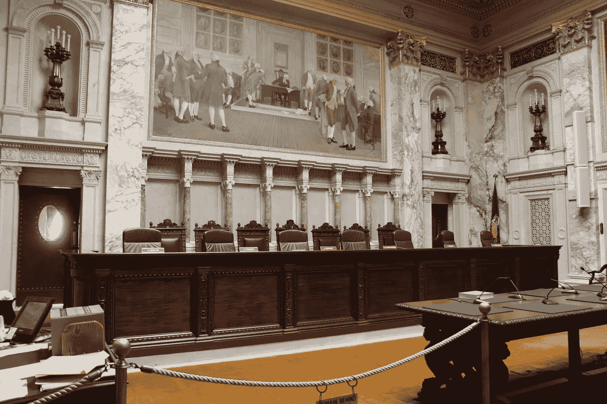

# 机器学习和公民自由

> 原文：<https://towardsdatascience.com/machine-learning-and-civil-liberties-7bfbfab8233d?source=collection_archive---------23----------------------->

## 从州诉卢米斯的刑事司法预测分析案例中我们能学到什么

By Royalbroil — Own work, CC BY-SA 3.0, [https://commons.wikimedia.org/w/index.php?curid=31771291](https://commons.wikimedia.org/w/index.php?curid=31771291)

## 法庭上预测分析的故事

2013 年，埃里克·卢米斯在威斯康星州被捕，并被指控五项与驾车枪击案有关的罪行。卢米斯否认参与枪击，但对两项指控认罪:试图逃避交通官员和未经车主同意驾驶车辆。

在判决阶段，Loomis 向法院提供信息，法院将根据法院的要求进行 [COMPAS 风险评估](https://www.equivant.com/compas-classification/)评分。

COMPAS 是一种预测分析工具，它使用罪犯提供的信息和来自个人犯罪历史的信息，根据预测分析算法训练的特征对他们的特征进行分类，来估计累犯的风险，即在未来犯下更多罪行。

根据案件信息和 COMPAS 风险评估分数，法院判处卢米斯最高六年监禁和五年延长监管——这几乎是他承认的两项罪行的最高刑期。显然，COMPAS 评分将 Loomis 归类为累犯的高风险，这是法官量刑决定的一个因素。

## **对判决的上诉**

也许是因为这两项罪行的量刑似乎不相称，卢米斯对判决提出上诉，理由是法院依赖 COMPAS 风险评估分数。他认为，这样做侵犯了他"被单独判刑和根据准确信息判刑的权利"。他进一步辩称，他因性别被判违宪，因为 COMPAS 算法考虑到了性别。

这些争论源于 COMPAS 是由私人公司 [Equivant](https://www.equivant.com/compas-classification/) 提供给威斯康辛州政府的。由于这种安排，COMPAS 算法是公司的专有机密信息。威斯康辛州政府和被告都无法获得关于模型如何被训练的信息，哪些输入以任何特定的方式被加权，以及有问题的个人如何与所使用的训练数据进行具体比较。

威斯康星州最高法院维持了判决，驳回了正当程序的担忧。法院发现，COMPAS 工具只使用公开信息和个人提供的信息，因此 Loomis 可以验证它的准确性。此外，上诉法院发现，下级法院确实提供了个人量刑，因为即使分数是与处境类似的广泛群体相比较的总和，法院在最终裁决中有自由裁量权，可能不同意 COMPAS 的评估。

## 黑箱问题符合政府决策

这是对机器学习预测分析的“黑箱”性质的普遍恐惧或抱怨，尤其是那些被更复杂的模型所采用的机器学习预测分析。关于目前在美国和其他国家的刑事司法领域使用的机器学习程序的相关风险，已经有大量的报道和报告。然而，这些问题应该适用于机器学习融入政府决策的所有领域。

**机器学习的黑匣子。**用一个现在很有名的比喻来说，机器学习，特别是神经网络和深度学习等更复杂的技术，已经创造了一个黑盒，在这个黑盒中，模型的输出不能以各方可以知道单个结果的细节的方式进行反向工程。这一点[已经被很好地记录下来](https://g.co/kgs/KANHCr)，并继续在机器学习伦理论坛上激烈辩论。

许多关于个人的决定都有可能产生重大影响，改变生活。例如，金融机构关于延期或信贷或贷款的决定将直接影响某人买房或创业的能力。同样，卫生保健提供者和保险公司做出的决定会直接影响个人的健康或预期寿命。

政府机构和管理者所做的决定可以改变生活，如果不是更多的话。这是因为政府处于独特的地位，能够以私人实体无法做到的方式对一个人做出决定。例如，一个人的公民身份、关于其对国家的财政义务的决定(税收)、关于其公民自由的决定(被逮捕或监禁)以及关于其子女的决定(社会服务)。

由于政府对我们生活的广泛权力，我们在美国建立了程序性的制衡，以确保公民和个人明确他们的个人权利与政府权利，以及关于如何作出决定的明确指导方针，以及他们可以与政府互动并要求审查这些决定的机制。

其中许多法律的基础是宪法，但也有许多法律法规允许政府决策的透明度、对决策的上诉机制以及对决策的司法审查。

在刑事司法背景下，就像卢米斯案件一样，美国宪法第四和第五修正案是个人权利的基础，它试图平衡个人与政府的权利和权威。这些修正案结合起来，防止“不合理的”侵犯隐私和未经正当程序的搜查。

## **机器学习给正当程序带来的风险。**

关于新技术如何影响美国法院如何适用第四修正案保护，有相当多的研究。最值得注意的是，已经出现了一种趋势，从仅仅解释它们以适用于防止对一个人的财产进行不合理的搜查，到保护他们的隐私，或者在我们的社会中可以合理地期望保持隐私的东西。

法院处理了这方面的许多变化。从担心有人在你的窗外偷听到了对公共付费电话亭的窃听(公共付费电话亭被认为是私人空间)。最近，最高法院更接近解决针对第四修正案保护的大数据隐私问题。

这一里程碑式的案件是*美国诉琼斯*，这是对一名男子因贩毒被定罪的上诉，其依据是通过他车上的 GPS 跟踪器获得的一个月的数据。虽然法院推翻了对跟踪搜查令技术违规的定罪，但法官们重点关注第四修正案的保护，他们认为基于收集的数据量，第四修正案受到了侵犯。

这是先前裁决的一个新的转折，先前的裁决坚持认为公民对在公共场所进行的行为没有隐私权。在公共场合开车，因此第四修正案不保护跟踪你的驾驶。然而，在这种情况下，法官做出了区分，即对于一个普通公民来说，期望他们一个月的所有驾驶都会被跟踪和记录是不合理的，因此这种 GPS 搜索侵犯了琼斯反对不合理搜索的权利。此后，这种现象被称为“马赛克效应”，更多的公开信息可以以可能侵犯个人隐私的方式进行汇编和组合。

**从 GPS 到大数据。**与 GPS 为执法部门提供跟踪潜在嫌疑人的新方法类似，政府机构也实施了大数据和机器学习，以瞄准警察巡逻队，对与警察互动的个人的风险进行分类，量化和预测犯罪将在哪里发生，正如我们在 Loomis 中看到的那样，根据再次犯罪的风险进行判决。

许多这些机器学习程序是由私营公司为政府创建的。因此，就像 COMPAS 一样，其设计、培训和维护的细节并不为受其影响的公民的政府所知。自从卢米斯案件以来，有[广泛报道](https://www.propublica.org/article/machine-bias-risk-assessments-in-criminal-sentencing)COMPAS 声称显示它是[有偏见的，它的预测不是很准确](https://doi.org/10.1093/ijlit/eaz001)。

除了这些非常现实的问题之外，人们还担心，在没有具体的第四修正案和隐私控制的情况下，政府可以在多大程度上使用这些技术来创建个人资料和收集公民信息。在马赛克效应下，这些公共信息可以被用来描述公民，政府有可能知道合理预期为私人的信息。

根据第四修正案的当前解释，这将引发一项禁令，禁止政府使用这些信息或以这些方式汇编信息，这些方式列出了由独立实体审查和批准的具体问题。

## 下一步是什么？

在琼斯案中，最高法院没有要求这项禁令和程序，但可以说我们的政府将不得不在许多不同的背景下处理机器学习和预测分析的现实，在这些背景下，政府被鼓励利用他们可以利用的一切优势；例如治安、刑事司法、情报以及执法与保护个人隐私和提供正当程序之间存在矛盾的其他领域。

我们在美国没有积极解决这些问题的良好记录。更有可能的是，我们将不得不等到出现一种司法情况，迫使法院作出法律裁决，以更好地界定这些界限应该划在哪里。同样可能的是，一个类似的情况将进入该国的政治和媒体意识，以某种方式集中公众的注意力，迫使立法行动，更好地界定这些线和要求。

然而，无论是哪种情况，最终的导火索都将是许多理性的公民认为政府使用这些技术的方式侵犯了我们对隐私权的看法，并威胁到“监控国家”——随之而来的是对言论和表达自由等其他权利的寒蝉效应。

不过，我个人的希望是，公民、企业和政治家可以开始以有效的方式讨论这些考虑因素，为法律、政策和程序奠定基础，使政府能够以有益于我们国家的方式从这些技术中受益，而不会对作为我们国家和社会文化基础的权利产生负面影响。