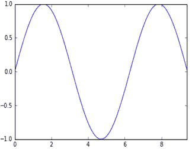

# 机器学习和数据分析—仁荷大学(第一部分)

> 原文：<https://towardsdatascience.com/machine-learning-and-data-analysis-inha-university-part-1-be288b619fb5?source=collection_archive---------24----------------------->

# 第 1 章:基本 python 和安装

大家好。我是韩国仁荷大学的研究生。虽然我不是计算机科学出身，但这十年来数据科学和机器学习的吸引力使我对数据科学产生了兴趣，因此我开始学习 python，并准备好完成预期的结果。今年秋天，我参加了由[造船&海洋工程](https://naoe.inha.ac.kr/user/naoe/)系开设的机器学习和数据分析课程。我将试着简要描述一下我通过这门课程学到了什么和取得了什么。


Learning Tools for Data mining and ML

该图显示了最流行的机器学习(ML)和数据挖掘工具。对于数据挖掘 R 和 MATLAB，对于 ML Python，使用最多的是 Keras 和 TensorFlow。实现机器学习算法的平台有好几个，比如 Azure，KT ucloude，IBM cloud。我们也可以使用 Google 的 colab 来实现 ML 项目，因为它提供了免费的 GPU(图形处理单元)。下图显示了截至 2014 年对 python 的需求，由于 python 是一种简单的语言，易于学习且用户友好，因此需求增长迅速。大多数编程语言需要编译，而 python 不需要编译，它按原样解释源代码。


Programming Language Usage Status in 2014

1989 年， [**吉多·范·罗苏姆**](https://en.wikipedia.org/wiki/Guido_van_Rossum) **，**一个荷兰程序员因为圣诞节期间无事可做，开发了 [Python](https://www.python.org/) 😂。Python 这个名字来源于喜剧节目《巨蟒剧团的飞行马戏团》。Python 的本义是希腊神话中的巨蛇。谷歌和 youtube 上有很多教程，你可以很容易地找到如何在你的操作系统中安装 Python。只需跟随网站并下载您期望的版本。


安装后，您可以打开命令提示符，检查 python 的版本，并在那里模拟编程。


现在有几种方法可以在 python 中运行程序，比如使用记事本、 [**、原子**](https://atom.io/) 或 [**崇高**](https://www.sublimetext.com/) 文本编辑器来编写代码，并使用*命令外壳*来运行它。或者我们可以使用一些集成开发环境( **IDE** )，我们可以同时编写和运行。 [**Pycharm**](https://www.jetbrains.com/pycharm/) ，[**Anaconda**](https://www.anaconda.com/)**或**[**Visual studio code**](https://code.visualstudio.com/)**都是 ide 的例子。******

******现在我们将讨论 [**Anaconda**](https://www.anaconda.com/) 在 windows 操作系统中的安装。 **Anaconda** 是 Python 数据科学的标准平台，引领机器学习的开源创新。[你可以通过](https://www.anaconda.com/)[编程知识](https://www.youtube.com/watch?v=5mDYijMfSzs)和 [Tech with Tim](https://www.youtube.com/watch?v=mIB7IZFCE_k&t=478s) youtube 频道按照这两个链接正确安装 anaconda。对于 Pycharm 安装，您可以使用 Tim 和[编程知识 2](https://www.youtube.com/watch?v=SZUNUB6nz3g) 遵循[技术。这些视频教程都是基于 windows 操作系统的。在安装](https://www.youtube.com/watch?v=56bPIGf4us0&t=12s)[**Anaconda**](https://www.anaconda.com/)**时，你需要小心选择环境变量的路径。您需要选择高级选项*将 anaconda 添加到系统路径环境变量中。*这是因为如果之前安装了任何其他 python IDE，那么路径将被合并，不会出现错误*。*********

************

******使用 Anaconda 作为 IDE 的另一个重要因素是，它可以为特定需求提供一个虚拟环境。假设您已经安装了 Anaconda，其中安装了 python 3.7 版本，但是您需要 python 3.6 来完成一些特定的任务，那么您可以轻松地创建一个虚拟环境，并在其上模拟您的程序。另一个问题是一些库可能会对已安装的软件包版本产生问题。因此，为了避免这种问题，我们应该创建一个虚拟环境，并在其上安装所需的软件包。******

******通常在 Anaconda 中，大多数库都是默认安装的。但是，如果您想安装任何库，那么您需要遵循以下步骤:******

> ******以管理员身份运行命令提示符。
> *升级 pip 类型:* python -m pip 安装—升级 pip
> *类型:* pip 安装“库名”(例如。pip install numpy)/conda install numpy
> *卸载类型:* pip 卸载“库名”(例如。pip 卸载编号)******

******你可以写 ***pip*** 或者 ***conda*** 来安装库。******

********

# ****Python 库(Numpy)****

****一个帮助你使用 Python 语言执行矩阵运算的库。Numpy 是 Python 中科学计算的核心库。Numpy 数组都是由相同类型的值构造的，并作为整数元组进行索引。维数是数组的秩，数组的形状是一个整数元组，告诉每个维的大小。您需要将`Numpy`作为`np`导入。你可以用任何东西代替 np，但是为了更好的理解和用户友好的代码，推荐使用`np`。****

********

****`Numpy-array:`numpy 数组是由相同类型的值组成的网格，由一组非负整数索引。维数是数组的秩；数组的形状是一组整数，给出了数组在每个维度上的大小。我们可以从嵌套的 Python 列表中初始化 numpy 数组，并使用方括号访问元素。****

********

****Numpy 还提供了许多创建数组的函数:****

****************

****Numpy 提供了几种方法来索引数组。****

****`array slicing`:类似于 Python 列表，numpy 数组可以切片。由于数组可能是多维的，因此必须为数组的每个维度指定一个切片:****

********

****`array indexing`:也可以混合整数索引和切片索引。但是，这样做将产生一个比原始数组秩更低的数组。注意，这与 MATLAB 处理数组切片的方式非常不同。访问数组中间行数据的两种方法。将整数索引与切片混合会产生一个较低秩的数组，而仅使用切片会产生一个与原始数组相同秩的数组:****

********

****在制作了 3 行 4 列的矩阵后，将(row) row_r1 设置为二维数组。然后，你可以很容易地得到矩阵的形状。****

****`array math`:基本数学函数在数组上按元素操作，既可作为运算符重载，也可作为 numpy 模块中的函数。****

********

****`Broadcasting`:广播是一种强大的机制，允许 numpy 在执行算术运算时处理不同形状的数组。通常我们有一个较小的数组和一个较大的数组，我们希望多次使用较小的数组来对较大的数组执行一些操作。例如，假设我们想给矩阵的每一行添加一个常量向量。我们可以这样做:****

********

****Adding [1, 0, 1] to all the Row of Matrix X****

# ****用 python 绘图(MATPLOTLIB)****

****Matplotlib 是一个库，使我们能够绘制图形，类似于 MATLAB 系统。这是一个非常棒的 Python 可视化库，用于数组的 2D 绘图。****

********

```
**import matplotlib.pyplot as pltimport numpy as npx =np.arange(0,3*np.pi,.1)
y = np.sin(x)
# Plot the points using matplotlib
plt.plot(x, y)
plt.show()**
```

****要使用 ***matplotlib*** 库，您需要将其调用为 ***plt。*** 我们还可以通过这个库添加 *xlabel* 、 *ylabel* 、 *title* 。****

********

```
**import matplotlib.pyplot as pltimport numpy as npx =np.arange(0,3*np.pi,.1)
y_sin = np.sin(x)
y_cos = np.cos(x)
# Plot the points using matplotlib
plt.plot(x, y_sin)
plt.plot(x, y_cos)
plt.xlabel('x axis label')
plt.ylabel('y axis label')
plt.title('Sine and Cosine')
plt.legend(['Sine', 'Cosine'])
plt.show()**
```

****在本文中，我试图给出一些关于 python 编程语言和 Windows 操作系统中 Python 模拟环境的基本概念。如果有人为更好的结果提供指导或批评，我们将不胜感激。在这里，我试图描述 python ***numpy*** 和 ***matplotlib*** 库，它们在数据科学领域非常基础。在本系列的第二部分，我已经用 python 描述了数据结构**和**。你可以点击下面的链接来看看。****

****[](/machine-learning-and-data-analysis-inha-university-part-2-3fb599732021) [## 机器学习和数据分析—仁荷大学(第二部分)

### 第 2 章:Python 数据结构—数据类型

towardsdatascience.com](/machine-learning-and-data-analysis-inha-university-part-2-3fb599732021) 

近期想做一篇关于如何在 anaconda 中创建一个 ***虚拟环境*** 的文章。我希望这个视频能够帮助那些 python 和数据科学领域的新手。我会试着继续这个系列，并放一些 GitHub 库以便更好地理解。如果你喜欢这篇文章，你可以看看我的其他文章:

[](/python-oop-corey-schafer-datacamp-be6b0b3cafc6) [## Python OOP —科里·斯查费和数据营

### 面向对象编程(OOP)是一种基于“对象”的编程范式，它是一种用面向对象的语言来定义事物的方法

towardsdatascience.com](/python-oop-corey-schafer-datacamp-be6b0b3cafc6) [](/markdown-cells-jupyter-notebook-d3bea8416671) [## 降价单元格— Jupyter 笔记本

### 我不知道如何开始。这将是我第一个与编程相关的故事。今天我将努力缩小…

towardsdatascience.com](/markdown-cells-jupyter-notebook-d3bea8416671) 

# 参考链接:

1.  **安装 python，anaconda:**https://www.youtube.com/watch?v=5mDYijMfSzs&t = 4s
2.  **安装 py charm**:[https://www.youtube.com/watch?v=SZUNUB6nz3g](https://www.youtube.com/watch?v=SZUNUB6nz3g)
    或，[https://www.youtube.com/watch?v=56bPIGf4us0&t = 15s](https://www.youtube.com/watch?v=56bPIGf4us0&t=15s)
3.  **安装蟒蛇:**[https://www.youtube.com/watch?v=mIB7IZFCE_k](https://www.youtube.com/watch?v=mIB7IZFCE_k)****