# 机器学习和数据分析—仁荷大学(第二部分)

> 原文：<https://towardsdatascience.com/machine-learning-and-data-analysis-inha-university-part-2-3fb599732021?source=collection_archive---------18----------------------->

# 第 2 章:Python 数据结构—数据类型

欢迎来到基于韩国仁荷大学研究生课程的机器学习和数据分析系列的第二部分。在这一部分，我们将讨论 python 中的数据结构。然而，如果你是第一次看这篇文章，我们鼓励你先看第一部分，在那里我们讨论了基本的 python，像 Anaconda，Pycharm 这样的 ide 的安装，以及一些 python 库，像 Numpy，Matplotlib 等等。

 [## 机器学习和数据分析—仁荷大学(第一部分)

### 第 1 章:基本 Python 和安装

towardsdatascience.com](/machine-learning-and-data-analysis-inha-university-part-1-be288b619fb5) 

数据结构是编程语言在你的计算机上存储数据的不同方式，以便数据可以被容易地访问和有效地工作。它基本上定义了数据和对数据执行的不同操作之间的关系。一般来说，数据结构分为两类:原语和非原语数据结构。整数、浮点、字符串和布尔是基本的数据结构，有时称为数据操作的构建块，包含在原始数据结构中。数组、列表、元组、集合、字典都包含在非原始数据结构中。在本文中，我们将讨论以下数据类型:

*   **1。标量(整数、浮点、布尔、无)**
*   **2。字符串**
*   **3。字节**
*   **4。列表**
*   **5。元组**
*   6。字典
*   7。设置
*   8。布尔

## 1.标量(整数、浮点、布尔、无)

**标量**是一种可以有单个值的类型，如`5`、`3.14`或`'Arman'`。有时字符串也被认为是一个标量，但在这里我们单独描述它。Python 附带了许多内置的数据类型。基本的内置标量类型有:

*   `int` —带符号的无限精度整数
*   `float` —浮点数
*   `None` —特殊的奇异空值
*   `bool` — `true` / `false`布尔值

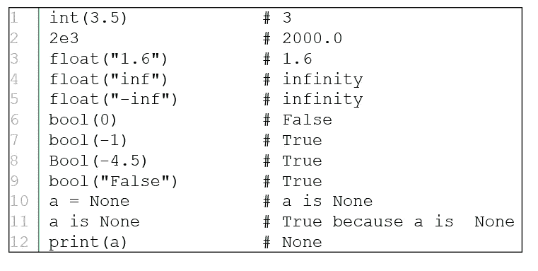

Scalar Data Types

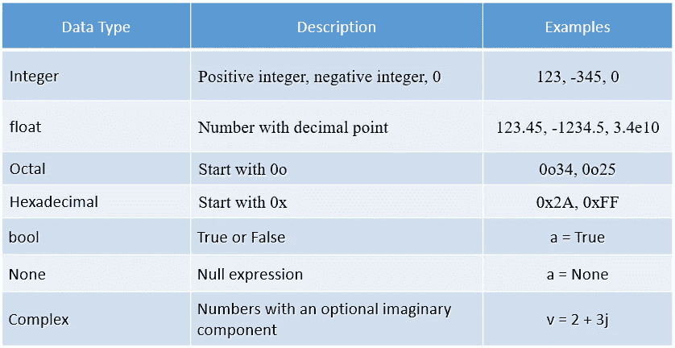

Data types in numeric form

Python 有一个名为`None`的特殊空值，用大写字母 n 拼写。None 常用来表示没有值。

## 2.**字符串**

**字符串**是由字母、单词或其他字符组成的字符序列。在 Python 中，可以通过在一对单引号或双引号中包含一系列字符来创建字符串。比如:`'Saman'`、`"12345"`等。python 中使用了几个转义序列，比如新行的`\n`和双引号的`\"`等等。点击此[链接](https://www.quackit.com/python/reference/python_3_escape_sequences.cfm)可以找到更多信息。下图中显示了字符串*索引*、**、**、*切片*、*串联、*和*重复*。

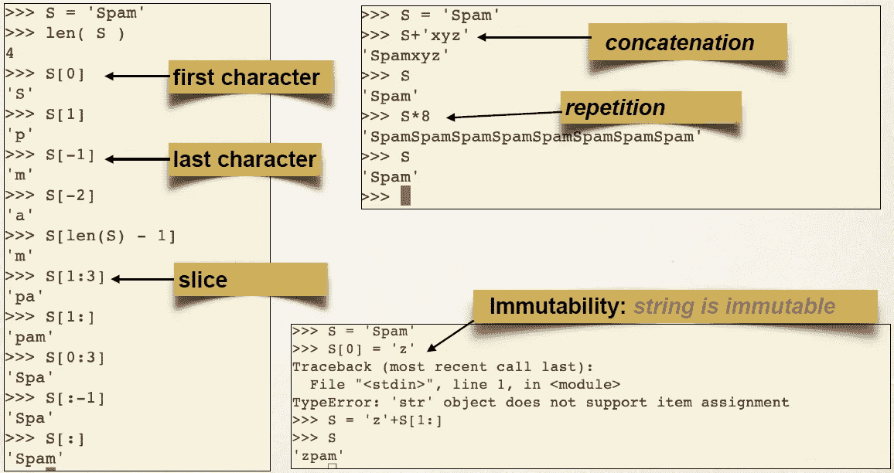

String **indexing**, **Slicing**, **concatenation**, **repetition**

**字符串**是**不可变的**，这意味着你不能覆盖**不可变的**对象的值。但是，您可以再次分配变量，这将创建一个新对象，或者您可以用*替换*字符串部分，我们可以在下图中观察到。几种串法，包括`find()`、`replace()`、`split()`、`upper()`、`rstrip()`等。在这里被描述。

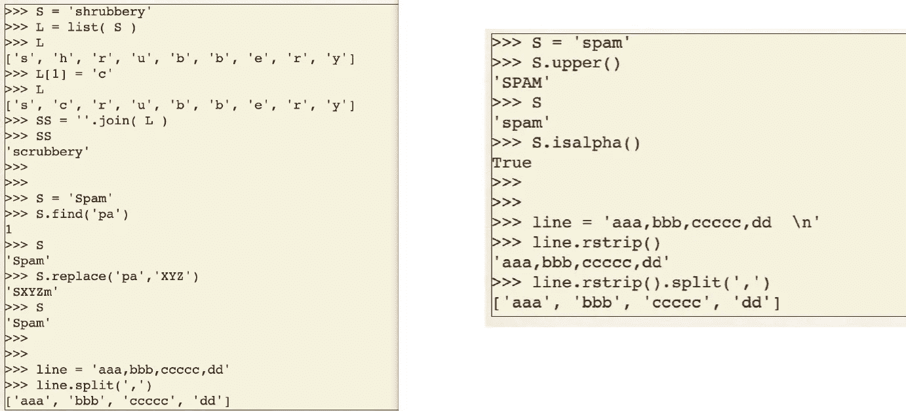

Several String methods

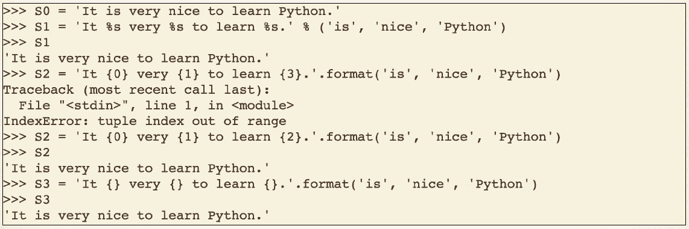

String Methods: **%, format()**

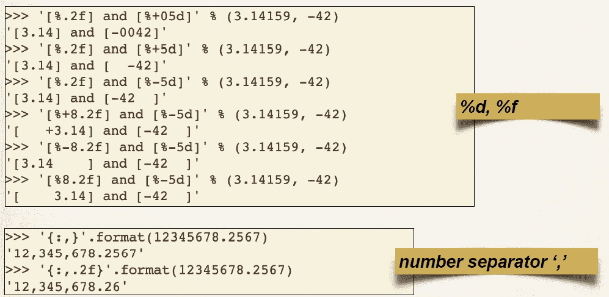

String Methods: **%d, %f,** separator

## 3.**字节**

**bytes** ()方法返回用给定大小和**数据**初始化的不可变 **bytes** 对象。 **bytes** ()方法返回一个 **bytes** 对象，它是范围`0<=x<256`内的一个不可变(不能修改)的整数序列。

计算机唯一能存储的是“字节”。

*   编码以字节表示音频、图像、文本等。
*   要保存音乐，您必须首先使用 MP3、WAV 等进行编码。
*   要保存图片，你需要用 PNG，JPEG 等编码。
*   要保存文本，首先使用 ASCII、UTF-8 等进行编码。
*   MP3、WAV、PNG、JPEG、ASCII 和 UTF-8 都是编码的例子。

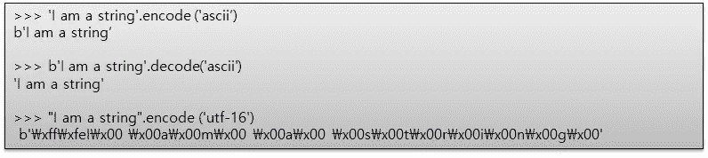

Example of **Bytes** class (**\ = crossed W**)

## 4.**列表**

一个**列表**是允许你添加、更新或删除元素的元素集合。数组大小可自由扩展，元素是可变的，用逗号分隔，没有元素的空列表表示为。

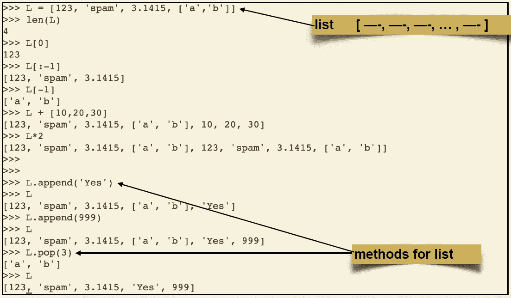

List **indexing**, **addition,** and some **methods**

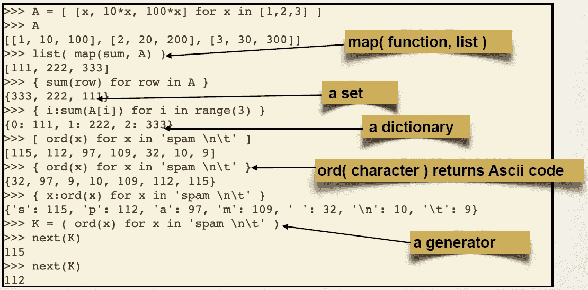

List **Comprehensions**

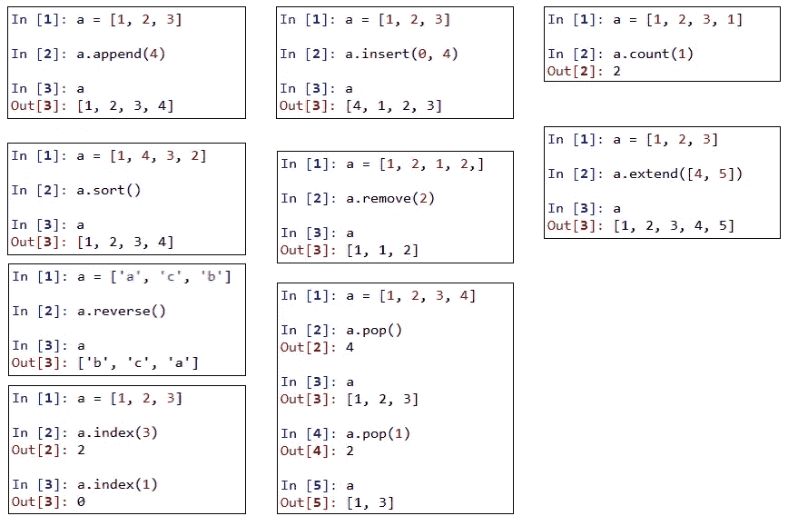

List **Methods**

## 5.元组

一个**元组**是一系列不可变的 **Python** 对象。**元组**是序列，就像*列表*一样。**元组**和*列表*的区别在于，**元组**不能像列表那样改变，**元组**使用括号，而列表使用方括号。下面三幅图展示了元组*串联*、*索引*、*不变性等几种操作，以及*、`open()`、`write()`和`read()`等几种元组方法。在文本文件上写东西时，你需要使用`close()`关闭它。要运行它，你需要输入`cat "Filename.txt"`。对于阅读，你可以遵循第三图所示的几种方法，如从文件中读取文本，逐行阅读等。

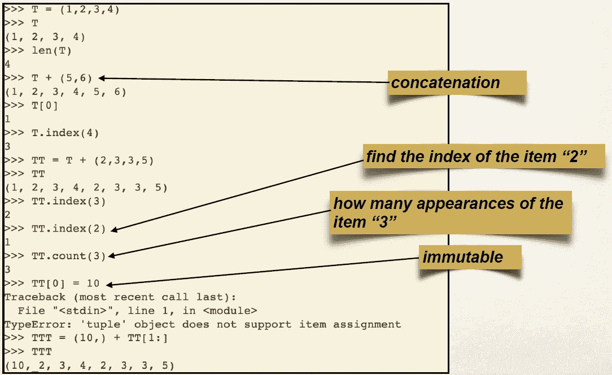

**Tuples** and **tuple methods**

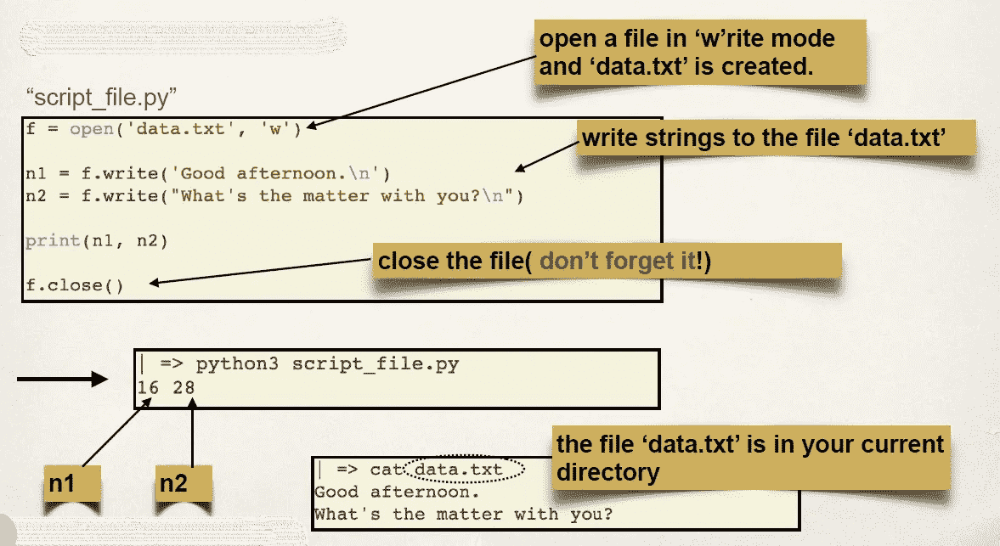

Tuple: **Files**, **open()**, **write()**

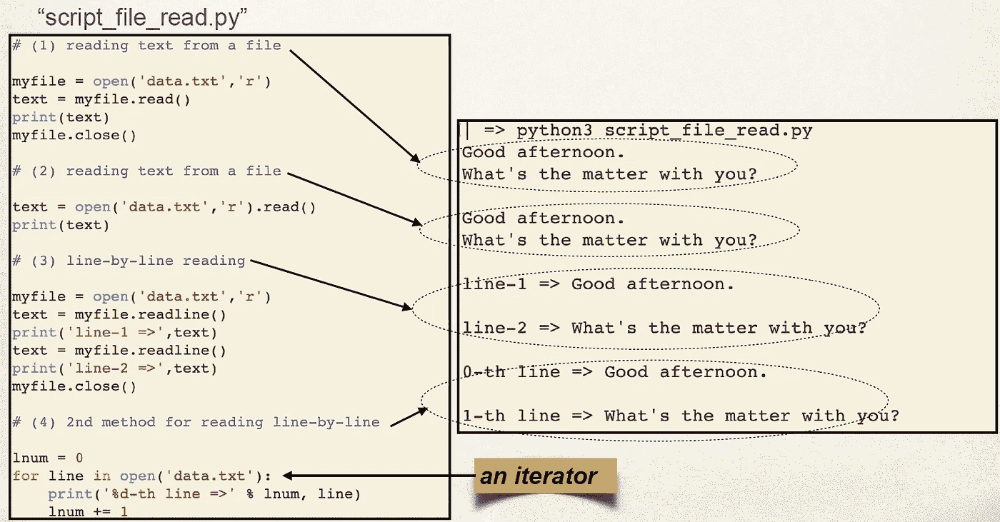

Tuple: **read()**

## 6.**字典**

字典是一组`key:value`对，其中`key`用于标识条目，而`value`保存条目的值。字典中的所有键必须是唯一的(可散列的)。下面三幅图展示了字典是如何形成的，以及字典的可变性和索引方法。

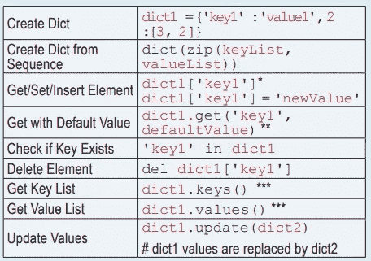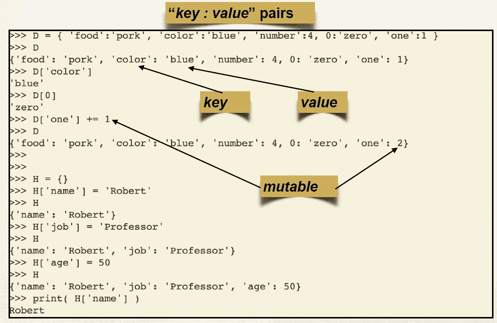

**Dictionary**

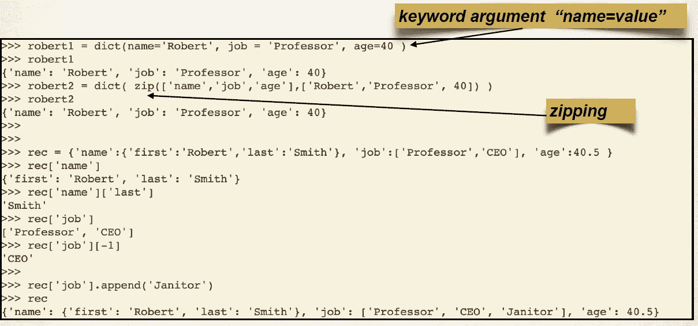

Dictionary: **keyword** arguments, **zipping**

## 7.一组

集合是 ***唯一*** 元素的无序集合。集合是**可变的**、**无序的**、**唯一的**对象，这在遍历庞大的数据集时非常有效。集合中的元素必须是可哈希的。下面三幅图概括了 set 的形成、操作和方法。

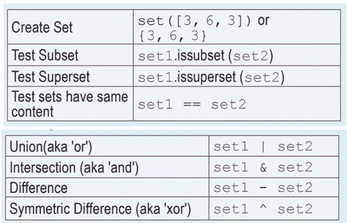

Creating a **set** and **set operations**

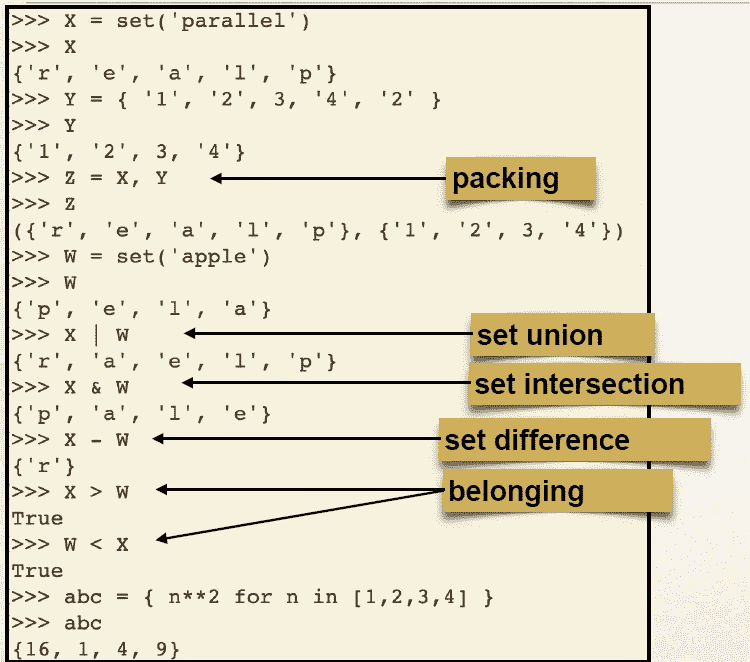

Set **Operations**

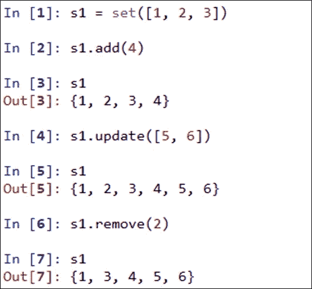

Set **Methods**

## 8.**布尔**

这个内置的数据类型可以取值:`True`和`False`，这通常使它们可以与整数 1 和 0 互换。

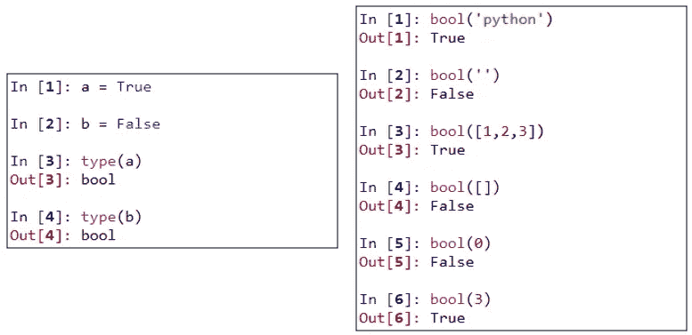

Boolean

在本文中，我们总结了 Python 中的数据类型。在本系列的下一部分，我们将讨论**控制语句** (if、for、while 等。)在 Python 中。如果有人在这篇文章或以后的文章中为更好的结果提供指导或批评，我们将非常感激。如果你喜欢这篇文章，你可以关注我关于数据科学几个问题的其他文章。

# 参考链接:

1.  **Python 数据类型 cheat sheet:**[http://www . cog sci . rpi . edu/~ destem/igd/Python _ cheat _ sheet . pdf](http://www.cogsci.rpi.edu/~destem/igd/python_cheat_sheet.pdf)
    https://clouds . EOS . UBC . ca/~ Phil/courses/eosc 582/pdf files/Python-Data-manipulations . pdf
2.  **Python 备忘单**:[http://datasciencefree.com/python.pdf](http://datasciencefree.com/python.pdf)
3.  [https://www . data camp . com/community/tutorials/data-structures-python](https://www.datacamp.com/community/tutorials/data-structures-python)
4.  [https://www.programiz.com/python-programming](https://www.programiz.com/python-programming)
5.  [https://www.tutorialspoint.com/python/](https://www.tutorialspoint.com/python/)