# 机器学习和数据分析—仁荷大学(第三部分)

> 原文：<https://towardsdatascience.com/machine-learning-and-data-analysis-inha-university-part-3-51cb64c10901?source=collection_archive---------32----------------------->

# Python 中的控制语句(循环)

这是由大韩民国仁荷大学(T2)提供的机器学习和数据分析系列的第三个教程。在本文中，我们将学习 Python 中的**循环控制语句**。如果你想了解这个系列，那么你可以看看我们之前关于这个系列的文章。链接如下:

[](/machine-learning-and-data-analysis-inha-university-part-1-be288b619fb5) [## 机器学习和数据分析—仁荷大学(第一部分)

### 第 1 章:基本 Python 和安装

towardsdatascience.com](/machine-learning-and-data-analysis-inha-university-part-1-be288b619fb5) [](/machine-learning-and-data-analysis-inha-university-part-2-3fb599732021) [## 机器学习和数据分析—仁荷大学(第二部分)

### 第 2 章:Python 数据结构—数据类型

towardsdatascience.com](/machine-learning-and-data-analysis-inha-university-part-2-3fb599732021) 

在本文中，我们将讨论 Python 中的以下循环控制语句:

*   **1。if 语句**
*   **2。while 循环**
*   **3。for 循环**
*   **4。断开**
*   **5。继续**
*   **6。通过**

## 1.如果语句

`if`是最简单的决策语句，用于决定是否执行某个语句或语句块。如果任何语句块为真，那么结果将被执行，否则不会被执行。Python 支持数学中常见的逻辑条件:

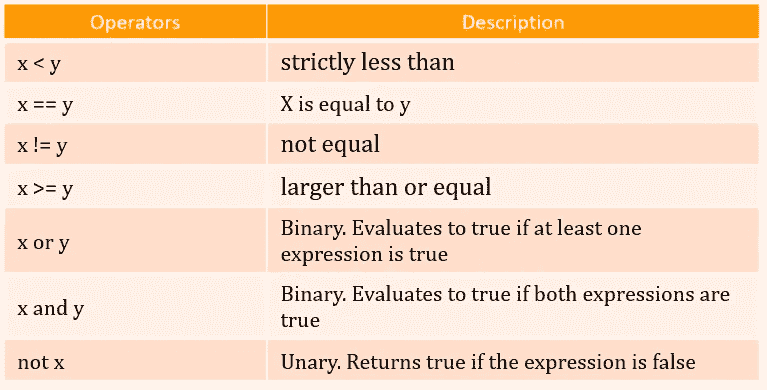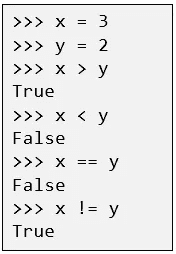

**Logical operators** in Python

**控制语句 if:** 这些条件可以以多种方式使用，最常见于“if 语句”和循环中。

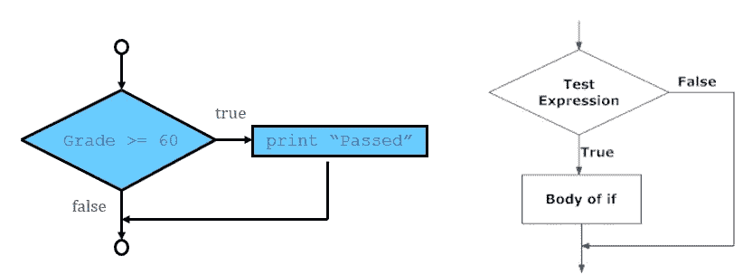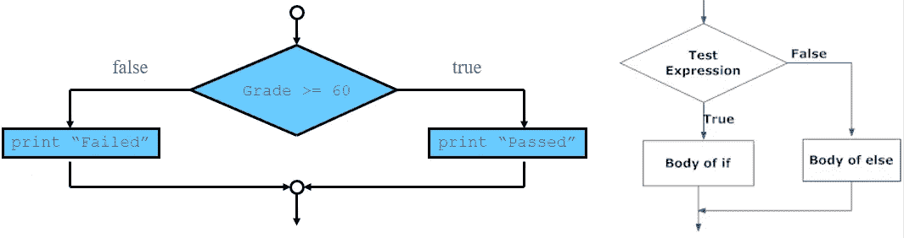

single if and if-else selection structure flow chart with the operation.

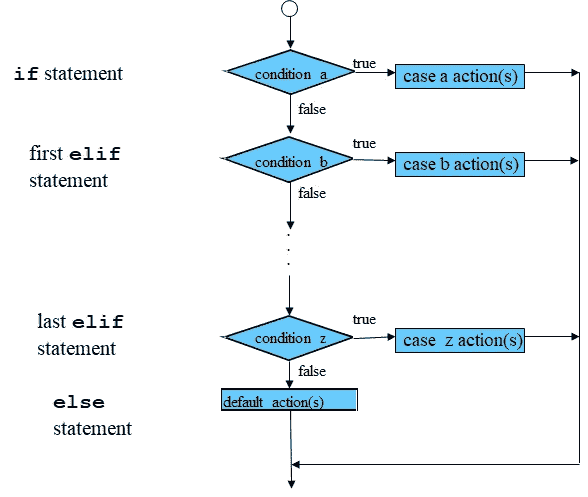

**if/elif/else** Selection Structure

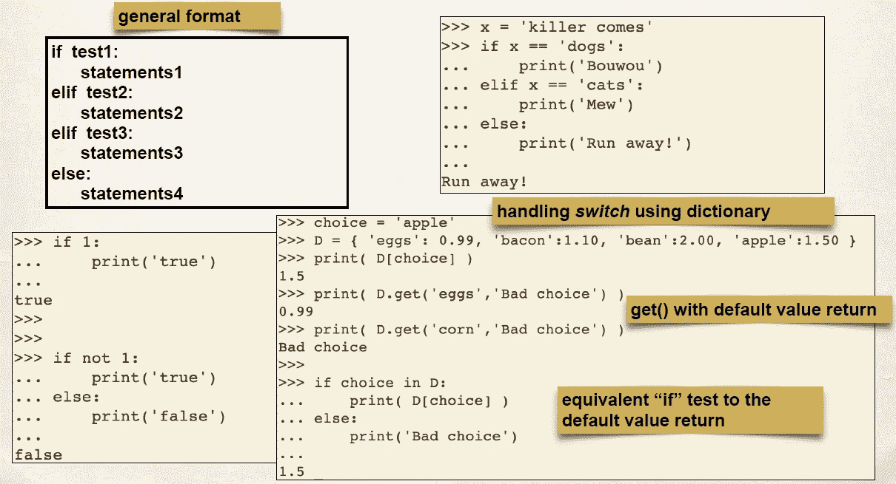

example of **if** statement

在上面提到的图中，我们试图展示 if-else 选择结构的操作流程图和一些例子。通常情况下提出条件后。如果条件为真，那么`if/elif/else`将执行它下面的语句块，否则不执行。语句本身告诉我们，如果条件为真，它将执行一组语句，如果条件为假，则不会执行。但是如果条件为假，我们想做别的事情呢。`else`语句来了。我们可以使用`else`语句和`if`语句在条件为假时执行一段代码。当条件数量较多时，最好使用`if-elif-else`结构，只有当其他*条件*都不为*真*时，才会执行 else 语句。`elif`是`else if`的简称。嵌套的 `if`是一个`if`语句，它是另一个`if`语句的目标。嵌套的`if`语句意味着一个`if`语句在另一个`if`语句内。

```
#Nested if statement only execute if statement above it is true.
i **=** 52
**if** (i **==** 52):
    **if** (i < 60):
        **print** ("i is smaller than 60")
    **if** (i < 55):
        **print**("i is smaller than 55 too")
    **else**:
        **print**("i is greater than 60").
```

**输出:**

```
i is smaller than 60
i is smaller than 55 too
```

## 2.while 循环

`while` 循环只要测试表达式(条件)为真，就迭代一段代码。如果事先不知道循环将重复多少次，可以使用这种类型的循环(强大的循环类型)。如图所示，只要*测试*表达式评估为*真，`while`结构就会执行代码块。*

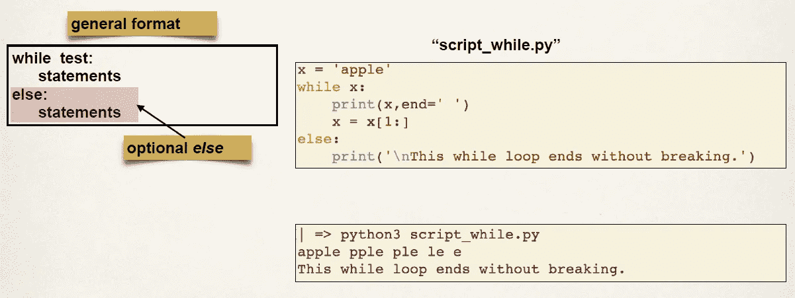

```
i = 1
**while** i < 6:
  **print**(i)
  i += 1
```

请注意，确保代码块包含修改是很重要的:如果我们忘记了上面示例中的行`i+=1`，那么`while`循环就会变成一个无限循环。嵌套的`while`循环允许在另一个`while`循环中使用一个`while`循环。

## 3.for 循环

最基本类型的确定循环是`for`循环。它用于迭代序列(列表、元组、字符串)或其他可迭代对象。遍历一个序列叫做遍历。使用`for`循环，我们可以执行一组语句，对列表、元组、集合等中的每一项执行一次。如下图`for`的通用格式所示，`for`循环遍历列表*对象*中*目标*的所有可能值，每次执行*语句。*嵌套`for`循环的一个例子也在这里说明。

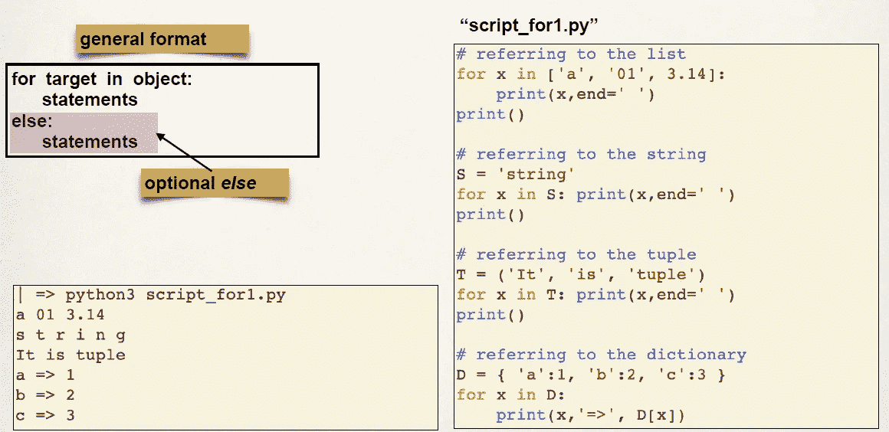

**for** Loop

```
**for** var **in** seq:
    **for** var **in** seq:
        statements(s)
        statements(s)
```

## 4.破裂

`break`语句终止包含它的循环。程序的控制直接流向循环体之后的语句。如果`break`语句在嵌套循环内(循环在另一个循环内)，`break`将终止最里面的循环。`break`最常见的用途是当某些外部条件被触发时，需要快速退出循环。如下图所示，`break`语句可用于`while`和`for`循环。

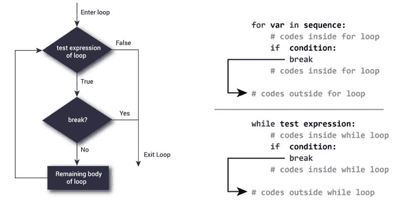

**break** statement structure flow chart with operation example in **for** and **while** loop

```
for val in "string":
    if val == "i":
        break
    print(val)
print("The end")
```

**输出:**

```
s
t
r
The end
```

## 5.及格

Python 中的`pass`语句在语法上需要一个语句，但您不想执行任何命令或代码时使用。`pass`语句是一个空操作；它执行的时候什么都不会发生。这个`pass`在你的代码最终要去但还没有被编写的地方也是有用的。

```
for letter in 'Arman':
    if letter == 'm':
        pass
        print ('This is pass block')
    print ('Current Letter :', letter)
print ("See you!")
```

**输出:**

```
Current Letter : A
Current Letter : r
This is pass block
Current Letter : m
Current Letter : a
Current Letter : n
See you!
```

当您创建了一个代码块，但不再需要它时，`pass` *语句*很有用。然后，您可以删除该块中的语句，但让该块保留一个`pass` *语句*，这样它就不会干扰代码的其他部分。

## 6.继续

`continue` *语句*用于仅在当前迭代中跳过循环中的剩余代码。循环不会终止，而是继续进行下一次迭代。`continue` *语句*可以在`while`和`for`循环中使用。

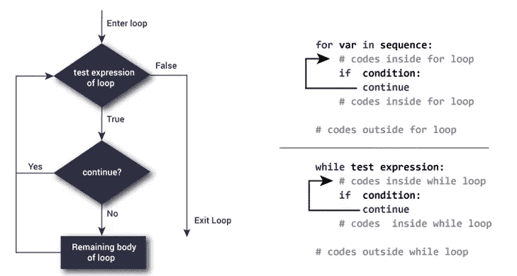

**continue** statement structure flow chart with operation example in **for** and **while** loop

```
for val in "Arman":
    if val == "m":
        continue
    print(val)
print("The end")
```

输出:

```
A
r
a
n
The end
```

在下图中，我们试图显示`while`循环下的`pass`、`break`和`continue`、*语句*。希望有助于清晰理解概念。

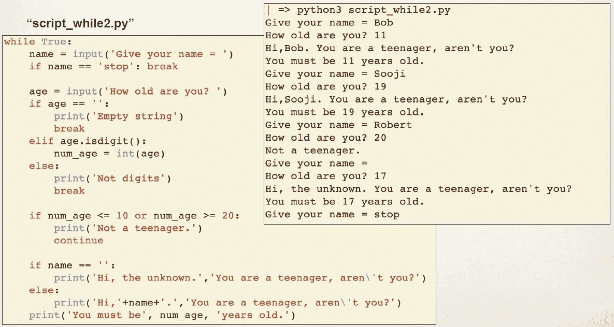

Example of **pass**, **break** and **continue** statements in **while** loop.

在本教程中，我们尽最大努力使 Python 中积累的**循环控制语句**简洁。可以浏览一篇只描述`for` / `if-else` / `while`循环的文章。但是我们使它简洁，并试图以兼容的方式描述，使它对 Python 新手有利可图。在本系列的下一部分，我们将描述 Python 中的**内置**和**用户自定义** **函数**和**模块**。

感谢您宝贵的时间。任何类型的建议或批评都是值得的，这样我们可以确保在未来的教程中有更好的表现。

# 参考链接:

1.  [https://www.geeksforgeeks.org/loops-in-python/](https://www.geeksforgeeks.org/loops-in-python/)
2.  【https://www.tutorialspoint.com/python/python_loops.htm】
3.  [http://nook . cs . UC Davis . edu/~ koehl/Teaching/ECS 15/lections/Python _ chapter 3 . pdf](http://nook.cs.ucdavis.edu/~koehl/Teaching/ECS15/Lectures/Python_Chapter3.pdf)
4.  [https://www . tutorialspoint . com/python/pdf/python _ loop _ control . pdf](https://www.tutorialspoint.com/python/pdf/python_loop_control.pdf)
5.  [http://pages . CPSC . u Calgary . ca/~ tamj/2008/217 w/notes/acrobat/loops . pdf](http://pages.cpsc.ucalgary.ca/~tamj/2008/217W/notes/acrobat/loops.pdf)