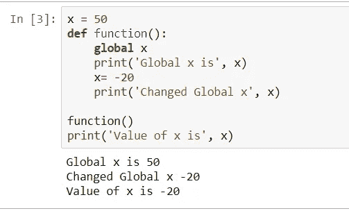

# 机器学习和数据分析—仁荷大学(第四部分)

> 原文：<https://towardsdatascience.com/machine-learning-and-data-analysis-inha-university-part-4-67aa1aa9c95d?source=collection_archive---------29----------------------->

# Python 函数和模块

在韩国仁荷大学提供的[系列机器学习和数据分析的这一部分中，我将尝试讲述 Python 中的**内置**和**用户自定义** **函数**和**模块**。从我的角度来看，这对 python 的初学者理解清楚是有帮助的。如果你想从这个系列的开头开始，那么你可以在下面的链接中找到所有的教程:](https://eng.inha.ac.kr/)

part-1:[https://towards data science . com/machine-learning-and-data-analysis-inha-university-part-1-be 288 b 619 FB 5](/machine-learning-and-data-analysis-inha-university-part-1-be288b619fb5)

part-2:[https://towards data science . com/machine-learning-and-data-analysis-inha-university-part-2-3fb 599732021](/machine-learning-and-data-analysis-inha-university-part-2-3fb599732021)

part-3:[https://towards data science . com/machine-learning-and-data-analysis-inha-university-part-3-51 CB 64 c 10901](/machine-learning-and-data-analysis-inha-university-part-3-51cb64c10901)

现在让我们关注 Python 中的函数。一个**函数**是一段代码，只在被调用时运行。您可以将数据(称为参数)传递给函数。函数可以返回数据作为结果。它是一组执行特定任务的相关语句。


Syntax of **Function**

**调用函数**

要调用一个*函数*，使用函数名后跟*括号*:

```
def **my_function**():
   print("Hello from a function")

 **my_function()**
```

输出:

```
Hello from a function
```

每当您调用函数`my_function`时，您都会得到打印语句作为结果。有两种类型的函数:*内置*函数和*用户自定义*函数。*内置*函数内置到 python 中就像`print()`、`abs()`、`sum()`都是内置函数。*用户自定义*功能和`my_function`功能一样，由用户自己定义。

**方法**中的参数(自变量)

变量或参数是可以作为参数传递给函数的信息。参数在函数名后面的括号内指定。添加任意数量的参数，用逗号分隔即可。在下面的例子中，我们在`sum()`函数的括号内传递`a,b`参数，函数将返回两个参数的和。我们还可以提到括号内的参数值，称为*默认参数值*，然后可以调用该函数，默认参数输出没有参数，或者不同结果有不同的参数值。比如，如果我们像`sum(a=4,b=8)`一样定义下面的函数，那么我们可以将 *total* 定义为`sum()`来获得默认参数输出，或者`sum(10,12)`来利用不同于默认参数的值。

```
**def** sum(a, b):
    s = a + b
    **return** s

total = **sum**(4, 7)
print(total)
```

输出:

```
11
```

**列表作为参数:**我们可以将参数的任何数据类型发送给函数(字符串、数字、列表、字典等。List 也可以作为*函数*中的一个参数。在下面的例子中，列表`fruits`作为一个参数。

```
def **my_function**(food):
"""*how lists are used as a parameter in function.*"""
    for x in food:
        print(x)
fruits = ["apple", "banana", "cherry"]
**my_function**(fruits)
```

输出:

```
apple
banana
cherry
```

有时在*函数头*后面会提到一个字符串，用来简单解释*函数*的作用。这个字符串叫做 *Docstring* 。像上面的例子一样，在`my_function(food)`之后的*文档串*用于描述函数。

**全局变量:**在 Python 代码主体中创建的变量是全局变量。全局变量可以在任何范围内使用，无论是全局的还是局部的。

**局部变量:**在函数内部创建的变量属于该函数的局部作用域，只能在该函数内部使用。

**非局部变量:**非局部变量用于未定义局部范围的*嵌套函数*中。这意味着变量既不能在局部范围内，也不能在全局范围内。



Example of **Local** and **Global** variable and their usage.

你可以在一个函数中调用任何一个全局变量，只有当它像`global x`一样被调用时才改变它的值，这里 x 是变量。

## **Python 中的模块**

简单来说， ***模块*** 是指包含 Python 语句和定义的文件。包含 Python 代码的文件，例如: *example.py* ，称为模块，其模块名就是一个例子。我们使用模块将大型程序分解成易于管理和组织的小文件。此外，模块提供了代码的可重用性。我们可以在一个模块中定义我们最常用的函数并导入，而不是把它们的定义复制到不同的程序中。模块可以是三种类型:*内置* *模块* ( *数学*、*平台*等。)、*添加模块* ( *Numpy* 、 *matplotlib* 、 *scikit-learn* 、 *keras* 、 *scipy* 等。)，以及*用户自定义模块*(可以像 *module_name.py* 一样自己定义)。要定义一个用户定义的模块，你需要使用任何文本编辑器，如 *Atom* 或 *sublime* text 来创建一个*文本文件*，该文件应该保存为`.py`，然后在该目录下你可以创建另一个文件，在该文件中你可以调用该模块的任何函数，如下例所示。


Example of **Add on**, **Built-in**, and **user-defined** modules.

我们可以使用`dir()` 函数找出定义在一个模块内部的名字。


Modules with **dir()** built-in function

我们可以从一个模块中导入特定的名称，而不用将该模块作为一个整体导入。通过使用 ***from*** 关键字，可以选择只从一个模块导入零件。Python 中有几个内置模块，可以随时导入。您可以在导入模块时创建一个别名，通过使用 ***作为*** 关键字。


Importing & Renaming **modules**

本教程到此结束。希望一切都更容易穿透。本系列的嵌套部分“[**Python 中的面向对象编程**](/python-oop-corey-schafer-datacamp-be6b0b3cafc6) ”已经出版。你可以点击下面的链接阅读这篇文章:

[](/python-oop-corey-schafer-datacamp-be6b0b3cafc6) [## Python OOP —科里·斯查费和数据营

### 面向对象编程(OOP)是一种基于“对象”的编程范式，它是一种用面向对象的语言来定义事物的方法

towardsdatascience.com](/python-oop-corey-schafer-datacamp-be6b0b3cafc6) 

从下一篇文章开始，我们将利用 *Scikit-learn* 库来关注 Python 中的机器学习，这是一个非常流行的机器学习算法库*。感谢您的宝贵时间，非常感谢您的任何建议或批评。*